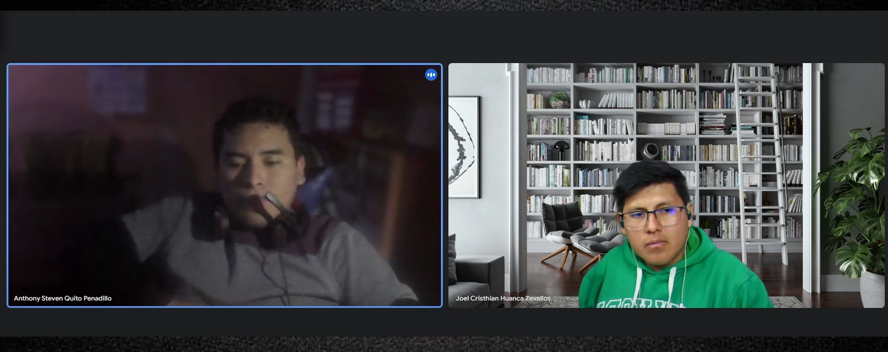
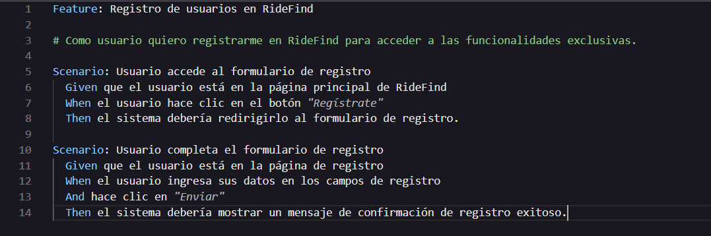

# COURSE PROJECT

---

    <strong>Universidad Peruana de Ciencias Aplicadas (UPC)</strong>     
    </img> 
    <strong>Carrera de Ingeniería de Software - Ciclo V</strong>  
    <strong>Aplicaciones Web - SI730</strong> 
     <strong>Profesor: Mori Paiva, Hugo Allan</strong> 
     <strong><b>INFORME DEL TRABAJO FINAL</strong></b> 

    <strong>Startup del Proyecto: RideLink</strong> 
    <strong>Producto: RideFind</strong> 

    <h3 align="center">Team Members:</h3>

    <table align="center">
        <tr>
            <th style="text-align:center;">Member</th>
            <th style="text-align:center;">Code</th>
        </tr>
        <tr>
            <td>Briceño De La Cruz, Farid Sebastian</td>
            <td>UU20211F211</td>
        </tr>
        <tr>
            <td>Gutierrez Garcia, Jose Eduardo</td>
            <td>U202221518</td>
        </tr>
        <tr>
            <td>Huamani Aguilar, Jhon Rony</td>
            <td>U20211D859</td>
        </tr>
        <tr>
            <td>Huanca Zevallos, Cristhian Joel</td>
            <td>U20201B914</td>
        </tr>
        <tr>
            <td>Sanchez Ignacio, Jefrey Martin</td>
            <td>U202113324</td>
        </tr>
    </table>
    

</body>

 <strong>2024-02</strong>

 

---

# Registro de Versiones del Informe

| Versión | Fecha | Autor | Descripción de la modificación |
|----|----|----|----|
| TB1 | 25/08/2024 | RideLink | Redacción de los Capítulos I: Introduction, II: Requirements Elicitation & Analysis, III: Requirements Specification, IV: Product Design, V: Product Implementation, Validation & Deployment. |
| TP1 | 27/09/2024 | RideLink | Adición del Capítulo V: 5.2.2., 5.2.2.1., 5.2.2.2., 5.2.2.3., 5.2.2.4., 5.2.2.5., 5.2.2.6., 5.2.2.7., 5.2.2.8. |
| TB2 | 03/11/2024 | RideLink | Adición del Capítulo V: 5.2.3., 5.2.3.1., 5.2.3.2., 5.2.3.3., 5.2.3.4., 5.2.3.5., 5.2.3.6., 5.2.3.7., 5.2.3.8, 5.3, 5.3.1, 5.3.2, 5.3.3, 5.4|
| TF1 | 21/11/2024 | RideLink | Adición del Capítulo V: 5.2.4., 5.2.4.1., 5.2.4.2., 5.2.4.3., 5.2.4.4., 5.2.4.5., 5.2.4.6., 5.2.4.7., 5.2.4.8|

---
  
# Project Report Collaboration Insights
TB1: Las tareas asignadas para la entrega TB1 se han completado exitosamente y están debidamente documentadas en el repositorio de GitHub, el cual pertenece a la organización del equipo. Este repositorio refleja los avances y colaboraciones de cada integrante a través de los commits y evidencia todo el ciclo de trabajo hasta la culminación de esta entrega.: [Repositorio Github](https://github.com/upc-pre-202401-si730-ws51-RideLink/RideFind-Report).

Durante la preparación del informe, se realizaron las siguientes actividades clave:

- Cada miembro escribió y diagramó sus contenidos asignados en formato Markdown, realizando commits frecuentes para reflejar el progreso en el repositorio.
- Se generaron los artefactos necesarios utilizando las herramientas recomendadas, y se obtuvieron enlaces de imágenes desde la carpeta “assets” en la rama develop del repositorio del informe.
- Se organizaron reuniones periódicas para coordinar el avance de los elementos del informe y comunicar los resultados del Sprint 1, que estuvo centrado en el desarrollo de la Landing Page.

  

**TP1** Las tareas asignadas para la entrega del TP1 han sido completadas y documentadas de manera exhaustiva en el repositorio de GitHub de la organización del equipo: [Repositorio Github](https://github.com/upc-pre-202401-si730-ws51-RideLink/RideFind-Report)

Se redactaron y diagramaron los contenidos asignados a cada integrante en formato Markdown, con commits regulares para mantener un seguimiento preciso del progreso en el repositorio.

Además, se han generado los artefactos necesarios utilizando las herramientas recomendadas, y se llevaron a cabo reuniones periódicas para coordinar el avance de los elementos del informe y comunicar los progresos del Sprint 2, centrado en el desarrollo de la aplicación web.

**TB2**: Las tareas asignadas para la entrega del TB2 han sido completadas y debidamente documentadas en el repositorio de GitHub del equipo. [Repositorio Github](https://github.com/upc-pre-202401-si730-ws51-RideLink/RideFind-Report)

- Se redactaron y diagramaron los contenidos asignados a cada integrante en formato Markdown, seguido de commits para asegurar el seguimiento del progreso en el repositorio. 
- Se generaron los artefactos necesarios utilizando las herramientas recomendadas. 
- Se llevaron a cabo reuniones para coordinar el avance de los elementos del informe y comunicar los progresos del Sprint 3, enfocado en el desarrollo del frontend y avance del backend.

**TF1**: Las tareas asignadas para la entrega del TF1 han sido completadas y debidamente documentadas en el repositorio de GitHub del equipo. [Repositorio Github](https://github.com/upc-pre-202401-si730-ws51-RideLink/RideFind-Report)

- Se realizaron actualizaciones tanto en el frontend como en el backend para garantizar la integración completa entre ambos.
- El frontend fue modificado para consumir las APIs del backend de manera eficiente, optimizando la comunicación entre los servicios.
- El backend fue desplegado en la nube, asegurando disponibilidad y escalabilidad para las funcionalidades de la aplicación.
- Se llevaron a cabo pruebas integrales para verificar que el consumo de servicios funcionara correctamente y cumpliera con los requerimientos del proyecto.
- Se coordinaron reuniones periódicas para alinear los avances técnicos con las metas del Sprint 4 y asegurar el cumplimiento de los plazos establecidos.

---

# Contenido
## Tabla de contenidos
- [**Registro de Versiones del Informe**](#registro-de-versiones-del-informe)
- [**Project Report Collaboration Insights**](#project-report-collaboration-insights)
- [**Contenido**](#contenido)
    - [Tabla de contenidos](#tabla-de-contenidos)
- [**Student Outcome**](#student-outcome)
- ## [ **Capítulo I: Introducción** ](#-capítulo-i-introducción-)
  - [**1.1. Startup Profile**](#11-startup-profile)
    - [**1.1.1. Descripción de la Startup**](#111-descripción-de-la-startup)
    - [**1.1.2. Perfiles de integrantes del equipo**](#112-perfiles-de-integrantes-del-equipo)
  - [**1.2. Solution Profile**](#12-solution-profile)
    - [**1.2.1 Antecedentes y problemática**](#121-antecedentes-y-problemática)
    - [What (¿Qué?)](#what-qué)
    - [Who (¿Quién?)](#who-quién)
    - [Where (¿Dónde?)](#where-dónde)
    - [When (¿Cuándo?)](#when-cuándo)
    - [Why (¿Por qué?)](#why-por-qué)
    - [How (¿Cómo?)](#how-cómo)
    - [How much (¿Cuánto?)](#how-much-cuánto)
    - [**1.2.2 Lean UX Process**](#122-lean-ux-process)
    - [**1.2.2.1. Lean UX Problem Statements**](#1221-lean-ux-problem-statements)
    - [**1.2.2.2. Lean UX Assumptions**](#1222-lean-ux-assumptions)
    - [**1.2.2.3. Lean UX Hypothesis Statements**](#1223-lean-ux-hypothesis-statements)
    - [**1.2.2.4. Lean UX Canvas**](#1224-lean-ux-canvas)
  - [**1.3. Segmentos objetivo**](#13-segmentos-objetivo)
- ## [ **Capítulo II: Requirements Elicitation \& Analysis**](#-capítulo-ii-requirements-elicitation--analysis)
  - [**2.1. Competidores**](#21-competidores)
    - [**2.1.1. Análisis competitivo**](#211-análisis-competitivo)
    - [**2.1.2. Estrategias y tácticas frente a competidores**](#212-estrategias-y-tácticas-frente-a-competidores)
  - [**2.2. Entrevistas**](#22-entrevistas)
    - [**2.2.1. Diseño de entrevistas**](#221-diseño-de-entrevistas)
    - [**2.2.2. Registro de entrevistas**](#222-registro-de-entrevistas)
    - [**2.2.3. Análisis de entrevistas**](#223-análisis-de-entrevistas)
  - [**2.3. Needfinding**](#23-needfinding)
    - [**2.3.1. User Personas**](#231-user-personas)
    - [**2.3.2. User Task Matrix**](#232-user-task-matrix)
    - [**2.3.3. User Journey Mapping**](#233-user-journey-mapping)
    - [**2.3.4. Empathy Mapping**](#234-empathy-mapping)
    - [**2.3.5. As-is Scenario Mapping**](#235-as-is-scenario-mapping)
  - [**2.4. Ubiquitous Language**](#24-ubiquitous-language)
- ## [ **Capítulo III: Requirements Specification**](#-capítulo-iii-requirements-specification)
  - [**3.1. To-Be Scenario Mapping**](#31-to-be-scenario-mapping)
  - [**3.2. User Stories**](#32-user-stories)
  - [**3.3. Impact Mapping**](#33-impact-mapping)
  - [**3.4. Product Backlog**](#34-product-backlog)
- ## [**Capítulo IV: Product Design**](#capítulo-iv-product-design)
  - [**4.1. Style Guidelines**](#41-style-guidelines)
    - [**4.1.1. General Style Guidelines**](#411-general-style-guidelines)
    - [**4.1.2. Web Style Guidelines**](#412-web-style-guidelines)
  - [**4.2. Information Architecture**](#42-information-architecture)
    - [**4.2.1. Organization Systems**](#421-organization-systems)
    - [**4.2.2. Labeling Systems**](#422-labeling-systems)
    - [**4.2.3. SEO Tags and Meta Tags**](#423-seo-tags-and-meta-tags)
    - [**4.2.4. Searching Systems**](#424-searching-systems)
    - [**4.2.5. Navigation Systems**](#425-navigation-systems)
  - [**4.3. Landing Page UI Design**](#43-landing-page-ui-design)
    - [**4.3.1. Landing Page Wireframe**](#431-landing-page-wireframe)
    - [**4.3.2. Landing Page Mock-up**](#432-landing-page-mock-up)
  - [**4.4. Web Applications UX/UI Design**](#44-web-applications-uxui-design)
    - [**4.4.1. Web Applications Wireframes**](#441-web-applications-wireframes)
    - [**4.4.2. Web Applications Wireflow Diagrams**](#442-web-applications-wireflow-diagrams)
    - [**4.4.3. Web Applications Mock-ups**](#443-web-applications-mock-ups)
    - [**4.4.4. Web Applications User Flow Diagrams**](#444-web-applications-user-flow-diagrams)
  - [**4.5. Web Applications Prototyping**](#45-web-applications-prototyping)
  - [**4.6. Domain-Driven Software Architecture**](#46-domain-driven-software-architecture)
    - [**4.6.1. Software Architecture Context Diagram**](#461-software-architecture-context-diagram)
    - [**4.6.2. Software Architecture Container Diagrams**](#462-software-architecture-container-diagrams)
    - [**4.6.3. Software Architecture Components Diagrams**](#463-software-architecture-components-diagrams)
  - [**4.7. Software Object-Oriented Design**](#47-software-object-oriented-design)
    - [**4.7.1. Class Diagrams**](#471-class-diagrams)
    - [**4.7.2. Class Dictionary**](#472-class-dictionary)
  - [**4.8. Database Design**](#48-database-design)
    - [**4.8.1. Database Diagram**](#481-database-diagram)
- ## [**Capítulo V: Product Implementation, Validation \& Deployment**](#capítulo-v-product-implementation-validation--deployment)
  - [**5.1. Software Configuration Management**](#51-software-configuration-management)
    - [**5.1.1. Software Development Environment Configuration**](#511-software-development-environment-configuration)
    - [**5.1.2. Source Code Management**](#512-source-code-management)
    - [**5.1.3. Source Code Style Guide \& Conventions**](#513-source-code-style-guide--conventions)
    - [**5.1.4. Software Deployment Configuration**](#514-software-deployment-configuration)
  - [**5.2. Landing Page, Services \& Applications Implementation**](#52-landing-page-services--applications-implementation)
    - [**5.2.1. Sprint 1**](#521-sprint-1)
    - [**5.2.1.1. Sprint Planning 1**](#5211-sprint-planning-1)
    - [**5.2.1.2. Sprint Backlog 1**](#5212-sprint-backlog-1)
    - [**5.2.1.3. Development Evidence for Sprint Review**](#5213-development-evidence-for-sprint-review)
    - [**5.2.1.4. Testing Suite Evidence for Sprint Review**](#5214-testing-suite-evidence-for-sprint-review)
    - [**5.2.1.5. Execution Evidence for Sprint Review**](#5215-execution-evidence-for-sprint-review)
    - [**5.2.1.6. Services Documentation Evidence for Sprint Review**](#5216-services-documentation-evidence-for-sprint-review)
    - [**5.2.1.7. Software Deployment Evidence for Sprint Review**](#5217-software-deployment-evidence-for-sprint-review)
    - [**5.2.1.8. Team Collaboration Insights during Sprint**](#5218-team-collaboration-insights-during-sprint)
  - [**5.2.2. Sprint 2**](#522-sprint-2)
    - [**5.2.2.1. Sprint Planning 2**](#5221-sprint-planning-2)
    - [**5.2.2.2. Sprint Backlog 2**](#5222-sprint-backlog-2)
    - [**5.2.2.3. Development Evidence for Sprint Review**](#5223-development-evidence-for-sprint-review)
    - [**5.2.2.4. Testing Suite Evidence for Sprint Review**](#5224-testing-suite-evidence-for-sprint-review)
    - [**5.2.2.5. Execution Evidence for Sprint Review**](#5225-execution-evidence-for-sprint-review)
    - [**5.2.2.6. Services Documentation Evidence for Sprint Review**](#5226-services-documentation-evidence-for-sprint-review)
    - [**5.2.2.7. Software Deployment Evidence for Sprint Review**](#5227-software-deployment-evidence-for-sprint-review)
    - [**5.2.2.8. Team Collaboration Insights during Sprint**](#5228-team-collaboration-insights-during-sprint)
    - [**5.2.3. Sprint 3**](#523-sprint-3)
    - [**5.2.3.1. Sprint Planning 3**](#5231-sprint-planning-3)
    - [**5.2.3.2. Sprint Backlog 3**](#5232-sprint-backlog-3)
    - [**5.2.3.3. Development Evidence for Sprint Review**](#5233-development-evidence-for-sprint-review)
    - [**5.2.3.4. Testing Suite Evidence for Sprint Review**](#5234-testing-suite-evidence-for-sprint-review)
    - [**5.2.3.5. Execution Evidence for Sprint Review**](#5235-execution-evidence-for-sprint-review)
    - [**5.2.3.6. Services Documentation Evidence for Sprint Review**](#5236-services-documentation-evidence-for-sprint-review)
    - [**5.2.3.7. Software Deployment Evidence for Sprint Review**](#5237-software-deployment-evidence-for-sprint-review)
    - [**5.2.3.8. Team Collaboration Insights during Sprint**](#5238-team-collaboration-insights-during-sprint)
    - [**5.2.4. Sprint 4**](#524-sprint-4)
    - [**5.2.4.1. Sprint Planning 4**](#5241-sprint-planning-4)
    - [**5.2.4.2. Sprint Backlog 4**](#5242-sprint-backlog-4)
    - [**5.2.4.3. Development Evidence for Sprint Review**](#5243-development-evidence-for-sprint-review)
    - [**5.2.4.4. Testing Suite Evidence for Sprint Review**](#5234-testing-suite-evidence-for-sprint-review)
    - [**5.2.4.5. Execution Evidence for Sprint Review**](#5245-execution-evidence-for-sprint-review)
    - [**5.2.4.6. Services Documentation Evidence for Sprint Review**](#5246-services-documentation-evidence-for-sprint-review)
    - [**5.2.4.7. Software Deployment Evidence for Sprint Review**](#5247-software-deployment-evidence-for-sprint-review)
    - [**5.2.4.8. Team Collaboration Insights during Sprint**](#5248-team-collaboration-insights-during-sprint)
  - [**5.3. Validation Interviews**](#53-validation-interviews)
    - [**5.3.1. Diseño de Entrevistas**](#531-diseño-de-entrevistas)
    - [**5.3.2. Registro de Entrevistas**](#532-registro-de-entrevistas)
    - [**5.3.3. Evaluaciones según heurísticas**](#533-evaluaciones-según-heurísticas)
  - [**5.4. Video About-the-Product**](#54-video-about-the-product)
- [**Conclusiones**](#conclusiones)
- [**Conclusiones y recomendaciones**](#conclusiones-y-recomendaciones)
- [**Video About-the-Team**](#video-about-the-team)
- [**Bibliografía**](#bibliografía)
- [**Anexos**](#anexos)

---  
  
# Student Outcome

<table>
    <tr>
        <th style="text-align:center;">Criterio específico</th>
        <th style="text-align:center;">Acciones realizadas</th>
        <th style="text-align:center;">Conclusiones</th>
    </tr>
    <tr>
        <td align="center">Trabaja en equipo para proporcionar liderazgo en forma conjunta</td>
        <td>
            Briceño De La Cruz, Farid Sebastian  
            TB1  
            Se encargó de la planificación inicial del proyecto y la distribución de roles entre los integrantes, promoviendo la equidad y una buena comunicación. Coordinó efectivamente al equipo, facilitando un entorno inclusivo y colaborativo que permitió una buena organización del trabajo.  
            TP1  
            En colaboración con Jose, me encargué de liderar el desarrollo de la funcionalidad de Registro de Usuario (US06), donde trabajé en el diseño y validación de los formularios con HTML, CSS y JavaScript. Proporcioné liderazgo en el área del frontend, asegurándome de que la interfaz fuera responsive y fácil de usar, y al mismo tiempo, participé en las reuniones de planificación para ayudar a definir los roles y objetivos del sprint, contribuyendo a la organización conjunta del equipo.
              TP2  
            En esta fase del proyecto, lideré la actualización del front-end y la Landing Page, asegurándome de que todos los cambios fueran comunicados al equipo de manera efectiva. Trabajé en colaboración con Jose para integrar el backend con el front-end, promoviendo un ambiente donde todos pudieran aportar ideas y comentarios. Coordiné el diseño responsive, garantizando que cada miembro tuviera un rol claro y se sintiera parte del proceso de desarrollo, fomentando así un entorno inclusivo y colaborativo.
              TF  
           No Participó
              
            Gutierrez Garcia, Jose Eduardo  
            TB1  
            Colaboró en la creación del front-end y la Landing Page, asegurándose de que la implementación fuera consistente con los requisitos del proyecto. Proporcionó liderazgo técnico al definir las mejores prácticas de desarrollo para la primera versión del front-end, logrando un resultado funcional y estéticamente coherente.
             TP  
            Como Team Leader, trabajé en equipo para coordinar y liderar de manera conjunta, asegurando que todos los integrantes del equipo tuvieran una comunicación constante y efectiva. Colaboré estrechamente con Farid en la planificación de las tareas y supervisé el progreso de todos los miembros para cumplir los objetivos del sprint. También proporcioné liderazgo técnico durante la implementación de la funcionalidad de Inicio de Sesión (US07), colaborando en el desarrollo del frontend y la autenticación del backend, asegurándome de que todo estuviera alineado con las expectativas del equipo.
              TB2  
            Me enfoqué en el desarrollo del backend y el deployment en la nube, proporcionando liderazgo técnico y asegurando que la implementación cumpliera con los requisitos establecidos por el equipo. Trabajé de cerca con Farid para coordinar la integración entre el front-end y el backend, además de gestionar el despliegue en la nube. Fomenté un ambiente colaborativo, alentando la participación activa de todos en las decisiones técnicas y en la planificación de tareas.
              TF  
            Trabajé en equipo para proporcionar liderazgo en forma conjunta durante la implementación del Bounded Context IAM. Lideré la actualización del backend, desarrollando la funcionalidad de login y el manejo de imágenes. Coordiné con Jefrey para asegurar que el frontend consumiera correctamente los endpoints del backend, logrando una integración fluida y efectiva. Promoví un ambiente colaborativo, tomando decisiones técnicas en conjunto y garantizando que las implementaciones cumplieran con los objetivos y estándares del equipo.
              
            Huamani Aguilar, Jhon Rony  
            TB1  
            Lideró la integración del sistema con el servicio RESTful, asegurando que el equipo comprendiera cómo utilizar y probar la API correctamente. Aportó un enfoque de liderazgo técnico y colaborativo, guiando al equipo en la integración exitosa del backend con el frontend.
             TP  
           Colaboré con el equipo para liderar la integración del backend en la funcionalidad de Recuperación de Contraseña (US08). Trabajé de manera conjunta con Cristhian para garantizar que el proceso de validación y envío de correos electrónicos estuviera completamente integrado con las APIs RESTful. Guié al equipo en la implementación de las APIs y trabajamos en conjunto para resolver problemas técnicos, asegurando que todos estuvieran alineados y que la integración fuera exitosa.
             TB2  
           No Participó
             TF  
           No Participó
              
            Huanca Zevallos, Cristhian Joel  
            TB1  
            Supervisó las sesiones de validación y pruebas iniciales, recopilando retroalimentación del equipo para mejorar la interfaz de usuario. Proporcionó un liderazgo centrado en la calidad, asegurando que las pruebas reflejaran el feedback real y contribuyendo a mejoras tangibles en el producto.
              TP  
            En colaboración con Jhon, lideré la creación de los Mensajes de Error y Validaciones (US09) para los formularios del sistema. Trabajé junto al equipo para definir las pruebas iniciales, promoviendo un entorno colaborativo en el que todos aportamos mejoras en la interfaz de usuario. Mi enfoque de liderazgo fue garantizar que la calidad del producto reflejara el feedback del equipo, y trabajé junto con mis compañeros para implementar mejoras basadas en sus aportes.
              TB2  
            Lideré las entrevistas de validación y trabajé en el backend, asegurando que todos los aportes del equipo fueran considerados en la implementación. Fomenté un ambiente inclusivo durante las entrevistas, donde cada miembro tuvo la oportunidad de expresar sus opiniones y sugerencias. Colaboré con el equipo para integrar las validaciones necesarias, garantizando que el producto final cumpliera con los estándares de calidad y las expectativas del cliente.
              TF  
           No Participó
              
            Sanchez Ignacio, Jefrey Martin  
            TB1  
            Dirigió las tareas relacionadas con la documentación del proyecto y los entregables del capítulo 5. A través de su liderazgo en la documentación, garantizó que todos los artefactos se presentaran de manera clara y organizada, facilitando el trabajo colaborativo y asegurando que los objetivos del sprint se cumplieran.
              TP   
            Trabajé en conjunto con mis compañeros en las pruebas de Registro de Usuario, Inicio de Sesión y Recuperación de Contraseña (US10), asegurando que todas las funcionalidades implementadas fueran testeadas exhaustivamente. Además, lideré el esfuerzo de documentación en equipo, organizando la información de manera clara y detallada para que todos pudieran referirse a ella durante el sprint. Colaboré con los demás para que la documentación apoyara la coordinación y facilitara la retroalimentación entre los integrantes.
              TB2  
            Colaboré en las entrevistas de validación y en el desarrollo del backend, asegurándome de que el equipo estuviera alineado en los objetivos y roles durante este proceso. Promoví un entorno colaborativo al facilitar la comunicación entre los miembros del equipo y asegurar que todas las voces fueran escuchadas. Mi enfoque en la retroalimentación y el trabajo conjunto permitió que las validaciones fueran efectivas y que se incorporaran mejoras significativas en el proyecto.
              TF  
            Trabajó en equipo para proporcionar liderazgo en forma conjunta durante la actualización del frontend de la aplicación. Jefrey implementó los cambios necesarios para consumir los nuevos endpoints del backend, asegurando que las funcionalidades de login y manejo de imágenes fueran completamente integradas en la interfaz de usuario. Colaboró estrechamente con Jose en la planificación y ejecución técnica, fomentando una comunicación constante y efectiva para cumplir con los objetivos del sprint. Además, su participación fue clave para garantizar una experiencia de usuario consistente y alineada con los requisitos del proyecto.
        </td>
        <td>
            TB1:  En este primer logro, el equipo demostró una sólida capacidad de liderazgo colaborativo. Cada integrante asumió roles clave que facilitaron la gestión del proyecto, desde la planificación inicial hasta la ejecución técnica. Gracias a un liderazgo compartido, el equipo mantuvo una comunicación constante y efectiva, lo que permitió alcanzar los objetivos propuestos dentro de los plazos estipulados. La sinergia entre los miembros fue crucial para crear un entorno de trabajo en el que las decisiones se tomaron en conjunto y donde cada persona aportó valor al éxito del proyecto.
             
            TP1:  Durante el trabajo en el capítulo 5 del TP, el equipo fortaleció su capacidad de colaboración al desarrollar secciones críticas como el Sprint Planning 2 y el Backlog 2. La integración de los aportes de cada miembro permitió completar las secciones **5.2.2.1** a **5.2.2.8**, consolidando el desarrollo del front-end y el despliegue en Firebase. 
            TB2:  En este segundo logro, el equipo demostró un notable crecimiento en su capacidad de trabajar en conjunto y proporcionar liderazgo compartido. Cada miembro asumió responsabilidades específicas que facilitaron la ejecución del proyecto, desde la actualización del front-end hasta el desarrollo del backend y el despliegue en la nube. La colaboración y la comunicación efectiva fueron fundamentales para alcanzar los objetivos establecidos y asegurar que cada voz fuera escuchada en el proceso. La cohesión del equipo permitió superar los desafíos y mejorar la calidad del producto final, destacando el compromiso de todos hacia el éxito del proyecto.  
            TF1:  En este logro, el equipo consolidó su capacidad de trabajo colaborativo, demostrando un liderazgo conjunto que fue esencial para el avance del proyecto. La comunicación constante y la asignación clara de responsabilidades permitieron a cada miembro aportar de manera significativa. Jefrey, al actualizar el frontend y asegurar su integración con el backend, y Jose, al realizar las modificaciones necesarias en el backend, trabajaron estrechamente para cumplir con los objetivos de este sprint. La cohesión del equipo y la eficiencia en la coordinación de tareas fueron fundamentales para implementar las funcionalidades clave, como el login y la gestión de imágenes. Este enfoque colaborativo fortaleció el desarrollo del producto, asegurando que las tareas se ejecutaran dentro del plazo y con la calidad esperada, consolidando el éxito de esta entrega.
        </td>
    </tr>
    <tr>
        <td align="center">Crea un entorno colaborativo e inclusivo, establece metas, planifica tareas y cumple objetivos</td>
        <td>
            Briceño De La Cruz, Farid Sebastian  
            TB1  
            Planificó y organizó las reuniones de equipo, asegurando que todos los integrantes pudieran participar activamente y se respetaran las opiniones de todos. Creó un entorno inclusivo y promovió la colaboración, logrando que las reuniones fueran productivas y que los objetivos del sprint se alcanzaran. 
             TP  
            Me encargué de liderar el desarrollo de la funcionalidad de Registro de Usuario (US06), estableciendo metas claras para la implementación del formulario de registro y promoviendo un entorno colaborativo en el que todos los comentarios fueron bienvenidos. Trabajé en conjunto con Jose para planificar las tareas y asignarlas de manera equitativa, asegurándonos de que el diseño responsive del formulario cumpliera los objetivos propuestos. Fomenté la inclusión de todos los miembros del equipo, impulsando su participación activa en el desarrollo de la interfaz de usuario.
              TB2  
            En esta fase del proyecto, me encargué de actualizar el front-end y la Landing Page, estableciendo metas claras y planificando las tareas en colaboración con el equipo. Fomenté un entorno inclusivo al facilitar reuniones donde todos pudieran expresar sus ideas y preocupaciones. Trabajé de cerca con Jose para asegurar que nuestras tareas estuvieran alineadas, promoviendo la comunicación constante y el apoyo mutuo para cumplir con los objetivos establecidos.
              TF  
           No Participó
              
            Gutierrez Garcia, Jose Eduardo  
            TB1  
            Desarrolló la primera versión del sistema backend, asegurándose de que las metas técnicas se alinearan con las necesidades del negocio. Ayudó a establecer metas claras y planificar el desarrollo técnico, asegurando que el equipo cumpliera con las expectativas del cliente y las necesidades funcionales.
              TP  
            Como Team Leader, me aseguré de crear un entorno colaborativo e inclusivo donde todos los miembros del equipo pudieran aportar sus ideas y trabajar en conjunto hacia los objetivos del sprint. Trabajé en estrecha colaboración con Farid y el resto del equipo para establecer metas claras, planificar las tareas de forma efectiva y garantizar que todos tuvieran roles definidos. En particular, lideré la planificación de la funcionalidad de Inicio de Sesión (US07), asegurándome de que las metas se cumplieran dentro del tiempo previsto y fomentando la participación de todos en la toma de decisiones.
              TB2  
            Mi enfoque en el backend y el deployment en la nube se centró en crear un ambiente colaborativo donde todos los integrantes pudieran participar activamente. Establecí metas específicas para el desarrollo del backend y coordinar el despliegue, asegurándome de que todos comprendieran sus responsabilidades y cómo contribuir al éxito del proyecto. Promoví la planificación de tareas, realizando reuniones regulares para evaluar el progreso y ajustar las estrategias según fuera necesario, lo que permitió cumplir con los objetivos del sprint.
              TF  
            Como líder del equipo, me aseguré de crear un entorno de trabajo inclusivo y colaborativo. Coordiné las tareas del equipo y establecí metas claras para que todos supieran qué se esperaba en este sprint. Mi principal responsabilidad fue actualizar el backend para implementar el sistema de inicio de sesión (login), lo cual fue crucial para el avance del proyecto. Además, trabajé en la implementación de la lectura de imágenes, lo que mejoró la funcionalidad. Me aseguré de que todos los objetivos del sprint se cumplieran a tiempo, y fui parte activa en la planificación para garantizar que el equipo tuviera un camino claro. Mi enfoque en la organización y la comunicación constante permitió que el equipo alcanzara los objetivos con éxito.
              
            Huamani Aguilar, Jhon Rony  
            TB1  
            Facilitó la comunicación entre los miembros del equipo técnico y los encargados del diseño, asegurando una integración armoniosa de los componentes visuales y funcionales. Su enfoque en la colaboración permitió una correcta integración de las interfaces de usuario y los servicios del backend, cumpliendo con los objetivos del proyecto.
              TP  
            Creé un ambiente colaborativo al trabajar estrechamente con Cristhian en la integración del backend para la funcionalidad de Recuperación de Contraseña (US08). Establecimos objetivos claros para implementar la API y planificamos juntos las tareas para lograr una integración fluida entre el frontend y el backend. Nos aseguramos de que cada miembro del equipo entendiera su papel en el proceso, promoviendo una participación inclusiva y un trabajo conjunto que permitió cumplir con los objetivos del sprint.
              TB2  
            No Participó
              TF  
           No Participó
              
            Huanca Zevallos, Cristhian Joel  
            TB1 
            Se encargó de documentar las métricas del sprint y garantizar que todos los miembros cumplieran con sus tareas asignadas dentro del plazo. A través de una planificación eficaz, contribuyó a que se cumplieran todos los objetivos del sprint, promoviendo una colaboración constante y organizada.
             TP  
            Lideré el desarrollo de los Mensajes de Error y Validaciones (US09), asegurándome de crear un entorno donde todas las ideas fueran escuchadas y consideradas. Junto con Jhon, planificamos las tareas necesarias para cumplir los objetivos de calidad del sprint, estableciendo metas alcanzables y asegurándonos de que todos los miembros del equipo participaran activamente en el proceso de validación. Fomenté un ambiente inclusivo donde todos se sintieron cómodos al compartir sus opiniones y sugerencias para mejorar el producto final.
              TB2  
            Lideré las entrevistas de validación y trabajé en el backend, estableciendo metas claras para el desarrollo de funcionalidades. Fomenté un ambiente colaborativo al invitar a todos a participar en las entrevistas, asegurando que las opiniones y sugerencias de cada miembro fueran consideradas. Esto no solo ayudó a crear un sentido de pertenencia, sino que también garantizó que el producto final cumpliera con las expectativas del equipo y del cliente.
              TF  
           No Participó
              
            Sanchez Ignacio, Jefrey Martin  
            TB1  
            Validó las decisiones tomadas en relación con la estructura del proyecto y la implementación de los sprints, asegurando que todas las partes estuvieran alineadas con los objetivos finales. Se aseguró de que el equipo mantuviera una planificación clara y alcanzara los objetivos propuestos, integrando continuamente las mejoras sugeridas durante el desarrollo.
             TP  
            Trabajé en un entorno colaborativo al liderar las pruebas de Registro de Usuario, Inicio de Sesión y Recuperación de Contraseña (US10), asegurando que cada miembro del equipo tuviera claras sus responsabilidades. Establecí metas para las pruebas y planifiqué las tareas de QA de manera inclusiva, permitiendo que todos los integrantes del equipo aportaran feedback. Además, me aseguré de cumplir con los objetivos de documentación del sprint, organizando la información de manera que facilitara el trabajo de todos y contribuyera a un ambiente inclusivo.
              TB2  
            Colaboré en las entrevistas de validación y en el desarrollo del backend, creando un entorno donde se priorizó la inclusión y la colaboración. Durante este proceso, establecimos metas comunes y planificamos las tareas de manera que cada miembro pudiera contribuir según sus fortalezas. Promoví un espacio abierto para la retroalimentación, lo que permitió que el equipo se ajustara rápidamente a las necesidades del proyecto y asegurara el cumplimiento de los objetivos.
              TF  
            En este sprint, trabajé en la actualización del frontend para integrar correctamente el backend. Colaboré estrechamente con José, asegurándome de que las nuevas funcionalidades del backend se reflejaran correctamente en el frontend. Me aseguré de que la interfaz de usuario fuera intuitiva y fácil de usar, lo que mejoró la experiencia del usuario. Establecimos metas claras con el equipo y planificamos las tareas de manera efectiva para cumplir con los objetivos del sprint. Durante todo el proceso, mantuve una comunicación constante con José y el resto del equipo, asegurándome de que todos los miembros estuvieran alineados con los objetivos y el progreso. Gracias a este enfoque colaborativo, logramos completar nuestras tareas con éxito y a tiempo.
        </td>
        <td>
            TB1: El equipo destacó por la creación de un entorno altamente colaborativo e inclusivo, donde cada miembro tuvo un rol activo en la planificación y ejecución de las tareas. La claridad en las metas y una adecuada distribución de las responsabilidades fueron fundamentales para el progreso fluido del proyecto. Al establecer una cultura de respeto y comunicación abierta, se logró cumplir con todos los objetivos propuestos de manera eficiente, lo que no solo permitió una mejor organización, sino que también mejoró el desempeño individual y grupal.
             
            TP1: En el contexto del TP, el equipo demostró su capacidad para cumplir con las metas propuestas para el Sprint 2, logrando desarrollar las secciones correspondientes al capítulo 5. La planificación detallada y el cumplimiento de los objetivos permitieron que el equipo completara con éxito las funcionalidades de autenticación, pruebas y despliegue, garantizando una entrega sólida y de alta calidad del front-end de la aplicación en Firebase.
             
            TB2: En este segundo logro, el equipo demostró un compromiso significativo con la creación de un entorno colaborativo e inclusivo. A través de la planificación de tareas y el establecimiento de metas claras, cada miembro pudo contribuir de manera efectiva al proyecto. La comunicación constante y el apoyo mutuo fueron esenciales para cumplir con los objetivos del sprint, lo que resultó en una mejor cohesión y un producto final de alta calidad. La inclusividad fomentada en cada etapa del proceso permitió que todas las voces fueran escuchadas, enriqueciendo el resultado del trabajo conjunto.
             
            TF1: En este sprint, el equipo demostró un fuerte enfoque en la colaboración y el cumplimiento de objetivos. José y Jeffrey trabajaron de manera conjunta, creando un entorno inclusivo donde la comunicación constante fue clave para el avance del proyecto. José, con su liderazgo técnico, se encargó de implementar funcionalidades críticas en el backend, mientras que Jeffrey, en el frontend, aseguró la correcta integración y experiencia de usuario. Ambos establecieron metas claras para el sprint y se encargaron de planificar y ejecutar las tareas necesarias para cumplir con los objetivos dentro del tiempo estipulado. La colaboración efectiva entre los miembros del equipo y la capacidad de adaptarse a los retos del sprint garantizaron el éxito de la entrega, destacando la importancia de trabajar de manera unificada y alineada para lograr los resultados deseados.
        </td>
    </tr>
</table>

 
  
---

# **Capítulo I: Introducción**

## 1.1. Startup Profile

### 1.1.1. Descripción de la Startup

"Ridelink" es una plataforma innovadora diseñada para conectar a personas interesadas en alquilar vehículos alternativos y sostenibles, como autos y motos eléctricas, scooters y skateboards, con propietarios que desean rentarlos. Nuestra solución busca aliviar la congestión vehicular en las ciudades y promover opciones de transporte más rápidas, flexibles y saludables. A través de nuestra plataforma, generamos ingresos mediante comisiones por alquileres, publicidad dirigida y suscripciones premium que ofrecen beneficios exclusivos como descuentos en los alquileres y una experiencia sin anuncios.

- **Misión:** Nuestra misión es ofrecer una alternativa de movilidad urbana que sea accesible, sostenible y eficiente, conectando a propietarios de vehículos alternativos con personas que buscan una manera más ágil y ecológica de desplazarse por la ciudad.

- **Visión:** Nuestra visión es convertirnos en la plataforma líder en movilidad urbana sostenible en Lima y expandir nuestra presencia a otras ciudades del Perú, contribuyendo activamente a la reducción de la congestión vehicular y a la adopción de un estilo de vida más saludable.

### 1.1.2. Perfiles de integrantes del equipo

|                    Photo                        |                                                                                                                                                                                                                                                                                                    Description                                                                                                                                                                                                                                                                                                    |
| :------------------------------------------------: | :---------------------------------------------------------------------------------------------------------------------------------------------------------------------------------------------------------------------------------------------------------------------------------------------------------------------------------------------------------------------------------------------------------------------------------------------------------------------------------------------------------------------------------------------------------------------------------------------------------------: |
|  |                                                                                                                           Soy una persona entusiasta de la tecnología informática, poseo habilidad de liderazgo cuando es necesario y entre mis habilidades técnicas se encuentran el manejo de base de datos en entorno como SQL Server o MongoDB, también domino el lenguaje de marcado HTML.                                                                                                                         |
|   | Mi nombre es Jose Gutierrez, tengo 20 años, actualmente me encuentro cruzando mi 5to ciclo de la carrera de ingeniería de software en la UPC. Me gusta jugar videojuegos y practicar natación, soy un gran aficionado de la tecnología y del ensamblaje de computadoras. Me considero una persona dispuesta siempre a aprender tecnologías nuevas, creativa y responsable. |
|     |                                                                                                                                                              Soy estudiante de Ingeniería de Software. Cuento con conocimientos básicos en C++, SQL, Python, HTML y CSS. A lo largo de la carrera he desarrollado habilidades que me permiten ofrecer soluciones efectivas a los desafíos que se presenten.                                                                                                                                                            |
|    |                                                                                                                              Me considero una persona  proactiva, organizada y responsable al momento de desarrollar un nuevo proyecto en mi vida. En un grupo de trabajo siempre trato de respetar las opiniones de los demás, trato de entender los demás puntos de vista y animo a estar en unión frente a un problema.                                                                                                                              |
|        |                                                                                                                                                                                                 Me considero una persona amable, que trabaja en equipo, tengo habilidades en html, css, javascript, C++. Estoy con muchas ganas de aprender del curso y de mis compañeros.                                                                                                                                                                                                 |

## 1.2. Solution Profile

RideFind se centra en abordar los problemas de congestión vehicular y la necesidad de opciones de transporte más sostenibles en las ciudades. Nuestra plataforma, RideFind, proporciona una solución innovadora al conectar a usuarios que buscan alquilar vehículos alternativos, como autos eléctricos, scooters y skateboards, con propietarios que desean rentarlos. Este enfoque no solo ofrece una alternativa más rápida y flexible para desplazarse, sino que también contribuye a la reducción de la contaminación y promueve un estilo de vida más activo.

### 1.2.1. Antecedentes y problemática

En las grandes ciudades, la congestión vehicular y la contaminación son problemas cada vez más graves. La dependencia de vehículos convencionales ha generado un incremento en el tráfico, afectando la calidad de vida de los habitantes y deteriorando el medio ambiente. Aunque las opciones de transporte sostenible están en crecimiento, aún no son accesibles para todos. Esta situación presenta una necesidad urgente de alternativas que ofrezcan movilidad eficiente, flexible y ecológica.

Nuestra startup surge en respuesta a esta problemática, ofreciendo una plataforma que facilita el alquiler de vehículos alternativos y sostenibles, como autos y motos eléctricas, scooters y skateboards. Buscamos no solo aliviar el tráfico, sino también promover un estilo de vida más saludable y responsable con el medio ambiente. A continuación, se presenta la información recopilada mediante la técnica de las 5W y 2H:

#### Uso de la técnica The 5'W's w Y 2'H's

| LAS 5W y 2H | Pregunta                                                | Descripción                                                                                                                                                                                                                                                                                                                                                                                                                                                                                                          |
| ----------- | ------------------------------------------------------- | -------------------------------------------------------------------------------------------------------------------------------------------------------------------------------------------------------------------------------------------------------------------------------------------------------------------------------------------------------------------------------------------------------------------------------------------------------------------------------------------------------------------- |
| What?        | ¿Cuál es el problema?                                     |  La congestión vehicular y la contaminación ambiental se han convertido en problemas críticos. El uso excesivo de automóviles particulares ha llevado a una mayor emisión de gases contaminantes y a un tráfico cada vez más caótico.                                                                                                                   |
| When?       | ¿Cuándo sucede el problema?                                   | Este problema se ha intensificado en los últimos años debido al crecimiento urbano y el incremento del parque automotor, siendo ahora una situación cotidiana en las principales ciudades del país.                                                                                                                                                                                                            |
| Where?       | ¿Dónde surge el problema?                             | La problemática es más aguda en Lima, la capital del Perú, y en otras grandes ciudades del país donde el tráfico y la contaminación son particularmente severos.                                                                                                                                           |
| Why?      | ¿Por qué sucede el problema?                               | El aumento descontrolado del parque automotor, impulsado por el crecimiento poblacional y la dependencia de vehículos particulares, junto con la ineficiencia del transporte público, ha agravado la situación. La falta de infraestructura adecuada y la informalidad en el transporte público también son factores contribuyentes.                                                                                                                                                                                        |
| Who?        | ¿Qué llevara a las personas a usar nuestro producto?                         | Las personas utilizarán nuestro producto debido a la necesidad de encontrar alternativas de transporte más eficientes, sostenibles y flexibles. Aquellos que buscan evitar los problemas del tráfico, reducir su huella de carbono, o simplemente moverse de manera más ágil en entornos urbanos estarán motivados a usar nuestra plataforma. Además, los propietarios de vehículos alternativos verán una oportunidad para generar ingresos adicionales al rentar sus vehículos cuando no los están utilizando.|
| How?        | ¿En qué condiciones los clientes usaran nuestro producto?               | Los clientes utilizarán nuestro producto principalmente en contextos urbanos donde la congestión vehicular es un problema significativo. Usarán la plataforma cuando necesiten una alternativa rápida y flexible para moverse por la ciudad, ya sea para evitar el tráfico, reducir costos de transporte, o adoptar un estilo de vida más saludable. Además, la plataforma será utilizada por personas que busquen opciones de transporte temporales o que no quieran incurrir en la compra de un vehículo propio.                                                                                                                                                                                  |
| How Much?   | ¿Con qué frecuencia o en qué cantidad se utilizará nuestro producto? | Nuestro producto será utilizado de manera regular por usuarios que necesitan una solución de transporte flexible y rápida en entornos urbanos. La frecuencia de uso variará según las necesidades individuales, pero se espera un uso recurrente en horas punta de tráfico o para desplazamientos cortos y medianos. La cantidad de usuarios crecerá a medida que más personas busquen alternativas sostenibles al transporte convencional y la plataforma gane popularidad en las ciudades objetivo.                                                                                             |

## 1.2.2. Lean UX Process.

#### 1.2.2.1. Lean UX Problem Statements.

En las ciudades principales del Perú, la congestión vehicular y la falta de opciones accesibles para el transporte sostenible están generando serios problemas tanto para las personas como para el entorno. Aunque existen alternativas como los vehículos eléctricos y scooters, su disponibilidad aún no es suficiente para satisfacer la demanda de una población en crecimiento que busca soluciones más ecológicas y eficientes. Además, la experiencia de usuario en las plataformas actuales no siempre optimiza el tiempo de los usuarios, lo que reduce la adopción de estas tecnologías. Por otro lado, para que RideFind pueda mantenerse competitiva y sostenible a largo plazo, es esencial desarrollar un modelo de negocio que no sólo atraiga a los usuarios, sino que también los motive a permanecer en la plataforma a través de una propuesta de valor clara y beneficios atractivos. ¿Cómo podemos diseñar y construir una plataforma que facilite el acceso a vehículos sostenibles de manera eficiente y que además fomente la lealtad de los usuarios mediante una experiencia de usuario superior y un modelo de suscripción valioso?

#### 1.2.2.2. Lean UX Assumptions.

Los usuarios buscan cuidar el medio ambiente mediante soluciones eco amigables, como el reemplazo de las energías fósiles.

**Features:**

- Embellecer la experiencia del usuario brindándole una no extensa variedad de funciones, que sean simples, pero a su vez completas para que quede satisfecho con los resultados de cada acción.
- Disponibilidad de la mayoría de métodos de pagos disponibles.
- Compromiso interno para aumentar la oferta de vehículos que se puedan rentar hacia los usuarios con el efecto de mejorar la satisfacción que obtengan de nuestro producto.
- Al “prestar” su vehículo, los dueños podrán generar regalías porcentuales de acuerdo a las características de su vehículo y del tiempo del servicio.
- En consecuencia, los usuarios también tendrán una amplia variedad de vehículos a los que puedan acceder, de acuerdo a las necesidades de cada individuo.

**Business Outcomes:**

- Satisfacción del usuario al poder pagar el servicio mediante su método de pago de preferencia.
- Los dueños de vehículos encontrarán un gran beneficio monetario en la aplicación, por lo que permanecerá brindando el servicio de su vehículo.
- Tras el incremento de oferta de vehículos disponibles, la demanda crecerá al, los usuarios, descubrir nuevas opciones de vehículos, a diferencia de modelos anteriores que no les convencía.

**Users:**
Los usuarios serían los dueños de vehículos que brindarán el servicio de su medio de transporte a cambio de beneficios, y los usuarios que lo alquilan para hacer uso de este durante un tiempo definido.

**User Outcomes & Benefits:**

- Dueños de vehículos: estos usuarios tienen la posibilidad de ganar beneficios lucrativos siempre y cuando su vehículo sea utilizado por el otro segmento de usuario.
- Personas que alquilan un vehículo: este segmento tiene a su disposición una amplia gama de medios de transporte que podrán utilizar de acuerdo a su necesidad inmediata.

**User Assumptions:**

- **¿Quién es el usuario?**
  Nuestro producto está dirigido tanto a los propietarios de vehículos como a quienes los alquilan. 

- **¿Dónde encaja nuestro producto en sus trabajos o vidas?**
  Nuestro producto puede encajar en el día a día del usuario al ser una solución de carácter flexible e inmediato. 

- **¿Qué problema resuelve nuestro producto?**
  Resuelve el hecho de que los usuarios tengan una necesidad temporal de la pertenencia de un vehículo. 

- **¿Cuándo y cómo es usado nuestro producto?**
  Se usa cuando los propietarios vehiculares buscan una fuente de ingreso o cuando los usuarios necesitan utilizar un medio de transporte no público, todo esto gestionado mediante la aplicación. 

- **¿Qué características son importantes?**
  Que el servicio esté disponible 24/7, así como el soporte, que se tenga un vasto rango de opciones disponibles para alquilar, que el sistema sea fácil y seguro de usar, un sistema de calificaciones de los medios de transporte mostrados y una asignación justa de precios. 

- **¿Cómo debería verse y comportarse nuestro producto?**
 Debería de presentarse con funciones de rápida respuesta y detalles minimalistas para enfocar al usuario en lo que realmente importa, el medio de transporte a alquilar. Además, solo se mostrará en exhibición los autos que tengan disponibilidad inmediata de préstamo para evitar pérdidas de tiempo consultando información sobre un vehículo fuera de servicio. Se debería mostrar las tarifas asignadas a un vehículo, así como las reseñas que corresponden, en conjunto, al dueño y su vehículo. Por último, debe ser seguro y confiable con medidas de verificación de identidad y poseer las últimas disposiciones de métodos de pagos. 

**Business Assumptions**

- Se asume que los clientes buscan una solución de transporte que les permita moverse sin tener que comprar un vehículo propio, lo cual es una propuesta clave del servicio.
- La adquisición de clientes se basa en el marketing digital, focalizado en dos grupos: propietarios de vehículos que desean alquilarlos para obtener ingresos y usuarios que necesitan un transporte temporal.
- El modelo de negocio se sustenta en cobrar una comisión por cada transacción de alquiler que se realice en la plataforma.
- Se identifica que uno de los mayores riesgos para el éxito del negocio es que los usuarios no confíen en la seguridad y calidad de los vehículos, así como posibles fallas técnicas en la plataforma que impacten negativamente la experiencia del usuario.
- Para mitigar los riesgos mencionados, se planea establecer un proceso estricto de verificación y evaluación tanto de los vehículos como de los propietarios, asegurando que cumplan con los estándares de seguridad y calidad.

#### 1.2.2.3. Lean UX Hypothesis Statements.

Para asegurar que nuestra solución esté alineada con las necesidades y expectativas de nuestros usuarios, hemos formulado las siguientes hipótesis utilizando el enfoque Lean UX. Este enfoque nos permitirá validar nuestras suposiciones a través de iteraciones constantes y ajustes basados en el feedback de los usuarios

**Hipótesis de Valor:**

**Creemos que** los usuarios de grandes ciudades que buscan alternativas de transporte rápido y sostenible necesitan una plataforma accesible que les permita alquilar vehículos eléctricos y sostenibles de manera rápida y confiable.
**Sabremos** que hemos tenido éxito,
**cuando** al menos el 45% de los usuarios registrados realicen su primer alquiler en la plataforma dentro del primer mes.

**Hipótesis de Usabilidad:**
**Creemos que** los usuarios prefieren una experiencia de usuario intuitiva y rápida que les permita encontrar, reservar y alquilar vehículos de manera sencilla y sin fricciones, porque valoran su tiempo y esperan procesos eficientes al utilizar aplicaciones de transporte.
**Sabremos** que hemos tenido éxito,
**cuando** el 70% de los usuarios completen el proceso de alquiler en menos de 3 minutos durante su primera interacción con la plataforma.

**Hipótesis de Crecimiento**
**Creemos que** la incorporación de una suscripción premium atraerá a usuarios que buscan beneficios adicionales como acceso a descuentos en alquileres, alquileres prioritarios y una experiencia libre de anuncios.
**Sabremos** que hemos tenido éxito,
**cuando** por lo menos el 20% de los usuarios activos opten por la suscripción premium dentro de los primeros seis meses.

#### 1.2.2.4. Lean UX Canvas.

<table border>
    <tr>
        <td ROWSPAN=2>
Lean UX Canvas
</td>
        <td ROWSPAN=2></td> 
        <td>
Fecha: 31/08/2024
</td> 
    </tr>
    <tr>
        <td>
Primera iteración
</td> 
    </tr>
    <tr>
        <td ROWSPAN>

**Business Problem**
En las principales ciudades del Perú, la congestión vehicular y la falta de opciones accesibles para el transporte sostenible están generando problemas tanto para las personas como para el entorno. La dependencia de vehículos convencionales y la ineficacia de las plataformas actuales limitan el acceso y la adopción de vehículos eléctricos y sostenibles.

</td>
            <td ROWSPAN=2>

**Solutions**

- Interfaz intuitiva para búsqueda y reserva de vehículos.
- Opciones de suscripción con descuentos y sin anuncios..
- Proceso de verificación y evaluación de vehículos y propietarios.
</td> <td ROWSPAN=2>

**Business Outcomes**

- **Valor para el Negocio:** Generar ingresos a través de comisiones por alquiler, suscripciones premium y publicidad.
- **Crecimiento del Usuario:** Aumentar la base de usuarios y fomentar la lealtad mediante una plataforma eficiente y beneficios atractivos.
</td> 
    </tr>
    <tr>
        <td>

**Users**

- **Segmento 1:** Propietarios de vehículos que buscan generar ingresos adicionales alquilando sus vehículos.
- **Segmento 2:** Usuarios que buscan alquilar vehículos alternativos para movilidad urbana, con interés en opciones sostenibles y flexibles.
</td> 
    </tr>
    <tr>
        <td ROWSPAN=2>

**Hypotheses**

- Creemos que los usuarios de grandes ciudades que buscan alternativas de transporte rápido y sostenible necesitan una plataforma accesible que les permita alquilar vehículos eléctricos y sostenibles de manera rápida y confiable. Sabemos que hemos tenido éxito, cuando al menos el 45% de los usuarios registrados realicen su primer alquiler en la plataforma dentro del primer mes.
- Creemos que los usuarios prefieren una experiencia de usuario intuitiva y rápida que les permita encontrar, reservar y alquilar vehículos de manera sencilla y sin fricciones, porque valoran su tiempo y esperan procesos eficientes al utilizar aplicaciones de transporte. Sabemos que hemos tenido éxito, cuando el 70% de los usuarios completen el proceso de alquiler en menos de 3 minutos durante su primera interacción con la plataforma.
- Creemos que la incorporación de una suscripción premium atraerá a usuarios que buscan beneficios adicionales como acceso a descuentos en alquileres, alquileres prioritarios y una experiencia libre de anuncios. Sabemos que hemos tenido éxito, cuando por lo menos el 20% de los usuarios activos opten por la suscripción premium dentro de los primeros seis meses.</td>

<td ROWSPAN=2>

**What's the most important thing we need to learn first?**

- Validar si los usuarios encuentran valor en la plataforma al realizar su primer alquiler dentro del primer mes y si la experiencia de usuario es intuitiva y eficiente.
</td>

<td>

**User Outcomes & Benefits**

- **Beneficios para Propietarios de Vehículos:**
  - Generar ingresos adicionales mediante el alquiler de sus vehículos.
  - Beneficios monetarios proporcionales a la demanda y características del vehículo.

- **Beneficios para Usuarios que Alquilan:**
  - Acceso a una amplia variedad de vehículos alternativos para diferentes necesidades.
  - Experiencia de alquiler conveniente y flexible, con opciones de suscripción que ofrecen descuentos y exclusividad.
</td> 
    </tr>
    <tr>
        <td>

**What's the least amount of work we need to do to learn the next most important?**

- Desarrollar una versión mínima viable (MVP) de la plataforma con funcionalidades básicas de búsqueda, reserva y alquiler de vehículos. Implementar un sistema de seguimiento de métricas clave como el tiempo de alquiler y las tasas de conversión de usuarios.
</td> 
    </tr>
</table>

## 1.3. Segmentos objetivo.

Para asegurar que nuestra aplicación RideFind satisfaga las necesidades específicas de nuestros usuarios y maximice su impacto, hemos identificado dos segmentos principales. Estos segmentos reflejan las diversas necesidades y características de nuestros usuarios potenciales, permitiéndonos adaptar nuestra oferta para proporcionar un servicio eficiente y valioso tanto para quienes buscan alquilar vehículos alternativos como para quienes desean ofrecerlos en alquiler. A continuación, se describen estos segmentos en detalle.

**Segmento Objetivo 1 - Usuarios que Buscan Alquilar Vehículos**

Son individuos de cualquier edad que viven en áreas urbanas del Perú y buscan una solución de transporte flexible y conveniente. Utilizan el servicio de alquiler para facilitar sus desplazamientos en entornos con alta congestión vehicular. Estos usuarios están dispuestos a probar diferentes medios de transporte según sus necesidades y valoran la opción de contribuir a una movilidad más sostenible al optar por alquileres en lugar de la propiedad individual de vehículos.

**Segmento Objetivo 2 - Propietarios de Vehículos Alternativos:**

Son personas de cualquier edad que poseen vehículos alternativos como bicicletas, scooters, patinetes eléctricos y motos eléctricas. Residen en diferentes partes del Perú y están interesados en reducir su impacto ambiental. Estos usuarios pueden tener un vehículo que no utilizan con frecuencia y buscan oportunidades para compartirlo y obtener ingresos adicionales. Además, valoran la posibilidad de promover un estilo de vida saludable y activo.

---

# **Capítulo II: Requirements Elicitation & Analysis**

## 2.1. Competidores.

<table>
    <thead>
        <tr>
            <th>Nombre</th>
            <th>Descripción</th>
        </tr>
    </thead>
    <tbody>
        <tr>
            <td rowspan align="center">CityBikeLima
            <td>CityBike Lima es un servicio de bicicletas compartidas que opera en el distrito de Miraflores, Lima. Su objetivo es promover el uso de medios de transporte sostenibles y saludables, facilitando el acceso a bicicletas públicas para residentes y visitantes. El sistema de CityBike Lima permite a los usuarios alquilar bicicletas de manera sencilla y económica, contribuyendo a mejorar la movilidad urbana y reducir la congestión vehicular en la ciudad. 
            Página web:<a href="https://www.citybikelima.com/"> https://www.citybikelima.com/</a>
        </tr>
        <tr>
            <td align="center">Airbnb
            <td> Airbnb es una plataforma global que conecta a viajeros con anfitriones que ofrecen alojamientos únicos y variados en todo el mundo. La empresa permite a los usuarios encontrar desde habitaciones compartidas hasta casas enteras, proporcionando experiencias de viaje personalizadas y auténticas. Airbnb se enfoca en crear una comunidad donde los viajeros puedan sumergirse en culturas locales y disfrutar de estadías cómodas y asequibles, mientras los anfitriones tienen la oportunidad de generar ingresos adicionales al compartir sus espacios. 
            Página web:<a href="https://www.airbnb.com.pe/"> https://www.airbnb.com.pe/</a>
        </tr>
        <tr>
           <td rowspan align="center">GrinPeru  
           <td>Grin Perú es una empresa dedicada al alquiler de scooters eléctricos en la ciudad de Lima. Ofrece planes de suscripción flexibles que permiten a los usuarios alquilar scooters por uno, dos o tres meses, brindando una alternativa de transporte rápida, económica y ecológica. Grin busca facilitar la movilidad urbana, ayudando a las personas a evitar el tráfico congestionado mientras contribuyen a la reducción de la huella de carbono. Entre sus beneficios destacan el ahorro en costos de transporte, mantenimiento ilimitado de los scooters, atención personalizada y vehículos diseñados para adaptarse a las vías limeñas. 
           Página web:<a href="https://grin4u.grin-mobility.com/?status=init"> https://grin4u.grin-mobility.com/?status=init</a>
    </tbody>
</table>

### 2.1.1. Análisis competitivo.

<table style="width: 100%;">
  <tr>
    <th colspan="6" style="padding: 8px; text-align: center;"> Competitive Analysis Landscape</th>
  </tr>
  <tr>
    <td>¿Por qué llevar a cabo este análisis?</td>
    <td colspan="5">Este análisis nos ayuda a comprender el panorama competitivo actual, identificando las fortalezas y debilidades de RideFind en comparación con otras opciones disponibles en el mercado. Esto nos permite optimizar nuestra propuesta de valor y estrategias para posicionarnos efectivamente y satisfacer mejor las necesidades de nuestros usuarios.</td>
  </tr>
  <tr>
    <td colspan="2"></td>
    <td align="center">RideFind </td>
    <td align="center">CityBikeLima </td>
    <td align="center">Airbnb </td>
    <td align="center">Grin Peru </td> 
  </tr>
  <tr>
    <td rowspan="2" align="center">Perfil</td>
    <td align="center">Overview</td>
    <td>Plataforma digital que conecta a usuarios con propietarios de vehículos eléctricos y alternativos para facilitar el alquiler de medios de transporte sostenibles como autos eléctricos, scooters y skateboards. Busca mejorar la movilidad urbana al ofrecer opciones flexibles y ecológicas que contribuyen a reducir el tráfico y la contaminación en las ciudades.</td>
    <td>Sistema de bicicletas públicas compartidas que ofrece una alternativa de transporte saludable y sostenible en el distrito de Miraflores, Lima. Facilita el desplazamiento urbano de manera económica y ecológica, contribuyendo a descongestionar el tráfico y fomentar hábitos de vida activos entre los usuarios.</td>
    <td>Plataforma global de alojamiento que conecta a viajeros con anfitriones ofreciendo una amplia variedad de opciones de hospedaje alrededor del mundo. Facilita experiencias de viaje únicas y personalizadas, permitiendo a los usuarios sumergirse en la cultura local y disfrutar de comodidades adaptadas a diferentes preferencias y presupuestos.</td>
    <td>Servicio de alquiler de scooters eléctricos a través de planes de suscripción mensuales, orientado a proporcionar una solución de transporte rápida y accesible que permite a los usuarios evitar el tráfico y disminuir costos asociados al transporte diario, mientras promueven prácticas amigables con el medio ambiente.</td>
  </tr>
  <tr>
    <td>Ventaja competitiva ¿Qué valor ofrece a los clientes?</td>
    <td><strong>Diversidad de Opciones:</strong>  Ofrece una amplia gama de vehículos eléctricos y alternativos para adaptarse a diversas necesidades de transporte. <strong>Conexión Directa:</strong>  Facilita la interacción directa entre propietarios y usuarios, creando oportunidades de ingresos adicionales y acceso sencillo a medios de transporte sostenibles. <strong>Flexibilidad:</strong>  Proporciona opciones de alquiler flexibles en términos de tiempo y tipo de vehículo, adaptándose a las circunstancias específicas de cada usuario.</td>
    <td><strong>Accesibilidad:</strong>  Proporciona estaciones de bicicletas ubicadas estratégicamente para facilitar el acceso y la movilidad dentro de la ciudad. <strong>Eco-Amigable:</strong>  Promueve el uso de transporte no motorizado, contribuyendo a la reducción de emisiones y mejorando la calidad del aire. <strong>Salud y Bienestar:</strong>  Incentiva hábitos saludables mediante el uso de la bicicleta como medio de transporte diario.</td>
    <td><strong>Experiencias Únicas:</strong>  Permite a los viajeros acceder a alojamientos diversos y auténticos que enriquecen su experiencia de viaje. <strong>Flexibilidad y Variedad:</strong>  Ofrece una amplia gama de opciones de hospedaje en múltiples ubicaciones y rangos de precios. <strong>Comunidad Global:</strong>  Fomenta una comunidad activa donde anfitriones y huéspedes pueden compartir y calificar experiencias, mejorando la confianza y calidad del servicio.</td>
    <td><strong>Planes de Suscripción Asequibles:</strong>  Ofrece planes de alquiler por periodos extendidos a precios competitivos, permitiendo un uso continuo y conveniente de scooters eléctricos. <strong>Mantenimiento Incluido:</strong>  Brinda servicio de mantenimiento ilimitado y soporte personalizado, asegurando una experiencia de uso sin inconvenientes. <strong>Ahorro de Tiempo y Dinero:</strong>  Ayuda a los usuarios a evitar embotellamientos y reduce gastos asociados al transporte convencional.</td>
  </tr>
  <tr>
    <td rowspan="2" align="center">Perfil de Marketing</td>
    <td>Mercado objetivo</td>
    <td><strong>Propietarios de Vehículos Alternativos:</strong>  Personas que poseen vehículos eléctricos o sostenibles y desean generar ingresos adicionales alquilándolos. <strong>Usuarios que Buscan Transporte Sostenible:</strong>  Individuos urbanos que necesitan soluciones de movilidad flexibles, eficientes y respetuosas con el medio ambiente.</td>
    <td><strong>Residentes Urbanos:</strong>  Habitantes de Miraflores y áreas cercanas que buscan alternativas de transporte práctico y económico. <strong>Turistas Locales e Internacionales:</strong>  Visitantes que desean explorar la ciudad de manera activa y sostenible.</td>
    <td><strong>Viajeros Independientes:</strong>  Personas que buscan experiencias de alojamiento personalizadas y diversas durante sus viajes. <strong>Anfitriones:</strong>  Propietarios que desean rentar sus espacios para generar ingresos adicionales.</td>
    <td><strong>Trabajadores y Estudiantes Urbanos:</strong>  Personas que requieren desplazarse diariamente por la ciudad de manera rápida y económica. <strong>Concienciados con el Medio Ambiente:</strong>  Usuarios interesados en opciones de transporte que reduzcan su impacto ambiental.</td>
  </tr>
  <tr>
    <td>Estrategias de marketing</td>
    <td><strong>Marketing Digital Orientado:</strong>  Campañas en redes sociales y plataformas digitales enfocadas en promover la sostenibilidad y eficiencia de la plataforma. <strong>Colaboraciones Estratégicas:</strong>  Alianzas con organizaciones ambientales y eventos urbanos para aumentar la visibilidad y credibilidad. <strong>Programas de Referidos:</strong>  Incentivos para usuarios que recomienden la plataforma a amigos y familiares.</td>
    <td><strong>Iniciativas Comunitarias:</strong>  Organización de paseos en bicicleta y eventos comunitarios para fomentar el uso de bicicletas. <strong>Paquetes para Turistas:</strong>  Ofertas especiales para visitantes que incluyen rutas turísticas y guías. <strong>Colaboración con Negocios Locales:</strong>  Alianzas con cafés, tiendas y otros negocios para ofrecer descuentos y beneficios a los usuarios.</td>
    <td><strong>Contenido Generado por Usuarios:</strong>  Promoción de historias y experiencias compartidas por huéspedes y anfitriones. <strong>Campañas Globales:</strong>  Publicidad que resalta la diversidad y alcance global de las opciones de alojamiento disponibles. <strong>Programas de Seguridad y Confianza:</strong>  Enfatizar las medidas de seguridad y protección para mejorar la confianza de los usuarios.</td>
    <td><strong>Promociones y Descuentos:</strong>  Ofertas especiales para nuevos suscriptores y descuentos por renovación de planes. <strong>Presencia en Eventos Urbanos:</strong>  Participación en eventos y actividades relacionadas con movilidad urbana y sostenibilidad. <strong>Contenido Educativo:</strong>  Generación de contenido que destaque los beneficios del uso de scooters eléctricos en la ciudad.</td>
  </tr>
  <tr>
    <td rowspan="3" align="center">Perfil del Producto</td>
    <td>Productos & Servicios</td>
    <td><strong>Plataforma Digital:</strong>  Aplicación web y móvil que permite la búsqueda, reserva y alquiler de diversos vehículos eléctricos y alternativos. 
    <strong>Opciones de Suscripción: </strong> Planes flexibles que ofrecen beneficios adicionales como descuentos y acceso prioritario. 
    <strong>Servicio al Cliente:</strong>  Soporte eficiente para resolver dudas y facilitar transacciones seguras entre usuarios y propietarios.</td>
    <td><strong>Estaciones de Bicicletas:</strong>  Puntos de alquiler distribuidos estratégicamente en el distrito de Miraflores. 
    <strong>Alquiler Flexible:</strong>  Opciones de alquiler por horas o días según la necesidad del usuario. 
    <strong>Aplicación Móvil:</strong>  Herramienta para localizar estaciones, gestionar alquileres y realizar pagos de manera sencilla.</td>
    <td><strong>Reserva de Alojamiento:</strong>  Amplia variedad de opciones de hospedaje en múltiples destinos globales. 
    <strong>Experiencias Locales:</strong>  Actividades organizadas por locales que permiten a los viajeros explorar y disfrutar de la cultura y entorno de cada lugar. 
    <strong>Servicios de Seguridad:</strong>  Sistemas de verificación, calificación y soporte para garantizar una experiencia segura y confiable.</td>
    <td><strong>Alquiler de Scooters Eléctricos:</strong>  Disponibilidad de scooters para uso personal con planes de 1, 2 o 3 meses. 
    <strong>Mantenimiento y Soporte:</strong>  Servicios de mantenimiento ilimitado y atención personalizada para asegurar la funcionalidad de los vehículos. 
    <strong>Entrega a Domicilio:</strong>  Envío gratuito de scooters a la dirección indicada por el usuario.</td>
  </tr>
  <tr>
    <td>Precios & Costos</td>
    <td><strong>Tarifas de Alquiler:</strong>  Precios variables dependiendo del tipo de vehículo y duración del alquiler, iniciando desde $5 por hora. 
    <strong>Comisiones:</strong>  Un porcentaje del costo de alquiler cobrado a los propietarios por el uso de la plataforma. 
    <strong>Planes de Suscripción:</strong>  Opciones mensuales o anuales que ofrecen beneficios adicionales y tarifas preferenciales.</td>
    <td><strong>Tarifa por Uso:</strong>  Aproximadamente $1 por cada 30 minutos de uso. 
    <strong>Membresías:</strong>  Opciones de suscripción mensual o anual con tarifas reducidas y uso ilimitado dentro de ciertos parámetros.</td>
    <td><strong>Costos de Alojamiento:</strong>  Varían ampliamente según la ubicación, tipo de alojamiento y temporada, desde $50 por noche en adelante. 
    <strong>Tarifas de Servicio:</strong>  Comisiones entre 3% y 5% aplicadas a cada reserva para mantener la plataforma y servicios asociados.</td>
    <td><strong>Plan Mensual:</strong>  S/139.90 por un mes de uso ilimitado del scooter. 
    <strong>Plan Bimestral:</strong>  S/239.90, ofreciendo ahorro adicional y días gratis en comparación con el plan mensual. 
    <strong>Plan Trimestral:</strong>  S/329.90, con mayor ahorro y beneficios extra como días gratuitos adicionales.</td>
  </tr>
  <tr>
    <td>Canales de distribución (Web y/o Móvil)</td>
    <td><strong>Página web:</strong> RideFind.com <strong>Redes sociales:</strong> @RideFind en Facebook, Instagram y X</td>
    <td><strong>Página web:</strong> citybikelima.com <strong>Redes sociales:</strong> @Grin_Peru en Facebook, Instagram y X</td>
    <td><strong>Página web:</strong> Airbnb.com <strong>Redes sociales:</strong> @Airbnb en Facebook, Instagram y Twitter</td>
    <td><strong>Página web:</strong> grin4u.grin-mobility.com <strong>Redes sociales:</strong> @CityBikepe en Facebook, Instagram y X</td>
  </tr>
  <tr>
    <td rowspan="4" align="center">Análisis SWOT</td>
    <td>Fortalezas</td>
    <td><strong>Diversidad de Opciones:</strong>  Amplia selección de vehículos que se adaptan a diferentes necesidades y preferencias. 
    <strong>Contribución Ambiental:</strong>  Promueve prácticas sostenibles y reducción de emisiones contaminantes. 
    <strong>Modelo Colaborativo:</strong>  Beneficia tanto a propietarios como a usuarios, creando una comunidad sólida y comprometida.</td>
    <td><strong>Infraestructura establecida:</strong>  CityBikeLima ya cuenta con una red de estaciones y bicicletas en varios puntos de la ciudad, facilitando el acceso a sus servicios. 
    <strong>Popularidad y reconocimiento:</strong>  Es una marca conocida en el mercado local, lo que le da una ventaja en términos de confianza y familiaridad. 
    <strong>Modelo de negocio probado:</strong>  El sistema de bicicletas compartidas es un modelo que ha demostrado ser efectivo en otras ciudades y ha sido adaptado a Lima.</td>
    <td><strong>Reconocimiento global:</strong>  Airbnb es una marca internacionalmente reconocida y confiable, con una amplia base de usuarios. 
    <strong>Diversidad de opciones:</strong>  Ofrece una amplia gama de opciones de alojamiento, desde apartamentos hasta casas completas, lo que atrae a una gran variedad de clientes. 
    <strong>Modelo de negocio escalable:</strong>  La plataforma permite a los anfitriones ofrecer sus propiedades sin necesidad de una inversión significativa en infraestructura propia.</td>
    <td><strong>Innovación en movilidad:</strong>  Ofrece scooters eléctricos, que son una forma de transporte innovadora y popular en entornos urbanos. 
    <strong>Flexibilidad y conveniencia: </strong> Los usuarios pueden recoger y dejar los scooters en cualquier lugar dentro de la zona de operación, lo que proporciona gran flexibilidad. 
    <strong>Modelo de negocio ágil:</strong>  Operan con una flota que se puede escalar rápidamente en respuesta a la demanda.</td>
  </tr>
  <tr>
    <td>Debilidades</td>
    <td><strong>Dependencia Tecnológica:</strong>  Requiere una plataforma digital robusta y confiable; fallas técnicas pueden afectar significativamente la experiencia del usuario. 
    <strong>Infraestructura Limitada:</strong>  Necesidad de infraestructura adecuada para carga y estacionamiento de vehículos eléctricos. 
    <strong>Seguridad y Confianza:</strong>  Establecer y mantener altos estándares de seguridad y confianza entre usuarios y propietarios puede ser desafiante.</td>
    <td><strong>Mantenimiento de la flota: </strong> El desgaste de las bicicletas y el mantenimiento puede ser costoso y desafiante, especialmente en un entorno urbano. 
    <strong>Problemas de seguridad:</strong>  Las bicicletas pueden ser robadas o vandalizadas, lo que podría afectar la confianza del usuario y los costos operativos. 
    <strong>Dependencia de infraestructura pública:</strong>  Depende de la disponibilidad de espacios en la vía pública para las estaciones, lo cual puede ser un limitante.</td>
    <td><strong>Problemas de confianza:</strong>  Las experiencias pueden variar ampliamente, y la calidad de los alojamientos puede ser inconsistente. 
    <strong>Regulaciones locales: </strong> Enfrenta desafíos regulatorios en diferentes ciudades y países, que pueden limitar su operación. 
    <strong>Dependencia de anfitriones:</strong>  La calidad y disponibilidad de los alojamientos dependen de los anfitriones, lo cual puede afectar la experiencia del cliente.</td>
    <td><strong>Mantenimiento de la flota:</strong>  La gestión y el mantenimiento de los scooters puede ser costoso y logísticamente desafiante. 
    <strong>Problemas de regulación:</strong>  Las normativas locales sobre el uso de scooters eléctricos pueden variar y afectar su operación. 
    <strong>Problemas de seguridad:</strong>  Los accidentes y el vandalismo pueden afectar la percepción del servicio y aumentar los costos.</td>
  </tr>
  <tr>
    <td>Oportunidades</td>
    <td><strong>Expansión Geográfica:</strong>  Posibilidad de crecer hacia otras ciudades y regiones con necesidades similares. 
    <strong>Alianzas Estratégicas:</strong>  Colaboraciones con gobiernos locales y empresas para mejorar la infraestructura y promoción del servicio. 
    <strong>Innovación Tecnológica:</strong>  Integración de nuevas tecnologías como seguimiento en tiempo real y sistemas de seguridad avanzados.</td>
    <td><strong>Expansión a nuevas áreas:</strong>  Hay potencial para ampliar la red de estaciones a zonas adicionales y así captar más usuarios. 
    <strong>Integración con otras formas de transporte:</strong>  Puede colaborar con otras formas de transporte sostenible o con aplicaciones de movilidad para mejorar la oferta. 
    <strong>Inversión en tecnología:</strong>  Mejorar la tecnología de rastreo y reserva de bicicletas para ofrecer una experiencia más fluida y moderna.</td>
    <td><strong>Expansión en nuevos mercados:</strong>  Puede seguir expandiéndose en mercados emergentes y en áreas con alta demanda turística. 
    <strong>Servicios adicionales: </strong> Introducción de nuevos servicios como experiencias locales o servicios adicionales para mejorar la oferta. 
    <strong>Mejora en la tecnología: </strong> Invertir en tecnología para mejorar la experiencia del usuario, como inteligencia artificial para recomendaciones personalizadas.</td>
    <td><strong>Expansión geográfica:</strong>  Puede expandirse a nuevas ciudades o regiones donde la demanda de movilidad alternativa esté en crecimiento. 
    <strong>Integración con otras plataformas:</strong>  Colaborar con aplicaciones de movilidad o sistemas de transporte público para ofrecer una solución de transporte más completa. 
    <strong>Desarrollo de tecnología:</strong>  Innovar en la tecnología de los scooters, como baterías de mayor duración o mejoras en la aplicación móvil.</td>
  </tr>
  <tr>
    <td>Amenazas</td>
    <td><strong>Competencia Creciente:</strong>  Entrada de nuevos competidores en el mercado con propuestas similares o innovadoras. 
    <strong>Regulaciones Gubernamentales:</strong>  Cambios en políticas y regulaciones que pueden afectar la operación y expansión del servicio. 
    <strong>Fluctuaciones Económicas:</strong>  Situaciones económicas adversas que disminuyan la demanda o dificulten la inversión y mantenimiento de la plataforma.</td>
    <td><strong>Competencia creciente:</strong>  La entrada de nuevas empresas de movilidad alternativa podría restar cuota de mercado. 
    <strong>Condiciones climáticas:</strong>  El clima adverso puede afectar la demanda de bicicletas y la experiencia del usuario. 
    <strong>Regulaciones gubernamentales:</strong>  Cambios en las políticas urbanas o restricciones en el uso de espacios públicos pueden impactar negativamente en su operación.</td>
    <td><strong>Competencia de plataformas similares: </strong> La competencia de otras plataformas de alquiler de corto plazo y de hospedaje puede afectar su cuota de mercado. 
    <strong>Cambios en las regulaciones:</strong>  Nuevas leyes y regulaciones sobre alquileres a corto plazo pueden restringir la operación. 
    <strong>Impacto económico:</strong>  Factores económicos, como recesiones, pueden reducir la demanda de viajes y estancias.</td>
    <td><strong>Competencia intensa: </strong> La presencia de otras empresas de scooters y bicicletas eléctricas puede aumentar la competencia en el mercado. 
    <strong>Regulaciones estrictas:</strong>  Las ciudades pueden imponer regulaciones más estrictas sobre el uso de scooters eléctricos. 
    <strong>Cambio en la demanda: </strong> Variaciones en la demanda debido a cambios en las preferencias de los consumidores o factores económicos pueden afectar el negocio.</td>
  </tr>
  <table>

### 2.1.2. Estrategias y tácticas frente a competidores.

<table>
    <thead>
        <tr>
            <th rowspan=2 colspan=2 align="center">MATRIZ FODA</th>
            <th colspan=2 align="center">EXTERNO</th>
        </tr>
        <tr>
            <td><strong>Oportunidades:</strong> - Creciente interés en la movilidad sostenible y alternativas de transporte ecológico. - Expansión a nuevas áreas urbanas con alta demanda de movilidad alternativa. - Integración de tecnología avanzada para mejorar la seguridad y la experiencia del usuario.</td>
            <td><strong> Amenazas:</strong> - Competencia creciente de nuevas startups y aplicaciones de movilidad urbana. 	- Regulaciones gubernamentales que limiten o restrinjan el uso de bicicletas y scooters eléctricos en ciertas áreas. - Desafíos relacionados con el mantenimiento de la flota y la gestión del vandalismo.</td>
        </tr>
    </thead>
    <tbody>
        <tr>
            <th rowspan=2 align="center">INTERNO</th>
            <td><strong>Fortalezas:</strong>  - Plataforma tecnológica avanzada que ofrece una experiencia de usuario fluida y eficiente. - Flota diversificada de bicicletas y scooters eléctricos con tecnología de geolocalización. - Buena reputación y reconocimiento de marca en el mercado local.</td>
            <td><strong>Estrategias FO:</strong> - Expansión de la flota de bicicletas y scooters eléctricos para aprovechar la creciente demanda de movilidad sostenible. - Alianzas estratégicas con gobiernos locales y empresas privadas para la promoción de la movilidad ecológica en nuevas áreas urbanas.	 - Inversión en tecnología avanzada, como la implementación de inteligencia artificial para optimizar la gestión de la flota y la experiencia del usuario.</td>
            <td><strong>Estrategias FA:</strong> - Colaboración con gobiernos y comunidades para superar barreras regulatorias y promover políticas favorables a la movilidad eléctrica.	 - Desarrollo de campañas de marketing que resalten la tecnología y la innovación detrás de la plataforma, diferenciando el servicio de la competencia. - Implementación de sistemas de seguridad avanzada y monitoreo en tiempo real para mitigar los riesgos de vandalismo y mejorar la seguridad de los usuarios.</td>
        </tr>
        <tr>
            <td><strong>Debilidades:</strong> - Alta dependencia de la infraestructura pública para la instalación de estaciones de carga y estacionamiento. - Costos elevados de mantenimiento y reemplazo de bicicletas y scooters eléctricos. - Dificultad para competir en precio con servicios de transporte tradicional o con otras aplicaciones de movilidad.</td>
            <td><strong>Estrategias DO:</strong> - Colaboración con proveedores de energía para desarrollar infraestructura de carga dedicada en áreas clave, mejorando la disponibilidad de vehículos y reduciendo los tiempos de inactividad. - Ofrecer un servicio premium que incluya beneficios adicionales, como seguros para los usuarios o garantías de seguridad, diferenciando el servicio frente a la competencia tradicional.  - Desarrollo de programas de fidelización para atraer y retener a los usuarios, incentivando el uso recurrente de la plataforma. </td>
            <td><strong>Estrategias DA:</strong> - Diversificación de los servicios, ofreciendo opciones de transporte compartido o soluciones de última milla para empresas y usuarios particulares, mitigando la dependencia de una sola fuente de ingresos. - Negociación con gobiernos y organizaciones para obtener subsidios o incentivos fiscales que reduzcan los costos operativos, permitiendo competir en precio con otras alternativas de transporte. - Inversión en tecnología de mantenimiento predictivo para reducir los costos asociados con la reparación y reemplazo de la flota, optimizando la eficiencia operativa y prolongando la vida útil de los vehículos.</td> 
        </tr>
    </tbody>
</table>

---

### Modelos de Suscripción

En RideFind, ofrecemos planes de suscripción diferenciados para adaptarnos a las necesidades específicas de nuestros dos principales segmentos de usuarios: aquellos que buscan alquilar vehículos y los propietarios de vehículos alternativos. A continuación, se detallan los beneficios de cada plan para cada segmento:

**Segmento 1: Usuarios que Buscan Alquilar Vehículos**
- **Plan Gratis (Ride Start)**
  - Alquiler: Permite alquilar 1 vehículo cada 2 semanas.
  - Anuncios: Incluye anuncios en la aplicación.
  - Promociones: No permite promocionar vehículos.

- **Plan Básico (Ride Plus)**
  - Alquiler: Permite alquilar hasta 3 vehículos por semana.
  - Anuncios: Libre de anuncios en la aplicación.
  - Promociones: Permite promocionar un vehículo.

- **Plan Premium (Ride Pro)**
  - Alquiler: Alquileres ilimitados.
  - Descuentos: 20% de descuento en alquileres.

**Segmento 2: Propietarios de Vehículos Alternativos**

- **Plan Gratis**
  - Alquiler: Permite alquilar 1 vehículo cada 2 semanas.
  - Anuncios: Incluye anuncios en la aplicación.
  - Promociones: No permite promocionar vehículos.

- **Plan Básico**
  - Alquiler: Permite alquilar hasta 3 vehículos por semana.
  - Anuncios: Libre de anuncios en la aplicación.
  - Promociones: Permite promocionar un vehículo.

- **Plan Premium**
  - Alquiler: Alquileres ilimitados.
  - Comisión: Solo el 10% de comisión sobre las ganancias de alquiler.
  - Promociones: Promoción de todos los vehículos.

## 2.2. Entrevistas.

El objetivo de las entrevistas es obtener una comprensión profunda de las experiencias, perspectivas y opiniones de los segmentos de mercado seleccionados. Nuestra meta es recopilar información valiosa que nos permita entender mejor a nuestro público objetivo y mejorar nuestra comprensión de los usuarios. Estas conversaciones nos proporcionarán una visión más clara de las necesidades y deseos de nuestros usuarios, lo que nos ayudará a adaptar nuestros productos o servicios de manera más efectiva a sus requisitos.

### 2.2.1. Diseño de entrevistas.

En esta parte, se han formulado varias preguntas destinadas a nuestros segmentos de interés con el fin de obtener información cualitativa, como opiniones o descripciones. Esta información será crucial para el desarrollo de nuestra solución.

<strong>Breve descripción de nuestra aplicación</strong>

RideFind es una plataforma que facilita el alquiler de vehículos alternativos y sostenibles, como autos eléctricos, motos eléctricas, scooters y bicicletas. Nuestra misión es ofrecer una solución de transporte eficiente, ecológica y accesible, ayudando a reducir la congestión vehicular y la contaminación en las ciudades. Ya sea que necesites un medio de transporte flexible y rápido, o que quieras alquilar un vehículo que no utilizas con frecuencia para obtener ingresos adicionales, RideFind está diseñada para satisfacer esas necesidades de manera segura y conveniente.

**Preguntas Generales:**

- ¿Cuál es tu nombre?
- ¿Cuántos años tienes?
- ¿Cuál es tu ocupación?

**Preguntas para el Segmento Objetivo 1 - Usuarios que Buscan Alquilar Vehículos**

- ¿Con qué frecuencia utilizas medios de transporte alternativos como scooters o autos eléctricos?
- ¿Qué te motiva a elegir un vehículo alternativo en lugar de un transporte tradicional?
- ¿Has utilizado alguna plataforma de alquiler de vehículos antes? ¿Cuál fue tu experiencia?
- ¿Qué aspectos valoras más en una plataforma de alquiler (precio, variedad, facilidad de uso, etc.)?
- ¿Qué te motivaría a utilizar una plataforma de alquiler de vehículos como RideFind?
- ¿Cuáles son tus principales preocupaciones al alquilar un vehículo (seguridad, calidad, disponibilidad)?
- ¿Qué características consideras indispensables en una plataforma de alquiler de vehículos?
- ¿Cómo debería ser la experiencia de usuario ideal para ti al alquilar un vehículo?
- ¿Qué te haría volver a utilizar la plataforma después de tu primer alquiler?
- ¿Recomendarías una plataforma que cumpla con tus expectativas? ¿Por qué?

**Preguntas para el Segmento Objetivo 2 - Propietarios de Vehículos Alternativos:**

- ¿Cuántos vehículos alternativos posees? ¿Con qué frecuencia los utilizas?
- ¿Estás interesado en compartir tu vehículo a través de una plataforma de alquiler? ¿Por qué?
- ¿Has alquilado tu vehículo anteriormente? ¿Cómo fue la experiencia?
- ¿Qué aspectos consideras importantes al alquilar tu vehículo a otras personas (precio, seguro, condiciones)?
- ¿Qué te motivaría a alquilar tu vehículo en una plataforma como RideFind?
- ¿Cuáles son tus principales preocupaciones al poner tu vehículo en alquiler (daños, uso indebido, retorno de inversión)?
- ¿Qué características te harían sentir más cómodo al ofrecer tu vehículo en alquiler?
- ¿Cómo debería ser la experiencia ideal para ti como propietario en la plataforma?
- ¿Qué te haría continuar utilizando la plataforma para alquilar tu vehículo a largo plazo?
- ¿Recomendarías la plataforma a otros propietarios? ¿Qué te motivaría a hacerlo?

### 2.2.2. Registro de entrevistas.

**Entrevista para el Segmento Objetivo 1 - Usuarios que Buscan Alquilar Vehículos**

---

Entrevista N°1:

**Entrevistado:** Harold Jaime Mayta Lopez
**Sexo:** Masculino
**Edad:** 20 años
**Inicio de la Entrevista:** 0:03

**Enlace:**
[Link](https://upcedupe-my.sharepoint.com/:v:/g/personal/u202221518_upc_edu_pe/EcCSsXuECudMq43U96doDSoBjlRz9pEakJAKjz9886APtQ?e=TCRqC8)

**Resumen de la Entrevista**: Harold, un estudiante de 20 años de Ingeniería de Software, fue entrevistado sobre su interés en la plataforma Ridefind, dedicada al alquiler de vehículos alternativos y sostenibles. Aunque no utiliza estos medios de transporte con frecuencia, muestra interés por su impacto ecológico. Valora la facilidad de uso, la disponibilidad y un precio accesible en una plataforma de alquiler. Sus principales preocupaciones son la seguridad y la calidad de los vehículos. Harold también sugiere que la plataforma podría educar a sus usuarios y fomentar una comunidad. Está dispuesto a recomendar la plataforma si cumple con sus expectativas.

---

Entrevista N°2:

**Entrevistad:** Luis Quispe 
**Sexo:** Masculino  
**Edad:** 24 años  
**Inicio de la Entrevista:** 0:05  

 

**Enlace:**
[Link](https://upcedupe-my.sharepoint.com/:v:/g/personal/u202221518_upc_edu_pe/EQAWSuW1CB9BhDIb-DEdFUgBE_27nMdsPVxCreJ9n0pLxQ?e=16i45B)

**Resumen de la Entrevista:** 	Luis Anthony, un comprador de autos de 24 años, usa medios de transporte alternativos ocasionalmente, valorando su flexibilidad, conveniencia y menor impacto ambiental. Aunque ha tenido experiencias positivas con plataformas de alquiler, sus principales preocupaciones son la seguridad, calidad y disponibilidad de los vehículos. Le interesaría usar RideFind sí ofrece tarifas competitivas, una variedad adecuada de vehículos y promociones. Recomendaría la plataforma si cumple con sus expectativas de calidad y facilidad de uso.

---

Entrevista N°3:

**Entrevistado:** Sabiel Surichaqui  
**Sexo:** Masculino 
**Edad:** 20 años 
**Inicio de la Entrevista:** 0:05 

 

**Enlace:**[Link](https://upcedupe-my.sharepoint.com/:v:/g/personal/u202221518_upc_edu_pe/EdW4MG4fMRZFtuoBaQlOyW0Bv3gGBsH-9aUTnfLxTnVoUA?e=UWE5n8)

**Resumen de la Entrevista:** Sabiel, un estudiante de 20 años de Ingeniería Mecánica, utiliza frecuentemente una bicicleta eléctrica para movilizarse a su universidad, motivado por el ahorro de dinero y la comodidad. Nunca ha utilizado una plataforma de alquiler de vehículos, pero considera importantes la calidad, seguridad, y la facilidad de uso en una plataforma.
 Además, valora que los precios sean justos y la variedad de vehículos. Estaría motivado a volver a utilizar la plataforma si esta ofrece descuentos o cupones para usuarios frecuentes. Sabiel también mencionó que recomendaría la plataforma a amigos y familiares si cumple con sus expectativas.

---

**Entrevista para el Segmento Objetivo 2 - Propietarios de Vehículos Alternativos:**

Entrevista N°1:

**Entrevistado:** Steven Quito 
**Sexo:** Masculino 
**Edad:** 21 años 
**Inicio de la Entrevista:** 0:01 

 

**Enlace:** [Link](https://upcedupe-my.sharepoint.com/:v:/g/personal/u202221518_upc_edu_pe/EY2g8tRloDlJvXhdqOSyeD4BrqBakso8OSIHKpr3ULXWEg?nav=eyJyZWZlcnJhbEluZm8iOnsicmVmZXJyYWxBcHAiOiJTdHJlYW1XZWJBcHAiLCJyZWZlcnJhbFZpZXciOiJTaGFyZURpYWxvZy1MaW5rIiwicmVmZXJyYWxBcHBQbGF0Zm9ybSI6IldlYiIsInJlZmVycmFsTW9kZSI6InZpZXcifX0%3D&e=RJaTB1)

**Resumen de la Entrevista:** Stiven, un profesional de 35 años que posee una bicicleta eléctrica y un scooter eléctrico, fue entrevistado sobre su disposición e interés en compartir sus vehículos a través de la plataforma RideFind. Utiliza su bicicleta eléctrica a diario para ir al trabajo, mientras que el scooter lo utiliza principalmente los fines de semana. Aunque nunca ha alquilado sus vehículos antes, Stiven está interesado en hacerlo, especialmente con su scooter, con la intención de generar ingresos adicionales. Para él, los aspectos más importantes al alquilar su vehículo son la seguridad y un precio justo. Sus principales preocupaciones incluyen posibles daños a sus vehículos y asegurarse de que el alquiler sea rentable. Stiven considera que un seguro integral y un sistema de calificaciones para los usuarios serían características clave para sentirse cómodo al ofrecer su vehículo en alquiler. Él espera que la experiencia en la plataforma sea simple y transparente, y estaría dispuesto a continuar utilizando y recomendar la plataforma si cumple con sus expectativas de rentabilidad, seguridad y facilidad de uso.

---

Entrevista N°2:

**Entrevistada:** Gimena Huanca 
**Sexo:** Femenino 
**Edad:** 26 años 
**Inicio de la Entrevista:** 0:03 

 

**Enlace:**
[Link](https://upcedupe-my.sharepoint.com/:v:/g/personal/u20201b914_upc_edu_pe/EZot7z-5ZzxJiBx9pe2-4YMBjAaj3e8lpuOhQ7c0G4UFRQ?nav=eyJyZWZlcnJhbEluZm8iOnsicmVmZXJyYWxBcHAiOiJPbmVEcml2ZUZvckJ1c2luZXNzIiwicmVmZXJyYWxBcHBQbGF0Zm9ybSI6IldlYiIsInJlZmVycmFsTW9kZSI6InZpZXciLCJyZWZlcnJhbFZpZXciOiJNeUZpbGVzTGlua0NvcHkifX0&e=dWx1gU)

**Resumen de la Entrevista**: Gimena, una emprendedora de 26 años, posee una moto eléctrica que utiliza regularmente para reuniones y un scooter eléctrico que apenas utiliza. Está interesada en compartir sus vehículos a través de la plataforma RideFind para aprovechar su scooter y generar ingresos adicionales. Aunque nunca ha alquilado sus vehículos antes, está dispuesta a probar la plataforma si esta ofrece garantías adecuadas. Los aspectos más importantes para Gimena al alquilar sus vehículos son la seguridad, un precio competitivo y condiciones claras. Sus principales preocupaciones son que el vehículo sufra daños o que no sea cuidado adecuadamente. Valora que la plataforma ofrezca un seguro y un sistema de calificaciones para los usuarios, lo que le daría más confianza. Espera una experiencia rápida, sencilla y automatizada. Gimena continuaría utilizando la plataforma a largo plazo si le resulta rentable y sus vehículos son bien cuidados, y estaría dispuesta a recomendarla si tiene una experiencia positiva.

Gimena, una emprendedora de 26 años, es propietaria de una moto eléctrica que utiliza para ir a reuniones y un scooter que rara vez usa. Aunque nunca ha alquilado sus vehículos antes, está interesada en hacerlo para generar ingresos adicionales, siempre y cuando la plataforma proporcione garantías y sea confiable. La seguridad del vehículo y un precio competitivo son sus principales prioridades, así como que las condiciones del alquiler estén claramente establecidas. Sus preocupaciones incluyen que el vehículo sufra daños y asegurarse de que el alquiler sea rentable. Para sentirse cómoda, considera que la plataforma debería ofrecer un seguro y un sistema de calificaciones. Gimena espera que la experiencia sea rápida, sencilla y automatizada. Continuaría usando RideFind si la plataforma es rentable y sus vehículos son bien cuidados, y estaría dispuesta a recomendarla si tiene una experiencia positiva.

Entrevista N°3:

**Entrevistada:** Juan Diaz 
**Sexo:** Masculino 
**Edad:** 25 años 
**Inicio de la Entrevista:** 0:03 

 

**Enlace:** [Link](https://upcedupe-my.sharepoint.com/:v:/g/personal/u20201b914_upc_edu_pe/ES6SusUIAe1Evh6zgGRi5AoBH-SerCMW3tTJta2Bj9vpzg?nav=eyJyZWZlcnJhbEluZm8iOnsicmVmZXJyYWxBcHAiOiJPbmVEcml2ZUZvckJ1c2luZXNzIiwicmVmZXJyYWxBcHBQbGF0Zm9ybSI6IldlYiIsInJlZmVycmFsTW9kZSI6InZpZXciLCJyZWZlcnJhbFZpZXciOiJNeUZpbGVzTGlua0NvcHkifX0&e=gWHAek)

**Resumen de la Entrevista:** Juan Sebastián, de 25 años, es dueño de una pequeña flota de vehículos eléctricos, compuesta por cinco bicicletas eléctricas y tres scooters, que alquila en su tienda física. Utiliza regularmente uno de sus scooters y está interesado en compartir sus vehículos a través de RideFind para ampliar su mercado y llegar a más clientes potenciales. Ya tiene experiencia en el alquiler de vehículos, pero quiere expandir su negocio. Para él, la seguridad de los vehículos, un precio competitivo y condiciones claras son esenciales. Sus principales preocupaciones incluyen daños significativos a los vehículos y un retorno de inversión insuficiente. Juan Sebastián se sentiría más cómodo si la plataforma ofrece un seguro completo y un riguroso proceso de verificación de usuarios. Considera que la plataforma debe ser fácil de usar, con una interfaz intuitiva. Continuaría usando RideFind si le ayuda a incrementar sus ingresos y a mantener sus vehículos en buen estado, y la recomendaría a otros propietarios si cumple con sus expectativas de seguridad, rentabilidad y facilidad de uso.

### 2.2.3. Análisis de entrevistas.

<table border>
  <tr>
    <td align="center"><b>Características</b></td>
    <td align="center"><b>Propietario de Vehículo</b></td>
    <td align="center"><b>Usuario que Alquila</b></td>
  </tr>
  <tr>
    <td>Interés en la plataforma RideFind</td>
    <td>Stiven está interesado en alquilar su scooter eléctrico para generar ingresos.</td>
    <td>Todos los usuarios muestran interés en la plataforma por su impacto ecológico y conveniencia.</td>
  </tr>
  <tr>
    <td>Uso frecuente de vehículos alternativos</td>
    <td>Utiliza su bicicleta eléctrica a diario y el scooter los fines de semana.</td>
    <td>Sabiel usa una bicicleta eléctrica regularmente, mientras que Harold y Luis los usan ocasionalmente.</td>
  </tr>
  <tr>
    <td>Preocupaciones principales</td>
    <td>Preocupado por la seguridad de sus vehículos y la rentabilidad del alquiler.</td>
    <td>Principales preocupaciones incluyen la seguridad, calidad y disponibilidad de los vehículos.</td>
  </tr>
  <tr>
    <td>Experiencia previa con plataformas similares</td>
    <td>Nunca ha alquilado sus vehículos, pero está dispuesto a probar RideFind.</td>
    <td>Sabiel nunca ha usado plataformas de alquiler, mientras que Harold y Luis tienen experiencia previa positiva.</td>
  </tr>
  <tr>
    <td>Preferencias en la plataforma</td>
    <td>Desea un seguro integral y un sistema de calificaciones para los usuarios.</td>
    <td>Valoran la facilidad de uso, precios accesibles, y promociones para usuarios frecuentes.</td>
  </tr>
  <tr>
    <td>Disposición a recomendar la plataforma</td>
    <td>Dispuesto a recomendarla si cumple con sus expectativas de seguridad y rentabilidad.</td>
    <td>Todos estarían dispuestos a recomendar la plataforma si cumple con sus expectativas de calidad, precio, y facilidad de uso.</td>
  </tr>
  <tr>
    <td>Motivación principal para usar la plataforma</td>
    <td>Generar ingresos adicionales al alquilar su scooter.</td>
    <td>Ahorro de dinero, comodidad, y menor impacto ambiental son las principales motivaciones.</td>
  </tr>
  <tr>
    <td>Sugerencias para mejorar la plataforma</td>
    <td>Considera importante la transparencia en el proceso de alquiler.</td>
    <td>Sugieren educar a los usuarios y fomentar una comunidad dentro de la plataforma.</td>
  </tr>
  <tr>
    <td>Preferencia por características adicionales</td>
    <td>Valora un proceso de alquiler simple y transparente.</td>
    <td>Valoran una variedad adecuada de vehículos, tarifas competitivas, y la oferta de descuentos/cupones.</td>
  </tr>
</table>

## 2.3. Needfinding.

El Needfinding es una metodología cualitativa centrada en captar las opiniones y sentimientos de los usuarios. Su propósito, como su nombre sugiere, es identificar, explorar, analizar, descubrir, y valorar de manera sencilla las necesidades que pueden dirigir y orientar el desarrollo y diseño de cualquier proyecto.

En este proyecto, hemos optado por interactuar con posibles usuarios a través de entrevistas y cuestionarios. A continuación, se presentan diversos análisis derivados de estas entrevistas en los siguientes artefactos.

### 2.3.1. User Personas.

- **Segmento Objetivo 1 - Usuarios que Buscan Alquilar Vehículos**

 

- **Segmento Objetivo 2 - Propietarios de Vehículos Alternativos**

 

### 2.3.2. User Task Matrix.

**Segmento Objetivo 1 - Usuarios que Buscan Alquilar Vehículos**   
**Roberto Perez**

---

| Tareas                                   | Frecuencia                          | Importancia                          |
| ---------------------------------------- | ----------------------------------- | ------------------------------------ |
| Buscar y seleccionar un vehículo         | Alta                                | Alta                                 |
| Recoger y verificar el estado del vehículo | Alta                              | Alta                                 |
| Regresar el vehículo rentado al propietario según los términos acordados | Media  | Media                                |
| Gestionar el pago y revisar los costos finales | Media                            | Alta                                 |
| Comparar precios y beneficios entre las opciones disponibles | Baja | Media                                |

---

 **Segmento Objetivo 2 - Propietarios de Vehículos Alternativos**   
**Santiago Garcia**

---

| Tareas                                                  | Frecuencia | Importancia |
| ------------------------------------------------------- | ---------- | ----------- |
| Configurar y ajustar las tarifas de alquiler            | Baja       | Alta        |
| Mantener el vehículo en buenas condiciones              | Alta       | Alta        |
| Gestionar las solicitudes de alquiler y comunicarse con los interesados | Media      | Media       |
| Monitorear el estado del vehículo durante el alquiler   | Media      | Alta        |
| Recibir y verificar el estado del vehículo al final del alquiler | Media      | Alta        |

---

### 2.3.3. User Journey Mapping.

- **Primer segmento: Usuario que Alquila**

  

- **Segundo segmento: Propietario de Vehículo**

  

### 2.3.4. Empathy Mapping.

- **Primer segmento: Usuario que Alquila**
  

- **Segundo segmento: Propietario de Vehículo**
  

### 2.3.5. As-is Scenario Mapping.

- **Primer segmento: Usuario que Alquila**
  

- **Segundo segmento: Propietario de Vehículo**
  

## 2.4. Ubiquitous Language.

- Usuario (User): Persona que interactúa con la plataforma para alquilar o gestionar vehículos eléctricos. Se clasifica en dos categorías:

    - Propietario de Vehículo (Owner): Usuario que pone a disposición su vehículo para alquilar a otros.
    - Usuario que Alquila (Renting User): Usuario que busca alquilar un vehículo a través de la plataforma.
- Vehículo (Vehicle): Cualquier medio de transporte eléctrico disponible en la plataforma, incluyendo bicicletas, scooters, patinetas, motos, etc.

- Plataforma (Platform): Sistema digital donde se gestionan los alquileres de vehículos, incluyendo la interfaz de usuario, el panel de control y las funcionalidades de búsqueda y gestión.

- Alquiler (Rental): Proceso mediante el cual un usuario paga por el uso de un vehículo durante un período determinado. Incluye la solicitud, confirmación y devolución del vehículo.

- Seguridad (Security): Conjunto de medidas para proteger los vehículos y asegurar la confianza en la plataforma, incluyendo el seguro de vehículo y la verificación de identidad.

- Experiencia del Usuario (User Experience): Impresión y satisfacción general del usuario al interactuar con la plataforma, abarcando la facilidad de uso, el tiempo de respuesta y el soporte al cliente.
- Tarifa de alquiler (Rental fee): Precio que cobra el propietario al cliente por el uso del vehículo durante un período específico.
- Planes (Plans): Modelo de negocio que se utiliza para proporcionar un servicio por una cuota. En este caso, habrá tres planes para los propietarios.
- Pago (Payment): Método que el cliente emplea para pagar el alquiler del vehículo y los planes.

# Capítulo III: Requirements Specification

## 3.1. To-Be Scenario Mapping.

- **Primer segmento: Usuario que Alquila**

  

- **Segundo segmento: Propietario de Vehículos alternativos**

  

## 3.2. User Stories.

<!-- Tabla para Epic01 -->
<table>
  <thead>
    <tr>
      <th>Epic ID</th>
      <th>Descripción del Epic</th>
    </tr>
  </thead>
  <tbody>
    <tr>
      <td>Epic01</td>
      <td>Como usuario, deseo explorar las secciones principales de la Landing Page</td>
    </tr>
  </tbody>
</table>

<table>
  <thead>
    <tr>
      <th>User Story ID</th>
      <th>Título</th>
    </tr>
  </thead>
  <tbody>
    <tr>
      <td>US01</td>
      <td>Barra de navegación Principal</td>
    </tr>
    <tr>
      <td>US02</td>
      <td>Sección de beneficios de la Aplicación</td>
    </tr>
    <tr>
      <td>US03</td>
      <td>Información sobre Nosotros</td>
    </tr>
    <tr>
      <td>US04</td>
      <td>Redes Sociales y Footer</td>
    </tr>
    <tr>
      <td>US05</td>
      <td>Sección de contacto</td>
    </tr>
  </tbody>
</table>

<!-- Tabla para Epic02 -->
 
<table>
  <thead>
    <tr>
      <th>Epic ID</th>
      <th>Descripción del Epic</th>
    </tr>
  </thead>
  <tbody>
    <tr>
      <td>Epic02</td>
      <td>Como usuario, deseo poder registrarme e iniciar sesión en la aplicación fácilmente</td>
    </tr>
  </tbody>
</table>

<table>
  <thead>
    <tr>
      <th>User Story ID</th>
      <th>Título</th>
    </tr>
  </thead>
  <tbody>
    <tr>
      <td>US06</td>
      <td>Registro de cuenta</td>
    </tr>
    <tr>
      <td>US07</td>
      <td>Registro con Google u Outlook</td>
    </tr>
    <tr>
      <td>US08</td>
      <td>Inicio de sesión</td>
    </tr>
  </tbody>
</table>

 
<!-- Tabla para Epic03 -->
<table>
  <thead>
    <tr>
      <th>Epic ID</th>
      <th>Descripción del Epic</th>
    </tr>
  </thead>
  <tbody>
    <tr>
      <td>Epic03</td>
      <td>Como usuario, deseo poder visualizar y filtrar los vehículos disponibles en la plataforma</td>
    </tr>
  </tbody>
</table>

<table>
  <thead>
    <tr>
      <th>User Story ID</th>
      <th>Título</th>
    </tr>
  </thead>
  <tbody>
    <tr>
      <td>US09</td>
      <td>Ver vehículos disponibles</td>
    </tr>
    <tr>
      <td>US10</td>
      <td>Filtro de búsqueda de vehículos</td>
    </tr>
    <tr>
      <td>US18</td>
      <td>Publicar un Vehículo</td>
    </tr>
    <tr>
      <td>US19</td>
      <td>Alquilar un Vehículo</td>
    </tr>
    <tr>
      <td>US20</td>
      <td>Selección de Vehículo entre Opciones</td>
    </tr>
  </tbody>
</table>

 
<!-- Tabla para Epic04 -->
<table>
  <thead>
    <tr>
      <th>Epic ID</th>
      <th>Descripción del Epic</th>
    </tr>
  </thead>
  <tbody>
    <tr>
      <td>Epic04</td>
      <td>Como usuario, deseo personalizar mi experiencia y tener acceso a funcionalidades adicionales</td>
    </tr>
  </tbody>
</table>

<table>
  <thead>
    <tr>
      <th>User Story ID</th>
      <th>Título</th>
    </tr>
  </thead>
  <tbody>
    <tr>
      <td>US11</td>
      <td>Beneficios por Promoción de Movilidad Sostenible</td>
    </tr>
    <tr>
      <td>US12</td>
      <td>Beneficios por Promoción de Movilidad Eléctrica</td>
    </tr>
    <tr>
      <td>US13</td>
      <td>Sección de testimonios</td>
    </tr>
    <tr>
      <td>US14</td>
      <td>Pago de plan de suscripción</td>
    </tr>
    <tr>
      <td>US15</td>
      <td>Información de pedido</td>
    </tr>
    <tr>
      <td>US16</td>
      <td>Personalización de perfil de propietario</td>
    </tr>
    <tr>
      <td>US17</td>
      <td>Personalización del Perfil del Usuario de Alquiler</td>
    </tr>
  </tbody>
</table>

---

  
<table>
    <thead>
        <tr>
            <th class= "red">Epic/Story ID</th>
            <th class= "red">US01</th>
            <th class= "red">Relacionado con (Epic ID)</th>
            <th class= "red">EP1</th>
        </tr>
    </thead>
    <tbody>
        <tr>
            <td class= "red">Título</td>
            <th colspan=3 align= "justify">Barra de navegación Principal</th>
        </tr>
        <tr>
            <td class= "red">Descripción</td>
            <th colspan=3 align= "justify">Como usuario quiero un menú para ver las secciones de la aplicación</th>
        </tr>
        <tr> 
            <td colspan=4><b class= "red">Criterios de Aceptación:</b>
             <b>Scenario 1:</b> El usuario debe poder ver el menú de navegación.
             <b>Dado que</b> el usuario se encuentra en la página principal.
             <b>Cuando</b> visualiza la barra de navegación.
             <b>Entonces</b> podrá interactuar con las secciones y botones disponibles.
             <b>Scenario 2:</b> El usuario debe ser redirigido a la sección deseada.
             <b>Dado que</b> el usuario está en la página principal,
             <b>Cuando</b> haga clic en un botón de la barra de navegación,
             <b>Entonces</b> será redirigido a la sección correspondiente.</td>
        </tr>
    </tbody>
</table>
<table>
    <thead>
        <tr>
            <th class= "red">Epic/Story ID</th>
            <th class= "red">US02</th>
            <th class= "red">Relacionado con (Epic ID)</th>
            <th class= "red">EP1</th>
        </tr>
    </thead>
    <tbody>
        <tr>
            <td class= "red">Título</td>
            <th colspan=3 align= "justify">Beneficios de la Aplicación</th>
        </tr>
        <tr>
            <td class= "red">Descripción</td>
            <th colspan=3 align= "justify">Como usuario, quiero conocer los beneficios y servicios ofrecidos en la página principal para tomar una decisión informada.</th>
        </tr>
        <tr> 
            <td colspan=4><b class= "red">Criterios de Aceptación:</b>
             <b>Scenario 1:</b> El usuario debe poder ver los beneficios ofrecidos.
             <b>Dado que</b> el usuario se encuentra en la página principal,
             <b>Cuando</b> acceda a la sección de beneficios.
             <b>Entonces</b> podrá visualizar información sobre los servicios de movilidad sostenible.</td>
        </tr>
    </tbody>
</table>

<table>
    <thead>
        <tr>
            <th class= "red">Epic/Story ID</th>
            <th class= "red">US03</th>
            <th class= "red">Relacionado con (Epic ID)</th>
            <th class= "red">EP1</th>
        </tr>
    </thead>
    <tbody>
        <tr>
            <td class= "red">Título</td>
            <th colspan=3 align= "justify">Información sobre Nosotros</th>
        </tr>
        <tr>
            <td class= "red">Descripción</td>
            <th colspan=3 align= "justify">Como usuario, quiero saber quiénes están detrás de la aplicación y qué ofrece para confiar en el servicio.</th>
        </tr>
        <tr> 
            <td colspan=4><b class= "red">Criterios de Aceptación:</b>
             <b>Scenario 1:</b> EEl usuario debe poder conocer al equipo y los servicios.
             <b>Dado que</b> que el usuario está en la página principal,
             <b>Cuando</b> acceda a la sección "Nosotros",
             <b>Entonces</b> podrá ver información sobre el equipo y los servicios ofrecidos.</td>
        </tr>
    </tbody>
</table>

<table>
    <thead>
        <tr>
            <th class= "red">Epic/Story ID</th>
            <th class= "red">US04</th>
            <th class= "red">Relacionado con (Epic ID)</th>
            <th class= "red">EP1</th>
        </tr>
    </thead>
    <tbody>
        <tr>
            <td class= "red">Título</td>
            <th colspan=3 align= "justify">Redes Sociales y Footer</th>
        </tr>
        <tr>
            <td class= "red">Descripción</td>
            <th colspan=3 align= "justify">Como usuario, deseo ver las redes sociales de la aplicación para seguirnos y estar al tanto de las actualizaciones.</th>
        </tr>
        <tr> 
            <td colspan=4><b class= "red">Criterios de Aceptación:</b>
             <b>Scenario 1:</b> El usuario debe ver las redes sociales de RideFind.
             <b>Dado que</b> el usuario está en la pagina principal.
             <b>Cuando</b> llegue al footer,
             <b>Entonces</b> podrá ver los enlaces a las redes sociales de la aplicación.</td>
        </tr>
    </tbody>
</table>

<table>
    <thead>
        <tr>
            <th class= "red">Epic/Story ID</th>
            <th class= "red">US05</th>
            <th class= "red">Relacionado con (Epic ID)</th>
            <th class= "red">EP1</th>
        </tr>
    </thead>
    <tbody>
        <tr>
            <td class= "red">Título</td>
            <th colspan=3 align= "justify">Sección de contacto en la pagina web.</th>
        </tr>
        <tr>
            <td class= "red">Descripción</td>
            <th colspan=3 align= "justify">Como usuario, quiero poder contactarnos para resolver dudas o problemas.</th>
        </tr>
        <tr> 
            <td colspan=4><b class= "red">Criterios de Aceptación:</b>
             <b>Scenario 1:</b> El usuario debe tener acceso a una sección de contacto.
             <b>Dado que</b> el usuario está en la página principal,
             <b>Cuando</b> acceda a la sección de contacto,
             <b>Entonces</b> podrá enviar sus datos y recibir asistencia.</td>
        </tr>
    </tbody>
</table>

<table>
    <thead>
        <tr>
            <th class= "red">Epic/Story ID</th>
            <th class= "red">US06</th>
            <th class= "red">Relacionado con (Epic ID)</th>
            <th class= "red">EP2</th>
        </tr>
    </thead>
    <tbody>
        <tr>
            <td class= "red">Título</td>
            <th colspan=3 align= "justify">Registro de cuenta</th>
        </tr>
        <tr>
            <td class= "red">Descripción</td>
            <th colspan=3 align= "justify">Como usuario, quiero registrarme para empezar a usar la aplicación.</th>
        </tr>
         <tr> 
            <td colspan=4><b class= "red">Criterios de Aceptación:</b>
             <b>Scenario 1:</b> El usuario debe completar el registro exitosamente.
             <b>Dado que</b>el usuario está en la pantalla de registro,
             <b>Cuando</b> ingrese sus datos y haga clic en "Enviar",
             <b>Entonces</b> sus datos serán guardados y se mostrará la pantalla principal con un mensaje de bienvenida.</td>
        </tr>
    </tbody>
</table>

<table>
    <thead>
        <tr>
            <th class= "red">Epic/Story ID</th>
            <th class= "red">US07</th>
            <th class= "red">Relacionado con (Epic ID)</th>
            <th class= "red">EP2</th>
        </tr>
    </thead>
    <tbody>
        <tr>
            <td class= "red">Título</td>
            <th colspan=3 align= "justify">Registro con Google u Outlook</th>
        </tr>
        <tr>
            <td class= "red">Descripción</td>
            <th colspan=3 align= "justify">Como usuario, quiero registrarme utilizando Google u Outlook para un proceso más rápido.</th>
        </tr>
         <tr> 
            <td colspan=4><b class= "red">Criterios de Aceptación:</b>
             <b>Scenario 1:</b>  El usuario debe poder registrarse usando una cuenta de Google u Outlook.
             <b>Dado que</b> El usuario debe poder registrarse usando una cuenta de Google u Outlook.
             <b>Cuando</b> haga clic en "Registrarse con Google u Outlook",
             <b>Entonces</b> será registrado rápidamente y se le mostrará un mensaje de confirmación.</td>
        </tr>
    </tbody>
</table>

<table>
    <thead>
        <tr>
            <th class= "red">Epic/Story ID</th>
            <th class= "red">US08</th>
            <th class= "red">Relacionado con (Epic ID)</th>
            <th class= "red">EP2</th>
        </tr>
    </thead>
    <tbody>
        <tr>
            <td class= "red">Título</td>
            <th colspan=3 align= "justify">Inicio de Sesión</th>
        </tr>
        <tr>
            <td class= "red">Descripción</td>
            <th colspan=3 align= "justify">Como usuario, deseo iniciar sesión para acceder a la aplicación.</th>
        </tr>
        <tr> 
            <td colspan=4><b class= "red">Criterios de Aceptación:</b>
             <b>Scenario 1:</b> El usuario debe iniciar sesión exitosamente.
             <b>Dado que</b>el usuario está en la pantalla de inicio de sesión,
             <b>Cuando</b> ingrese sus credenciales y haga clic en "Iniciar sesión",
             <b>Entonces</b> se validarán sus datos y se le mostrará la pantalla principal con un mensaje de bienvenida.</td>
        </tr>
    </tbody>
</table>

<table>
    <thead>
        <tr>
            <th class= "red">Epic/Story ID</th>
            <th class= "red">US09</th>
            <th class= "red">Relacionado con (Epic ID)</th>
            <th class= "red">EP3</th>
        </tr>
    </thead>
    <tbody>
        <tr>
            <td class= "red">Título</td>
            <th colspan=3 align= "justify">Visualización y Filtro de Vehículos</th>
        </tr>
        <tr>
            <td class= "red">Descripción</td>
            <th colspan=3 align= "justify"><b>Como usuario, quiero ver todos los vehículos disponibles para seleccionar el que desee alquilar.</th>
        </tr>
        <tr> 
            <td colspan=4><b class= "red">Criterios de Aceptación:</b>
             <b>Scenario 1:</b> El usuario debe ver una lista de vehículos.
             <b>Dado que</b> el usuario está en la sección de vehículos,
             <b>Cuando</b> acceda al catálogo,
             <b>Entonces</b> podrá ver todos los vehículos registrados y sus características.</td>
        </tr>
    </tbody>
</table>

<table>
    <thead>
        <tr>
            <th class= "red">Epic/Story ID</th>
            <th class= "red">US10</th>
            <th class= "red">Relacionado con (Epic ID)</th>
            <th class= "red">EP3</th>
        </tr>
    </thead>
    <tbody>
        <tr>
            <td class= "red">Título</td>
            <th colspan=3 align= "justify">Filtro de búsqueda de vehículos</th>
        </tr>
        <tr>
            <td class= "red">Descripción</td>
            <th colspan=3 align= "justify"><b>Como usuario, quiero filtrar los vehículos según mis preferencias para encontrar el adecuado.</th>
        </tr>
         <tr> 
            <td colspan=4><b class= "red">Criterios de Aceptación:</b>
             <b>Scenario 1:</b> El usuario debe usar filtros para buscar vehículos.
             <b>Dado que</b> el usuario está en la sección de vehículos,
             <b>Cuando</b> seleccione los filtros (por tipo, marca, modelo),
             <b>Entonces</b> podrá ver los vehículos que cumplen con los criterios seleccionados.</td>
        </tr>
    </tbody>
</table>

<table>
    <thead>
        <tr>
            <th class= "red">Epic/Story ID</th>
            <th class= "red">US11</th>
            <th class= "red">Relacionado con (Epic ID)</th>
            <th class= "red">EP4</th>
        </tr>
    </thead>
    <tbody>
        <tr>
            <td class= "red">Título</td>
            <th colspan=3 align= "justify">Beneficios por Promoción de Movilidad Sostenible</th>
        </tr>
        <tr>
            <td class= "red">Descripción</td>
            <th colspan=3 align= "justify"><b>Como usuario, quiero recibir beneficios al compartir contenido sobre la movilidad sostenible en mis redes sociales.</th>
        </tr>
         <tr> 
            <td colspan=4><b class= "red">Criterios de Aceptación:</b>
             <b>Scenario 1:</b> El usuario debe recibir beneficios al compartir en redes
             <b>Dado que</b> el usuario está en la sección de reservas,
             <b>Cuando</b> comparta la información en redes sociales,
             <b>Entonces</b> verá los beneficios asociados a su acción.</td>
        </tr>
    </tbody>
</table>

<table>
    <thead>
        <tr>
            <th class= "red">Epic/Story ID</th>
            <th class= "red">US12</th>
            <th class= "red">Relacionado con (Epic ID)</th>
            <th class= "red">EP4</th>
        </tr>
    </thead>
    <tbody>
        <tr>
            <td class= "red">Título</td>
            <th colspan=3 align= "justify">Beneficios por Promoción de Movilidad Eléctrica</th>
        </tr>
        <tr>
            <td class= "red">Descripción</td>
            <th colspan=3 align= "justify"><b>Como usuario, quiero recibir beneficios al compartir contenido sobre la movilidad eléctrica en mis redes sociales.</th>
        </tr>
         <tr> 
            <td colspan=4><b class= "red">Criterios de Aceptación:</b>
             <b>Scenario 1:</b> El usuario debe recibir beneficios por compartir sobre movilidad eléctrica.
             <b>Dado que</b> el usuario está en la pantalla principal,
             <b>Cuando</b> comparta información sobre movilidad eléctrica,
             <b>Entonces</b> verá los beneficios relacionados.</td>
        </tr>
    </tbody>
</table>

<table>
    <thead>
        <tr>
            <th class= "red">Epic/Story ID</th>
            <th class= "red">US13</th>
            <th class= "red">Relacionado con (Epic ID)</th>
            <th class= "red">EP4</th>
        </tr>
    </thead>
    <tbody>
        <tr>
            <td class= "red">Título</td>
            <th colspan=3 align= "justify">Sección de Testimonios</th>
        </tr>
        <tr>
            <td class= "red">Descripción</td>
            <th colspan=3 align= "justify"><b>Como usuario, quiero leer testimonios de otros usuarios para tomar decisiones basadas en experiencias previas.</th>
        </tr>
         <tr> 
            <td colspan=4><b class= "red">Criterios de Aceptación:</b>
             <b>Scenario 1:</b> El usuario debe acceder a la sección de testimonios.
             <b>Dado que</b>el usuario está en la pantalla principal,
             <b>Cuando</b>  acceda a la sección de testimonios,
             <b>Entonces</b> podrá leer y agregar su propio testimonio.</td>
        </tr>
    </tbody>
</table>

<table>
    <thead>
        <tr>
            <th class= "red">Epic/Story ID</th>
            <th class= "red">US14</th>
            <th class= "red">Relacionado con (Epic ID)</th>
            <th class= "red">EP4</th>
        </tr>
    </thead>
    <tbody>
        <tr>
            <td class= "red">Título</td>
            <th colspan=3 align= "justify">Pago de plan de suscripción</th>
        </tr>
        <tr>
            <td class= "red">Descripción</td>
            <th colspan=3 align= "justify">Como propietario, deseo pagar por un plan de suscripción para acceder a características adicionales.</th>
        </tr>
         <tr> 
            <td colspan=4><b class= "red">Criterios de Aceptación:</b>
             <b>Scenario 1:</b> El usuario completa el Pago de manera exitosa.
             <b>Dado que</b> el propietario selecciona un plan,
             <b>Cuando</b> proceda al pago con PayPal y confirme,
             <b>Entonces</b> el pago se procesará y se actualizará la cuenta con las nuevas características.
             <b>Scenario 2:</b> El usuario presenta fallo en el pago.
             <b>Dado que</b> el propietario intenta pagar y el pago falla
             <b>Cuando</b> intente confirmar el pago,
             <b>Entonces</b> se mostrará un mensaje de error.
            </td>
        </tr>
    </tbody>
</table>

<table>
    <thead>
        <tr>
            <th class= "red">Epic/Story ID</th>
            <th class= "red">US15</th>
            <th class= "red">Relacionado con (Epic ID)</th>
            <th class= "red">EP4</th>
        </tr>
    </thead>
    <tbody>
        <tr>
            <td class= "red">Título</td>
            <th colspan=3 align= "justify">Información de pedido</th>
        </tr>
        <tr>
            <td class= "red">Descripción</td>
            <th colspan=3 align= "justify">Como propietario, quiero revisar la información del pedido antes de confirmar el pago.</th>
        </tr>
        <tr> 
            <td colspan=4><b class= "red">Criterios de Aceptación:</b>
             <b>Scenario :</b> Visualización de detalles del pedido
             <b>Dado que</b> el propietario está eligiendo un plan,
             <b>Cuando</b> acceda a la sección de detalles del pedido,
             <b>Entonces</b> podrá revisar la información antes de proceder al pago.
        </tr>
    </tbody>
</table>

<table>
    <thead>
        <tr>
            <th class= "red">Epic/Story ID</th>
            <th class= "red">US16</th>
            <th class= "red">Relacionado con (Epic ID)</th>
            <th class= "red">EP4</th>
        </tr>
    </thead>
    <tbody>
        <tr>
            <td class= "red">Título</td>
            <th colspan=3 align= "justify">Personalización de perfil de propietario</th>
        </tr>
        <tr>
            <td class= "red">Descripción</td>
            <th colspan=3 align= "justify">Como propietario, deseo personalizar mi perfil para mejorar mi visibilidad y mostrar información relevante.</th>
        </tr>
         <tr> 
            <td colspan=4><b class= "red">Criterios de Aceptación:</b>
             <b>Scenario 1:</b> Acceso a la sección de perfil.
             <b>Dado que</b> el propietario está registrado,
             <b>Cuando</b> acceda a la sección de perfil,
             <b>Entonces</b> podrá personalizar su información fácilmente.
             <b>Scenario 2:</b>  Edición y actualización del perfil.
             <b>Dado que</b> el propietario está en la sección de perfil,
             <b>Cuando</b> realice cambios en su información
             <b>Entonces</b> los cambios se guardarán y actualizarán automáticamente.
            </td>
        </tr>
    </tbody>
</table>

<table>
    <thead>
        <tr>
            <th class= "red">Epic/Story ID</th>
            <th class= "red">US17</th>
            <th class= "red">Relacionado con (Epic ID)</th>
            <th class= "red">EP4</th>
        </tr>
    </thead>
    <tbody>
        <tr>
            <td class= "red">Título</td>
            <th colspan=3 align= "justify">Personalización del Perfil del Usuario de Alquiler</th>
        </tr>
        <tr>
            <td class= "red">Descripción</td>
            <th colspan=3 align= "justify">Como usuario de alquiler, quiero personalizar mi perfil para mejorar mi experiencia en la aplicación.</th>
        </tr>
         <tr> 
            <td colspan=4><b class= "red">Criterios de Aceptación:</b>
             <b>Scenario 1:</b> Acceso a la sección de perfil.
             <b>Dado que</b> el usuario está registrado,
             <b>Cuando</b> acceda a la sección de perfil,
             <b>Entonces</b> podrá personalizar su información y preferencias.</td>
        </tr>
    </tbody>
</table>

<!-- nuevas US -->

<table>
    <thead>
        <tr>
            <th class= "red">Epic/Story ID</th>
            <th class= "red">US18</th>
            <th class= "red">Relacionado con (Epic ID)</th>
            <th class= "red">EP3</th>
        </tr>
    </thead>
    <tbody>
        <tr>
            <td class= "red">Título</td>
            <th colspan=3 align= "justify">Publicar un Vehículo</th>
        </tr>
        <tr>
            <td class= "red">Descripción</td>
            <th colspan=3 align= "justify"><b>Como usuario, quiero publicar un vehículo en la plataforma para que otros usuarios puedan alquilarlo.</th>
        </tr>
        <tr> 
            <td colspan=4><b class= "red">Criterios de Aceptación:</b>
             <b>Scenario 1:</b> El usuario debe poder añadir un vehículo a la plataforma.
             <b>Dado que</b> el usuario está en la sección de publicación de vehículos,
             <b>Cuando</b>  ingrese los detalles del vehículo y presione el botón "Publicar",
             <b>Entonces</b> el vehículo se añadirá a la plataforma y estará visible para otros usuarios.</td>
        </tr>
    </tbody>
</table>

<table>
    <thead>
        <tr>
            <th class= "red">Epic/Story ID</th>
            <th class= "red">US19</th>
            <th class= "red">Relacionado con (Epic ID)</th>
            <th class= "red">EP3</th>
        </tr>
    </thead>
    <tbody>
        <tr>
            <td class= "red">Título</td>
            <th colspan=3 align= "justify">Alquilar un Vehículo</th>
        </tr>
        <tr>
            <td class= "red">Descripción</td>
            <th colspan=3 align= "justify"><b>Como usuario, quiero alquilar un vehículo disponible en la plataforma.</th>
        </tr>
        <tr> 
            <td colspan=4><b class= "red">Criterios de Aceptación:</b>
             <b>Scenario 1:</b> El usuario debe poder alquilar un vehículo
             <b>Dado que</b>  el usuario ha seleccionado un vehículo,
             <b>Cuando</b> haga clic en el botón "Alquilar",
             <b>Entonces</b> el sistema iniciará el proceso de alquiler y mostrará una confirmación de la transacción.</td>
        </tr>
    </tbody>
</table>

<table>
    <thead>
        <tr>
            <th class= "red">Epic/Story ID</th>
            <th class= "red">US20</th>
            <th class= "red">Relacionado con (Epic ID)</th>
            <th class= "red">EP3</th>
        </tr>
    </thead>
    <tbody>
        <tr>
            <td class= "red">Título</td>
            <th colspan=3 align= "justify">Selección de Vehículo entre Opciones</th>
        </tr>
        <tr>
            <td class= "red">Descripción</td>
            <th colspan=3 align= "justify"><b>Como usuario, quiero seleccionar un vehículo entre varias opciones disponibles para alquilar.</th>
        </tr>
        <tr> 
            <td colspan=4><b class= "red">Criterios de Aceptación:</b>
             <b>Scenario 1:</b> El usuario debe poder elegir entre múltiples vehículos
             <b>Dado que</b> que el usuario está en la sección de selección de vehículos,
             <b>Cuando</b> vea una lista de vehículos disponibles,
             <b>Entonces</b> podrá seleccionar el vehículo que prefiera y proceder con el alquiler.</td>
        </tr>
    </tbody>
</table>

<!-- Fin nuevas US -->

---
## 3.3. Impact Mapping.

En esta sección, debemos identificar los "Business Goals" para nuestra aplicación web, la cual conecta a personas que desean alquilar un vehículo con propietarios que desean ofrecer sus vehículos. Estos usuarios nos ayudarán a cumplir estos objetivos. Hemos identificado el "Impact" o impacto que deseamos lograr, y luego estableceremos los "Deliverables" que nos permitirán como negocio digital alcanzar estos impactos. Finalmente, incluiremos las "User Stories" para obtener las características o funcionalidades que ayudarán a producir los Deliverables.

  

## 3.4. Product Backlog.

Con el fin de simplificar la complejidad de las tareas, hemos utilizado la escala de Fibonacci (1/2/3/5/8) para crear nuestro product backlog.
Historia de usuario base:
Tomamos como referencia US09: Como persona interesada en alquilar un vehículo, quiero poder visualizar todos los vehículos disponibles para poder elegir. (Posee 3 puntos de historia).
Asimismo, utilizamos la herramienta “Planning Poker Online” para poder votar en grupo y decidir la dificultad de cada historia de usuario, tomando como punto intermedio el User Story 09

<table>
  <thead>
    <tr>
      <th># Orden</th>
      <th>User Story ID</th>
      <th>Título</th>
      <th>Descripción</th>
      <th>Story Points (1/2/3/5/8)</th>
    </tr>
  </thead>
  <tbody>
    <tr>
      <td>1</td>
      <td>US01</td>
      <td>Barra de navegación en la Principal</td>
      <td>Como usuario, quiero ver una barra de navegación en la Landing Page para acceder fácilmente a las secciones principales.</td>
      <td>3</td>
    </tr>
    <tr>
      <td>2</td>
      <td>US02</td>
      <td>Sección de beneficios</td>
      <td>Como usuario, quiero ver una sección de beneficios de la aplicación en la Landing Page para entender las ventajas que ofrece.</td>
      <td>3</td>
    </tr>
    <tr>
      <td>3</td>
      <td>US03</td>
      <td>Información sobre Nosotros</td>
      <td>Como usuario, quiero conocer más sobre nosotros en la Landing Page para saber quién está detrás de la aplicación.</td>
      <td>2</td>
    </tr>
    <tr>
      <td>4</td>
      <td>US04</td>
      <td>Redes Sociales y Footer</td>
      <td>Como usuario, quiero ver enlaces a redes sociales y un footer en la Landing Page para conectar con nosotros y tener información adicional.</td>
      <td>2</td>
    </tr>
    <tr>
      <td>5</td>
      <td>US05</td>
      <td>Sección de contacto</td>
      <td>Como usuario, quiero tener una sección de contacto en la Landing Page para poder comunicarme con el soporte.</td>
      <td>3</td>
    </tr>
    <tr>
      <td>6</td>
      <td>US06</td>
      <td>Registro de cuenta</td>
      <td>Como usuario, quiero registrarme en la aplicación con un formulario de registro para crear una cuenta.</td>
      <td>5</td>
    </tr>
    <tr>
      <td>7</td>
      <td>US07</td>
      <td>Registro con Google u Outlook</td>
      <td>Como usuario, quiero registrarme usando Google u Outlook para simplificar el proceso de registro.</td>
      <td>3</td>
    </tr>
    <tr>
      <td>8</td>
      <td>US08</td>
      <td>Inicio de sesión</td>
      <td>Como usuario, quiero iniciar sesión en la aplicación para acceder a mi cuenta.</td>
      <td>3</td>
    </tr>
    <tr>
      <td>9</td>
      <td>US09</td>
      <td>Ver vehículos disponibles</td>
      <td>Como persona interesada en alquilar un vehículo, quiero poder visualizar todos los vehículos disponibles para poder elegir.</td>
      <td>3</td>
    </tr>
    <tr>
      <td>10</td>
      <td>US10</td>
      <td>Filtro de búsqueda de vehículos</td>
      <td>Como usuario, quiero usar filtros para buscar vehículos específicos en la plataforma para encontrar rápidamente el que necesito.</td>
      <td>5</td>
    </tr>
    <tr>
      <td>11</td>
      <td>US18</td>
      <td>Publicar un Vehículo</td>
      <td>Como propietario, quiero publicar un vehículo en la plataforma para que otros usuarios puedan alquilarlo.</td>
      <td>5</td>
    </tr>
    <tr>
      <td>12</td>
      <td>US19</td>
      <td>Alquilar un Vehículo</td>
      <td>Como usuario, quiero alquilar un vehículo publicado para utilizarlo según mis necesidades.</td>
      <td>5</td>
    </tr>
    <tr>
      <td>13</td>
      <td>US20</td>
      <td>Selección de Vehículo entre Opciones</td>
      <td>Como usuario, quiero seleccionar un vehículo entre varias opciones disponibles para tomar una decisión informada.</td>
      <td>8</td>
    </tr>
    <tr>
      <td>14</td>
      <td>US11</td>
      <td>Beneficios por Promoción de Movilidad Sostenible</td>
      <td>Como usuario, quiero conocer los beneficios por promover la movilidad sostenible para tomar decisiones alineadas con el medio ambiente.</td>
      <td>3</td>
    </tr>
    <tr>
      <td>15</td>
      <td>US12</td>
      <td>Beneficios por Promoción de Movilidad Eléctrica</td>
      <td>Como usuario, quiero conocer los beneficios por promover la movilidad eléctrica para aprovechar las ventajas ofrecidas.</td>
      <td>3</td>
    </tr>
    <tr>
      <td>16</td>
      <td>US13</td>
      <td>Sección de testimonios</td>
      <td>Como usuario, quiero ver testimonios en la aplicación para conocer las experiencias de otros usuarios.</td>
      <td>5</td>
    </tr>
    <tr>
      <td>17</td>
      <td>US14</td>
      <td>Pago de plan de suscripción</td>
      <td>Como usuario, quiero pagar mi plan de suscripción para acceder a las funcionalidades según el plan seleccionado.</td>
      <td>5</td>
    </tr>
    <tr>
      <td>18</td>
      <td>US15</td>
      <td>Información de pedido</td>
      <td>Como usuario, quiero recibir información detallada sobre mi pedido de suscripción para tener claro el estado y detalles del mismo.</td>
      <td>3</td>
    </tr>
    <tr>
      <td>19</td>
      <td>US16</td>
      <td>Personalización de perfil de propietario</td>
      <td>Como propietario, quiero personalizar mi perfil en la plataforma para reflejar mejor mis vehículos y mi identidad.</td>
      <td>5</td>
    </tr>
    <tr>
      <td>20</td>
      <td>US17</td>
      <td>Personalización del Perfil del Usuario de Alquiler</td>
      <td>Como usuario de alquiler, quiero personalizar mi perfil para mejorar la experiencia de uso y gestión de mis alquileres.</td>
      <td>5</td>
    </tr>
  </tbody>
</table>

---

## Capítulo IV: Product Design

El diseño de producto es una fase fundamental en el desarrollo de cualquier software, ya que define cómo los usuarios interactuarán con la plataforma y garantiza que la experiencia de usuario sea intuitiva, fluida y estéticamente atractiva. En este capítulo, detallamos el proceso de diseño que seguimos para RideFind, desde las directrices generales de estilo hasta la arquitectura de software y la base de datos. Cada sección refleja nuestro enfoque en la creación de una experiencia de usuario óptima y un diseño de interfaz que facilite la navegación y el uso de la plataforma, tanto en la landing page como en las aplicaciones web.

### 4.1. Style Guidelines.

Definimos las pautas de estilo tanto generales como específicas para la web, asegurándonos de mantener una coherencia visual y una identidad sólida a lo largo de todo el diseño.

#### 4.1.1. General Style Guidelines.

**Task:**
En esta sección, se detallarán las directrices generales de estilo que guiarán el diseño y la presentación de nuestro proyecto. Estas directrices asegurarán que todos los elementos visuales y textuales sean coherentes y alineados con la identidad de nuestra marca, proporcionando una experiencia de usuario uniforme y profesional. 

**Insight:**
La consistencia en el estilo y diseño es crucial para establecer una identidad de marca fuerte y reconocible. Una guía de estilo clara ayuda a mantener la coherencia a lo largo del proyecto y asegura que todos los miembros del equipo trabajen hacia los mismos objetivos visuales y comunicativos. 

**Branding:**
Nuestro logo es una flecha orientada hacia la derecha con "RideFind" escrito sobre la flecha. Este diseño simboliza el progreso y la dirección, reflejando nuestra misión de conectar a las personas con vehículos de forma eficiente y moderna. La flecha representa movimiento y avance, mientras que la tipografía utilizada para "RideFind" está diseñada para ser clara y fácilmente legible, reforzando la identidad de nuestra marca y facilitando el reconocimiento de nuestro nombre en diferentes contextos.

**Typography:**
Se escogió esta tipografía debido a que proyecta simplicidad, y un toque moderno el cual creemos que encaja con nuestro proyecto.

**Colors:**

**Primary Colors**

- **Eco-Friendly Green (#04b679)**

    **Usage:** Utilizado para texto principal y elementos clave en la interfaz. Este verde representa nuestro compromiso con la sostenibilidad y el enfoque ecológico de nuestra plataforma. Se empleará en llamadas a la acción, botones principales y enlaces destacados para resaltar nuestra misión de promover la movilidad sostenible.

- **Sky Blue (#0097b2)**

    **Usage:** Este celeste se usará para la flecha en el logo y como color secundario en la interfaz. Representa nuestro compromiso con el medio ambiente y la frescura de nuestras soluciones. También se aplicará en fondos y elementos decorativos para transmitir una sensación de claridad y amplitud.

- **Light Blue (#2ca7de)**

    **Usage:** Utilizado para textos y elementos secundarios. Este tono de azul celeste complementa el color principal, proporcionando una visualización coherente y atractiva. Se aplicará en subtítulos, íconos y detalles que requieran una distinción suave pero efectiva sin perder la armonía visual con el verde principal.

**Spacing:**

Se utiliza un espaciado base de 4px para padding y margin en todos los elementos. Este espaciado asegura una apariencia uniforme y ordenada en la interfaz.

#### 4.1.2. Web Style Guidelines.

**Responsive Web Interface**

La Landing Page se centra en facilitar el acceso a información clave como inscripción, vehículos y beneficios, para captar la atención de los usuarios de manera eficiente.

El espaciado está basado en múltiplos de 4px, garantizando un diseño coherente y organizado. Los colores elegidos, junto con el tamaño y alineación del texto, aseguran una buena legibilidad. La tipografía empleada distingue claramente los títulos y mantiene un estilo profesional y serio.

Las imágenes utilizadas son de dominio público y están alineadas con el propósito de la aplicación. Se optó por un fondo degradado para mantener una apariencia simple y atractiva.

### 4.2. Information Architecture.

La arquitectura de la información es clave para organizar y estructurar los contenidos de RideFind. En esta sección, presentamos los sistemas de organización, etiquetado, y búsqueda, junto con el uso de etiquetas SEO y meta tags para mejorar la visibilidad de la plataforma en motores de búsqueda.

#### 4.2.1. Organization Systems.

El propósito del sistema de organización de la página es establecer la estructura visual del contenido y la navegación en la misma. En el caso de RideFind, el esquema de organización de contenido se divide en módulos y se enfoca en los siguientes temas:

**Homepage:**
La página se divide en distintas secciones que incluyen: Home , Why Choose Us?, Contact, Service Features, Sign In y Sign Up.

En la parte superior, los enlaces de navegación permiten a los usuarios acceder rápidamente a diferentes áreas del sitio, siguiendo un diseño intuitivo que destaca la información esencial. La estructura está diseñada para que los usuarios comprendan fácilmente la propuesta de valor de la aplicación y puedan registrar o iniciar sesión con facilidad.

Además, hemos incluido un botón para alternar entre el modo claro y oscuro, proporcionando una experiencia de usuario personalizada basada en las preferencias individuales. También, en la esquina superior derecha, se encuentra un selector de idioma que permite cambiar entre Español e Inglés, mejorando la accesibilidad y adaptabilidad del sitio para una audiencia global.

#### 4.2.2. Labeling Systems.

**Home:**  
La sección Home sirve como punto de partida para los usuarios, proporcionando una visión general de la aplicación y destacando las características principales y los beneficios. Aquí, los visitantes pueden explorar rápidamente el propósito de la aplicación y acceder a otras secciones clave del sitio.

**Why Choose Us?:**  
En Why Choose Us? se detallan las razones por las que la aplicación se destaca en comparación con otras soluciones en el mercado. Esta sección resalta los beneficios únicos y las ventajas competitivas, ayudando a los usuarios a comprender por qué deberían elegir nuestra aplicación.

**Contact:**  
La sección Contact ofrece diferentes métodos para que los usuarios se pongan en contacto con el equipo de soporte o con el servicio de atención al cliente. Aquí se proporcionan formularios, direcciones de correo electrónico, números de teléfono y otros medios para resolver dudas o recibir asistencia.

**Service Features:**  
Service Features presenta una descripción detallada de las características y funcionalidades que ofrece la aplicación. Esta sección proporciona a los usuarios una comprensión clara de lo que pueden esperar y cómo cada característica puede satisfacer sus necesidades.

**Sign In:**  
La sección Sign In permite a los usuarios registrados acceder a sus cuentas. Aquí, los usuarios ingresan sus credenciales para acceder a sus perfiles y disfrutar de las funcionalidades personalizadas que la aplicación ofrece.

**Sign Up:**  
En Sign Up, los nuevos usuarios pueden crear una cuenta para comenzar a utilizar la aplicación. Esta sección incluye formularios para ingresar información básica y establecer credenciales, facilitando el registro y el inicio de la experiencia en la plataforma.

#### 4.2.3. SEO Tags and Meta Tags

En esta sección, se detallan las etiquetas SEO y Meta que se utilizarán para optimizar el posicionamiento en buscadores del sitio web y la landing page de RideFind. Estas etiquetas son esenciales para garantizar que el sitio sea fácilmente encontrado por los usuarios a través de motores de búsqueda como Google, lo cual incrementa la visibilidad y el tráfico cualificado al sitio.

Cada página clave del sitio, incluyendo Inicio, Registro de vehículo, Alquiler y Funcionalidades, contará con etiquetas SEO y Meta personalizadas que reflejan su contenido específico. Esto incluirá títulos relevantes, descripciones claras y palabras clave estratégicas para mejorar la posición en los resultados de búsqueda y atraer a usuarios interesados en nuestra aplicación.

**Landing Page**

- Title Tag: Descubre RideFind | Alquiler de Vehículos Alternativos
- Meta Description Tag: "Bienvenido a RideFind, la plataforma ideal para alquilar vehículos alternativos de forma rápida y segura. Explora nuestra amplia gama de opciones y únete hoy mismo."
- Meta Keyword Tag: RideFind, alquiler de vehículos, movilidad alternativa, alquiler de scooters, alquiler de bicicletas eléctricas
- Author: RideFind Team

**Home**

- Title Tag: Inicio | RideFind
- Meta Description Tag: Content: "Explora la página principal de RideFind y descubre cómo puedes alquilar vehículos alternativos de manera conveniente y ecológica. Únete a nuestra comunidad hoy."
- Meta Keyword Tag: Content: RideFind, alquiler de vehículos, movilidad sostenible, alquiler de bicicletas, alquiler de scooters
- Author: RideFind Team

**Why Choose Us?**

- Title Tag: ¿Por qué Elegir RideFind? | Ventajas y Beneficios
- Meta Description Tag: "Conoce las razones por las que RideFind es la mejor opción para alquilar vehículos alternativos. Descubre nuestras ventajas y beneficios únicos que nos diferencian de la competencia."
- Meta Keyword Tag: ventajas RideFind, beneficios alquiler vehículos, por qué elegir RideFind
- Author: RideFind Team

**Contact**

- Title Tag: Contacta con RideFind | Soporte y Atención al Cliente
- Meta Description Tag: "¿Necesitas ayuda? Contacta a RideFind para soporte y asistencia. Encuentra los medios de contacto, incluyendo formularios, correos electrónicos y números de teléfono."
- Meta Keyword Tag: contacto RideFind, soporte RideFind, atención al cliente
- Author: RideFind Team

**Service Features**

- Title Tag: Características del Servicio de RideFind | Lo que Ofrecemos
Meta Description Tag: "Explora las características y funcionalidades de RideFind. Conoce - cómo nuestra plataforma puede satisfacer tus necesidades de alquiler de vehículos alternativos."
- Meta Keyword Tag: características RideFind, funcionalidades alquiler vehículos, servicios RideFind
- Author: RideFind Team

**Sign In**
- Title Tag: Iniciar Sesión en RideFind | Accede a tu Cuenta
- Meta Description Tag: "Accede a tu cuenta de RideFind para gestionar tus alquileres y disfrutar de una experiencia personalizada. Introduce tus credenciales para iniciar sesión."
- Meta Keyword Tag: iniciar sesión RideFind, acceso cuenta RideFind, login RideFind
- Author: RideFind Team

**Sign Up**
- Title Tag: Regístrate en RideFind | Crea tu Cuenta
- Meta Description Tag: "Únete a RideFind creando una cuenta. Completa el formulario de registro para empezar a alquilar vehículos alternativos y aprovechar todas nuestras funcionalidades."
- Meta Keyword Tag: registrarse RideFind, crear cuenta RideFind, signup RideFind
- Author: RideFind Team

#### 4.2.4. Searching Systems.

- **Barra de Navegación Principal:**
  En la parte superior de la página se encuentra una barra de navegación que incluye enlaces a las secciones principales del sitio.
  Los enlaces principales son: "Página Principal", "¿Porque elegirnos?", "Contacto" y "Caracteristicas del servicio".  

- **Navegación Jerárquica:**
  La página principal sigue un diseño en forma de F, lo que resalta la importancia de que el usuario comprenda la empresa y sus servicios. Las opciones de navegación están organizadas de manera jerárquica, colocando las secciones más relevantes y destacadas en la parte superior.
  

- **Sección Inferior:**
  En la parte inferior de la página, se incluye una navegación adicional que proporciona acceso rápido a información importante y complementaria, como "Contáctanos.

#### 4.2.5. Navigation Systems.
Utilizaremos un sistema de navegación conocido como "Hamburger Menú" que consiste en un panel izquierdo de navegación. Este panel nos permitirá aplicar filtros y subfiltros durante la búsqueda, lo que nos ayudará a organizar y presentar varias opciones de navegación de forma clara y concisa, manteniendo así la aplicación ordenada y fácil de usar.
Asimismo se usará la barra de búsqueda para que las personas busquen sus necesidades.

### 4.3. Landing Page UI Design.

El diseño de la interfaz de usuario para la landing page es crucial para causar una buena primera impresión en los usuarios. Aquí mostramos los wireframes y mockups creados para asegurar una navegación eficiente y clara.

#### 4.3.1. Landing Page Wireframe.

 
 
 
 
 
 

Enlace de los Wireframes: https://www.figma.com/design/3wujndmKi1aJfHe56S9odg/app-web-project?node-id=0-1&node-type=CANVAS&t=ahCrmvbCCl8cgM8n-0

#### 4.3.2. Landing Page Mock-up.

### 4.4. Web Applications UX/UI Design.

Diseñar la experiencia de usuario para las aplicaciones web implica pensar en cada paso que los usuarios darán. Esta sección presenta los wireframes, flujos de usuario, y mockups que garantizan una experiencia intuitiva.

#### 4.4.1. Web Applications Wireframes.

En esta sección, se pueden encontrar los wireframes relacionados con nuestra aplicación web, RideFind.

 
 
 
 
 
 
 
 
 
 

  
### 4.4.2. wireflow diagrams
inicio de sesion

Busqueda y seleccion de un vehículo

Enlace de los Wireflow Diagrams en LucidChart: https://lucid.app/lucidchart/db91d34c-37fb-4264-8376-1aece315750c/edit?viewport_loc=-257%2C860%2C4021%2C1923%2C0_0&invitationId=inv_5b6a04fe-06ce-4f58-a6a1-0c50ef7bd0ec

### 4.5. Web Applications Prototyping.

### 4.6. Domain-Driven Software Architecture.

El diseño arquitectónico de RideFind se basa en un enfoque de dominio dirigido. A través de diagramas de contexto, contenedores y componentes, se describe la estructura del software, proporcionando una visión clara de cómo cada parte del sistema se integra y opera en conjunto.

#### 4.6.1. Software Architecture Context Diagram.

</a>

#### 4.6.2. Software Architecture Container Diagrams.

</a>

#### 4.6.3. Software Architecture Components Diagrams.

-  Las funcionalidades para nuestra aplicación web.
  </a>

-  Los componentes para los vehiculos dentro de nuestra aplicacion.
  </a>

## 4.7. Software Object-Oriented Design
### 4.7.1. Class Diagrams

User Bounded Context

Content Bounded Context

Collaboration Bounded Context

Monetization Bounded Context

### 4.7.2. Class Dictionary

<table border="1" width="30%">
  <tr>
    <td colspan="1" valign="top">User</td>
  </tr>
    <tr>
    <td colspan="2" valign="top">La clase User representa a los usuarios de la aplicación</td>
  </tr>
<table>

<table border="1" width="30%">
  <tr>
    <td colspan="1" valign="top">Writer</td>
  </tr>
    <tr>
    <td colspan="2" valign="top">La clase Writer representa a los escritores de la aplicación</td>
  </tr>
<table>

<table border="1" width="30%">
  <tr>
    <td colspan="1" valign="top">Illustrator</td>
  </tr>
    <tr>
    <td colspan="2" valign="top">La clase Illustrator representa a los ilustradores de la aplicación</td>
  </tr>
<table>

<table border="1" width="30%">
  <tr>
    <td colspan="1" valign="top">Reader</td>
  </tr>
    <tr>
    <td colspan="2" valign="top">La clase Reader representa a los lectores de la aplicación</td>
  </tr>
<table>

<table border="1" width="50%">
  <tr>
    <td colspan="2" valign="top">UserFactory</td>
  </tr>
    <tr>
    <td colspan="2" valign="top">La clase UserFactory es una clase hija de UserManager y se encarga de la creación de los usuarios del sistema.</td>
  </tr>
  <tr>
    <td colspan="1" valign="top">Método</td>
    <td colspan="2" valign="top">Descripción</td>
  </tr>
   <tr>
    <td colspan="1" valign="top">createUser()</td>
    <td colspan="2" valign="top">Método que crea nuevos objetos de tipo User.</td>
  </tr>
<table>

<table border="1" width="50%">
  <tr>
    <td colspan="2" valign="top">WriterFactory</td>
  </tr>
    <tr>
    <td colspan="2" valign="top">La clase WriterFactory es una clase hija de UserFactory. Se encarga de la creación de los usuarios escritores en la aplicación.</td>
  </tr>
  <tr>
    <td colspan="1" valign="top">Método</td>
    <td colspan="2" valign="top">Descripción</td>
  </tr>
   <tr>
    <td colspan="1" valign="top">createUser()</td>
    <td colspan="2" valign="top">Método que crea nuevos objetos de tipo Writer.</td>
  </tr>
<table>

<table border="1" width="50%">
  <tr>
    <td colspan="2" valign="top">IllustratorFactory</td>
  </tr>
    <tr>
    <td colspan="2" valign="top">La clase IllustratorFactory es una clase hija de UserFactory. Se encarga de la creación de los usuarios ilustradores en la aplicación.</td>
  </tr>
  <tr>
    <td colspan="1" valign="top">Método</td>
    <td colspan="2" valign="top">Descripción</td>
  </tr>
   <tr>
    <td colspan="1" valign="top">createUser()</td>
    <td colspan="2" valign="top">Método que crea nuevos objetos de tipo Illustrator.</td>
  </tr>
<table>

<table border="1" width="50%">
  <tr>
    <td colspan="2" valign="top">ReaderFactory</td>
  </tr>
    <tr>
    <td colspan="2" valign="top">La clase ReaderFactory es una clase hija de UserFactory. Se encarga de la creación de los usuarios lectores en la aplicación.</td>
  </tr>
  <tr>
    <td colspan="1" valign="top">Método</td>
    <td colspan="2" valign="top">Descripción</td>
  </tr>
   <tr>
    <td colspan="1" valign="top">createUser()</td>
    <td colspan="2" valign="top">Método que crea nuevos objetos de tipo Reader.</td>
  </tr>
<table>

<table border="1" width="50%">
  <tr>
    <td colspan="2" valign="top">UserManager</td>
  </tr>
    <tr>
    <td colspan="2" valign="top">La clase UserManager se encarga de la gestión de los usuarios en el sistema.</td>
  </tr>
  <tr>
    <td colspan="1" valign="top">Método</td>
    <td colspan="2" valign="top">Descripción</td>
  </tr>
   <tr>
    <td colspan="1" valign="top">createUser()</td>
    <td colspan="2" valign="top">Método que crea nuevos objetos de tipo User.</td>
  </tr>
  <tr>
    <td colspan="1" valign="top">getUser()</td>
    <td colspan="2" valign="top">Método que obtiene el identificador de un usuario.</td>
  </tr>
  <tr>
    <td colspan="1" valign="top">updateUser()</td>
    <td colspan="2" valign="top">Método que actualiza los atributos de un usuario.</td>
  </tr>
  <tr>
    <td colspan="1" valign="top">deleteUser()</td>
    <td colspan="2" valign="top">Método que elimina a un usuario del sistema.</td>
  </tr>
<table>

<table border="1" width="30%">
  <tr>
    <td colspan="1" valign="top">Account</td>
  </tr>
    <tr>
    <td colspan="2" valign="top">La clase Account representa la cuenta de los usuarios de la aplicación.</td>
  </tr>
<table>

<table border="1" width="30%">
  <tr>
    <td colspan="1" valign="top">Subscription</td>
  </tr>
    <tr>
    <td colspan="2" valign="top">La clase Subscription representa la suscripción a un plan de la aplicaicón.</td>
  </tr>
<table>

<table border="1" width="30%">
  <tr>
    <td colspan="1" valign="top">Plan</td>
  </tr>
    <tr>
    <td colspan="2" valign="top">La clase Plan representa a los planes de suscripción de la aplicación.</td>
  </tr>
<table>

<table border="1" width="50%">
  <tr>
    <td colspan="2" valign="top">Observer</td>
  </tr>
    <tr>
    <td colspan="2" valign="top">La clase Observer es una clase se encarga de notificar acerca de cambios realizadosa otro objeto </td>
  </tr>
  <tr>
    <td colspan="1" valign="top">Método</td>
    <td colspan="2" valign="top">Descripción</td>
  </tr>
   <tr>
    <td colspan="1" valign="top">update()</td>
    <td colspan="2" valign="top">Método que informa al resto de los observadores acerca de n cambio de estado.</td>
  </tr>
<table>

<table border="1" width="50%">
  <tr>
    <td colspan="2" valign="top">SuscriptionObserver</td>
  </tr>
    <tr>
    <td colspan="2" valign="top">La clase SuscriptionObserver es una clase hija de Observer. Se encarga de gestionar el estado de las suscripciones del sistema.</td>
  </tr>
  <tr>
    <td colspan="1" valign="top">Método</td>
    <td colspan="2" valign="top">Descripción</td>
  </tr>
   <tr>
    <td colspan="1" valign="top">update()</td>
    <td colspan="2" valign="top">Método que actualiza el estado de la suscripción de un usuario.</td>
  </tr>
<table>

<table border="1" width="50%">
  <tr>
    <td colspan="2" valign="top">UserObserver</td>
  </tr>
    <tr>
    <td colspan="2" valign="top">La clase UserObserver es una clase hija de Observer. Se encarga de gestionar los estados de los usuarios en el sistema.</td>
  </tr>
  <tr>
    <td colspan="1" valign="top">Método</td>
    <td colspan="2" valign="top">Descripción</td>
  </tr>
   <tr>
    <td colspan="1" valign="top">update()</td>
    <td colspan="2" valign="top">Método que actualiza el estado de usuario.</td>
  </tr>
<table>

## 4.8. Database Design

### 4.8.1. Database Diagram

   
Se presenta a continuación el modelo físico elaborado para esta entrega, tomando en cuenta los requisitos necesarios para el negocio.

    

---

## Capítulo V: Product Implementation, Validation & Deployment
### 5.1. Software Configuration Management.
#### 5.1.1. Software Development Environment Configuration.
En esta sección, detallaremos las herramientas y plataformas que hemos utilizado como equipo para la realización de nuestro startup. Estas herramientas son esenciales para el desarrollo, la colaboración y la gestión del proyecto. A continuación, se presenta un resumen de cada una de las herramientas utilizadas:

- **GitHub**

    **Descripción:** GitHub es una plataforma de alojamiento de código fuente y colaboración basada en Git. Nos permite gestionar el código del proyecto, realizar revisiones de código, y colaborar de manera eficiente con nuestro equipo. 
    **Uso:** Se utilizó para el versionado del código, gestión de ramas y pull requests, así como para la documentación del proyecto.

- **Git**

    **Descripción:** Git es un sistema de control de versiones distribuido que facilita la gestión de cambios en el código fuente.  **Uso:** Se empleó para realizar commits, push y pull de cambios, así como para la gestión de ramas, permitiendo una colaboración fluida y eficiente en el desarrollo del proyecto.

- **Canva**

    **Descripción:** Canva es una herramienta de diseño gráfico en línea que permite crear gráficos y elementos visuales de manera intuitiva.  **Uso:** Se utilizó para diseñar gráficos y elementos visuales para la landing page del proyecto, incluyendo banners, íconos y otros elementos de diseño que mejoran la presentación visual de la aplicación.

- **Visual Studio Code**

    **Descripción:** Visual Studio Code (VS Code) es un editor de código fuente ligero y extensible que soporta una amplia variedad de lenguajes de programación.  **Uso:** Se utilizó como el principal editor de código para escribir y editar el código del proyecto, aprovechando sus extensiones para mejorar la productividad y facilitar el desarrollo.

- **WhatsApp**

    **Descripción:** WhatsApp es una aplicación de mensajería instantánea que facilita la comunicación rápida y efectiva.  **Uso:** Se empleó para la comunicación diaria entre los miembros del equipo, coordinando tareas, resolviendo problemas y organizando reuniones informales.

- **Google Meet**

    **Descripción:** Google Meet es una herramienta de videoconferencia que permite realizar reuniones virtuales con facilidad.  **Uso:** Se utilizó para llevar a cabo reuniones virtuales de equipo, facilitando discusiones en tiempo real y presentaciones de avances del proyecto a los stakeholders y al equipo.

- **Figma**

    **Descripción:** Figma es una herramienta de diseño colaborativo en línea que permite crear y prototipar interfaces de usuario.  **Uso:** Se empleó para el diseño de interfaces y prototipos del proyecto, permitiendo la colaboración en tiempo real entre diseñadores y desarrolladores para ajustar y revisar el diseño de la aplicación.

  

#### 5.1.2. Source Code Management.

**Gestión del Código Fuente:**

En esta sección, se detalla cómo gestionamos y supervisamos el desarrollo del código para el proyecto RideFind. Utilizamos GitHub como nuestra plataforma principal para la gestión del código fuente, complementada por Git como sistema de control de versiones. Además, seguimos el flujo de trabajo GitFlow para estructurar el desarrollo de manera eficiente.

- Repositorio GitHub para nuestra Landing Page:
<b>https://github.com/upc-pre-202401-si730-ws51-RideLink/RideFind.github.io</b>

**Ramas Principales:**
- **main:** Esta rama, a menudo llamada "master", contiene la versión más estable y final del proyecto, lista para ser desplegada en producción. Los cambios integrados en esta rama han pasado todas las pruebas y revisiones necesarias, y se consideran completamente preparados para su lanzamiento.

- **develop:** La rama develop es el punto central de integración para las nuevas funcionalidades y mejoras en desarrollo. Las características y correcciones se fusionan en esta rama, donde se realizan pruebas adicionales antes de su eventual integración en la rama main.

**Ramas Auxiliares:**

- **releases:** Las ramas de tipo releases se crean para preparar nuevas versiones del proyecto. En estas ramas se llevan a cabo las pruebas finales y se corrigen errores menores antes del lanzamiento oficial. Una vez que una versión ha sido validada, los cambios se integran en la rama develop para futuros desarrollos y luego se fusionan en la rama main para su despliegue.

**Uso de GitFlow:**

- **Feature Branches:** Se utilizan ramas de características para desarrollar nuevas funcionalidades. Estas ramas se crean a partir de la rama develop y, una vez que se completa el desarrollo y se aprueban las revisiones, se fusionan nuevamente en la rama develop.

- **Bugfix Branches:** Para solucionar errores que necesitan ser corregidos antes de la siguiente versión, se utilizan ramas de corrección de errores. Estas ramas se crean a partir de la rama develop o, en casos críticos, desde la rama main.

- **Hotfix Branches:** Se emplean para abordar errores críticos que requieren una solución urgente en producción. Estas ramas se crean a partir de la rama main, y una vez que el problema se resuelve, los cambios se fusionan tanto en la rama main como en la rama develop.

Este enfoque estructurado con GitFlow nos permite gestionar el desarrollo del código de manera eficiente, facilitando la integración de nuevas características, la corrección de errores y la preparación de versiones estables para producción.

**Commits Conventions:**

En RideFind, los commits se nombran de acuerdo con el avance y el contenido específico del trabajo realizado. No seguimos una convención rígida para los nombres de los commits; en su lugar, los desarrolladores utilizan descripciones claras y concisas para reflejar las modificaciones implementadas. Esto nos permite una mayor flexibilidad a la hora de registrar el progreso, asegurando que cada commit tenga un nombre que represente con precisión el trabajo efectuado.

#### 5.1.3. Source Code Style Guide & Conventions.
n RideFind hemos implementado varias convenciones de estilo para asegurar un desarrollo de código claro y consistente en distintos lenguajes y tecnologías:

<b>HTML y CSS:</b>  

1. El tipo de documento se declara al inicio del archivo con `<!DOCTYPE html>`.

2. Se añaden los meta tags necesarios.

3. La etiqueta `<title>` se incluye dentro del bloque `<head>`.

4. Usamos una indentación de dos espacios.

5. Se escriben en minúsculas los nombres de los elementos HTML, atributos, propiedades, valores y selectores CSS.

6. Los atributos de los elementos HTML siempre están entre comillas.

7. Cada elemento HTML debe contar con su etiqueta de cierre.

8. Se evita escribir líneas de código demasiado largas.

9. Para las imágenes, se especifican tanto el ancho y alto como el texto alternativo.

<b>JavaScript</b>

1. Cada línea de código termina con un punto y coma.

2. Las variables y funciones siguen la convención de CamelCase.

3. Las cadenas de texto (strings) se colocan entre comillas simples.

4. La indentación es de 2 espacios.

5. Se utiliza preferentemente let y const en lugar de var para declarar variables.

6. Gherkin (Convenciones de Gherkin para Especificaciones Legibles)

7. Se utilizan los términos "Given", "When", "Then" y "And" para definir los pasos del escenario.

8. Los pasos que comienzan con "And" se indentan.

9. Se deja una línea en blanco entre los pasos.

10. Los parámetros se colocan entre comillas simples.

11. Se separan los escenarios con un comentario y dos líneas en blanco.

Estas convenciones nos ayudan a mantener el código organizado, legible y coherente a lo largo del proyecto.

- US01:

- US02:

- US03:

- US04:

- US05:

#### 5.1.4. Software Deployment Configuration.

Explicaremos cómo realizar el despliegue de nuestra Landing Page utilizando el servicio automatizado en la nube de GitHub Pages. A continuación, detallaremos los pasos necesarios para lograr este proceso. 

1. Es fundamental asegurarnos de que la configuración del repositorio sea correcta, ya que será desplegado posteriormente con GitHub Pages: 
 

 
 
2. Accedemos a GitHub Pages:
 
 

 
 
3. Tras guardar la configuración adecuada, GitHub Pages comenzará automáticamente el despliegue de nuestra Landing Page. En este caso, trabajamos con tres ramas clave: main, develop, y releases. El contenido más estable y listo para producción se encuentra en main, mientras que develop se utiliza para integrar nuevas características en desarrollo, y releases nos ayuda a preparar versiones finales. Una vez completado el despliegue, se generará un enlace que nos permitirá acceder directamente a nuestra Landing Page.
 
 

 
 
4. Una vez que hayamos ajustado la configuración, GitHub Pages dará inicio al despliegue automático de nuestra Landing Page. Durante este proceso, podremos monitorear el progreso, y cuando se complete exitosamente, se nos proporcionará un enlace directo para acceder a la Landing Page.
 
 

 
 

<b> Link de nuestra Landing Page: </b> https://upc-pre-202401-si730-ws51-ridelink.github.io/RideFind.github.io/

### 5.2. Landing Page, Services & Applications Implementation.
#### 5.2.1. Sprint 1.
#### 5.2.1.1. Sprint Planning 1.

<table>
  <tr>
    <th> Sprint # </th>
    <th> Sprint 1 </th>
  </tr>
  <tr>
    <td style="font-weight: bold;" colspan="2"> Sprint Planning Background </td>
  </tr>
  <tr>
    <td style="font-weight: bold;"> Date </td>
    <td> 09/07/2024 </td>
  </tr>
  <tr>
    <td style="font-weight: bold;"> Time </td>
    <td> 19:00 horas (GMT-5) </td>
  </tr>
  <tr>
    <td style="font-weight: bold;"> Location </td>
    <td> Virtual (Google Meet) </td>
  </tr>
  <tr>
    <td style="font-weight: bold;"> Prepared By </td>
    <td> Gutierrez Garcia, Jose Eduardo </td>
  </tr>
  <tr>
    <td style="font-weight: bold;"> Attendees (to planning meeting) </td>
    <td>
      Briceño De La Cruz, Farid Sebastian 
      Gutierrez Garcia, Jose Eduardo 
      Huamani Aguilar, Jhon Rony  
      Huanca Zevallos, Cristhian Joel  
      Sanchez Ignacio, Jefrey Martin  
    </td>
    </td>
  </tr>
  <tr>
    <td style="font-weight: bold;"> Sprint 1 Review Summary </td>
    <td> Al este ser nuestro primer sprint de desarrollo no existe un review summary del sprint </td>
  </tr>
  <tr>
    <td style="font-weight: bold;"> Sprint 1 Retrospective Summary </td>
    <td> Ya que es nuestro primer sprint aún no identificamos ningun plane de mejora. </td>
  </tr>
  <tr>
    <td style="font-weight: bold;" colspan="2"> Sprint Goal & User Stories </td>
  </tr>
  <tr>
    <td style="font-weight: bold;"> Sprint 1 Goal </td>
    <td> Completar las principales secciones de la Landing Page de la aplicación RideFind, permitiendo a los usuarios explorar y familiarizarse con la plataforma. </td>
  </tr>
  <tr>
    <td style="font-weight: bold;"> Sprint 1 Velocity </td>
    <td> <strong>8 </strong>  Se estima una capacidad de 8 Story Points para este sprint, tomando en cuenta las tareas relacionadas con el desarrollo de la Landing Page. </td>
  </tr>
  <tr>
    <td style="font-weight: bold;"> Sum of Story Points </td>
    <td> 8 </td>
  </tr>
</table>

#### 5.2.1.2. Sprint Backlog 1.

| id   | Title                  | Id  | Title                                                    | Description                                                                                                   | Estimations(Hours) | Assigned To   | Status(To-do /InProcess/ToReview/Done) |
| ---- | ---------------------- | --- | -------------------------------------------------------- | ------------------------------------------------------------------------------------------------------------- | ------------------ | ------------- | -------------------------------------- |
| US01 | Barra de navegación en la Landing Page     | TS01 |Barra de navegación en la Landing Page (Desarrollado en HTML, CSS y JS).| Implementación del header y la barra de navegación, desarrollados en HTML, CSS y JS con diseño responsive. | 8                  | Farid | Done                                   |
| US02 | 	Sección de beneficios de la Aplicación   | TS02 | Sección de beneficios (Desarrollado en HTML, CSS y JS).|Desarrollar una sección que destaque los beneficios clave de RideFind utilizando HTML, CSS, y componentes reutilizables con diseño responsive. | 6                | Jose | Done                                   |
| US03 | Información sobre Nosotros           | TS03 | Sección de suscripciones (Desarrollado en HTML, CSS y JS).| Implementar la sección "Sobre Nosotros", mostrando información clave de la empresa con diseño responsive y optimización para dispositivos móviles y tablets. | 4                 | Jhon   | Done                                   |
| US04 | Redes Sociales y Footer | TS04 | RRedes Sociales y Footer (Desarrollado en HTML, CSS y JS).| Crear un footer con enlaces a redes sociales, optimizado para diferentes resoluciones de pantalla, asegurando su visibilidad en todo tipo de dispositivos.| 4 | Cristhian | Done
| US05 | Sección de contacto | TS04 | Sección de contacto (Desarrollado en HTML, CSS y JS).| Implementar una sección de contacto con un formulario básico, validación de datos, y diseño responsive para garantizar su correcto funcionamiento en móviles.| 4 | Jefrey | Done

Este plan del Sprint 1 se centra en la implementación técnica de las principales secciones de la Landing Page con un enfoque en diseño responsive para asegurar que la plataforma RideFind sea accesible y visualmente atractiva en todos los dispositivos.

---

#### 5.2.1.3. Development Evidence for Sprint Review.

| Repository | Branch | Commit Id | Commit  Message | Commit  Message Body | Commited  on (Date) |
|:-------------:|:---------------:|:-------------:|:-------------:|:---------------:|:-------------:|
| RideFind | main | 7f2e29691448144300e3a8c4a1a6078841206486 | Initial commit |  | 07/09/2024 |
| Landing | develop | 45ebb06fb1cd8f33405b7545ce698b0f39848447 | feat: add footer |  | 07/09/2024 |
| Landing | develop | 9841da5fd418fe9618ea0a58a9b45ab3a4a943f1 | feat: Add Customers feedback |  | 07/09/2024 |
| Landing | develop | 87aea777d2da7e056a3f63bda68a52f52e7a4c9a | feat: added service |  | 07/09/2024 |
| Landing | develop | a0cab30644d8c7166c7f5d31f8d63541dd33f718 | Add: Update section 1 index.html |  | 07/09/2024 |
| Landing | develop | c0c2c323a498f48408239ba36bc2b9179806d638 | feat: Add headers |  | 07/09/2024 |
| Landing | develop  | 8c13ce84d24ccdd7d924dbd58d03917cfe49bb3c | feat: Update styles |  | 07/09/2024 |

#### 5.2.1.4. Testing Suite Evidence for Sprint Review.

Durante este sprint, hemos llevado a cabo las pruebas de aceptación utilizando la herramienta Gherkin. Puedes encontrar los escenarios de estas pruebas dando click aqui: [https://github.com/upc-pre-202401-si730-ws51-RideLink/RideFind-Acceptance-Tests](https://github.com/upc-pre-202401-si730-ws51-RideLink/RideFind-Acceptance-Tests).

| Repository | Branch | Commit Id | Commit  Message | Commit  Message Body | Commited  on (Date) |
|:-------------:|:---------------:|:-------------:|:-------------:|:---------------:|:-------------:|
| RideLink | main | a4398b440f4935619dccd14ee2c75b8815409834 | Initial commit |  | 07/09/2024 |
|  | main | de33ade90354d7ca9156ec92f80d2747d1335edc | feat: add .feature in Epic-01 |  | 07/09/2024 |

#### 5.2.1.5. Execution Evidence for Sprint Review.

En esta entrega, el equipo RideFind ha logrado completar con éxito la creación de la Landing Page. Esta proporcionará detalles precisos sobre nuestra misión como startup, además de ofrecer información sobre los servicios que proporcionamos en nuestra aplicación web.

Enlace del deploy del Landing Page de RideLink en GitHub Pages: https://upc-pre-202401-si730-ws51-ridelink.github.io/RideFind.github.io/

Sección de header donde se encuentra el menu de navegación principal y el Banner donde  se muestra un mensaje con una imagen acerca de RideFind:

Sección para saber que ofrecemos en nuestra plataforma:

Sección para ver las ventajas

Sección para ver las suscripciones:

Sección para ver las reseñas de nuestros clientes:

Sección de contacto y footer con enlaces a redes sociales y un formulario de contacto:

#### 5.2.1.6. Services Documentation Evidence for Sprint Review.

En esta entrega, nos enfocamos en Landing page, por lo que no fue necesario ningún servicio adicional.

#### 5.2.1.7. Software Deployment Evidence for Sprint Review.

En este caso se uso GitHub Pages, para desplegar la Landing page, el cual nos sirvio para, a partir de un código en un repositorio poder desplegar la página. Enlace de la landing page: [https://upc-pre-202401-si730-ws51-ridelink.github.io/RideFind.github.io/](https://upc-pre-202401-si730-ws51-ridelink.github.io/RideFind.github.io/)

#### 5.2.1.8. Team Collaboration Insights during Sprint.

Para llevar a cabo este proyecto se usaron distintas herramientas como Visual Studio Code; junto con manejo de versiones en Git. En este caso se dividio la landing page mostrada anteriormente en sectores, a partir de esto cada uno presentó su parte y luego un miembro juntó las partes para finalmente tener el resultado deseado.

 
 

 

#### 5.2.2. Sprint 2.
#### 5.2.2.1. Sprint Planning 2.

<table>
  <tr>
    <th> Sprint # </th>
    <th> Sprint 2 </th>
  </tr>
  <tr>
    <td style="font-weight: bold;" colspan="2"> Sprint Planning Background </td>
  </tr>
  <tr>
    <td style="font-weight: bold;"> Date </td>
    <td> 14/09/2024 </td>
  </tr>
  <tr>
    <td style="font-weight: bold;"> Time </td>
    <td> 19:00 horas (GMT-5) </td>
  </tr>
  <tr>
    <td style="font-weight: bold;"> Location </td>
    <td> Virtual (Google Meet) </td>
  </tr>
  <tr>
    <td style="font-weight: bold;"> Prepared By </td>
    <td> Gutierrez Garcia, Jose Eduardo </td>
  </tr>
  <tr>
    <td style="font-weight: bold;"> Attendees (to planning meeting) </td>
    <td>
      Briceño De La Cruz, Farid Sebastian 
      Gutierrez Garcia, Jose Eduardo 
      Huamani Aguilar, Jhon Rony 
      Huanca Zevallos, Cristhian Joel 
      Sanchez Ignacio, Jefrey Martin 
    </td>
  </tr>
  <tr>
    <td style="font-weight: bold;"> Sprint 2 Review Summary </td>
    <td> En este sprint se completaron las principales secciones de la Landing Page y se realizaron pruebas básicas para asegurar su correcto funcionamiento. Se logró que la página se visualice correctamente en diferentes dispositivos, asegurando una experiencia responsiva. </td>
  </tr>
  <tr>
    <td style="font-weight: bold;"> Sprint 2 Retrospective Summary </td>
    <td> Se identificó la necesidad de establecer una mejor comunicación en la asignación de tareas y definir criterios de aceptación más claros para cada historia de usuario. Se acordó realizar reuniones diarias más breves y enfocadas. </td>
  </tr>
  <tr>
    <td style="font-weight: bold;" colspan="2"> Sprint Goal & User Stories </td>
  </tr>
  <tr>
    <td style="font-weight: bold;"> Sprint 2 Goal </td>
    <td> Implementar las funcionalidades de registro e inicio de sesión para la aplicación RideFind, asegurando que los usuarios puedan crear cuentas, autenticarse y recuperar contraseñas. </td>
  </tr>
  <tr>
    <td style="font-weight: bold;"> Sprint 2 Velocity </td>
    <td> <strong>10</strong>  Se estima una capacidad de 10 Story Points para este sprint, considerando la complejidad de las funcionalidades relacionadas con el registro e inicio de sesión. </td>
  </tr>
  <tr>
    <td style="font-weight: bold;"> Sum of Story Points </td>
    <td> 10 </td>
  </tr>
</table>

#### 5.2.2.2. Sprint Backlog 2.

| id   | Title                  | Id  | Title                                                    | Description                                                                                                   | Estimations(Hours) | Assigned To   | Status(To-do /InProcess/ToReview/Done) |
| ---- | ---------------------- | --- | -------------------------------------------------------- | ------------------------------------------------------------------------------------------------------------- | ------------------ | ------------- | -------------------------------------- |
| US06 | Funcionalidad de Registro de Usuario | TS06 | Desarrollo del formulario de registro (HTML, CSS y JS). | Crear un formulario de registro de usuario con validación de datos y diseño responsive para todos los dispositivos. | 10                 | Farid         | InProcess                              |
| US07 | Funcionalidad de Inicio de Sesión    | TS07 | Desarrollo de inicio de sesión (HTML, CSS, JS y Backend). | Implementar la funcionalidad de inicio de sesión utilizando autenticación en backend y diseño responsive. | 12                 | Jose          | To-do                                  |
| US08 | Recuperación de Contraseña           | TS08 | Recuperación de contraseña (HTML, CSS, JS y Backend). | Implementar la funcionalidad de recuperación de contraseña con envío de correo y validación de código. | 8                  | Jhon          | To-do                                  |
| US09 | Mensajes de Error y Validaciones      | TS09 | Mensajes de error y validaciones (HTML, CSS y JS). | Crear mensajes de error y validaciones visuales para los formularios de registro e inicio de sesión. | 6                  | Cristhian     | To-do                                  |
| US10 | Pruebas de la Funcionalidad          | TS10 | Pruebas de validación y funcionalidad (QA). | Realizar pruebas de validación y funcionalidad para asegurarse de que el registro, inicio de sesión y recuperación de contraseña funcionen correctamente. | 6                  | Jefrey        | To-do                                  |

#### 5.2.2.3. Development Evidence for Sprint Review.

| Repository | Branch | Commit Id | Commit  Message | Commit  Message Body | Commited  on (Date) |
|:-------------:|:---------------:|:-------------:|:-------------:|:---------------:|:-------------:|
| RideFind-FrontEnd | main | 6d9ca50ced635ff55453038eca62f8d9c59aa96b | Initial commit | Create .gitignore| 27/09/2024 |
| RideFind-FrontEnd | develop | e7e8e6b2b3cdd8c0d0c983df572705eec22ca4ce | feat: develop | Update http-common.js | 28/09/2024 |
| RideFind-FrontEnd | develop | 8350dbc4c55f12f94c09c98f4b2e2a3754d5729d | feat:login | Upload RideFind FrontEnd | 27/09/2024 |
| RideFind-FrontEnd | develop | 87aea777d2da7e056a3f63bda68a52f52e7a4c9a | feat: order-owner  | create order-owner | 27/09/2024 |
| RideFind-FrontEnd | develop | 05866f6bd76c7860f20eb5d426e26fc4241f805a | Feat: Owner-profile | create profiles | 27/09/2024 |
| RideFind-FrontEnd | develop | 8350dbc4c55f12f94c09c98f4b2e2a3754d5729d | feat: Plans | view plans | 27/09/2024 |

#### 5.2.2.4. Testing Suite Evidence for Sprint Review.

Durante este sprint, hemos llevado a cabo las pruebas de aceptación utilizando la herramienta Gherkin. Puedes encontrar los escenarios de estas pruebas dando click aqui: [https://github.com/upc-pre-202401-si730-ws51-RideLink/RideFind-Acceptance-Tests](https://github.com/upc-pre-202401-si730-ws51-RideLink/RideFind-Acceptance-Tests).

| Repository | Branch | Commit Id | Commit  Message | Commit  Message Body | Commited  on (Date) |
|:-------------:|:---------------:|:-------------:|:-------------:|:---------------:|:-------------:|
| RideLink | main | 6d9ca50ced635ff55453038eca62f8d9c59aa96b | Initial commit |  | 27/09/2024 |
|  | main | 05866f6bd76c7860f20eb5d426e26fc4241f805a | feat: develop |  | 28/09/2024 |

#### 5.2.2.5. Execution Evidence for Sprint Review.

Durante este sprint, el equipo de RideFind ha logrado optimizar y completar la creación del front-end de la aplicación, incorporando mejoras significativas en la estructura y la usabilidad de las principales interfaces. El nuevo diseño ofrece una navegación más fluida y una disposición coherente de los componentes, proporcionando una experiencia de usuario más satisfactoria e intuitiva.

Enlace al despliegue del front-end de RideFind en GitHub Pages: 

En la sección del header, se han ajustado los elementos del menú de navegación y se han mejorado los estilos visuales, brindando una interfaz moderna y responsiva. Además, se ha incluido un mensaje claro y conciso que resalta los beneficios de utilizar la plataforma RideFind, alineado con la misión y visión de la startup.

#### 5.2.2.6. Services Documentation Evidence for Sprint Review.

En esta entrega, nos enfocamos en todo lo que es el Front, por lo que no fue necesario ningún servicio adicional.

#### 5.2.2.7. Software Deployment Evidence for Sprint Review.

Para este sprint, se utilizó Firebase como la plataforma de despliegue para el front-end de la aplicación RideFind. La elección de Firebase nos permitió implementar y gestionar de manera eficiente el código almacenado en nuestro repositorio, garantizando una integración continua y un despliegue rápido. El front-end de la aplicación se encuentra ahora disponible, asegurando una entrega fluida de la interfaz al usuario final.

Enlace del despliegue del front-end en Firebase: https://ridefind-frontend.web.app/myProfile.

#### 5.2.2.8. Team Collaboration insights during sprint.

Para el desarrollo de este proyecto se emplearon diversas herramientas, entre ellas WebStorm para la programación y edición del código, junto con el control de versiones utilizando Git. La estructura del front-end se dividió en secciones individuales, permitiendo a cada miembro del equipo trabajar en su parte correspondiente. Posteriormente, un integrante del equipo consolidó todas las secciones en un solo proyecto, obteniendo así el resultado final esperado de manera coordinada y eficiente.

### 5.2.3. Sprint 3
#### 5.2.3.1. Spring Planning 3

<table>
  <tr>
    <th> Sprint # </th>
    <th> Sprint 3 </th>
  </tr>
  <tr>
    <td style="font-weight: bold;" colspan="2"> Sprint Planning Background </td>
  </tr>
  <tr>
    <td style="font-weight: bold;"> Date </td>
    <td> 01/11/2024 </td>
  </tr>
  <tr>
    <td style="font-weight: bold;"> Time </td>
    <td> 19:00 horas (GMT-5) </td>
  </tr>
  <tr>
    <td style="font-weight: bold;"> Location </td>
    <td> Virtual (Google Meet) </td>
  </tr>
  <tr>
    <td style="font-weight: bold;"> Prepared By </td>
    <td> Gutierrez Garcia, Jose Eduardo </td>
  </tr>
  <tr>
    <td style="font-weight: bold;"> Attendees (to planning meeting) </td>
    <td>
      Briceño De La Cruz, Farid Sebastian 
      Gutierrez Garcia, Jose Eduardo 
      Huamani Aguilar, Jhon Rony  
      Huanca Zevallos, Cristhian Joel  
      Sanchez Ignacio, Jefrey Martin  
    </td>
  </tr>
  <tr>
    <td style="font-weight: bold;"> Sprint 3 Review Summary </td>
    <td> Durante este sprint, se completaron las actualizaciones en el backend para soportar la funcionalidad de reservas y la gestión de disponibilidad de vehículos. Además, se avanzó en la mejora de la Landing Page y la actualización del front-end para ofrecer una experiencia de usuario más intuitiva y consistente con los requisitos de usabilidad. Las pruebas iniciales mostraron comentarios positivos en la navegación y la facilidad de uso del sistema de reservas. </td>
  </tr>
  <tr>
    <td style="font-weight: bold;"> Sprint 3 Retrospective Summary </td>
    <td>Se identificó la necesidad de optimizar la colaboración en las tareas del backend y el front-end para reducir el tiempo de integración. Se propuso mejorar la coordinación en las revisiones de código, con un enfoque específico en la consistencia del diseño y la optimización del flujo de trabajo para las pruebas de funcionalidades críticas. </td>
  </tr>
  <tr>
    <td style="font-weight: bold;" colspan="2"> Sprint Goal & User Stories </td>
  </tr>
  <tr>
    <td style="font-weight: bold;"> Sprint 3 Goal </td>
    <td> Completar la integración del sistema de reservas y gestión de disponibilidad en la plataforma, permitiendo a los usuarios realizar y gestionar alquileres de manera fluida y a los propietarios actualizar la disponibilidad de sus vehículos. </td>
  </tr>
  <tr>
    <td style="font-weight: bold;"> Sprint 3 Velocity </td>
    <td> <strong>46</strong>  Se estimó una capacidad de 46 Story Points para este sprint, abarcando el desarrollo, pruebas y despliegue de la funcionalidad de reservas, así como la actualización y validación de la Landing Page.</td>
  </tr>
  <tr>
    <td style="font-weight: bold;"> Sum of Story Points </td>
    <td> 46 </td>
  </tr>
</table>

#### 5.2.3.2. Sprint Backlog 3

| id   | Title                                 | Id    | Title                                                          | Description                                                                                                              | Estimations(Hours) | Assigned To   | Status (To-do /InProcess/ToReview/Done) |
|------|---------------------------------------|-------|----------------------------------------------------------------|--------------------------------------------------------------------------------------------------------------------------|---------------------|---------------|------------------------------------------|
| US11 | Funcionalidad de Reserva de Vehículo  | TS11  | Formulario de Reserva (HTML, CSS, JS y Backend).              | Crear un formulario para que los usuarios puedan reservar vehículos, con validación de datos y diseño responsive.       | 12                  | Farid         | Done                                   |
| US12 | Gestión de Disponibilidad             | TS12  | Panel de gestión de disponibilidad (HTML, CSS, JS y Backend). | Desarrollar un panel que permita a los propietarios gestionar la disponibilidad de sus vehículos en la plataforma.      | 10                  | Jose          | Done                                   |
| US13 | Confirmación y Notificaciones         | TS13  | Notificaciones de confirmación de reserva (Backend).           | Implementar una funcionalidad que envíe confirmaciones de reserva y notificaciones a usuarios y propietarios.           | 8                   | Jhon          | Done                                   |
| US14 | Cancelación y Reembolso               | TS14  | Funcionalidad de cancelación y reembolso (Backend).           | Crear un sistema que permita cancelar reservas y gestionar los reembolsos, asegurando notificaciones adecuadas.         | 10                  | Cristhian     | Done                                    |
| US15 | Pruebas de Funcionalidad de Reserva   | TS15  | Pruebas de validación de reserva (QA).                        | Realizar pruebas para validar la funcionalidad de reserva, gestión de disponibilidad y cancelación en diferentes casos. | 6                   | Jefrey        | Done                                   |

#### 5.2.3.3. Development Evidence for Sprint Review

| Repository   [RideFind   BackEnd](https://github.com/upc-pre-202401-si730-ws51-RideLink/Ridefind-BackEnd)    | Branch    | Commit Id                              | Commit  Message     | Commit  Message Body                         | Commited  on (Date) |
|:----------------:|:---------:|:--------------------------------------:|:-----------------------:|:-----------------------------------------------:|:------------------------:|
| RideFind-BackEnd | develop   | 3e91732  | feat(shared): add initial backend structure and shared module |   | 03/11/2024              |
| RideFind-BackEnd | feat/vehicle   | bb1ee8c  | feat(vehicle): add complete vehicle bounded context |   | 03/11/2024              |
| RideFind-BackEnd | feat/userProfile  | 465f39  | feat(userProfile): add complete userProfile bounded context |   | 03/11/2024              |
| RideFind-BackEnd | feat/order   | 0fc4ed2  | feat(order): add complete order bounded context |   | 03/11/2024              |
| RideFind-BackEnd | feat/azure-settings  | bdd0a69 | feat(deploy): add deployment configuration files |   | 03/11/2024              |
| RideFind-BackEnd | develop | 483edfd  | merge(azure-settings): integrate Azure deployment settings into develop |   | 03/11/2024              |
| RideFind-BackEnd | main  | 9b4d0bd  | merge(azure-settings): merge Azure deployment settings from develop to main |   | 03/11/2024              |

#### 5.2.3.4. Testing Suite Evidence for Sprint Review

Durante este sprint, hemos llevado a cabo las pruebas de aceptación utilizando la herramienta Gherkin. Puedes encontrar los escenarios de estas pruebas dando click aquí: [https://github.com/upc-pre-202401-si730-ws51-RideLink/RideFind-Acceptance-Tests](https://github.com/upc-pre-202401-si730-ws51-RideLink/RideFind-Acceptance-Tests)

| Repository | Branch  | Commit Id                              | Commit  Message       | Commit  Message Body              | Commited  on (Date) |
|:----------:|:-------:|:--------------------------------------:|:-------------------------:|:------------------------------------:|:------------------------:|
| RideLink   | main    | 1234567abcd1234567abcd1234567abcd1234  | feat: reservation-tests  | Add acceptance tests for reservation functionality | 30/10/2024              |
| RideLink   | main    | 2345678abcd2345678abcd2345678abcd2345  | feat: notifications-test | Implement tests for notification feature | 30/10/2024              |
| RideLink   | main    | 3456789abcd3456789abcd3456789abcd3456  | feat: cancellation-tests | Add tests for booking cancellation and refund process | 30/10/2024              |

#### 5.2.3.5. Execution Evidence for Sprint Review

En este sprint, el equipo de RideFind completó exitosamente la creación y el deployment del BackEnd API en Azure Web Services, utilizando mySQL for Azure como base de datos. Esta infraestructura garantiza un entorno escalable y seguro para el almacenamiento y gestión de datos de usuarios, clientes y mascotas, cumpliendo con los estándares de rendimiento y seguridad necesarios para la aplicación.

Además, se desplegó una nueva versión de la landing page y del frontend de la aplicación, lo cual mejora la experiencia de usuario y proporciona acceso a funcionalidades clave implementadas en este sprint, como la creación y gestión de perfiles de usuario y mascota. Esta actualización también incluye videos informativos sobre el producto y el equipo, que proporcionan una visión general de los servicios de RideFind.

La API del backend se documenta mediante Swagger, facilitando el acceso a todos los endpoints para el equipo de desarrollo y futuros colaboradores.

Enlace a la documentación de la API en Swagger:

Enlace del deployment del BackEnd: [https://ridefind-habtgfbff5fqddgw.eastus2-01.azurewebsites.net/index.html](https://ridefind-habtgfbff5fqddgw.eastus2-01.azurewebsites.net/index.html)

Enlace del deployment del FrontEnd: [https://ridefind-frontend.web.app/](https://ridefind-frontend.web.app/)

Enlace del deployment de la Landing Page: [https://upc-pre-202401-si730-ws51-ridelink.github.io/RideFind.github.io/](https://upc-pre-202401-si730-ws51-ridelink.github.io/RideFind.github.io/)

Este despliegue asegura una base sólida para el funcionamiento de  RideFind, dejando el backend, el frontend y la landing page listos para futuras integraciones y escalabilidad conforme crezcan las necesidades del proyecto.

**Swagger UI**

**Seccion video about the team en landing page**

**Seccion video about the product en landing page**

#### 5.2.3.6. Services Documentation Evidence for Sprint Review

En el alcance del Sprint 3 de RideFind, se priorizó el desarrollo y despliegue del BackEnd API en Azure Web Services, junto con la implementación de las funcionalidades de reserva y gestión de disponibilidad para los vehículos. Para garantizar una integración efectiva y un uso accesible de los servicios, se ha documentado detalladamente el backend utilizando Swagger. Esto facilita que tanto desarrolladores como colaboradores accedan a la API y entiendan los endpoints disponibles.

La documentación incluye:

- Descripción de los endpoints para la funcionalidad de reservas y gestión de disponibilidad de vehículos.
- Detalles sobre las operaciones permitidas, incluyendo la creación, actualización y eliminación de reservas.
- Ejemplos de solicitudes y respuestas para cada endpoint, lo cual simplifica la integración y asegura un flujo adecuado entre el frontend y el backend.
- Información sobre los mensajes de error y validaciones para cada operación.

#### 5.2.3.7. Software Deployment Evidence for Sprint Review

Durante este sprint, se ha completado el desarrollo del backend de la aplicación web, así como la actualización del frontend. Para el despliegue, se utilizaron las siguientes herramientas y servicios:

- **Git:** Sistema de control de versiones utilizado para facilitar la colaboración entre los miembros del equipo y monitorear las versiones de la aplicación web en un repositorio remoto.

- **GitFlow:** Este flujo de trabajo colaborativo nos permitió gestionar las ramas del repositorio de manera efectiva, asegurando que el desarrollo de nuevas funcionalidades se hiciera en ramas separadas y facilitando la integración al proyecto principal.

- **GitHub Desktop:** Herramienta de interfaz gráfica que utilizamos para interactuar con nuestro repositorio de GitHub de manera intuitiva, simplificando la gestión de commits, ramas y pull requests.

- **GitHub:** Plataforma de desarrollo colaborativo que nos proporcionó el repositorio donde almacenamos y gestionamos el código fuente de nuestro proyecto, facilitando el seguimiento de cambios y la colaboración.

- **Azure Web Services:** Servicio en la nube utilizado para desplegar el backend de nuestra aplicación. Esto nos permitió implementar una infraestructura escalable y segura para la API de RideFind.

- **MySQL for Azure:** Servicio de base de datos en la nube que utilizamos para almacenar y gestionar los datos de la aplicación. Esta solución proporcionó un entorno robusto para nuestras operaciones de backend.

Enlace del deployment del BackEnd: [https://ridefind-habtgfbff5fqddgw.eastus2-01.azurewebsites.net/index.html](https://ridefind-habtgfbff5fqddgw.eastus2-01.azurewebsites.net/index.html)

Enlace del deployment del FrontEnd: [https://ridefind-frontend.web.app/](https://ridefind-frontend.web.app/)

Enlace del deployment de la Landing Page: [https://upc-pre-202401-si730-ws51-ridelink.github.io/RideFind.github.io/](https://upc-pre-202401-si730-ws51-ridelink.github.io/RideFind.github.io/)

Este enfoque integral asegura que tanto el frontend como el backend de la aplicación estén correctamente implementados y funcionales, permitiendo a los usuarios finales una experiencia óptima al interactuar con RideFind.

#### 5.2.3.8. Team Collaboration Insights during Sprint

Durante el Sprint 3, el equipo se centró en el desarrollo y despliegue del backend en Azure Web Services para la plataforma RideFind, trabajando en las funcionalidades de Reserva de Vehículos y Gestión de Disponibilidad. Para la programación y gestión del backend, se utilizó Visual Studio Code y Git para el control de versiones, permitiendo un flujo de trabajo eficiente en las distintas fases de desarrollo.

Para coordinar las tareas del equipo y realizar un seguimiento de los avances, se emplearon herramientas como Trello para la gestión de tareas y Slack para una comunicación ágil. Esto facilitó la colaboración en tiempo real y permitió realizar revisiones constantes para asegurar que las nuevas funcionalidades fueran desarrolladas de acuerdo con los requisitos.

Cada miembro del equipo se encargó de tareas específicas en el backend, y al finalizar el sprint, se consolidaron los avances en una versión integrada. Gracias a esta colaboración efectiva y al uso adecuado de las herramientas, se lograron los objetivos de Sprint 3, sentando las bases para próximas integraciones con el frontend.

| Username (GitHub) | Nombre                         |
| ----------------- | ------------------------------ |
| InjustShin        | Farid Sebastian Briceño De La Cruz     |
| elcrackje         | Gutierrez Garcia, Jose Eduardo         |
| JhonHuam          | Huamani Aguilar, Jhon Rony            |
| JoelHuanca        | Huanca Zevallos, Cristhian Joel        |
| Jefrey            | Sanchez Ignacio, Jefrey Martin         | 

A continuación se mostrarán los gráficos de insights durante el sprint:

Anexo: Flujo de trabajo entre las ramas.

Anexo: Tablas de commits en el periodo de 1 mes.

### 5.2.4. Sprint 4

#### 5.2.4.1. Sprint Planning 4

<table>
  <tr>
    <th> Sprint # </th>
    <th> Sprint 4 </th>
  </tr>
  <tr>
    <td style="font-weight: bold;" colspan="2"> Sprint Planning Background </td>
  </tr>
  <tr>
    <td style="font-weight: bold;"> Date </td>
    <td> 21/11/2024 </td>
  </tr>
  <tr>
    <td style="font-weight: bold;"> Time </td>
    <td> 13:00 horas (GMT-5) </td>
  </tr>
  <tr>
    <td style="font-weight: bold;"> Location </td>
    <td> Virtual (Google Meet) </td>
  </tr>
  <tr>
    <td style="font-weight: bold;"> Prepared By </td>
    <td> Gutierrez Garcia, Jose Eduardo </td>
  </tr>
  <tr>
    <td style="font-weight: bold;"> Attendees (to planning meeting) </td>
    <td>
      Briceño De La Cruz, Farid Sebastian 
      Gutierrez Garcia, Jose Eduardo 
      Huamani Aguilar, Jhon Rony  
      Huanca Zevallos, Cristhian Joel  
      Sanchez Ignacio, Jefrey Martin  
    </td>
  </tr>
  <tr>
    <td style="font-weight: bold;"> Sprint 4 Review Summary </td>
    <td> Durante este sprint, se implementó el sistema de autenticación y gestión de usuarios (IAM) con funcionalidades de login en la nueva versión del front-end. También se completó la integración del backend con esta funcionalidad y se desplegó completamente en la nube. El sistema fue probado y validado, confirmando su correcto funcionamiento y la capacidad de manejar sesiones de usuario de manera segura. </td>
  </tr>
  <tr>
    <td style="font-weight: bold;"> Sprint 4 Retrospective Summary </td>
    <td>Se identificó que la planificación inicial de tareas relacionadas con el IAM podría haberse coordinado mejor para evitar retrasos en la integración del front-end y el backend. Para futuros sprints, se recomendó realizar revisiones intermedias más frecuentes y documentar claramente los criterios de aceptación de las funcionalidades críticas. </td>
  </tr>
  <tr>
    <td style="font-weight: bold;" colspan="2"> Sprint Goal & User Stories </td>
  </tr>
  <tr>
    <td style="font-weight: bold;"> Sprint 4 Goal </td>
    <td>Implementar el sistema de autenticación y gestión de usuarios, integrarlo con el front-end actualizado y desplegar completamente el backend funcional en la nube. </td>
  </tr>
  <tr>
    <td style="font-weight: bold;"> Sprint 4 Velocity </td>
    <td> <strong>46</strong>  Se estimó una capacidad de 35 Story Points, que incluyó la implementación del sistema IAM, actualizaciones en el front-end y el despliegue final del backend en la nube.</td>
  </tr>
  <tr>
    <td style="font-weight: bold;"> Sum of Story Points </td>
    <td> 35 </td>
  </tr>
</table>

#### 5.2.4.2. Sprint Backlog 4

| **ID**  | **Title**                              | **Task ID** | **Task Title**                                    | **Description**                                                                                     | **Estimations (Hours)** | **Assigned To** | **Status**              |
|---------|----------------------------------------|-------------|--------------------------------------------------|-----------------------------------------------------------------------------------------------------|--------------------------|-----------------|-------------------------|
| US31    | Sistema de Autenticación (IAM)        | TS21        | Desarrollo del Login y Registro                  | Implementación del sistema de login y registro seguro para usuarios, con validación de credenciales. | 12                       | Jose            | Done                    |
| US32    | Actualización del Front-end           | TS22        | Nueva Versión del Front-end                      | Rediseño e integración de la interfaz para adaptarse a las nuevas funcionalidades del sistema IAM.   | 10                       | Jefrey           | Done                    |
| US33    | Despliegue del Backend en la Nube     | TS23        | Deployment en Azure                              | Configuración y despliegue del backend actualizado en los servicios de Azure.                       | 8                        | Jose            | Done                    |
| US34    | Pruebas de Integración                | TS24        | Validación de Front-end y Back-end Integrados    | Realización de pruebas para asegurar que el front-end y back-end trabajen de manera coordinada y sin errores. | 8                        | Jefrey          | Done                    |
| US35    | Optimización de la Navegación         | TS25        | Mejora de la Barra de Navegación                | Ajustes en la barra de navegación para mejorar la usabilidad y accesibilidad.                       | 6                        | Farid           | Done                    |
| US36    | Seguridad en el Sistema de Autenticación | TS26        | Implementación de Seguridad para IAM            | Agregar medidas de seguridad, como el cifrado de contraseñas y la protección contra ataques comunes. | 10                       | Jefrey          | Done                    |

#### 5.2.4.3. Development Evidence for Sprint Review

| Repository   [RideFind   BackEnd](https://github.com/upc-pre-202401-si730-ws51-RideLink/Ridefind-BackEnd)    | Branch    | Commit Id                              | Commit  Message     | Commit  Message Body                         | Commited  on (Date) |
|:----------------:|:---------:|:--------------------------------------:|:-----------------------:|:-----------------------------------------------:|:------------------------:|
| RideFind-BackEnd | develop   | 3e91732  | feat(shared): add initial backend structure and shared module |   | 03/11/2024              |
| RideFind-BackEnd | feat/vehicle   | bb1ee8c  | feat(vehicle): add complete vehicle bounded context |   | 03/11/2024              |
| RideFind-BackEnd | feat/userProfile  | 465f39  | feat(userProfile): add complete userProfile bounded context |   | 03/11/2024              |
| RideFind-BackEnd | feat/order   | 0fc4ed2  | feat(order): add complete order bounded context |   | 03/11/2024              |
| RideFind-BackEnd | feat/azure-settings  | bdd0a69 | feat(deploy): add deployment configuration files |   | 03/11/2024              |
| RideFind-BackEnd | develop | 483edfd  | merge(azure-settings): integrate Azure deployment settings into develop |   | 03/11/2024              |
| RideFind-BackEnd | main  | 9b4d0bd  | merge(azure-settings): merge Azure deployment settings from develop to main |   | 03/11/2024  

#### 5.2.4.4. Testing Suite Evidence for Sprint Review
Durante este sprint, hemos llevado a cabo las pruebas de aceptación utilizando la herramienta Gherkin. Puedes encontrar los escenarios de estas pruebas dando click aquí: [https://github.com/upc-pre-202401-si730-ws51-RideLink/RideFind-Acceptance-Tests](https://github.com/upc-pre-202401-si730-ws51-RideLink/RideFind-Acceptance-Tests)

| Repository | Branch  | Commit Id                              | Commit  Message       | Commit  Message Body              | Commited  on (Date) |
|:----------:|:-------:|:--------------------------------------:|:-------------------------:|:------------------------------------:|:------------------------:|
| RideLink   | main    | 1234567abcd1234567abcd1234567abcd1234  | feat: reservation-tests  | Add acceptance tests for reservation functionality | 30/10/2024              |
| RideLink   | main    | 2345678abcd2345678abcd2345678abcd2345  | feat: notifications-test | Implement tests for notification feature | 30/10/2024              |
| RideLink   | main    | 3456789abcd3456789abcd3456789abcd3456  | feat: cancellation-tests | Add tests for booking cancellation and refund process | 30/10/2024              |

#### 5.2.4.5. Execution Evidence for Sprint Review
En este sprint, el equipo de RideFind logró implementar e integrar el sistema de autenticación (IAM), incluyendo las funcionalidades de login y registro, asegurando una experiencia de usuario segura y eficiente. Este sistema fue desplegado junto con una nueva versión del backend en Azure Web Services, utilizando MySQL for Azure como base de datos para almacenar de forma segura las credenciales y perfiles de usuario.

Además, se actualizó el frontend de la aplicación, integrando la nueva funcionalidad de autenticación y mejorando la usabilidad general. Esta versión también incluye una barra de navegación optimizada, asegurando una experiencia más intuitiva para los usuarios.

El backend actualizado fue completamente documentado con Swagger, proporcionando a los desarrolladores y colaboradores una guía clara sobre los endpoints disponibles, incluyendo sus métodos, parámetros y respuestas esperadas.

Por último, se realizaron pruebas de integración exhaustivas para garantizar que el backend y el frontend funcionen de manera fluida, cumpliendo con los estándares de calidad establecidos para el proyecto.

Enlace a la documentación de la API en Swagger:

Enlace del deployment del Backend: [https://pawfectcare-dnhqhvbmbxfgcqen.eastus2-01.azurewebsites.net/swagger-ui/index.html#/](https://pawfectcare-dnhqhvbmbxfgcqen.eastus2-01.azurewebsites.net/swagger-ui/index.html#/)

Enlace del deployment del FrontEnd: [https://pawfect-care-app-web.web.app](https://pawfect-care-app-web.web.app/home)

Enlace del deployment de la Landing Page: [https://upc-pre-si729-2402-wx51-g4-aceitunitas.github.io/-PawfectCareLanding-Page.github.io/](https://upc-pre-si729-2402-wx51-g4-aceitunitas.github.io/-PawfectCareLanding-Page.github.io/)

Este despliegue asegura una base sólida para el funcionamiento de PawFect Care, dejando el backend, el frontend y la landing page listos para futuras integraciones y escalabilidad conforme crezcan las necesidades del proyecto.

**Swagger UI**

#### 5.2.4.6. Services Documentation Evidence for Sprint Review

En el alcance del Sprint 4 de RideFind, se priorizó la implementación del sistema de autenticación (IAM) y el despliegue de una nueva versión del backend en Azure Web Services. Para garantizar la accesibilidad y comprensión de los servicios, se documentó detalladamente el backend utilizando Swagger, facilitando la integración y uso por parte de desarrolladores y colaboradores.

La documentación incluye:

- Descripción de los endpoints relacionados con el sistema de autenticación, como registro, login y recuperación de contraseñas.
- Detalles sobre las operaciones permitidas, incluyendo validación de credenciales y gestión de sesiones de usuario.
- Ejemplos de solicitudes y respuestas para cada endpoint, asegurando que los desarrolladores comprendan fácilmente cómo consumir los servicios.
- Información sobre los mensajes de error y validaciones específicas para el sistema de autenticación, proporcionando claridad sobre posibles escenarios de fallos y cómo manejarlos.

#### 5.2.4.7. Software Deployment Evidence for Sprint Review

Durante este sprint, se ha completado el desarrollo del backend de la aplicación web, así como la actualización del frontend. Para el despliegue, se utilizaron las siguientes herramientas y servicios:

- **Git:** Sistema de control de versiones utilizado para facilitar la colaboración entre los miembros del equipo y monitorear las versiones de la aplicación web en un repositorio remoto.

- **GitFlow:** Este flujo de trabajo colaborativo nos permitió gestionar las ramas del repositorio de manera efectiva, asegurando que el desarrollo de nuevas funcionalidades se hiciera en ramas separadas y facilitando la integración al proyecto principal.

- **GitHub Desktop:** Herramienta de interfaz gráfica que utilizamos para interactuar con nuestro repositorio de GitHub de manera intuitiva, simplificando la gestión de commits, ramas y pull requests.

- **GitHub:** Plataforma de desarrollo colaborativo que nos proporcionó el repositorio donde almacenamos y gestionamos el código fuente de nuestro proyecto, facilitando el seguimiento de cambios y la colaboración.

- **Azure Web Services:** Servicio en la nube utilizado para desplegar el backend de nuestra aplicación. Esto nos permitió implementar una infraestructura escalable y segura para la API de RideFind.

- **MySQL for Azure:** Servicio de base de datos en la nube que utilizamos para almacenar y gestionar los datos de la aplicación. Esta solución proporcionó un entorno robusto para nuestras operaciones de backend.

Enlace del deployment del BackEnd: [https://ridefind-habtgfbff5fqddgw.eastus2-01.azurewebsites.net/index.html](https://ridefind-habtgfbff5fqddgw.eastus2-01.azurewebsites.net/index.html)

Enlace del deployment del FrontEnd: [https://ridefind-frontend.web.app/](https://ridefind-frontend.web.app/)

Enlace del deployment de la Landing Page: [https://upc-pre-202401-si730-ws51-ridelink.github.io/RideFind.github.io/](https://upc-pre-202401-si730-ws51-ridelink.github.io/RideFind.github.io/)

Este enfoque integral asegura que tanto el frontend como el backend de la aplicación estén correctamente implementados y funcionales, permitiendo a los usuarios finales una experiencia óptima al interactuar con RideFind.

#### 5.2.3.8. Team Collaboration Insights during Sprint

En el Sprint 4, el equipo organizó el desarrollo del frontend y backend de la aplicación web utilizando ramas específicas para cada funcionalidad, siguiendo las convenciones de GitFlow. Este enfoque permitió a los desarrolladores trabajar de manera independiente en diferentes aspectos del proyecto, facilitando la colaboración y el mantenimiento del código.

A continuación, se detallan las tareas asignadas a cada miembro del equipo, junto con las contribuciones realizadas a través de la plataforma GitHub:

| Alumno                          | Actividad                                                                                                                                                                                        |  
| ------------------------------- | ------------------------------------------------------------------------------------------------------------------------------------------------------------------------------------------------ |  
| **Gutierrez Garcia, Jose Eduardo**  | Desarrollo y despliegue del backend en la nube, garantizando la operatividad de la API y su integración con el frontend.                                                  |  
| **Bastidas Bastidas, Diego Martin**  | Desarrollo del backend y soporte en la integración de datos, contribuyendo al diseño y funcionalidad de los módulos clave. |  
| **Perez Garcia, David Alexander**   | Implementación de características tanto en el backend como en el frontend, mejorando la experiencia de usuario y asegurando la funcionalidad de la plataforma.                                         |  
| **Chavez Uribe, Ario Joel**        | Desarrollo del frontend y diseño de la landing page, enfocándose en la usabilidad y estética para ofrecer una experiencia intuitiva.                                                                 |

Este enfoque colaborativo permitió que el equipo integrara diversas perspectivas y habilidades, asegurando un progreso efectivo en el desarrollo de PawFect Care. Además, se utilizaron herramientas como GitHub para coordinar las tareas y realizar revisiones de código, fortaleciendo la calidad del producto final.

A continuación, se mostrará la tabla de colaboradores en el repositorio de GitHub, con el objetivo de identificar a cada miembro del equipo.

Tabla de integrantes:

| Username (GitHub) | Nombre                         |
| ----------------- | ------------------------------ |
| ghostnotfound404  | Bastidas Bastidas, Diego Martin  |
| feg06             | Chavez Uribe, Ario Joel  |
| elcrackje         | Gutierrez Garcia, Jose Eduardo  |
| davidalexd        | Perez Garcia, David Alexander   |

A continuación se mostrarán los gráficos de insights durante el sprint:

Anexo: Flujo de trabajo entre las ramas.

Anexo: Tablas de commits en el periodo de 1 mes.

## 5.3. Validation Interviews
La etapa de Validación de Entrevistas tiene como objetivo recolectar comentarios y observaciones directas de los usuarios para evaluar cómo perciben el diseño, la facilidad de uso y las funciones de la plataforma RideFind. Mediante estas entrevistas, buscamos confirmar que la experiencia de la plataforma está bien alineada con las necesidades de los distintos tipos de usuarios. Así, esta fase es clave para asegurar que RideFind sea intuitiva y cumpla con los objetivos de satisfacer a sus usuarios.

### 5.3.1. Diseño de entrevistas
En esta sección de Diseño de Entrevistas, se detalla la estructura y las preguntas que se usarán para recopilar información de los usuarios de RideFind. El diseño de las entrevistas incluye preguntas generales para todos los participantes, así como preguntas específicas que se adaptan a los diferentes grupos de usuarios: aquellos que buscan opciones de movilidad sostenible y los conductores que alquilan sus vehículos. Estas preguntas permiten explorar distintas áreas de la experiencia de usuario, como la facilidad de navegación y la satisfacción general, para entender cómo RideFind cumple con lo que cada segmento espera.

#### Preguntas generales:
- ¿Cuál es tu nombre?
- ¿Qué edad tienes?
- ¿Dónde vives actualmente?
- ¿A qué te dedicas?

#### Segmento 1: Usuarios que buscan opciones de movilidad sostenible

**Intereses y motivaciones**
- ¿Qué es lo que más valoras al buscar opciones de movilidad?
- ¿Qué te motivaría a elegir una opción de movilidad sostenible como RideFind sobre otras alternativas?

**Proceso de búsqueda y reserva**
- ¿Cómo describirías la facilidad para encontrar y reservar un vehículo en la plataforma?
- ¿La información sobre el vehículo (precio, características, disponibilidad) fue suficiente y clara?
- ¿Te sentiste seguro al confirmar tu reserva?

**Preferencias y necesidades adicionales**
- ¿Qué otras funciones o filtros te gustaría tener al buscar un vehículo?
- ¿Consideras que el proceso de pago es cómodo y seguro? ¿Qué mejoras propondrías?
- ¿Qué tipo de información adicional sobre los vehículos te gustaría ver?

**Retroalimentación específica sobre la sostenibilidad**
- ¿Qué tan importante es para ti ver información sobre el impacto ambiental de cada vehículo?
- ¿Te gustaría tener opciones para seleccionar vehículos según su nivel de sostenibilidad?

#### Segmento 2: Conductores interesados en alquilar sus vehículos

**Facilidad de registro y publicación**
- ¿Qué tan sencillo te pareció el proceso de registro y la creación de tu perfil como conductor?
- ¿La información solicitada para publicar un vehículo fue clara y completa?

**Gestión de reservas y comunicación con usuarios**
- ¿Te pareció fácil administrar las reservas y la disponibilidad de tu vehículo?
- ¿Tuviste problemas para comunicarte con los usuarios interesados? ¿Qué mejorarías en esta área?

**Seguridad y confianza en el sistema**
- ¿Sientes que la plataforma ofrece un nivel adecuado de seguridad para ti y tu vehículo?
- ¿Consideras que la plataforma te brinda suficientes garantías para proteger tu propiedad?

**Sugerencias de mejora**
- ¿Qué funcionalidades adicionales crees que ayudarían a mejorar la experiencia de los conductores?
- ¿Te gustaría tener herramientas para gestionar pagos y reportes directamente desde la plataforma?

### 5.3.2. Registro de Entrevistas
En el Registro de Entrevistas, se documenta todo lo que dijeron los entrevistados y se organiza para poder analizar sus respuestas. Aquí se incluye información básica de cada participante, un resumen de sus respuestas y enlaces a los videos de las entrevistas. Este registro es muy útil para entender mejor lo que opinan los usuarios y, además, sirve de base para hacer mejoras en RideFind, adaptando la plataforma a lo que realmente necesitan y valoran.

#### Segmento 1: Usuarios que buscan opciones de movilidad sostenible

**Entrevista 1:**
- **Nombre:** Sabiel Del Piero
- **Apellidos:** Surichaqui Vasquez
- **Edad:** 20 años
- **Lugar de residencia:** San Martin de Porres
- **Entrevistador:** Jefrey Sanchez
- **Evidencia de entrevista**
  - **Imagen de entrevista:** 

  
  - **Enlace de entrevista:** [Link](https://upcedupe-my.sharepoint.com/:v:/g/personal/u202113324_upc_edu_pe/Ec1pMkKn51FHtGMaZSPEyXQBB5RzfwOrMp4OzekVHeg75A?nav=eyJyZWZlcnJhbEluZm8iOnsicmVmZXJyYWxBcHAiOiJPbmVEcml2ZUZvckJ1c2luZXNzIiwicmVmZXJyYWxBcHBQbGF0Zm9ybSI6IldlYiIsInJlZmVycmFsTW9kZSI6InZpZXciLCJyZWZlcnJhbFZpZXciOiJNeUZpbGVzTGlua0NvcHkifX0&e=aiJn1l)
  - **Inicio:** 00:10
  - **Fin:** 07:00

 **Resumen de entrevista:**

En la entrevista, se evaluó la experiencia de un usuario con la plataforma *RideFind*, la cual conecta a usuarios con opciones de movilidad sostenible como vehículos eléctricos, bicicletas, y scooters. El usuario, un estudiante de ingeniería, destacó que valora precios accesibles y la variedad de vehículos disponibles en la plataforma, lo que le permite elegir según sus necesidades.

El usuario consideró que la plataforma es fácil de usar, clara y agradable, especialmente en el proceso de búsqueda y reserva de vehículos. Sin embargo, sugirió algunas mejoras, como incluir más detalles técnicos sobre los vehículos, como el kilometraje máximo, el estado del odómetro y la cantidad de veces que el vehículo ha sido reservado, para asegurar la confiabilidad de la información.

También propuso la implementación de un sistema de filtrado más robusto para facilitar la búsqueda específica de ciertos tipos de vehículos, como scooters. Aunque consideró poco importante la información sobre el impacto ambiental, sugirió que podría ser útil mostrar mensajes ecológicos para concienciar a los usuarios, aunque él personalmente no le daría mucha importancia.

Finalmente, el usuario señaló que sería útil tener información sobre el rendimiento de los vehículos eléctricos, como la autonomía según el tiempo de carga, para planificar mejor los desplazamientos y evitar quedar varado.

**Entrevista 2:**
- **Nombre:** Harold Jaime
- **Apellidos:** Mayta Lopez
- **Edad:** 20 años
- **Lugar de residencia:** San Isidro 
- **Entrevistador:** Jefrey Sanchez
- **Evidencia de entrevista**
  - **Imagen de entrevista:** 

  
  - **Enlace de entrevista:** [Link](https://upcedupe-my.sharepoint.com/:v:/g/personal/u202113324_upc_edu_pe/EbaDZuYoyhBAtPkZafZxn1cBVhznDsq7rEP8RzJTWkRFhQ?nav=eyJyZWZlcnJhbEluZm8iOnsicmVmZXJyYWxBcHAiOiJPbmVEcml2ZUZvckJ1c2luZXNzIiwicmVmZXJyYWxBcHBQbGF0Zm9ybSI6IldlYiIsInJlZmVycmFsTW9kZSI6InZpZXciLCJyZWZlcnJhbFZpZXciOiJNeUZpbGVzTGlua0NvcHkifX0&e=dmuiIf)

  - **Inicio:** 01:00
  - **Fin:** 10:00
 
### Resumen de la entrevista

En la entrevista, se evaluó la experiencia de un usuario con la plataforma *RideFind*, enfocada en opciones de movilidad sostenible como vehículos eléctricos, scooters, y bicicletas. El usuario, un estudiante de ingeniería y técnico de mantenimiento, mencionó que valora principalmente el precio y la contribución a la reducción de emisiones como factores esenciales al elegir un medio de transporte.

El usuario consideró que la plataforma cumple su función de contactar con los propietarios de los vehículos, pero señaló que el diseño es poco amigable y necesita mejoras, como una barra de herramientas (toolbar) más eficiente y un diseño más atractivo. También sugirió la implementación de un sistema de filtrado más robusto para facilitar la búsqueda, permitiendo filtrar por tipo de vehículo, precio y si el vehículo es eléctrico o no.

En cuanto a la información proporcionada sobre los vehículos, el usuario comentó que es adecuada, pero destacó la necesidad de mostrar el precio de manera más clara y detallada. También mencionó la importancia de incluir mensajes que motiven a los usuarios a continuar eligiendo opciones sostenibles, como destacar la reducción de emisiones de CO2 de forma estándar.

Finalmente, propuso la idea de seleccionar vehículos según su nivel de sostenibilidad y dio recomendaciones técnicas, como mejorar el manejo de rutas en la aplicación utilizando "routing" para optimizar la experiencia de usuario.

**Entrevista 3:**
- **Nombre:** Damaris Consuelos
- **Apellidos:** Mejia Calderón
- **Edad:** 18 años
- **Lugar de residencia:** Callao 
- **Entrevistador:** Jefrey Sanchez
- **Evidencia de entrevista**
  - **Imagen de entrevista:** 
  
  - **Enlace de entrevista:** [Link](https://upcedupe-my.sharepoint.com/:v:/g/personal/u202113324_upc_edu_pe/EQGv0dWAFdhAh_rdB70r1uUBmWI27GwzT0mb8W8Eh7ikBw?nav=eyJyZWZlcnJhbEluZm8iOnsicmVmZXJyYWxBcHAiOiJPbmVEcml2ZUZvckJ1c2luZXNzIiwicmVmZXJyYWxBcHBQbGF0Zm9ybSI6IldlYiIsInJlZmVycmFsTW9kZSI6InZpZXciLCJyZWZlcnJhbFZpZXciOiJNeUZpbGVzTGlua0NvcHkifX0&e=Ctb4pJ)
  
  - **Inicio:** 00:24
  - **Fin:** 05:00
  - **Resumen de entrevista:** 

Se entrevistó a **Damaris**, quien participó en una sesión para evaluar la plataforma *RideFind*, que ofrece opciones de movilidad sostenible mediante el alquiler de vehículos eléctricos. Durante la entrevista, Damaris proporcionó observaciones y sugerencias basadas en su experiencia con el prototipo de la aplicación.

En términos de **diseño**, Damaris valoró que la plataforma sea visualmente adecuada, pero sugirió que el color azul puede no ser atractivo para todos los usuarios. Aunque no le pareció necesario cambiarlo, mencionó que algunas personas podrían preferir otros tonos. Propuso agregar detalles adicionales sobre los vehículos, como el kilometraje recorrido y la velocidad máxima, para que los usuarios puedan evaluar mejor el estado y las capacidades de los vehículos.

Sobre la **usabilidad**, Damaris consideró que la plataforma es intuitiva y fácil de navegar. No encontró dificultades al buscar y reservar un vehículo, y apreció la claridad de la información proporcionada. Sin embargo, sugirió incluir un sistema de incentivos, como descuentos o promociones, para motivar a los usuarios recurrentes. También destacó la importancia de tener opciones para seleccionar vehículos según su autonomía.

Finalmente, mencionó que una **versión móvil** sería muy útil, ya que los usuarios prefieren gestionar estas reservas desde sus teléfonos en lugar de computadoras. Damaris afirmó que recomendaría *Redfine* a otros usuarios, pero cree que estas mejoras podrían optimizar aún más la experiencia.

**Conclusión**:  
Damaris considera que *RideFind* es una plataforma bien implementada y fácil de usar. Propone incluir más detalles técnicos sobre los vehículos, un sistema de incentivos, y la opción de seleccionar según la autonomía. Estas mejoras, junto con una versión móvil, contribuirían a hacer la aplicación más atractiva y eficiente.

#### Segmento 2: Conductores interesados en alquilar sus vehículos

**Entrevista 1:**
- **Nombre:** Antony
- **Apellidos:** Quito
- **Edad:** 24
- **Lugar de residencia:** Lima
- **Entrevistador:** Huanca Zevallos, Cristhian Joel
- **Evidencia de entrevista**
  - **Imagen de entrevista:** 
  
  - **Enlace de entrevista:** 
  [Link](https://upcedupe-my.sharepoint.com/:v:/g/personal/u20201b914_upc_edu_pe/EYedwLZpMOJDvxzlF8-hvvcBSiub07St99Wtk6B9qQZ2IA?nav=eyJyZWZlcnJhbEluZm8iOnsicmVmZXJyYWxBcHAiOiJTdHJlYW1XZWJBcHAiLCJyZWZlcnJhbFZpZXciOiJTaGFyZURpYWxvZy1MaW5rIiwicmVmZXJyYWxBcHBQbGF0Zm9ybSI6IldlYiIsInJlZmVycmFsTW9kZSI6InZpZXcifX0%3D&e=02yujQ)  
  - **Inicio:** 00:02
  - **Fin:** 04:00
  - **Resumen de entrevista:**  
    Se entrevistó a Steven Quito, un joven de 24 años que vive en Lima. Actualmente es estudiante y usa una bicicleta eléctrica para desplazarse a su trabajo todos los días. Según nos cuenta, el proceso de registro en la plataforma le resultó sencillo y rápido, aunque sugiere que podría incluirse un espacio para agregar detalles específicos sobre el estado del vehículo, lo cual considera útil para los usuarios. Respecto a la administración de reservas, le pareció accesible, pero cree que sería ideal contar con un sistema de notificaciones automáticas que le avise cuando alguien reserve su scooter. En cuanto a la comunicación con los usuarios, mencionó que le gustaría tener una opción de mensajería directa para resolver dudas antes de que se confirme una reserva. Sobre la seguridad, Steven comenta que la plataforma es adecuada, aunque vería con buenos ojos un seguro más detallado que le ofrezca mayor tranquilidad ante posibles daños. Finalmente, resalta la necesidad de herramientas de gestión financiera que le permitan monitorear sus ganancias mensuales y ajustar los precios de su vehículo según la demanda.

**Entrevista 2:**
- **Nombre:** Kevin
- **Apellidos:** Idrogo
- **Edad:** 20
- **Lugar de residencia:** Lima
- **Entrevistador:** Huanca Zevallos, Cristhian Joel
- **Evidencia de entrevista**
  - **Imagen de entrevista:** 
  
  - **Enlace de entrevista:** 
  [Link](https://upcedupe-my.sharepoint.com/:v:/g/personal/u20201b914_upc_edu_pe/EVovaFoswaVDj7WbTx2lgfQBlU2EoMCYeTZwXbFjjRfBpA?nav=eyJyZWZlcnJhbEluZm8iOnsicmVmZXJyYWxBcHAiOiJTdHJlYW1XZWJBcHAiLCJyZWZlcnJhbFZpZXciOiJTaGFyZURpYWxvZy1MaW5rIiwicmVmZXJyYWxBcHBQbGF0Zm9ybSI6IldlYiIsInJlZmVycmFsTW9kZSI6InZpZXcifX0%3D&e=ngg8ML)
  - **Inicio:** 00:02
  - **Fin:** 02:24
  - **Resumen de entrevista:**  
    Se entrevistó a Kelvin Idrogo, un joven de 20 años que vive en Lima. Kelvin es emprendedor y utiliza una moto eléctrica para asistir a sus reuniones de trabajo. Al registrarse en la plataforma, comenta que el proceso le pareció fácil y directo, aunque sugiere que podría ser aún mejor si incluyera recomendaciones para establecer precios competitivos. En cuanto a la administración de reservas, Kelvin propone implementar un calendario visual que le permita gestionar la disponibilidad de su moto de forma más intuitiva. Además, considera útil una función de chat en la plataforma para facilitar la comunicación y aclarar dudas con los usuarios antes de concretar la reserva. Sobre la seguridad, Kelvin sugiere que el sistema ofrezca un seguro detallado que cubra daños menores, además de una política clara para este tipo de situaciones. Por último, ve necesario contar con un sistema de reportes financieros para poder llevar un registro claro de sus ingresos mensuales y el rendimiento de su moto.

**Entrevista 3:**
- **Nombre:** Juan
- **Apellidos:** Diaz
- **Edad:** 25
- **Lugar de residencia:** Lima
- **Entrevistador:** Huanca Zevallos, Cristhian Joel
- **Evidencia de entrevista**
  - **Imagen de entrevista:** 
  
  - **Enlace de entrevista:** 
  [Link](https://upcedupe-my.sharepoint.com/:v:/g/personal/u20201b914_upc_edu_pe/EQASYtkRwA9Lm3OHG9E0sNYBbmpsEsHuQyOlPKGi2s4GAg?nav=eyJyZWZlcnJhbEluZm8iOnsicmVmZXJyYWxBcHAiOiJTdHJlYW1XZWJBcHAiLCJyZWZlcnJhbFZpZXciOiJTaGFyZURpYWxvZy1MaW5rIiwicmVmZXJyYWxBcHBQbGF0Zm9ybSI6IldlYiIsInJlZmVycmFsTW9kZSI6InZpZXcifX0%3D&e=SjbOdF)
  - **Inicio:** 00:02
  - **Fin:** 02:25
  - **Resumen de entrevista:**  
    Juan Sebastián Díaz, un empresario de 25 años residente en Lima y propietario de una tienda de alquiler de vehículos eléctricos, también compartió sus impresiones sobre la plataforma. Considera que el proceso de registro es sencillo, pero cree que sería útil poder publicar varios vehículos a la vez, lo cual ahorraría tiempo. Para mejorar la gestión de reservas, sugiere un sistema de notificaciones y alertas más visibles que le permita controlar las solicitudes con mayor facilidad. En cuanto a la comunicación con los usuarios, opina que un sistema de mensajería dentro de la plataforma ayudaría a resolver preguntas antes de confirmar las reservas. Sobre la seguridad, menciona que sería ideal contar con una descripción más clara de la cobertura del seguro, además de un proceso de verificación de usuarios para mayor tranquilidad. Finalmente, considera esencial la inclusión de un sistema de reportes financieros semanales o mensuales que le permita monitorear las ganancias de su flota y mejorar su gestión económica.

### 5.3.3. Evaluaciones según heurísticas
La sección de Evaluaciones según Heurísticas se enfoca en revisar la experiencia de usuario de RideFind usando principios de usabilidad, para ver si la plataforma es clara, fácil de usar y consistente. Analizar estos aspectos, como la visibilidad de las opciones o la coherencia en el diseño, nos ayuda a encontrar posibles problemas y a proponer mejoras. El objetivo de esta evaluación es que la plataforma ofrezca una experiencia de calidad que los usuarios disfruten y encuentren práctica.

**Carrera:** Ingeniería de Software  
**Curso:** WS51  
**Profesor:** Hugo Allan Mori Paiva  
**Auditor:** Grupo 3  
**Cliente:** Grupo 3  
**SITE o APP a evaluar:** RiderFind

**Tareas a evaluar:** 
- Web Application
- Registro y publicación de vehículo
- Administración de disponibilidad de vehículo
- Comunicación con usuarios interesados
- Configuración de alertas y notificaciones
- Gestión de reportes financieros

#### Escala de severidad
Los errores serán puntuados tomando en cuenta la siguiente escala de severidad:

| Nivel | Descripción                                                                                         |
|-------|-----------------------------------------------------------------------------------------------------|
| 1     | Problema superficial: puede ser fácilmente superado por el usuario o ocurre con poca frecuencia. No necesita ser arreglado salvo que haya tiempo. |
| 2     | Problema menor: ocurre con más frecuencia o es un poco más difícil de superar para el usuario. Debería solucionarse con prioridad baja para el siguiente lanzamiento. |
| 3     | Problema mayor: ocurre frecuentemente o los usuarios no pueden resolverlo. Es importante corregirlo y debe tener prioridad alta. |
| 4     | Problema muy grave: un error crítico que impide al usuario continuar usando la herramienta. Debe corregirse antes del lanzamiento. |

#### Tabla de resumen

| Numero | Problema                                                       | Escala de severidad | Heurística/Principio violada(o)                  |
|--------|----------------------------------------------------------------|---------------------|-------------------------------------------------|
| 1      | No se incluyen detalles del estado del vehículo en la publicación. | 2                   | Visibilidad del estado del sistema               |
| 2      | No hay alertas automáticos para notificar la reserva del vehículo. | 3                   | Libertad y control del usuario                  |
| 3      | Falta de opción de comunicación directa con usuarios dentro de la plataforma. | 2                   | Flexibilidad y eficiencia                        |
| 4      | No hay una política clara sobre la cobertura de seguros en caso de daños menores. | 4                   | Seguridad y prevención de errores                |
| 5      | No hay visualización ni reporte automático de ganancias y alquileres de vehículos. | 3                   | Arquitectura de información                      |

#### Descripción de problemas

**PROBLEMA #1:** No se incluyen detalles del estado del vehículo en la publicación.  
- **Severidad:** 2  
- **Heurística violada:** Visibilidad del estado del sistema  
- **Descripción:** La información básica del vehículo está disponible, pero se carece de un espacio para especificar el estado o detalles específicos del vehículo, lo que podría ser valioso para los usuarios interesados en alquilarlo.  
- **Recomendación:** Añadir una sección específica en la publicación donde los propietarios puedan describir el estado y características del vehículo.

**PROBLEMA #2:** No hay alertas automáticos para notificar la reserva del vehículo. 
- **Severidad:** 3  
- **Heurística violada:** Libertad y control del usuario
- **Descripción:** El sistema no envía alertas automáticas cuando un vehículo ha sido reservado, lo que impide que los propietarios gestionan adecuadamente las reservas.
- **Recomendación:** Implementar notificaciones automáticas que informen a los propietarios sobre cada reserva o cambio en la disponibilidad de sus vehículos.

**PROBLEMA #3:** Falta de opción de comunicación directa con usuarios dentro de la plataforma. 
- **Severidad:** 2  
- **Heurística violada:** Flexibilidad y eficiencia
- **Descripción:** Los propietarios no tienen una opción de chat directo con los usuarios interesados, lo cual puede dificultar aclarar dudas previas a la reserva.
- **Recomendación:** Agregar un sistema de mensajería interna que facilite la comunicación entre propietarios y usuarios antes de confirmar las reservas.

**PROBLEMA #4:** No hay una política clara sobre la cobertura de seguros en caso de daños menores.
- **Severidad:** 4  
- **Heurística violada:** Seguridad y prevención de errores
- **Descripción:** La falta de claridad en la cobertura de seguros para daños menores genera inseguridad en los propietarios sobre la protección de sus vehículos.
- **Recomendación:** Establecer una política detallada que especifique la cobertura del seguro para daños menores y otras eventualidades para ofrecer mayor confianza a los usuarios.

**PROBLEMA #5:** No hay visualización ni reporte automático de ganancias y alquileres de vehículos.
- **Severidad:** 3  
- **Heurística violada:** Arquitectura de información 
- **Descripción:** Los propietarios no cuentan con una herramienta de reporte donde puedan visualizar el ingreso generado por los alquileres mensualmente.
- **Recomendación:** Incorporar un sistema de reportes financieros que permita a los propietarios ver un resumen de sus ingresos y el rendimiento de cada vehículo por periodo.

**PROBLEMA #6:** Diseño poco amigable y estético.
- **Severidad:** 3  
- **Heurística violada:** Estética y diseño minimalista  
- **Descripción:** El diseño actual de la plataforma no es visualmente atractivo ni intuitivo, lo que afecta la experiencia de usuario. Falta un diseño más organizado, con una barra de herramientas eficiente y mejor manejo de vistas.
- **Recomendación:** Mejorar el diseño visual con un enfoque más moderno y agregar una barra de herramientas que facilite la navegación. Implementar un sistema de "routing" para optimizar la carga y transición de páginas.

**PROBLEMA #7:** Falta de detalles técnicos importantes sobre los vehículos.
- **Severidad:** 2  
- **Heurística violada:** Visibilidad del estado del sistema  
- **Descripción:** La información sobre los vehículos es limitada y no proporciona detalles técnicos esenciales como el kilometraje máximo, el estado del odómetro o cuántas veces ha sido reservado un vehículo.
- **Recomendación:** Agregar información técnica adicional, como el kilometraje máximo, el odómetro y la cantidad de veces que el vehículo ha sido alquilado, para mejorar la confiabilidad y transparencia de la plataforma.

**PROBLEMA #8:** Falta de filtros específicos para la búsqueda de vehículos.
- **Severidad:** 3  
- **Heurística violada:** Flexibilidad y eficiencia de uso  
- **Descripción:** Los usuarios no pueden filtrar fácilmente por tipo de vehículo, precio o características específicas, lo que dificulta la búsqueda y selección de opciones adecuadas.
- **Recomendación:** Implementar un sistema de filtrado avanzado que permita a los usuarios buscar por tipo de vehículo, rango de precios y si es eléctrico o no, mejorando así la experiencia de búsqueda.

**PROBLEMA #9:** Ausencia de un sistema de pago integrado y seguro.
- **Severidad:** 4  
- **Heurística violada:** Seguridad y prevención de errores  
- **Descripción:** Actualmente, las transacciones se manejan a través de WhatsApp, lo que no ofrece la seguridad y comodidad de un sistema de pago integrado y validado.
- **Recomendación:** Desarrollar un sistema de pago seguro dentro de la plataforma, que incluya opciones como tarjetas de crédito y billeteras virtuales, con validación adecuada para proteger los datos de los usuarios.

**PROBLEMA #10:** Información ambiental poco destacada.
- **Severidad:** 2  
- **Heurística violada:** Estética y diseño minimalista  
- **Descripción:** Los usuarios no ven claramente el impacto ambiental positivo de usar vehículos sostenibles, lo que podría motivar a más personas a elegir estas opciones.
- **Recomendación:** Incluir mensajes ecológicos que resalten el beneficio ambiental de cada vehículo, como la reducción de emisiones de CO2, de manera visible y sin ser invasivos.

### 5.4. Video About the Product

En este video, presentamos **RideFind**, una plataforma innovadora diseñada para facilitar el alquiler de vehículos alternativos, como scooters eléctricos, bicicletas eléctricas, y motos eléctricas. RideFind conecta a personas que desean alquilar estos vehículos con propietarios que los tienen disponibles, simplificando el proceso de renta y promoviendo una movilidad más sostenible.

El video destaca las principales características de la aplicación, incluyendo:

- **Búsqueda y Reserva de Vehículos**: Los usuarios pueden buscar y reservar vehículos disponibles en su área, con opciones de filtrado para encontrar el que mejor se adapte a sus necesidades.
- **Gestión de Disponibilidad para Propietarios**: Los dueños pueden gestionar la disponibilidad de sus vehículos en la plataforma, facilitando el control y la optimización de sus recursos.
- **Notificaciones y Confirmaciones de Reserva**: Los usuarios y propietarios reciben notificaciones y confirmaciones de sus transacciones, asegurando transparencia y confianza en cada alquiler.
- **Planes de Suscripción**: Ofrecemos planes flexibles para diferentes tipos de usuarios, que incluyen opciones con descuentos en alquileres y sin anuncios para mejorar la experiencia.

Este video muestra cómo RideFind se convierte en una solución accesible y eficaz para todos, promoviendo una alternativa de transporte sostenible y asequible en la ciudad.

Enlace al Video : [`https://upcedupe-my.sharepoint.com/:v:/g/personal/u202113324_upc_edu_pe/Ef-tqYbgys5CnPZiNK9sesEBDSjgCz5-w-1uvAbqC3yxAQ?nav=eyJyZWZlcnJhbEluZm8iOnsicmVmZXJyYWxBcHAiOiJPbmVEcml2ZUZvckJ1c2luZXNzIiwicmVmZXJyYWxBcHBQbGF0Zm9ybSI6IldlYiIsInJlZmVycmFsTW9kZSI6InZpZXciLCJyZWZlcnJhbFZpZXciOiJNeUZpbGVzTGlua0NvcHkifX0&e=BXBJQO`](https://upcedupe-my.sharepoint.com/:v:/g/personal/u202113324_upc_edu_pe/Ef-tqYbgys5CnPZiNK9sesEBDSjgCz5-w-1uvAbqC3yxAQ?nav=eyJyZWZlcnJhbEluZm8iOnsicmVmZXJyYWxBcHAiOiJPbmVEcml2ZUZvckJ1c2luZXNzIiwicmVmZXJyYWxBcHBQbGF0Zm9ybSI6IldlYiIsInJlZmVycmFsTW9kZSI6InZpZXciLCJyZWZlcnJhbFZpZXciOiJNeUZpbGVzTGlua0NvcHkifX0&e=BXBJQO)

## Conclusiones

- Colaboración y participación equitativa: Para asegurar el éxito del proyecto, es crucial que todos los miembros del equipo participen de manera equitativa. Una colaboración efectiva entre los integrantes permitirá finalizar el proyecto de manera eficiente y dentro del plazo establecido.

- Priorización de necesidades del usuario: La creación de User Stories y la definición del Product Backlog son pasos clave para identificar y clasificar las necesidades de los usuarios. Esto permite que el equipo se enfoque en resolver primero las necesidades más críticas, optimizando así el valor entregado al cliente.

- Pruebas continuas y mitigación de riesgos: El éxito del proyecto también depende de la capacidad del equipo para abordar los riesgos funcionales mediante pruebas continuas y mejoras incrementales. Esto garantiza que los errores sean corregidos rápidamente, mejorando la calidad del producto final.

- Para el desarrollo de este proyecto se emplearon diversas herramientas, entre ellas WebStorm para la programación y edición del código, junto con el control de versiones utilizando Git. La estructura del front-end se dividió en secciones individuales, permitiendo a cada miembro del equipo trabajar en su parte correspondiente. Posteriormente, un integrante del equipo consolidó todas las secciones en un solo proyecto, obteniendo así el resultado final esperado de manera coordinada y eficiente.

- Durante el proceso, se evidenció una mejora significativa en la colaboración y en la organización del equipo. Cada miembro aportó su experiencia y conocimientos, lo que permitió optimizar tiempos y resolver los desafíos que se presentaron en la implementación de la interfaz. Además, la utilización de Firebase para el despliegue facilitó la visualización y revisión del proyecto en tiempo real, asegurando una entrega más ágil y efectiva.

- La estructura modular aplicada al desarrollo del front-end permitió un mayor control sobre cada componente y una mejor capacidad de realizar ajustes en función del feedback recibido. Asimismo, la adopción de WebStorm como entorno de desarrollo se tradujo en una mayor productividad gracias a sus herramientas de depuración y soporte para tecnologías web.

- A lo largo del sprint, el equipo identificó y resolvió problemas relacionados con la compatibilidad entre navegadores y la optimización de recursos, lo que resultó en un front-end más robusto y eficiente. El despliegue en Firebase también facilitó la detección y solución de errores de integración que surgieron durante las pruebas.

## Video About-the-Team

En este video, tenemos el honor de presentarles a nuestro equipo de **RideFind** y detallar cómo colaboramos durante el ciclo de desarrollo de nuestro proyecto. Cada miembro de nuestro equipo aporta una combinación única de habilidades y experiencias que enriquecen nuestro flujo de trabajo y permiten que el proyecto avance de manera coordinada y eficiente.

Durante el video, cada integrante hablará sobre su rol específico, así como sobre las metodologías y herramientas que empleamos, como **Trello** para la gestión de tareas y **Slack** para una comunicación constante y rápida. Estas herramientas nos ayudan a mantener una colaboración fluida y efectiva, asegurando que todos estén alineados con los objetivos del sprint y del proyecto en general.

Nos esforzamos por crear un entorno inclusivo y colaborativo que nos permite enfrentar desafíos, cumplir nuestras metas, y mejorar continuamente. Agradecemos su atención y esperamos que este video les brinde una visión clara de nuestro proceso de trabajo en equipo en **RideFind**.

Enlace Video About the team: 
[`https://upcedupe-my.sharepoint.com/:v:/g/personal/u202221518_upc_edu_pe/EbfxHhH3PnhHhP_uGm6GqgAB4yi0q11a1rddZ62E8tOoGA?nav=eyJyZWZlcnJhbEluZm8iOnsicmVmZXJyYWxBcHAiOiJTdHJlYW1XZWJBcHAiLCJyZWZlcnJhbFZpZXciOiJTaGFyZURpYWxvZy1MaW5rIiwicmVmZXJyYWxBcHBQbGF0Zm9ybSI6IldlYiIsInJlZmVycmFsTW9kZSI6InZpZXcifX0%3D&e=9PFyLg`](https://upcedupe-my.sharepoint.com/:v:/g/personal/u202221518_upc_edu_pe/EbfxHhH3PnhHhP_uGm6GqgAB4yi0q11a1rddZ62E8tOoGA?nav=eyJyZWZlcnJhbEluZm8iOnsicmVmZXJyYWxBcHAiOiJTdHJlYW1XZWJBcHAiLCJyZWZlcnJhbFZpZXciOiJTaGFyZURpYWxvZy1MaW5rIiwicmVmZXJyYWxBcHBQbGF0Zm9ybSI6IldlYiIsInJlZmVycmFsTW9kZSI6InZpZXcifX0%3D&e=9PFyLg)

## Bibliografía

- Banco Mundial. (2020). Peru: Better transport for Lima to mitigate climate change. World Bank. https://www.bancomundial.org/es/results/2013/04/24/Peru-better-transport-for-Lima-to-mitigate-climate-change

- Universidad de Nueva York. (2019). Analyzing traffic management issues in Lima, Peru. New York University. https://wagner.nyu.edu/education/capstone/projects/analyzing-traffic-management-issues-lima-peru-0

- Conexión Esan. (2019, junio 6). Scooters eléctricos: ¿una solución ecosostenible al caótico tráfico?. ESAN. https://www.esan.edu.pe/conexion/blog/scooters-electricos-una-solucion-ecosostenible-al-caotico-trafico 

## Anexos

**Entrevistas de NeedFinding:**

**Anexo 1:**  
**Entrevistas Usuarios que Buscan Alquilar Vehículos:**  
- [`https://upcedupe-my.sharepoint.com/:v:/g/personal/u202221518_upc_edu_pe/EcCSsXuECudMq43U96doDSoBjlRz9pEakJAKjz9886APtQ?e=TCRqC8`](https://upcedupe-my.sharepoint.com/:v:/g/personal/u202221518_upc_edu_pe/EcCSsXuECudMq43U96doDSoBjlRz9pEakJAKjz9886APtQ?e=TCRqC8)  
- [`https://upcedupe-my.sharepoint.com/:v:/g/personal/u202221518_upc_edu_pe/EQAWSuW1CB9BhDIb-DEdFUgBE_27nMdsPVxCreJ9n0pLxQ?e=16i45B`](https://upcedupe-my.sharepoint.com/:v:/g/personal/u202221518_upc_edu_pe/EQAWSuW1CB9BhDIb-DEdFUgBE_27nMdsPVxCreJ9n0pLxQ?e=16i45B)  
- [`https://upcedupe-my.sharepoint.com/:v:/g/personal/u202221518_upc_edu_pe/EdW4MG4fMRZFtuoBaQlOyW0Bv3gGBsH-9aUTnfLxTnVoUA?e=UWE5n8`](https://upcedupe-my.sharepoint.com/:v:/g/personal/u202221518_upc_edu_pe/EdW4MG4fMRZFtuoBaQlOyW0Bv3gGBsH-9aUTnfLxTnVoUA?e=UWE5n8)  

**Entrevistas Propietarios de Vehículos Alternativos:**  
- [`https://upcedupe-my.sharepoint.com/:v:/g/personal/u202221518_upc_edu_pe/EY2g8tRloDlJvXhdqOSyeD4BrqBakso8OSIHKpr3ULXWEg?nav=eyJyZWZlcnJhbEluZm8iOnsicmVmZXJyYWxBcHAiOiJTdHJlYW1XZWJBcHAiLCJyZWZlcnJhbFZpZXciOiJTaGFyZURpYWxvZy1MaW5rIiwicmVmZXJyYWxBcHBQbGF0Zm9ybSI6IldlYiIsInJlZmVycmFsTW9kZSI6InZpZXcifX0%3D&e=RJaTB1`](https://upcedupe-my.sharepoint.com/:v:/g/personal/u202221518_upc_edu_pe/EY2g8tRloDlJvXhdqOSyeD4BrqBakso8OSIHKpr3ULXWEg?nav=eyJyZWZlcnJhbEluZm8iOnsicmVmZXJyYWxBcHAiOiJTdHJlYW1XZWJBcHAiLCJyZWZlcnJhbFZpZXciOiJTaGFyZURpYWxvZy1MaW5rIiwicmVmZXJyYWxBcHBQbGF0Zm9ybSI6IldlYiIsInJlZmVycmFsTW9kZSI6InZpZXcifX0%3D&e=RJaTB1)  
- [`https://upcedupe-my.sharepoint.com/:v:/g/personal/u20201b914_upc_edu_pe/EZot7z-5ZzxJiBx9pe2-4YMBjAaj3e8lpuOhQ7c0G4UFRQ?nav=eyJyZWZlcnJhbEluZm8iOnsicmVmZXJyYWxBcHAiOiJPbmVEcml2ZUZvckJ1c2luZXNzIiwicmVmZXJyYWxBcHBQbGF0Zm9ybSI6IldlYiIsInJlZmVycmFsTW9kZSI6InZpZXciLCJyZWZlcnJhbFZpZXciOiJNeUZpbGVzTGlua0NvcHkifX0&e=dWx1gU`](https://upcedupe-my.sharepoint.com/:v:/g/personal/u20201b914_upc_edu_pe/EZot7z-5ZzxJiBx9pe2-4YMBjAaj3e8lpuOhQ7c0G4UFRQ?nav=eyJyZWZlcnJhbEluZm8iOnsicmVmZXJyYWxBcHAiOiJPbmVEcml2ZUZvckJ1c2luZXNzIiwicmVmZXJyYWxBcHBQbGF0Zm9ybSI6IldlYiIsInJlZmVycmFsTW9kZSI6InZpZXciLCJyZWZlcnJhbFZpZXciOiJNeUZpbGVzTGlua0NvcHkifX0&e=dWx1gU)  
- [`https://upcedupe-my.sharepoint.com/:v:/g/personal/u20201b914_upc_edu_pe/ES6SusUIAe1Evh6zgGRi5AoBH-SerCMW3tTJta2Bj9vpzg?nav=eyJyZWZlcnJhbEluZm8iOnsicmVmZXJyYWxBcHAiOiJPbmVEcml2ZUZvckJ1c2luZXNzIiwicmVmZXJyYWxBcHBQbGF0Zm9ybSI6IldlYiIsInJlZmVycmFsTW9kZSI6InZpZXciLCJyZWZlcnJhbFZpZXciOiJNeUZpbGVzTGlua0NvcHkifX0&e=gWHAek`](https://upcedupe-my.sharepoint.com/:v:/g/personal/u20201b914_upc_edu_pe/ES6SusUIAe1Evh6zgGRi5AoBH-SerCMW3tTJta2Bj9vpzg?nav=eyJyZWZlcnJhbEluZm8iOnsicmVmZXJyYWxBcHAiOiJPbmVEcml2ZUZvckJ1c2luZXNzIiwicmVmZXJyYWxBcHBQbGF0Zm9ybSI6IldlYiIsInJlZmVycmFsTW9kZSI6InZpZXciLCJyZWZlcnJhbFZpZXciOiJNeUZpbGVzTGlua0NvcHkifX0&e=gWHAek)  

**Entrevistas De Validacion**

**Entrevistas Usuarios que Buscan Alquilar Vehículos:**
- [`https://upcedupe-my.sharepoint.com/:v:/g/personal/u202113324_upc_edu_pe/Ec1pMkKn51FHtGMaZSPEyXQBB5RzfwOrMp4OzekVHeg75A?nav=eyJyZWZlcnJhbEluZm8iOnsicmVmZXJyYWxBcHAiOiJPbmVEcml2ZUZvckJ1c2luZXNzIiwicmVmZXJyYWxBcHBQbGF0Zm9ybSI6IldlYiIsInJlZmVycmFsTW9kZSI6InZpZXciLCJyZWZlcnJhbFZpZXciOiJNeUZpbGVzTGlua0NvcHkifX0&e=aiJn1l`](https://upcedupe-my.sharepoint.com/:v:/g/personal/u202113324_upc_edu_pe/Ec1pMkKn51FHtGMaZSPEyXQBB5RzfwOrMp4OzekVHeg75A?nav=eyJyZWZlcnJhbEluZm8iOnsicmVmZXJyYWxBcHAiOiJPbmVEcml2ZUZvckJ1c2luZXNzIiwicmVmZXJyYWxBcHBQbGF0Zm9ybSI6IldlYiIsInJlZmVycmFsTW9kZSI6InZpZXciLCJyZWZlcnJhbFZpZXciOiJNeUZpbGVzTGlua0NvcHkifX0&e=aiJn1l)
- [`https://upcedupe-my.sharepoint.com/:v:/g/personal/u202113324_upc_edu_pe/EbaDZuYoyhBAtPkZafZxn1cBVhznDsq7rEP8RzJTWkRFhQ?nav=eyJyZWZlcnJhbEluZm8iOnsicmVmZXJyYWxBcHAiOiJPbmVEcml2ZUZvckJ1c2luZXNzIiwicmVmZXJyYWxBcHBQbGF0Zm9ybSI6IldlYiIsInJlZmVycmFsTW9kZSI6InZpZXciLCJyZWZlcnJhbFZpZXciOiJNeUZpbGVzTGlua0NvcHkifX0&e=dmuiIf`](https://upcedupe-my.sharepoint.com/:v:/g/personal/u202113324_upc_edu_pe/EbaDZuYoyhBAtPkZafZxn1cBVhznDsq7rEP8RzJTWkRFhQ?nav=eyJyZWZlcnJhbEluZm8iOnsicmVmZXJyYWxBcHAiOiJPbmVEcml2ZUZvckJ1c2luZXNzIiwicmVmZXJyYWxBcHBQbGF0Zm9ybSI6IldlYiIsInJlZmVycmFsTW9kZSI6InZpZXciLCJyZWZlcnJhbFZpZXciOiJNeUZpbGVzTGlua0NvcHkifX0&e=dmuiIf)
- [`https://upcedupe-my.sharepoint.com/:v:/g/personal/u202113324_upc_edu_pe/EQGv0dWAFdhAh_rdB70r1uUBmWI27GwzT0mb8W8Eh7ikBw?nav=eyJyZWZlcnJhbEluZm8iOnsicmVmZXJyYWxBcHAiOiJPbmVEcml2ZUZvckJ1c2luZXNzIiwicmVmZXJyYWxBcHBQbGF0Zm9ybSI6IldlYiIsInJlZmVycmFsTW9kZSI6InZpZXciLCJyZWZlcnJhbFZpZXciOiJNeUZpbGVzTGlua0NvcHkifX0&e=Ctb4pJ`](https://upcedupe-my.sharepoint.com/:v:/g/personal/u202113324_upc_edu_pe/EQGv0dWAFdhAh_rdB70r1uUBmWI27GwzT0mb8W8Eh7ikBw?nav=eyJyZWZlcnJhbEluZm8iOnsicmVmZXJyYWxBcHAiOiJPbmVEcml2ZUZvckJ1c2luZXNzIiwicmVmZXJyYWxBcHBQbGF0Zm9ybSI6IldlYiIsInJlZmVycmFsTW9kZSI6InZpZXciLCJyZWZlcnJhbFZpZXciOiJNeUZpbGVzTGlua0NvcHkifX0&e=Ctb4pJ)

**Entrevistas Propietarios de Vehículos Alternativos:**  
- [`https://upcedupe-my.sharepoint.com/:v:/g/personal/u20201b914_upc_edu_pe/EYedwLZpMOJDvxzlF8-hvvcBSiub07St99Wtk6B9qQZ2IA?nav=eyJyZWZlcnJhbEluZm8iOnsicmVmZXJyYWxBcHAiOiJTdHJlYW1XZWJBcHAiLCJyZWZlcnJhbFZpZXciOiJTaGFyZURpYWxvZy1MaW5rIiwicmVmZXJyYWxBcHBQbGF0Zm9ybSI6IldlYiIsInJlZmVycmFsTW9kZSI6InZpZXcifX0%3D&e=02yujQ`](https://upcedupe-my.sharepoint.com/:v:/g/personal/u20201b914_upc_edu_pe/EYedwLZpMOJDvxzlF8-hvvcBSiub07St99Wtk6B9qQZ2IA?nav=eyJyZWZlcnJhbEluZm8iOnsicmVmZXJyYWxBcHAiOiJTdHJlYW1XZWJBcHAiLCJyZWZlcnJhbFZpZXciOiJTaGFyZURpYWxvZy1MaW5rIiwicmVmZXJyYWxBcHBQbGF0Zm9ybSI6IldlYiIsInJlZmVycmFsTW9kZSI6InZpZXcifX0%3D&e=02yujQ)
- [`https://upcedupe-my.sharepoint.com/:v:/g/personal/u20201b914_upc_edu_pe/EVovaFoswaVDj7WbTx2lgfQBlU2EoMCYeTZwXbFjjRfBpA?nav=eyJyZWZlcnJhbEluZm8iOnsicmVmZXJyYWxBcHAiOiJTdHJlYW1XZWJBcHAiLCJyZWZlcnJhbFZpZXciOiJTaGFyZURpYWxvZy1MaW5rIiwicmVmZXJyYWxBcHBQbGF0Zm9ybSI6IldlYiIsInJlZmVycmFsTW9kZSI6InZpZXcifX0%3D&e=ngg8ML`](https://upcedupe-my.sharepoint.com/:v:/g/personal/u20201b914_upc_edu_pe/EVovaFoswaVDj7WbTx2lgfQBlU2EoMCYeTZwXbFjjRfBpA?nav=eyJyZWZlcnJhbEluZm8iOnsicmVmZXJyYWxBcHAiOiJTdHJlYW1XZWJBcHAiLCJyZWZlcnJhbFZpZXciOiJTaGFyZURpYWxvZy1MaW5rIiwicmVmZXJyYWxBcHBQbGF0Zm9ybSI6IldlYiIsInJlZmVycmFsTW9kZSI6InZpZXcifX0%3D&e=ngg8ML)
- [`https://upcedupe-my.sharepoint.com/:v:/g/personal/u20201b914_upc_edu_pe/EQASYtkRwA9Lm3OHG9E0sNYBbmpsEsHuQyOlPKGi2s4GAg?nav=eyJyZWZlcnJhbEluZm8iOnsicmVmZXJyYWxBcHAiOiJTdHJlYW1XZWJBcHAiLCJyZWZlcnJhbFZpZXciOiJTaGFyZURpYWxvZy1MaW5rIiwicmVmZXJyYWxBcHBQbGF0Zm9ybSI6IldlYiIsInJlZmVycmFsTW9kZSI6InZpZXcifX0%3D&e=SjbOdF`](https://upcedupe-my.sharepoint.com/:v:/g/personal/u20201b914_upc_edu_pe/EQASYtkRwA9Lm3OHG9E0sNYBbmpsEsHuQyOlPKGi2s4GAg?nav=eyJyZWZlcnJhbEluZm8iOnsicmVmZXJyYWxBcHAiOiJTdHJlYW1XZWJBcHAiLCJyZWZlcnJhbFZpZXciOiJTaGFyZURpYWxvZy1MaW5rIiwicmVmZXJyYWxBcHBQbGF0Zm9ybSI6IldlYiIsInJlZmVycmFsTW9kZSI6InZpZXcifX0%3D&e=SjbOdF)

---

**Anexo 2:**  
**Presentación del Proyecto:**  

**TB1 y TP1:**   
[https://www.canva.com/design/DAGQDRydqY8/or-NGszjIWSFbZ9EE5PpSw/edit?utm_content=DAGQDRydqY8&utm_campaign=designshare&utm_medium=link2&utm_source=sharebutton](https://www.canva.com/design/DAGQDRydqY8/or-NGszjIWSFbZ9EE5PpSw/edit?utm_content=DAGQDRydqY8&utm_campaign=designshare&utm_medium=link2&utm_source=sharebutton)

**TB2:** 
[https://www.canva.com/design/DAGVelSyb28/gs1W1NArEd_-D_YVPwg1Og/edit?utm_content=DAGVelSyb28&utm_campaign=designshare&utm_medium=link2&utm_source=sharebutton](https://www.canva.com/design/DAGVelSyb28/gs1W1NArEd_-D_YVPwg1Og/edit?utm_content=DAGVelSyb28&utm_campaign=designshare&utm_medium=link2&utm_source=sharebutton)

---

**Anexo 3:**  
**Project Figma:**  
[https://www.figma.com/design/3wujndmKi1aJfHe56S9odg/app-web-project?node-id=0-1&node-type=CANVAS&t=fMYzVqO9YaR2ms7B-0](https://www.figma.com/design/3wujndmKi1aJfHe56S9odg/app-web-project?node-id=0-1&node-type=CANVAS&t=fMYzVqO9YaR2ms7B-0)  

---

**Anexo 4:**  
**Landing Page:**  
[https://upc-pre-202401-si730-ws51-ridelink.github.io/RideFind.github.io/](https://upc-pre-202401-si730-ws51-ridelink.github.io/RideFind.github.io/)  

---

**Anexo 5:**
**Front-End:**
[https://ridefind-frontend.web.app/](https://ridefind-frontend.web.app/)

---

**Anexo 6:**  
**Organización de Github:**  
[https://github.com/upc-pre-202401-si730-ws51-RideLink](https://github.com/upc-pre-202401-si730-ws51-RideLink)  

---

**Anexo 7:**  
**BackEnd:**  
[https://ridefind-habtgfbff5fqddgw.eastus2-01.azurewebsites.net/index.html](https://ridefind-habtgfbff5fqddgw.eastus2-01.azurewebsites.net/index.html)

---

**Anexo 8:**
Enlace Video Expoción: 
- **TB1 :** [`https://upcedupe-my.sharepoint.com/:v:/g/personal/u202221518_upc_edu_pe/ESJuYjvw259JliV3vbPJbTYBFNbV8pTf_-WtJfhTErnx8Q?nav=eyJyZWZlcnJhbEluZm8iOnsicmVmZXJyYWxBcHAiOiJTdHJlYW1XZWJBcHAiLCJyZWZlcnJhbFZpZXciOiJTaGFyZURpYWxvZy1MaW5rIiwicmVmZXJyYWxBcHBQbGF0Zm9ybSI6IldlYiIsInJlZmVycmFsTW9kZSI6InZpZXcifX0%3D&e=7htm5r`](https://upcedupe-my.sharepoint.com/:v:/g/personal/u202221518_upc_edu_pe/ESJuYjvw259JliV3vbPJbTYBFNbV8pTf_-WtJfhTErnx8Q?nav=eyJyZWZlcnJhbEluZm8iOnsicmVmZXJyYWxBcHAiOiJTdHJlYW1XZWJBcHAiLCJyZWZlcnJhbFZpZXciOiJTaGFyZURpYWxvZy1MaW5rIiwicmVmZXJyYWxBcHBQbGF0Zm9ybSI6IldlYiIsInJlZmVycmFsTW9kZSI6InZpZXcifX0%3D&e=7htm5r)

- **TB2 :** [`https://upcedupe-my.sharepoint.com/:v:/g/personal/u202221518_upc_edu_pe/EbD56nc53ilKst9g7y-bCMoBmrbKRquuo6ygzXe0QqsVxw?nav=eyJyZWZlcnJhbEluZm8iOnsicmVmZXJyYWxBcHAiOiJTdHJlYW1XZWJBcHAiLCJyZWZlcnJhbFZpZXciOiJTaGFyZURpYWxvZy1MaW5rIiwicmVmZXJyYWxBcHBQbGF0Zm9ybSI6IldlYiIsInJlZmVycmFsTW9kZSI6InZpZXcifX0%3D&e=EyQIhv`](https://upcedupe-my.sharepoint.com/:v:/g/personal/u202221518_upc_edu_pe/EbD56nc53ilKst9g7y-bCMoBmrbKRquuo6ygzXe0QqsVxw?nav=eyJyZWZlcnJhbEluZm8iOnsicmVmZXJyYWxBcHAiOiJTdHJlYW1XZWJBcHAiLCJyZWZlcnJhbFZpZXciOiJTaGFyZURpYWxvZy1MaW5rIiwicmVmZXJyYWxBcHBQbGF0Zm9ybSI6IldlYiIsInJlZmVycmFsTW9kZSI6InZpZXcifX0%3D&e=EyQIhv)

**Anexo 9:**
Enlace Video About The Product: 
[`https://upcedupe-my.sharepoint.com/:v:/g/personal/u202113324_upc_edu_pe/Ef-tqYbgys5CnPZiNK9sesEBDSjgCz5-w-1uvAbqC3yxAQ?nav=eyJyZWZlcnJhbEluZm8iOnsicmVmZXJyYWxBcHAiOiJPbmVEcml2ZUZvckJ1c2luZXNzIiwicmVmZXJyYWxBcHBQbGF0Zm9ybSI6IldlYiIsInJlZmVycmFsTW9kZSI6InZpZXciLCJyZWZlcnJhbFZpZXciOiJNeUZpbGVzTGlua0NvcHkifX0&e=BXBJQO`](https://upcedupe-my.sharepoint.com/:v:/g/personal/u202113324_upc_edu_pe/Ef-tqYbgys5CnPZiNK9sesEBDSjgCz5-w-1uvAbqC3yxAQ?nav=eyJyZWZlcnJhbEluZm8iOnsicmVmZXJyYWxBcHAiOiJPbmVEcml2ZUZvckJ1c2luZXNzIiwicmVmZXJyYWxBcHBQbGF0Zm9ybSI6IldlYiIsInJlZmVycmFsTW9kZSI6InZpZXciLCJyZWZlcnJhbFZpZXciOiJNeUZpbGVzTGlua0NvcHkifX0&e=BXBJQO)

---

**Anexo 10:**

Enlace Video About The Team: 
[`https://upcedupe-my.sharepoint.com/:v:/g/personal/u202221518_upc_edu_pe/EbfxHhH3PnhHhP_uGm6GqgAB4yi0q11a1rddZ62E8tOoGA?nav=eyJyZWZlcnJhbEluZm8iOnsicmVmZXJyYWxBcHAiOiJTdHJlYW1XZWJBcHAiLCJyZWZlcnJhbFZpZXciOiJTaGFyZURpYWxvZy1MaW5rIiwicmVmZXJyYWxBcHBQbGF0Zm9ybSI6IldlYiIsInJlZmVycmFsTW9kZSI6InZpZXcifX0%3D&e=9PFyLg`](https://upcedupe-my.sharepoint.com/:v:/g/personal/u202221518_upc_edu_pe/EbfxHhH3PnhHhP_uGm6GqgAB4yi0q11a1rddZ62E8tOoGA?nav=eyJyZWZlcnJhbEluZm8iOnsicmVmZXJyYWxBcHAiOiJTdHJlYW1XZWJBcHAiLCJyZWZlcnJhbFZpZXciOiJTaGFyZURpYWxvZy1MaW5rIiwicmVmZXJyYWxBcHBQbGF0Zm9ybSI6IldlYiIsInJlZmVycmFsTW9kZSI6InZpZXcifX0%3D&e=9PFyLg)

---