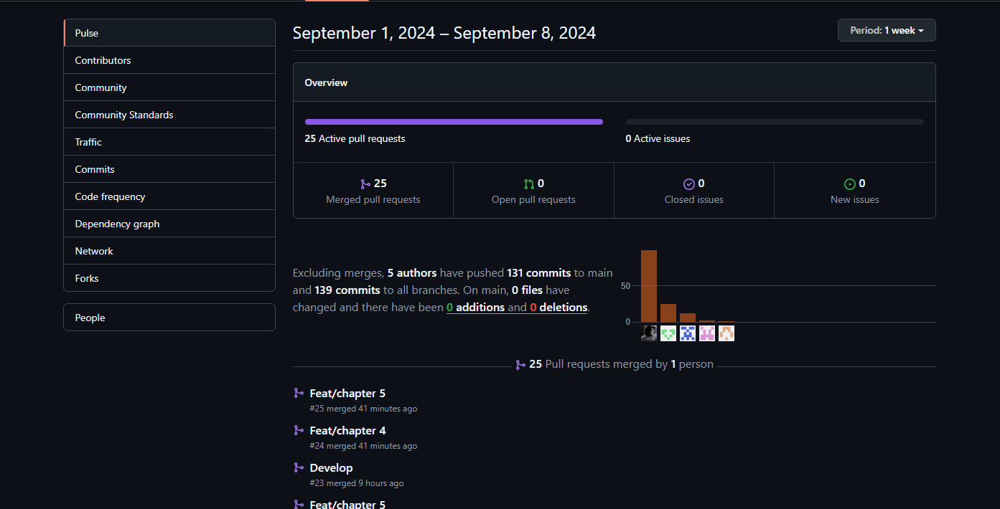
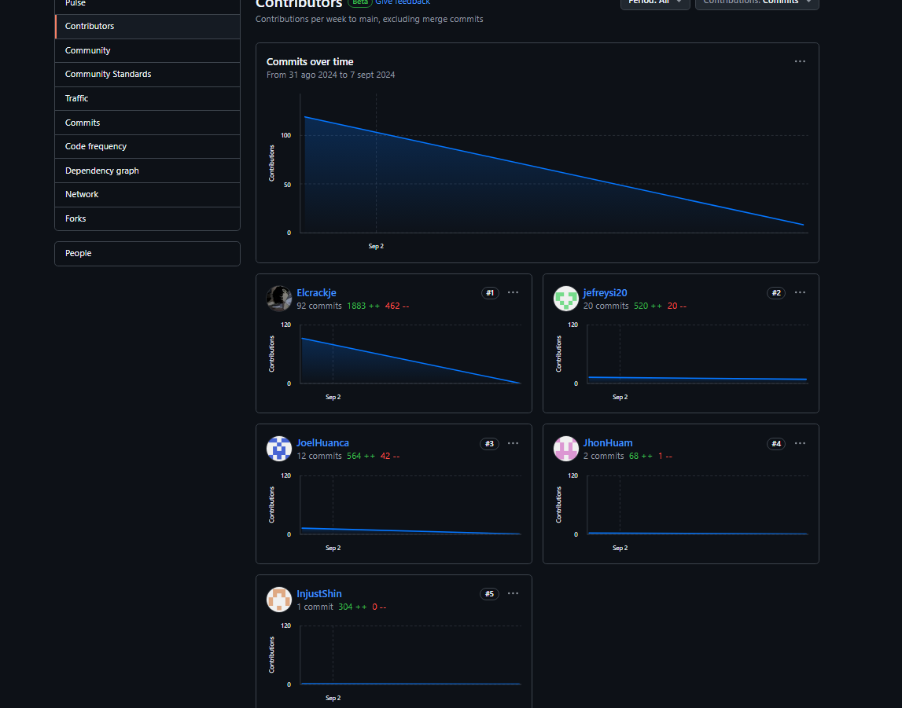
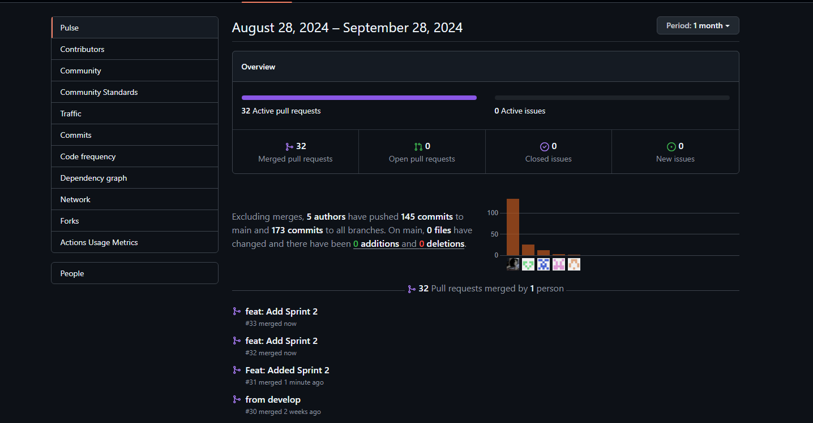
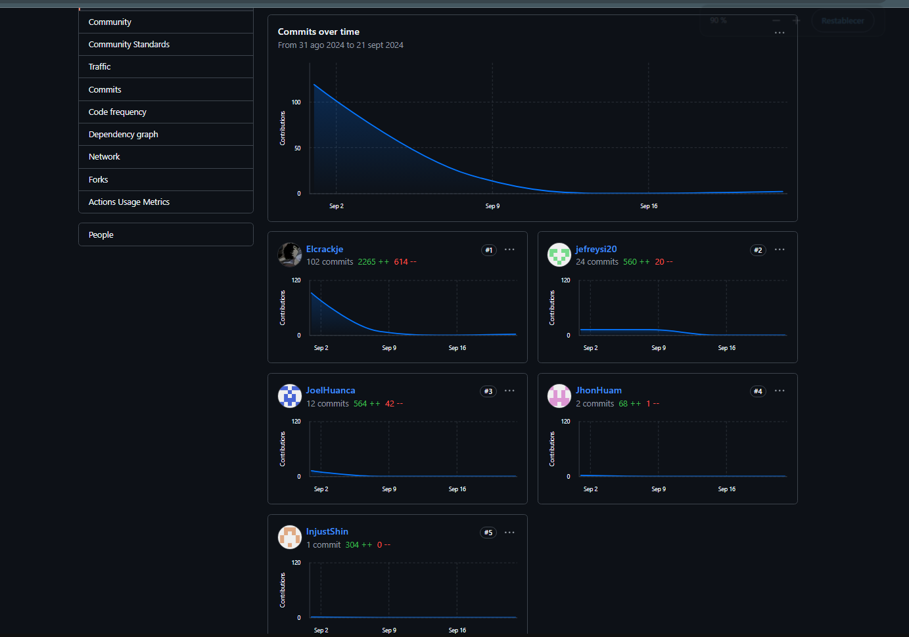
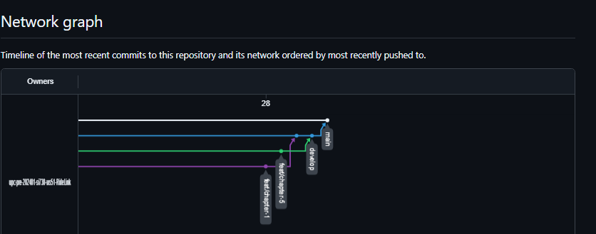
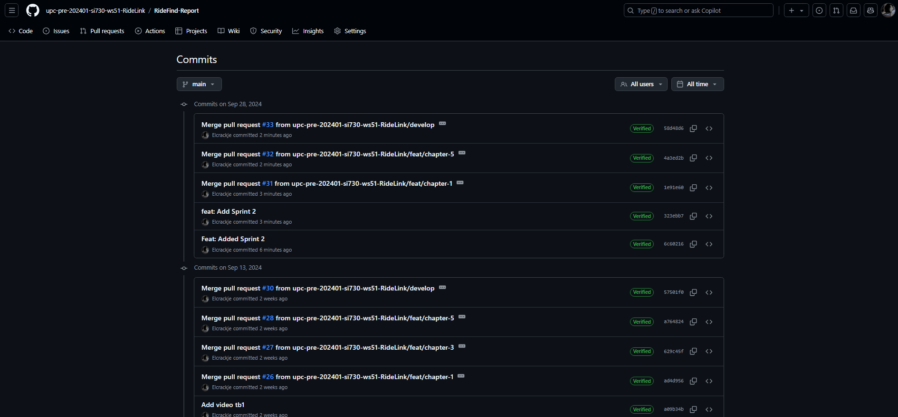
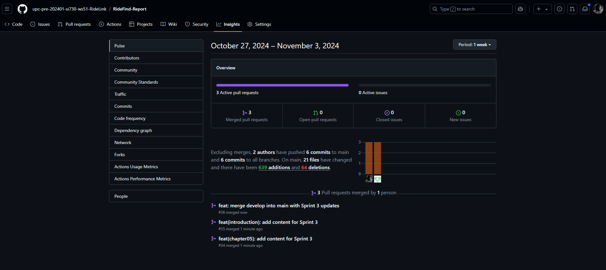
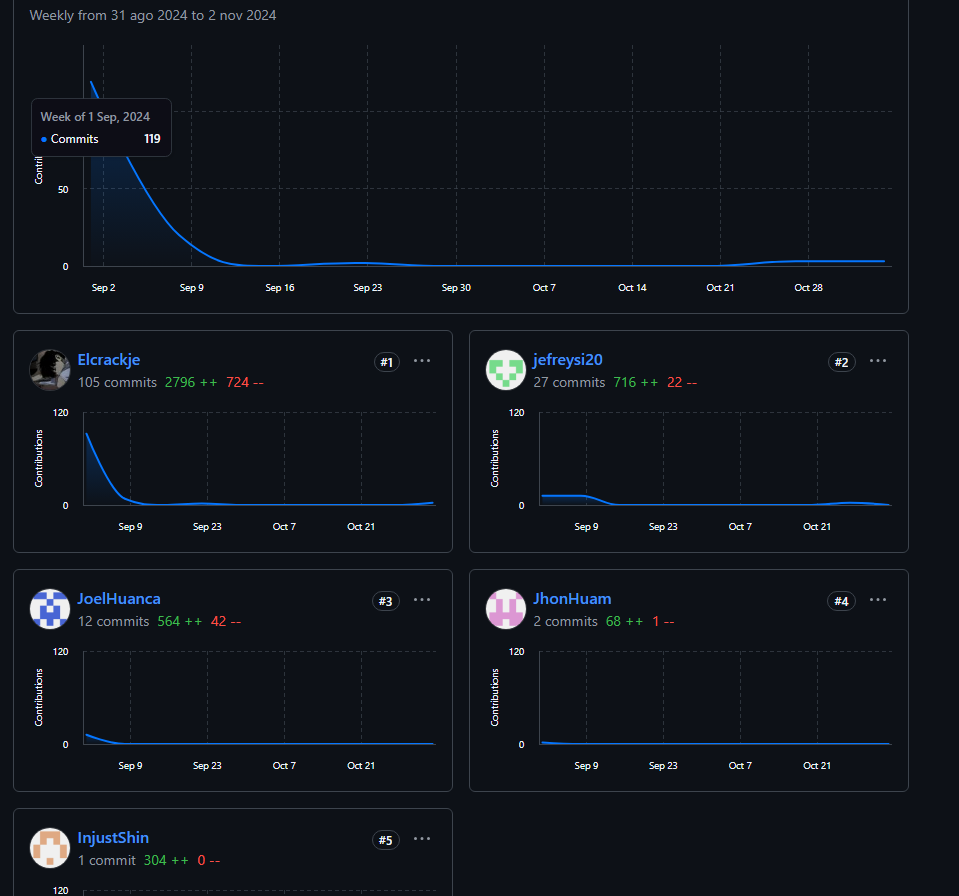
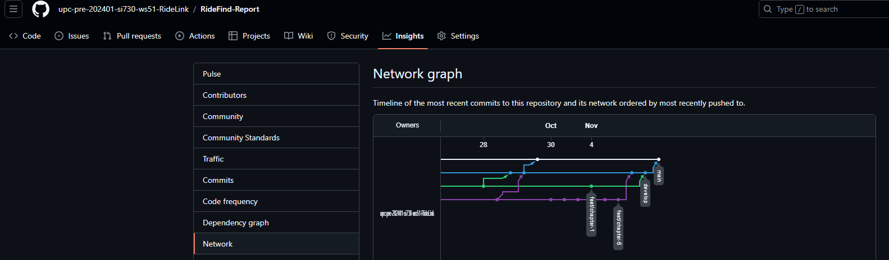
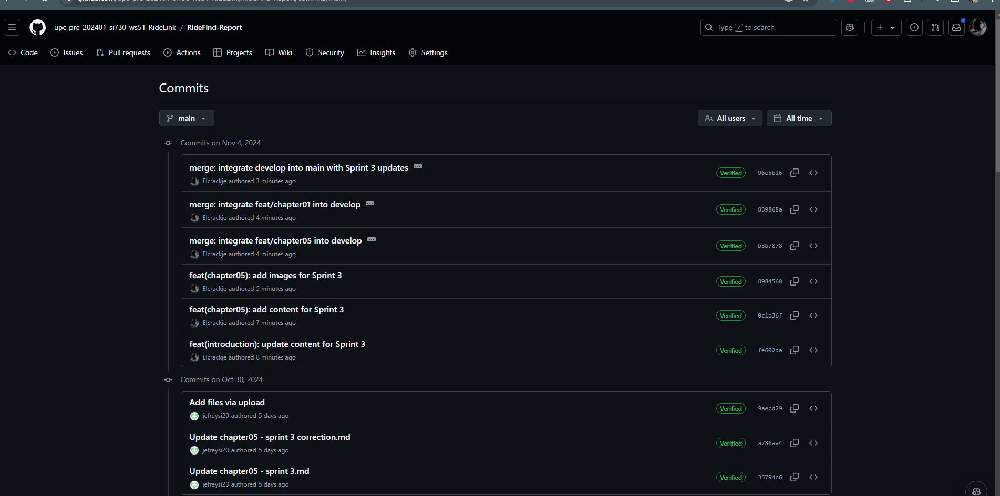

# Registro de Versiones del Informe

| Versión | Fecha | Autor | Descripción de la modificación |
|----|----|----|----|
| TB1 | 25/08/2024 | RideLink | Redacción de los Capítulos I: Introduction, II: Requirements Elicitation & Analysis, III: Requirements Specification, IV: Product Design, V: Product Implementation, Validation & Deployment. |
| TP1 | 27/09/2024 | RideLink | Adición del Capítulo V: 5.2.2., 5.2.2.1., 5.2.2.2., 5.2.2.3., 5.2.2.4., 5.2.2.5., 5.2.2.6., 5.2.2.7., 5.2.2.8. |
| TB2 | 03/11/2024 | RideLink | Adición del Capítulo V: 5.2.3., 5.2.3.1., 5.2.3.2., 5.2.3.3., 5.2.3.4., 5.2.3.5., 5.2.3.6., 5.2.3.7., 5.2.3.8, 5.3, 5.3.1, 5.3.2, 5.3.3, 5.4|
  
---
  
# Project Report Collaboration Insights
TB1: Las tareas asignadas para la entrega TB1 se han completado exitosamente y están debidamente documentadas en el repositorio de GitHub, el cual pertenece a la organización del equipo. Este repositorio refleja los avances y colaboraciones de cada integrante a través de los commits y evidencia todo el ciclo de trabajo hasta la culminación de esta entrega.: [Repositorio Github](https://github.com/upc-pre-202401-si730-ws51-RideLink/RideFind-Report).

Durante la preparación del informe, se realizaron las siguientes actividades clave:

- Cada miembro escribió y diagramó sus contenidos asignados en formato Markdown, realizando commits frecuentes para reflejar el progreso en el repositorio.
- Se generaron los artefactos necesarios utilizando las herramientas recomendadas, y se obtuvieron enlaces de imágenes desde la carpeta “assets” en la rama develop del repositorio del informe.
- Se organizaron reuniones periódicas para coordinar el avance de los elementos del informe y comunicar los resultados del Sprint 1, que estuvo centrado en el desarrollo de la Landing Page.

  

**TP1** Las tareas asignadas para la entrega del TP1 han sido completadas y documentadas de manera exhaustiva en el repositorio de GitHub de la organización del equipo: [Repositorio Github](https://github.com/upc-pre-202401-si730-ws51-RideLink/RideFind-Report)

Se redactaron y diagramaron los contenidos asignados a cada integrante en formato Markdown, con commits regulares para mantener un seguimiento preciso del progreso en el repositorio.

Además, se han generado los artefactos necesarios utilizando las herramientas recomendadas, y se llevaron a cabo reuniones periódicas para coordinar el avance de los elementos del informe y comunicar los progresos del Sprint 2, centrado en el desarrollo de la aplicación web.

**TB2**: Las tareas asignadas para la entrega del TB2 han sido completadas y debidamente documentadas en el repositorio de GitHub del equipo. [Repositorio Github](https://github.com/upc-pre-202401-si730-ws51-RideLink/RideFind-Report)

- Se redactaron y diagramaron los contenidos asignados a cada integrante en formato Markdown, seguido de commits para asegurar el seguimiento del progreso en el repositorio. 
- Se generaron los artefactos necesarios utilizando las herramientas recomendadas. 
- Se llevaron a cabo reuniones para coordinar el avance de los elementos del informe y comunicar los progresos del Sprint 3, enfocado en el desarrollo del frontend y avance del backend.

---

# Contenido
## Tabla de contenidos
- [**Registro de Versiones del Informe**](#registro-de-versiones-del-informe)
- [**Project Report Collaboration Insights**](#project-report-collaboration-insights)
- [**Contenido**](#contenido)
    - [Tabla de contenidos](#tabla-de-contenidos)
- [**Student Outcome**](#student-outcome)
- ## [ **Capítulo I: Introducción** ](#-capítulo-i-introducción-)
  - [**1.1. Startup Profile**](#11-startup-profile)
    - [**1.1.1. Descripción de la Startup**](#111-descripción-de-la-startup)
    - [**1.1.2. Perfiles de integrantes del equipo**](#112-perfiles-de-integrantes-del-equipo)
  - [**1.2. Solution Profile**](#12-solution-profile)
    - [**1.2.1 Antecedentes y problemática**](#121-antecedentes-y-problemática)
    - [What (¿Qué?)](#what-qué)
    - [Who (¿Quién?)](#who-quién)
    - [Where (¿Dónde?)](#where-dónde)
    - [When (¿Cuándo?)](#when-cuándo)
    - [Why (¿Por qué?)](#why-por-qué)
    - [How (¿Cómo?)](#how-cómo)
    - [How much (¿Cuánto?)](#how-much-cuánto)
    - [**1.2.2 Lean UX Process**](#122-lean-ux-process)
    - [**1.2.2.1. Lean UX Problem Statements**](#1221-lean-ux-problem-statements)
    - [**1.2.2.2. Lean UX Assumptions**](#1222-lean-ux-assumptions)
    - [**1.2.2.3. Lean UX Hypothesis Statements**](#1223-lean-ux-hypothesis-statements)
    - [**1.2.2.4. Lean UX Canvas**](#1224-lean-ux-canvas)
  - [**1.3. Segmentos objetivo**](#13-segmentos-objetivo)
- ## [ **Capítulo II: Requirements Elicitation \& Analysis**](#-capítulo-ii-requirements-elicitation--analysis)
  - [**2.1. Competidores**](#21-competidores)
    - [**2.1.1. Análisis competitivo**](#211-análisis-competitivo)
    - [**2.1.2. Estrategias y tácticas frente a competidores**](#212-estrategias-y-tácticas-frente-a-competidores)
  - [**2.2. Entrevistas**](#22-entrevistas)
    - [**2.2.1. Diseño de entrevistas**](#221-diseño-de-entrevistas)
    - [**2.2.2. Registro de entrevistas**](#222-registro-de-entrevistas)
    - [**2.2.3. Análisis de entrevistas**](#223-análisis-de-entrevistas)
  - [**2.3. Needfinding**](#23-needfinding)
    - [**2.3.1. User Personas**](#231-user-personas)
    - [**2.3.2. User Task Matrix**](#232-user-task-matrix)
    - [**2.3.3. User Journey Mapping**](#233-user-journey-mapping)
    - [**2.3.4. Empathy Mapping**](#234-empathy-mapping)
    - [**2.3.5. As-is Scenario Mapping**](#235-as-is-scenario-mapping)
  - [**2.4. Ubiquitous Language**](#24-ubiquitous-language)
- ## [ **Capítulo III: Requirements Specification**](#-capítulo-iii-requirements-specification)
  - [**3.1. To-Be Scenario Mapping**](#31-to-be-scenario-mapping)
  - [**3.2. User Stories**](#32-user-stories)
  - [**3.3. Impact Mapping**](#33-impact-mapping)
  - [**3.4. Product Backlog**](#34-product-backlog)
- ## [**Capítulo IV: Product Design**](#capítulo-iv-product-design)
  - [**4.1. Style Guidelines**](#41-style-guidelines)
    - [**4.1.1. General Style Guidelines**](#411-general-style-guidelines)
    - [**4.1.2. Web Style Guidelines**](#412-web-style-guidelines)
  - [**4.2. Information Architecture**](#42-information-architecture)
    - [**4.2.1. Organization Systems**](#421-organization-systems)
    - [**4.2.2. Labeling Systems**](#422-labeling-systems)
    - [**4.2.3. SEO Tags and Meta Tags**](#423-seo-tags-and-meta-tags)
    - [**4.2.4. Searching Systems**](#424-searching-systems)
    - [**4.2.5. Navigation Systems**](#425-navigation-systems)
  - [**4.3. Landing Page UI Design**](#43-landing-page-ui-design)
    - [**4.3.1. Landing Page Wireframe**](#431-landing-page-wireframe)
    - [**4.3.2. Landing Page Mock-up**](#432-landing-page-mock-up)
  - [**4.4. Web Applications UX/UI Design**](#44-web-applications-uxui-design)
    - [**4.4.1. Web Applications Wireframes**](#441-web-applications-wireframes)
    - [**4.4.2. Web Applications Wireflow Diagrams**](#442-web-applications-wireflow-diagrams)
    - [**4.4.3. Web Applications Mock-ups**](#443-web-applications-mock-ups)
    - [**4.4.4. Web Applications User Flow Diagrams**](#444-web-applications-user-flow-diagrams)
  - [**4.5. Web Applications Prototyping**](#45-web-applications-prototyping)
  - [**4.6. Domain-Driven Software Architecture**](#46-domain-driven-software-architecture)
    - [**4.6.1. Software Architecture Context Diagram**](#461-software-architecture-context-diagram)
    - [**4.6.2. Software Architecture Container Diagrams**](#462-software-architecture-container-diagrams)
    - [**4.6.3. Software Architecture Components Diagrams**](#463-software-architecture-components-diagrams)
  - [**4.7. Software Object-Oriented Design**](#47-software-object-oriented-design)
    - [**4.7.1. Class Diagrams**](#471-class-diagrams)
    - [**4.7.2. Class Dictionary**](#472-class-dictionary)
  - [**4.8. Database Design**](#48-database-design)
    - [**4.8.1. Database Diagram**](#481-database-diagram)
- ## [**Capítulo V: Product Implementation, Validation \& Deployment**](#capítulo-v-product-implementation-validation--deployment)
  - [**5.1. Software Configuration Management**](#51-software-configuration-management)
    - [**5.1.1. Software Development Environment Configuration**](#511-software-development-environment-configuration)
    - [**5.1.2. Source Code Management**](#512-source-code-management)
    - [**5.1.3. Source Code Style Guide \& Conventions**](#513-source-code-style-guide--conventions)
    - [**5.1.4. Software Deployment Configuration**](#514-software-deployment-configuration)
  - [**5.2. Landing Page, Services \& Applications Implementation**](#52-landing-page-services--applications-implementation)
    - [**5.2.1. Sprint 1**](#521-sprint-1)
    - [**5.2.1.1. Sprint Planning 1**](#5211-sprint-planning-1)
    - [**5.2.1.2. Sprint Backlog 1**](#5212-sprint-backlog-1)
    - [**5.2.1.3. Development Evidence for Sprint Review**](#5213-development-evidence-for-sprint-review)
    - [**5.2.1.4. Testing Suite Evidence for Sprint Review**](#5214-testing-suite-evidence-for-sprint-review)
    - [**5.2.1.5. Execution Evidence for Sprint Review**](#5215-execution-evidence-for-sprint-review)
    - [**5.2.1.6. Services Documentation Evidence for Sprint Review**](#5216-services-documentation-evidence-for-sprint-review)
    - [**5.2.1.7. Software Deployment Evidence for Sprint Review**](#5217-software-deployment-evidence-for-sprint-review)
    - [**5.2.1.8. Team Collaboration Insights during Sprint**](#5218-team-collaboration-insights-during-sprint)
  - [**5.2.2. Sprint 2**](#522-sprint-2)
    - [**5.2.2.1. Sprint Planning 2**](#5221-sprint-planning-2)
    - [**5.2.2.2. Sprint Backlog 2**](#5222-sprint-backlog-2)
    - [**5.2.2.3. Development Evidence for Sprint Review**](#5223-development-evidence-for-sprint-review)
    - [**5.2.2.4. Testing Suite Evidence for Sprint Review**](#5224-testing-suite-evidence-for-sprint-review)
    - [**5.2.2.5. Execution Evidence for Sprint Review**](#5225-execution-evidence-for-sprint-review)
    - [**5.2.2.6. Services Documentation Evidence for Sprint Review**](#5226-services-documentation-evidence-for-sprint-review)
    - [**5.2.2.7. Software Deployment Evidence for Sprint Review**](#5227-software-deployment-evidence-for-sprint-review)
    - [**5.2.2.8. Team Collaboration Insights during Sprint**](#5228-team-collaboration-insights-during-sprint)
    - [**5.2.3. Sprint 3**](#523-sprint-3)
    - [**5.2.3.1. Sprint Planning 3**](#5231-sprint-planning-3)
    - [**5.2.3.2. Sprint Backlog 3**](#5232-sprint-backlog-3)
    - [**5.2.3.3. Development Evidence for Sprint Review**](#5233-development-evidence-for-sprint-review)
    - [**5.2.3.4. Testing Suite Evidence for Sprint Review**](#5234-testing-suite-evidence-for-sprint-review)
    - [**5.2.3.5. Execution Evidence for Sprint Review**](#5235-execution-evidence-for-sprint-review)
    - [**5.2.3.6. Services Documentation Evidence for Sprint Review**](#5236-services-documentation-evidence-for-sprint-review)
    - [**5.2.3.7. Software Deployment Evidence for Sprint Review**](#5237-software-deployment-evidence-for-sprint-review)
    - [**5.2.3.8. Team Collaboration Insights during Sprint**](#5238-team-collaboration-insights-during-sprint)
  - [**5.3. Validation Interviews**](#53-validation-interviews)
    - [**5.3.1. Diseño de Entrevistas**](#531-diseño-de-entrevistas)
    - [**5.3.2. Registro de Entrevistas**](#532-registro-de-entrevistas)
    - [**5.3.3. Evaluaciones según heurísticas**](#533-evaluaciones-según-heurísticas)
  - [**5.4. Video About-the-Product**](#54-video-about-the-product)
- [**Conclusiones**](#conclusiones)
- [**Conclusiones y recomendaciones**](#conclusiones-y-recomendaciones)
- [**Video About-the-Team**](#video-about-the-team)
- [**Bibliografía**](#bibliografía)
- [**Anexos**](#anexos)

---  
  
# Student Outcome

<table>
    <tr>
        <th style="text-align:center;">Criterio específico</th>
        <th style="text-align:center;">Acciones realizadas</th>
        <th style="text-align:center;">Conclusiones</th>
    </tr>
    <tr>
        <td align="center">Trabaja en equipo para proporcionar liderazgo en forma conjunta</td>
        <td>
            Briceño De La Cruz, Farid Sebastian  
            TB1  
            Se encargó de la planificación inicial del proyecto y la distribución de roles entre los integrantes, promoviendo la equidad y una buena comunicación. Coordinó efectivamente al equipo, facilitando un entorno inclusivo y colaborativo que permitió una buena organización del trabajo.  
            TP1  
            En colaboración con Jose, me encargué de liderar el desarrollo de la funcionalidad de Registro de Usuario (US06), donde trabajé en el diseño y validación de los formularios con HTML, CSS y JavaScript. Proporcioné liderazgo en el área del frontend, asegurándome de que la interfaz fuera responsive y fácil de usar, y al mismo tiempo, participé en las reuniones de planificación para ayudar a definir los roles y objetivos del sprint, contribuyendo a la organización conjunta del equipo.
              TP2  
            En esta fase del proyecto, lideré la actualización del front-end y la Landing Page, asegurándome de que todos los cambios fueran comunicados al equipo de manera efectiva. Trabajé en colaboración con Jose para integrar el backend con el front-end, promoviendo un ambiente donde todos pudieran aportar ideas y comentarios. Coordiné el diseño responsive, garantizando que cada miembro tuviera un rol claro y se sintiera parte del proceso de desarrollo, fomentando así un entorno inclusivo y colaborativo.
              
            Gutierrez Garcia, Jose Eduardo  
            TB1  
            Colaboró en la creación del front-end y la Landing Page, asegurándose de que la implementación fuera consistente con los requisitos del proyecto. Proporcionó liderazgo técnico al definir las mejores prácticas de desarrollo para la primera versión del front-end, logrando un resultado funcional y estéticamente coherente.
             TP  
            Como Team Leader, trabajé en equipo para coordinar y liderar de manera conjunta, asegurando que todos los integrantes del equipo tuvieran una comunicación constante y efectiva. Colaboré estrechamente con Farid en la planificación de las tareas y supervisé el progreso de todos los miembros para cumplir los objetivos del sprint. También proporcioné liderazgo técnico durante la implementación de la funcionalidad de Inicio de Sesión (US07), colaborando en el desarrollo del frontend y la autenticación del backend, asegurándome de que todo estuviera alineado con las expectativas del equipo.
              TB2  
            Me enfoqué en el desarrollo del backend y el deployment en la nube, proporcionando liderazgo técnico y asegurando que la implementación cumpliera con los requisitos establecidos por el equipo. Trabajé de cerca con Farid para coordinar la integración entre el front-end y el backend, además de gestionar el despliegue en la nube. Fomenté un ambiente colaborativo, alentando la participación activa de todos en las decisiones técnicas y en la planificación de tareas.
              
            Huamani Aguilar, Jhon Rony  
            TB1  
            Lideró la integración del sistema con el servicio RESTful, asegurando que el equipo comprendiera cómo utilizar y probar la API correctamente. Aportó un enfoque de liderazgo técnico y colaborativo, guiando al equipo en la integración exitosa del backend con el frontend.
             TP  
           Colaboré con el equipo para liderar la integración del backend en la funcionalidad de Recuperación de Contraseña (US08). Trabajé de manera conjunta con Cristhian para garantizar que el proceso de validación y envío de correos electrónicos estuviera completamente integrado con las APIs RESTful. Guié al equipo en la implementación de las APIs y trabajamos en conjunto para resolver problemas técnicos, asegurando que todos estuvieran alineados y que la integración fuera exitosa.
             TB2  
           No Participó
              
            Huanca Zevallos, Cristhian Joel  
            TB1  
            Supervisó las sesiones de validación y pruebas iniciales, recopilando retroalimentación del equipo para mejorar la interfaz de usuario. Proporcionó un liderazgo centrado en la calidad, asegurando que las pruebas reflejaran el feedback real y contribuyendo a mejoras tangibles en el producto.
              TP  
            En colaboración con Jhon, lideré la creación de los Mensajes de Error y Validaciones (US09) para los formularios del sistema. Trabajé junto al equipo para definir las pruebas iniciales, promoviendo un entorno colaborativo en el que todos aportamos mejoras en la interfaz de usuario. Mi enfoque de liderazgo fue garantizar que la calidad del producto reflejara el feedback del equipo, y trabajé junto con mis compañeros para implementar mejoras basadas en sus aportes.
              TB2  
            Lideré las entrevistas de validación y trabajé en el backend, asegurando que todos los aportes del equipo fueran considerados en la implementación. Fomenté un ambiente inclusivo durante las entrevistas, donde cada miembro tuvo la oportunidad de expresar sus opiniones y sugerencias. Colaboré con el equipo para integrar las validaciones necesarias, garantizando que el producto final cumpliera con los estándares de calidad y las expectativas del cliente.
              
            Sanchez Ignacio, Jefrey Martin  
            TB1  
            Dirigió las tareas relacionadas con la documentación del proyecto y los entregables del capítulo 5. A través de su liderazgo en la documentación, garantizó que todos los artefactos se presentaran de manera clara y organizada, facilitando el trabajo colaborativo y asegurando que los objetivos del sprint se cumplieran.
              TP   
            Trabajé en conjunto con mis compañeros en las pruebas de Registro de Usuario, Inicio de Sesión y Recuperación de Contraseña (US10), asegurando que todas las funcionalidades implementadas fueran testeadas exhaustivamente. Además, lideré el esfuerzo de documentación en equipo, organizando la información de manera clara y detallada para que todos pudieran referirse a ella durante el sprint. Colaboré con los demás para que la documentación apoyara la coordinación y facilitara la retroalimentación entre los integrantes.
              TB2  
            Colaboré en las entrevistas de validación y en el desarrollo del backend, asegurándome de que el equipo estuviera alineado en los objetivos y roles durante este proceso. Promoví un entorno colaborativo al facilitar la comunicación entre los miembros del equipo y asegurar que todas las voces fueran escuchadas. Mi enfoque en la retroalimentación y el trabajo conjunto permitió que las validaciones fueran efectivas y que se incorporaran mejoras significativas en el proyecto.
        </td>
        <td>
            TB1:  En este primer logro, el equipo demostró una sólida capacidad de liderazgo colaborativo. Cada integrante asumió roles clave que facilitaron la gestión del proyecto, desde la planificación inicial hasta la ejecución técnica. Gracias a un liderazgo compartido, el equipo mantuvo una comunicación constante y efectiva, lo que permitió alcanzar los objetivos propuestos dentro de los plazos estipulados. La sinergia entre los miembros fue crucial para crear un entorno de trabajo en el que las decisiones se tomaron en conjunto y donde cada persona aportó valor al éxito del proyecto.
             
            TP1:  Durante el trabajo en el capítulo 5 del TP, el equipo fortaleció su capacidad de colaboración al desarrollar secciones críticas como el Sprint Planning 2 y el Backlog 2. La integración de los aportes de cada miembro permitió completar las secciones **5.2.2.1** a **5.2.2.8**, consolidando el desarrollo del front-end y el despliegue en Firebase. 
            TB2:  En este segundo logro, el equipo demostró un notable crecimiento en su capacidad de trabajar en conjunto y proporcionar liderazgo compartido. Cada miembro asumió responsabilidades específicas que facilitaron la ejecución del proyecto, desde la actualización del front-end hasta el desarrollo del backend y el despliegue en la nube. La colaboración y la comunicación efectiva fueron fundamentales para alcanzar los objetivos establecidos y asegurar que cada voz fuera escuchada en el proceso. La cohesión del equipo permitió superar los desafíos y mejorar la calidad del producto final, destacando el compromiso de todos hacia el éxito del proyecto.
        </td>
    </tr>
    <tr>
        <td align="center">Crea un entorno colaborativo e inclusivo, establece metas, planifica tareas y cumple objetivos</td>
        <td>
            Briceño De La Cruz, Farid Sebastian  
            TB1  
            Planificó y organizó las reuniones de equipo, asegurando que todos los integrantes pudieran participar activamente y se respetaran las opiniones de todos. Creó un entorno inclusivo y promovió la colaboración, logrando que las reuniones fueran productivas y que los objetivos del sprint se alcanzaran. 
             TP  
            Me encargué de liderar el desarrollo de la funcionalidad de Registro de Usuario (US06), estableciendo metas claras para la implementación del formulario de registro y promoviendo un entorno colaborativo en el que todos los comentarios fueron bienvenidos. Trabajé en conjunto con Jose para planificar las tareas y asignarlas de manera equitativa, asegurándonos de que el diseño responsive del formulario cumpliera los objetivos propuestos. Fomenté la inclusión de todos los miembros del equipo, impulsando su participación activa en el desarrollo de la interfaz de usuario.
              TB2  
            En esta fase del proyecto, me encargué de actualizar el front-end y la Landing Page, estableciendo metas claras y planificando las tareas en colaboración con el equipo. Fomenté un entorno inclusivo al facilitar reuniones donde todos pudieran expresar sus ideas y preocupaciones. Trabajé de cerca con Jose para asegurar que nuestras tareas estuvieran alineadas, promoviendo la comunicación constante y el apoyo mutuo para cumplir con los objetivos establecidos.
              
            Gutierrez Garcia, Jose Eduardo  
            TB1  
            Desarrolló la primera versión del sistema backend, asegurándose de que las metas técnicas se alinearan con las necesidades del negocio. Ayudó a establecer metas claras y planificar el desarrollo técnico, asegurando que el equipo cumpliera con las expectativas del cliente y las necesidades funcionales.
              TP  
            Como Team Leader, me aseguré de crear un entorno colaborativo e inclusivo donde todos los miembros del equipo pudieran aportar sus ideas y trabajar en conjunto hacia los objetivos del sprint. Trabajé en estrecha colaboración con Farid y el resto del equipo para establecer metas claras, planificar las tareas de forma efectiva y garantizar que todos tuvieran roles definidos. En particular, lideré la planificación de la funcionalidad de Inicio de Sesión (US07), asegurándome de que las metas se cumplieran dentro del tiempo previsto y fomentando la participación de todos en la toma de decisiones.
              TB2  
            Mi enfoque en el backend y el deployment en la nube se centró en crear un ambiente colaborativo donde todos los integrantes pudieran participar activamente. Establecí metas específicas para el desarrollo del backend y coordinar el despliegue, asegurándome de que todos comprendieran sus responsabilidades y cómo contribuir al éxito del proyecto. Promoví la planificación de tareas, realizando reuniones regulares para evaluar el progreso y ajustar las estrategias según fuera necesario, lo que permitió cumplir con los objetivos del sprint.
              
            Huamani Aguilar, Jhon Rony  
            TB1  
            Facilitó la comunicación entre los miembros del equipo técnico y los encargados del diseño, asegurando una integración armoniosa de los componentes visuales y funcionales. Su enfoque en la colaboración permitió una correcta integración de las interfaces de usuario y los servicios del backend, cumpliendo con los objetivos del proyecto.
              TP  
            Creé un ambiente colaborativo al trabajar estrechamente con Cristhian en la integración del backend para la funcionalidad de Recuperación de Contraseña (US08). Establecimos objetivos claros para implementar la API y planificamos juntos las tareas para lograr una integración fluida entre el frontend y el backend. Nos aseguramos de que cada miembro del equipo entendiera su papel en el proceso, promoviendo una participación inclusiva y un trabajo conjunto que permitió cumplir con los objetivos del sprint.
              TB2  
            No Participó
              
            Huanca Zevallos, Cristhian Joel  
            TB1 
            Se encargó de documentar las métricas del sprint y garantizar que todos los miembros cumplieran con sus tareas asignadas dentro del plazo. A través de una planificación eficaz, contribuyó a que se cumplieran todos los objetivos del sprint, promoviendo una colaboración constante y organizada.
             TP  
            Lideré el desarrollo de los Mensajes de Error y Validaciones (US09), asegurándome de crear un entorno donde todas las ideas fueran escuchadas y consideradas. Junto con Jhon, planificamos las tareas necesarias para cumplir los objetivos de calidad del sprint, estableciendo metas alcanzables y asegurándonos de que todos los miembros del equipo participaran activamente en el proceso de validación. Fomenté un ambiente inclusivo donde todos se sintieron cómodos al compartir sus opiniones y sugerencias para mejorar el producto final.
              TB2  
            Lideré las entrevistas de validación y trabajé en el backend, estableciendo metas claras para el desarrollo de funcionalidades. Fomenté un ambiente colaborativo al invitar a todos a participar en las entrevistas, asegurando que las opiniones y sugerencias de cada miembro fueran consideradas. Esto no solo ayudó a crear un sentido de pertenencia, sino que también garantizó que el producto final cumpliera con las expectativas del equipo y del cliente.
              
            Sanchez Ignacio, Jefrey Martin  
            TB1  
            Validó las decisiones tomadas en relación con la estructura del proyecto y la implementación de los sprints, asegurando que todas las partes estuvieran alineadas con los objetivos finales. Se aseguró de que el equipo mantuviera una planificación clara y alcanzara los objetivos propuestos, integrando continuamente las mejoras sugeridas durante el desarrollo.
             TP  
            Trabajé en un entorno colaborativo al liderar las pruebas de Registro de Usuario, Inicio de Sesión y Recuperación de Contraseña (US10), asegurando que cada miembro del equipo tuviera claras sus responsabilidades. Establecí metas para las pruebas y planifiqué las tareas de QA de manera inclusiva, permitiendo que todos los integrantes del equipo aportaran feedback. Además, me aseguré de cumplir con los objetivos de documentación del sprint, organizando la información de manera que facilitara el trabajo de todos y contribuyera a un ambiente inclusivo.
              TB2  
            Colaboré en las entrevistas de validación y en el desarrollo del backend, creando un entorno donde se priorizó la inclusión y la colaboración. Durante este proceso, establecimos metas comunes y planificamos las tareas de manera que cada miembro pudiera contribuir según sus fortalezas. Promoví un espacio abierto para la retroalimentación, lo que permitió que el equipo se ajustara rápidamente a las necesidades del proyecto y asegurara el cumplimiento de los objetivos.
        </td>
        <td>
            TB1: El equipo destacó por la creación de un entorno altamente colaborativo e inclusivo, donde cada miembro tuvo un rol activo en la planificación y ejecución de las tareas. La claridad en las metas y una adecuada distribución de las responsabilidades fueron fundamentales para el progreso fluido del proyecto. Al establecer una cultura de respeto y comunicación abierta, se logró cumplir con todos los objetivos propuestos de manera eficiente, lo que no solo permitió una mejor organización, sino que también mejoró el desempeño individual y grupal.
             
            TP1: En el contexto del TP, el equipo demostró su capacidad para cumplir con las metas propuestas para el Sprint 2, logrando desarrollar las secciones correspondientes al capítulo 5. La planificación detallada y el cumplimiento de los objetivos permitieron que el equipo completara con éxito las funcionalidades de autenticación, pruebas y despliegue, garantizando una entrega sólida y de alta calidad del front-end de la aplicación en Firebase.
             
            TB2: En este segundo logro, el equipo demostró un compromiso significativo con la creación de un entorno colaborativo e inclusivo. A través de la planificación de tareas y el establecimiento de metas claras, cada miembro pudo contribuir de manera efectiva al proyecto. La comunicación constante y el apoyo mutuo fueron esenciales para cumplir con los objetivos del sprint, lo que resultó en una mejor cohesión y un producto final de alta calidad. La inclusividad fomentada en cada etapa del proceso permitió que todas las voces fueran escuchadas, enriqueciendo el resultado del trabajo conjunto.
        </td>
    </tr>
</table>

 
  
---
