# **Capítulo II: Requirements Elicitation & Analysis**

## 2.1. Competidores.

<table>
    <thead>
        <tr>
            <th>Nombre</th>
            <th>Descripción</th>
        </tr>
    </thead>
    <tbody>
        <tr>
            <td rowspan align="center">CityBikeLima
            <td>CityBike Lima es un servicio de bicicletas compartidas que opera en el distrito de Miraflores, Lima. Su objetivo es promover el uso de medios de transporte sostenibles y saludables, facilitando el acceso a bicicletas públicas para residentes y visitantes. El sistema de CityBike Lima permite a los usuarios alquilar bicicletas de manera sencilla y económica, contribuyendo a mejorar la movilidad urbana y reducir la congestión vehicular en la ciudad. 
            Página web:<a href="https://www.citybikelima.com/"> https://www.citybikelima.com/</a>
        </tr>
        <tr>
            <td align="center">Airbnb
            <td> Airbnb es una plataforma global que conecta a viajeros con anfitriones que ofrecen alojamientos únicos y variados en todo el mundo. La empresa permite a los usuarios encontrar desde habitaciones compartidas hasta casas enteras, proporcionando experiencias de viaje personalizadas y auténticas. Airbnb se enfoca en crear una comunidad donde los viajeros puedan sumergirse en culturas locales y disfrutar de estadías cómodas y asequibles, mientras los anfitriones tienen la oportunidad de generar ingresos adicionales al compartir sus espacios. 
            Página web:<a href="https://www.airbnb.com.pe/"> https://www.airbnb.com.pe/</a>
        </tr>
        <tr>
           <td rowspan align="center">GrinPeru 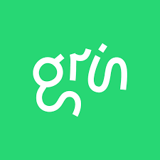 
           <td>Grin Perú es una empresa dedicada al alquiler de scooters eléctricos en la ciudad de Lima. Ofrece planes de suscripción flexibles que permiten a los usuarios alquilar scooters por uno, dos o tres meses, brindando una alternativa de transporte rápida, económica y ecológica. Grin busca facilitar la movilidad urbana, ayudando a las personas a evitar el tráfico congestionado mientras contribuyen a la reducción de la huella de carbono. Entre sus beneficios destacan el ahorro en costos de transporte, mantenimiento ilimitado de los scooters, atención personalizada y vehículos diseñados para adaptarse a las vías limeñas. 
           Página web:<a href="https://grin4u.grin-mobility.com/?status=init"> https://grin4u.grin-mobility.com/?status=init</a>
    </tbody>
</table>

### 2.1.1. Análisis competitivo.

<table style="width: 100%;">
  <tr>
    <th colspan="6" style="padding: 8px; text-align: center;"> Competitive Analysis Landscape</th>
  </tr>
  <tr>
    <td>¿Por qué llevar a cabo este análisis?</td>
    <td colspan="5">Este análisis nos ayuda a comprender el panorama competitivo actual, identificando las fortalezas y debilidades de RideFind en comparación con otras opciones disponibles en el mercado. Esto nos permite optimizar nuestra propuesta de valor y estrategias para posicionarnos efectivamente y satisfacer mejor las necesidades de nuestros usuarios.</td>
  </tr>
  <tr>
    <td colspan="2"></td>
    <td align="center">RideFind 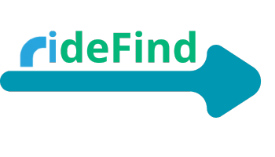</td>
    <td align="center">CityBikeLima </td>
    <td align="center">Airbnb </td>
    <td align="center">Grin Peru </td> 
  </tr>
  <tr>
    <td rowspan="2" align="center">Perfil</td>
    <td align="center">Overview</td>
    <td>Plataforma digital que conecta a usuarios con propietarios de vehículos eléctricos y alternativos para facilitar el alquiler de medios de transporte sostenibles como autos eléctricos, scooters y skateboards. Busca mejorar la movilidad urbana al ofrecer opciones flexibles y ecológicas que contribuyen a reducir el tráfico y la contaminación en las ciudades.</td>
    <td>Sistema de bicicletas públicas compartidas que ofrece una alternativa de transporte saludable y sostenible en el distrito de Miraflores, Lima. Facilita el desplazamiento urbano de manera económica y ecológica, contribuyendo a descongestionar el tráfico y fomentar hábitos de vida activos entre los usuarios.</td>
    <td>Plataforma global de alojamiento que conecta a viajeros con anfitriones ofreciendo una amplia variedad de opciones de hospedaje alrededor del mundo. Facilita experiencias de viaje únicas y personalizadas, permitiendo a los usuarios sumergirse en la cultura local y disfrutar de comodidades adaptadas a diferentes preferencias y presupuestos.</td>
    <td>Servicio de alquiler de scooters eléctricos a través de planes de suscripción mensuales, orientado a proporcionar una solución de transporte rápida y accesible que permite a los usuarios evitar el tráfico y disminuir costos asociados al transporte diario, mientras promueven prácticas amigables con el medio ambiente.</td>
  </tr>
  <tr>
    <td>Ventaja competitiva ¿Qué valor ofrece a los clientes?</td>
    <td><strong>Diversidad de Opciones:</strong>  Ofrece una amplia gama de vehículos eléctricos y alternativos para adaptarse a diversas necesidades de transporte. <strong>Conexión Directa:</strong>  Facilita la interacción directa entre propietarios y usuarios, creando oportunidades de ingresos adicionales y acceso sencillo a medios de transporte sostenibles. <strong>Flexibilidad:</strong>  Proporciona opciones de alquiler flexibles en términos de tiempo y tipo de vehículo, adaptándose a las circunstancias específicas de cada usuario.</td>
    <td><strong>Accesibilidad:</strong>  Proporciona estaciones de bicicletas ubicadas estratégicamente para facilitar el acceso y la movilidad dentro de la ciudad. <strong>Eco-Amigable:</strong>  Promueve el uso de transporte no motorizado, contribuyendo a la reducción de emisiones y mejorando la calidad del aire. <strong>Salud y Bienestar:</strong>  Incentiva hábitos saludables mediante el uso de la bicicleta como medio de transporte diario.</td>
    <td><strong>Experiencias Únicas:</strong>  Permite a los viajeros acceder a alojamientos diversos y auténticos que enriquecen su experiencia de viaje. <strong>Flexibilidad y Variedad:</strong>  Ofrece una amplia gama de opciones de hospedaje en múltiples ubicaciones y rangos de precios. <strong>Comunidad Global:</strong>  Fomenta una comunidad activa donde anfitriones y huéspedes pueden compartir y calificar experiencias, mejorando la confianza y calidad del servicio.</td>
    <td><strong>Planes de Suscripción Asequibles:</strong>  Ofrece planes de alquiler por periodos extendidos a precios competitivos, permitiendo un uso continuo y conveniente de scooters eléctricos. <strong>Mantenimiento Incluido:</strong>  Brinda servicio de mantenimiento ilimitado y soporte personalizado, asegurando una experiencia de uso sin inconvenientes. <strong>Ahorro de Tiempo y Dinero:</strong>  Ayuda a los usuarios a evitar embotellamientos y reduce gastos asociados al transporte convencional.</td>
  </tr>
  <tr>
    <td rowspan="2" align="center">Perfil de Marketing</td>
    <td>Mercado objetivo</td>
    <td><strong>Propietarios de Vehículos Alternativos:</strong>  Personas que poseen vehículos eléctricos o sostenibles y desean generar ingresos adicionales alquilándolos. <strong>Usuarios que Buscan Transporte Sostenible:</strong>  Individuos urbanos que necesitan soluciones de movilidad flexibles, eficientes y respetuosas con el medio ambiente.</td>
    <td><strong>Residentes Urbanos:</strong>  Habitantes de Miraflores y áreas cercanas que buscan alternativas de transporte práctico y económico. <strong>Turistas Locales e Internacionales:</strong>  Visitantes que desean explorar la ciudad de manera activa y sostenible.</td>
    <td><strong>Viajeros Independientes:</strong>  Personas que buscan experiencias de alojamiento personalizadas y diversas durante sus viajes. <strong>Anfitriones:</strong>  Propietarios que desean rentar sus espacios para generar ingresos adicionales.</td>
    <td><strong>Trabajadores y Estudiantes Urbanos:</strong>  Personas que requieren desplazarse diariamente por la ciudad de manera rápida y económica. <strong>Concienciados con el Medio Ambiente:</strong>  Usuarios interesados en opciones de transporte que reduzcan su impacto ambiental.</td>
  </tr>
  <tr>
    <td>Estrategias de marketing</td>
    <td><strong>Marketing Digital Orientado:</strong>  Campañas en redes sociales y plataformas digitales enfocadas en promover la sostenibilidad y eficiencia de la plataforma. <strong>Colaboraciones Estratégicas:</strong>  Alianzas con organizaciones ambientales y eventos urbanos para aumentar la visibilidad y credibilidad. <strong>Programas de Referidos:</strong>  Incentivos para usuarios que recomienden la plataforma a amigos y familiares.</td>
    <td><strong>Iniciativas Comunitarias:</strong>  Organización de paseos en bicicleta y eventos comunitarios para fomentar el uso de bicicletas. <strong>Paquetes para Turistas:</strong>  Ofertas especiales para visitantes que incluyen rutas turísticas y guías. <strong>Colaboración con Negocios Locales:</strong>  Alianzas con cafés, tiendas y otros negocios para ofrecer descuentos y beneficios a los usuarios.</td>
    <td><strong>Contenido Generado por Usuarios:</strong>  Promoción de historias y experiencias compartidas por huéspedes y anfitriones. <strong>Campañas Globales:</strong>  Publicidad que resalta la diversidad y alcance global de las opciones de alojamiento disponibles. <strong>Programas de Seguridad y Confianza:</strong>  Enfatizar las medidas de seguridad y protección para mejorar la confianza de los usuarios.</td>
    <td><strong>Promociones y Descuentos:</strong>  Ofertas especiales para nuevos suscriptores y descuentos por renovación de planes. <strong>Presencia en Eventos Urbanos:</strong>  Participación en eventos y actividades relacionadas con movilidad urbana y sostenibilidad. <strong>Contenido Educativo:</strong>  Generación de contenido que destaque los beneficios del uso de scooters eléctricos en la ciudad.</td>
  </tr>
  <tr>
    <td rowspan="3" align="center">Perfil del Producto</td>
    <td>Productos & Servicios</td>
    <td><strong>Plataforma Digital:</strong>  Aplicación web y móvil que permite la búsqueda, reserva y alquiler de diversos vehículos eléctricos y alternativos. 
    <strong>Opciones de Suscripción: </strong> Planes flexibles que ofrecen beneficios adicionales como descuentos y acceso prioritario. 
    <strong>Servicio al Cliente:</strong>  Soporte eficiente para resolver dudas y facilitar transacciones seguras entre usuarios y propietarios.</td>
    <td><strong>Estaciones de Bicicletas:</strong>  Puntos de alquiler distribuidos estratégicamente en el distrito de Miraflores. 
    <strong>Alquiler Flexible:</strong>  Opciones de alquiler por horas o días según la necesidad del usuario. 
    <strong>Aplicación Móvil:</strong>  Herramienta para localizar estaciones, gestionar alquileres y realizar pagos de manera sencilla.</td>
    <td><strong>Reserva de Alojamiento:</strong>  Amplia variedad de opciones de hospedaje en múltiples destinos globales. 
    <strong>Experiencias Locales:</strong>  Actividades organizadas por locales que permiten a los viajeros explorar y disfrutar de la cultura y entorno de cada lugar. 
    <strong>Servicios de Seguridad:</strong>  Sistemas de verificación, calificación y soporte para garantizar una experiencia segura y confiable.</td>
    <td><strong>Alquiler de Scooters Eléctricos:</strong>  Disponibilidad de scooters para uso personal con planes de 1, 2 o 3 meses. 
    <strong>Mantenimiento y Soporte:</strong>  Servicios de mantenimiento ilimitado y atención personalizada para asegurar la funcionalidad de los vehículos. 
    <strong>Entrega a Domicilio:</strong>  Envío gratuito de scooters a la dirección indicada por el usuario.</td>
  </tr>
  <tr>
    <td>Precios & Costos</td>
    <td><strong>Tarifas de Alquiler:</strong>  Precios variables dependiendo del tipo de vehículo y duración del alquiler, iniciando desde $5 por hora. 
    <strong>Comisiones:</strong>  Un porcentaje del costo de alquiler cobrado a los propietarios por el uso de la plataforma. 
    <strong>Planes de Suscripción:</strong>  Opciones mensuales o anuales que ofrecen beneficios adicionales y tarifas preferenciales.</td>
    <td><strong>Tarifa por Uso:</strong>  Aproximadamente $1 por cada 30 minutos de uso. 
    <strong>Membresías:</strong>  Opciones de suscripción mensual o anual con tarifas reducidas y uso ilimitado dentro de ciertos parámetros.</td>
    <td><strong>Costos de Alojamiento:</strong>  Varían ampliamente según la ubicación, tipo de alojamiento y temporada, desde $50 por noche en adelante. 
    <strong>Tarifas de Servicio:</strong>  Comisiones entre 3% y 5% aplicadas a cada reserva para mantener la plataforma y servicios asociados.</td>
    <td><strong>Plan Mensual:</strong>  S/139.90 por un mes de uso ilimitado del scooter. 
    <strong>Plan Bimestral:</strong>  S/239.90, ofreciendo ahorro adicional y días gratis en comparación con el plan mensual. 
    <strong>Plan Trimestral:</strong>  S/329.90, con mayor ahorro y beneficios extra como días gratuitos adicionales.</td>
  </tr>
  <tr>
    <td>Canales de distribución (Web y/o Móvil)</td>
    <td><strong>Página web:</strong> RideFind.com <strong>Redes sociales:</strong> @RideFind en Facebook, Instagram y X</td>
    <td><strong>Página web:</strong> citybikelima.com <strong>Redes sociales:</strong> @Grin_Peru en Facebook, Instagram y X</td>
    <td><strong>Página web:</strong> Airbnb.com <strong>Redes sociales:</strong> @Airbnb en Facebook, Instagram y Twitter</td>
    <td><strong>Página web:</strong> grin4u.grin-mobility.com <strong>Redes sociales:</strong> @CityBikepe en Facebook, Instagram y X</td>
  </tr>
  <tr>
    <td rowspan="4" align="center">Análisis SWOT</td>
    <td>Fortalezas</td>
    <td><strong>Diversidad de Opciones:</strong>  Amplia selección de vehículos que se adaptan a diferentes necesidades y preferencias. 
    <strong>Contribución Ambiental:</strong>  Promueve prácticas sostenibles y reducción de emisiones contaminantes. 
    <strong>Modelo Colaborativo:</strong>  Beneficia tanto a propietarios como a usuarios, creando una comunidad sólida y comprometida.</td>
    <td><strong>Infraestructura establecida:</strong>  CityBikeLima ya cuenta con una red de estaciones y bicicletas en varios puntos de la ciudad, facilitando el acceso a sus servicios. 
    <strong>Popularidad y reconocimiento:</strong>  Es una marca conocida en el mercado local, lo que le da una ventaja en términos de confianza y familiaridad. 
    <strong>Modelo de negocio probado:</strong>  El sistema de bicicletas compartidas es un modelo que ha demostrado ser efectivo en otras ciudades y ha sido adaptado a Lima.</td>
    <td><strong>Reconocimiento global:</strong>  Airbnb es una marca internacionalmente reconocida y confiable, con una amplia base de usuarios. 
    <strong>Diversidad de opciones:</strong>  Ofrece una amplia gama de opciones de alojamiento, desde apartamentos hasta casas completas, lo que atrae a una gran variedad de clientes. 
    <strong>Modelo de negocio escalable:</strong>  La plataforma permite a los anfitriones ofrecer sus propiedades sin necesidad de una inversión significativa en infraestructura propia.</td>
    <td><strong>Innovación en movilidad:</strong>  Ofrece scooters eléctricos, que son una forma de transporte innovadora y popular en entornos urbanos. 
    <strong>Flexibilidad y conveniencia: </strong> Los usuarios pueden recoger y dejar los scooters en cualquier lugar dentro de la zona de operación, lo que proporciona gran flexibilidad. 
    <strong>Modelo de negocio ágil:</strong>  Operan con una flota que se puede escalar rápidamente en respuesta a la demanda.</td>
  </tr>
  <tr>
    <td>Debilidades</td>
    <td><strong>Dependencia Tecnológica:</strong>  Requiere una plataforma digital robusta y confiable; fallas técnicas pueden afectar significativamente la experiencia del usuario. 
    <strong>Infraestructura Limitada:</strong>  Necesidad de infraestructura adecuada para carga y estacionamiento de vehículos eléctricos. 
    <strong>Seguridad y Confianza:</strong>  Establecer y mantener altos estándares de seguridad y confianza entre usuarios y propietarios puede ser desafiante.</td>
    <td><strong>Mantenimiento de la flota: </strong> El desgaste de las bicicletas y el mantenimiento puede ser costoso y desafiante, especialmente en un entorno urbano. 
    <strong>Problemas de seguridad:</strong>  Las bicicletas pueden ser robadas o vandalizadas, lo que podría afectar la confianza del usuario y los costos operativos. 
    <strong>Dependencia de infraestructura pública:</strong>  Depende de la disponibilidad de espacios en la vía pública para las estaciones, lo cual puede ser un limitante.</td>
    <td><strong>Problemas de confianza:</strong>  Las experiencias pueden variar ampliamente, y la calidad de los alojamientos puede ser inconsistente. 
    <strong>Regulaciones locales: </strong> Enfrenta desafíos regulatorios en diferentes ciudades y países, que pueden limitar su operación. 
    <strong>Dependencia de anfitriones:</strong>  La calidad y disponibilidad de los alojamientos dependen de los anfitriones, lo cual puede afectar la experiencia del cliente.</td>
    <td><strong>Mantenimiento de la flota:</strong>  La gestión y el mantenimiento de los scooters puede ser costoso y logísticamente desafiante. 
    <strong>Problemas de regulación:</strong>  Las normativas locales sobre el uso de scooters eléctricos pueden variar y afectar su operación. 
    <strong>Problemas de seguridad:</strong>  Los accidentes y el vandalismo pueden afectar la percepción del servicio y aumentar los costos.</td>
  </tr>
  <tr>
    <td>Oportunidades</td>
    <td><strong>Expansión Geográfica:</strong>  Posibilidad de crecer hacia otras ciudades y regiones con necesidades similares. 
    <strong>Alianzas Estratégicas:</strong>  Colaboraciones con gobiernos locales y empresas para mejorar la infraestructura y promoción del servicio. 
    <strong>Innovación Tecnológica:</strong>  Integración de nuevas tecnologías como seguimiento en tiempo real y sistemas de seguridad avanzados.</td>
    <td><strong>Expansión a nuevas áreas:</strong>  Hay potencial para ampliar la red de estaciones a zonas adicionales y así captar más usuarios. 
    <strong>Integración con otras formas de transporte:</strong>  Puede colaborar con otras formas de transporte sostenible o con aplicaciones de movilidad para mejorar la oferta. 
    <strong>Inversión en tecnología:</strong>  Mejorar la tecnología de rastreo y reserva de bicicletas para ofrecer una experiencia más fluida y moderna.</td>
    <td><strong>Expansión en nuevos mercados:</strong>  Puede seguir expandiéndose en mercados emergentes y en áreas con alta demanda turística. 
    <strong>Servicios adicionales: </strong> Introducción de nuevos servicios como experiencias locales o servicios adicionales para mejorar la oferta. 
    <strong>Mejora en la tecnología: </strong> Invertir en tecnología para mejorar la experiencia del usuario, como inteligencia artificial para recomendaciones personalizadas.</td>
    <td><strong>Expansión geográfica:</strong>  Puede expandirse a nuevas ciudades o regiones donde la demanda de movilidad alternativa esté en crecimiento. 
    <strong>Integración con otras plataformas:</strong>  Colaborar con aplicaciones de movilidad o sistemas de transporte público para ofrecer una solución de transporte más completa. 
    <strong>Desarrollo de tecnología:</strong>  Innovar en la tecnología de los scooters, como baterías de mayor duración o mejoras en la aplicación móvil.</td>
  </tr>
  <tr>
    <td>Amenazas</td>
    <td><strong>Competencia Creciente:</strong>  Entrada de nuevos competidores en el mercado con propuestas similares o innovadoras. 
    <strong>Regulaciones Gubernamentales:</strong>  Cambios en políticas y regulaciones que pueden afectar la operación y expansión del servicio. 
    <strong>Fluctuaciones Económicas:</strong>  Situaciones económicas adversas que disminuyan la demanda o dificulten la inversión y mantenimiento de la plataforma.</td>
    <td><strong>Competencia creciente:</strong>  La entrada de nuevas empresas de movilidad alternativa podría restar cuota de mercado. 
    <strong>Condiciones climáticas:</strong>  El clima adverso puede afectar la demanda de bicicletas y la experiencia del usuario. 
    <strong>Regulaciones gubernamentales:</strong>  Cambios en las políticas urbanas o restricciones en el uso de espacios públicos pueden impactar negativamente en su operación.</td>
    <td><strong>Competencia de plataformas similares: </strong> La competencia de otras plataformas de alquiler de corto plazo y de hospedaje puede afectar su cuota de mercado. 
    <strong>Cambios en las regulaciones:</strong>  Nuevas leyes y regulaciones sobre alquileres a corto plazo pueden restringir la operación. 
    <strong>Impacto económico:</strong>  Factores económicos, como recesiones, pueden reducir la demanda de viajes y estancias.</td>
    <td><strong>Competencia intensa: </strong> La presencia de otras empresas de scooters y bicicletas eléctricas puede aumentar la competencia en el mercado. 
    <strong>Regulaciones estrictas:</strong>  Las ciudades pueden imponer regulaciones más estrictas sobre el uso de scooters eléctricos. 
    <strong>Cambio en la demanda: </strong> Variaciones en la demanda debido a cambios en las preferencias de los consumidores o factores económicos pueden afectar el negocio.</td>
  </tr>

### 2.1.2. Estrategias y tácticas frente a competidores.

<table>
    <thead>
        <tr>
            <th rowspan=2 colspan=2 align="center">MATRIZ FODA</th>
            <th colspan=2 align="center">EXTERNO</th>
        </tr>
        <tr>
            <td><strong>Oportunidades:</strong> - Creciente interés en la movilidad sostenible y alternativas de transporte ecológico. - Expansión a nuevas áreas urbanas con alta demanda de movilidad alternativa. - Integración de tecnología avanzada para mejorar la seguridad y la experiencia del usuario.</td>
            <td><strong> Amenazas:</strong> - Competencia creciente de nuevas startups y aplicaciones de movilidad urbana. 	- Regulaciones gubernamentales que limiten o restrinjan el uso de bicicletas y scooters eléctricos en ciertas áreas. - Desafíos relacionados con el mantenimiento de la flota y la gestión del vandalismo.</td>
        </tr>
    </thead>
    <tbody>
        <tr>
            <th rowspan=2 align="center">INTERNO</th>
            <td><strong>Fortalezas:</strong>  - Plataforma tecnológica avanzada que ofrece una experiencia de usuario fluida y eficiente. - Flota diversificada de bicicletas y scooters eléctricos con tecnología de geolocalización. - Buena reputación y reconocimiento de marca en el mercado local.</td>
            <td><strong>Estrategias FO:</strong> - Expansión de la flota de bicicletas y scooters eléctricos para aprovechar la creciente demanda de movilidad sostenible. - Alianzas estratégicas con gobiernos locales y empresas privadas para la promoción de la movilidad ecológica en nuevas áreas urbanas.	 - Inversión en tecnología avanzada, como la implementación de inteligencia artificial para optimizar la gestión de la flota y la experiencia del usuario.</td>
            <td><strong>Estrategias FA:</strong> - Colaboración con gobiernos y comunidades para superar barreras regulatorias y promover políticas favorables a la movilidad eléctrica.	 - Desarrollo de campañas de marketing que resalten la tecnología y la innovación detrás de la plataforma, diferenciando el servicio de la competencia. - Implementación de sistemas de seguridad avanzada y monitoreo en tiempo real para mitigar los riesgos de vandalismo y mejorar la seguridad de los usuarios.</td>
        </tr>
        <tr>
            <td><strong>Debilidades:</strong> - Alta dependencia de la infraestructura pública para la instalación de estaciones de carga y estacionamiento. - Costos elevados de mantenimiento y reemplazo de bicicletas y scooters eléctricos. - Dificultad para competir en precio con servicios de transporte tradicional o con otras aplicaciones de movilidad.</td>
            <td><strong>Estrategias DO:</strong> - Colaboración con proveedores de energía para desarrollar infraestructura de carga dedicada en áreas clave, mejorando la disponibilidad de vehículos y reduciendo los tiempos de inactividad. - Ofrecer un servicio premium que incluya beneficios adicionales, como seguros para los usuarios o garantías de seguridad, diferenciando el servicio frente a la competencia tradicional.  - Desarrollo de programas de fidelización para atraer y retener a los usuarios, incentivando el uso recurrente de la plataforma. </td>
            <td><strong>Estrategias DA:</strong> - Diversificación de los servicios, ofreciendo opciones de transporte compartido o soluciones de última milla para empresas y usuarios particulares, mitigando la dependencia de una sola fuente de ingresos. - Negociación con gobiernos y organizaciones para obtener subsidios o incentivos fiscales que reduzcan los costos operativos, permitiendo competir en precio con otras alternativas de transporte. - Inversión en tecnología de mantenimiento predictivo para reducir los costos asociados con la reparación y reemplazo de la flota, optimizando la eficiencia operativa y prolongando la vida útil de los vehículos.</td> 
        </tr>
    </tbody>
</table>

## 2.2. Entrevistas.

El objetivo de las entrevistas es obtener una comprensión profunda de las experiencias, perspectivas y opiniones de los segmentos de mercado seleccionados. Nuestra meta es recopilar información valiosa que nos permita entender mejor a nuestro público objetivo y mejorar nuestra comprensión de los usuarios. Estas conversaciones nos proporcionarán una visión más clara de las necesidades y deseos de nuestros usuarios, lo que nos ayudará a adaptar nuestros productos o servicios de manera más efectiva a sus requisitos.

### 2.2.1. Diseño de entrevistas.

En esta parte, se han formulado varias preguntas destinadas a nuestros segmentos de interés con el fin de obtener información cualitativa, como opiniones o descripciones. Esta información será crucial para el desarrollo de nuestra solución.

<strong>Breve descripción de nuestra aplicación</strong>

RideFind es una plataforma que facilita el alquiler de vehículos alternativos y sostenibles, como autos eléctricos, motos eléctricas, scooters y bicicletas. Nuestra misión es ofrecer una solución de transporte eficiente, ecológica y accesible, ayudando a reducir la congestión vehicular y la contaminación en las ciudades. Ya sea que necesites un medio de transporte flexible y rápido, o que quieras alquilar un vehículo que no utilizas con frecuencia para obtener ingresos adicionales, RideFind está diseñada para satisfacer esas necesidades de manera segura y conveniente.

**Preguntas Generales:**

- ¿Cuál es tu nombre?
- ¿Cuántos años tienes?
- ¿Cuál es tu ocupación?

**Preguntas para el Segmento Objetivo 1 - Propietarios de Vehículos Alternativos**

- ¿Con qué frecuencia utilizas medios de transporte alternativos como scooters o autos eléctricos?
- ¿Qué te motiva a elegir un vehículo alternativo en lugar de un transporte tradicional?
- ¿Has utilizado alguna plataforma de alquiler de vehículos antes? ¿Cuál fue tu experiencia?
- ¿Qué aspectos valoras más en una plataforma de alquiler (precio, variedad, facilidad de uso, etc.)?
- ¿Qué te motivaría a utilizar una plataforma de alquiler de vehículos como RideFind?
- ¿Cuáles son tus principales preocupaciones al alquilar un vehículo (seguridad, calidad, disponibilidad)?
- ¿Qué características consideras indispensables en una plataforma de alquiler de vehículos?
- ¿Cómo debería ser la experiencia de usuario ideal para ti al alquilar un vehículo?
- ¿Qué te haría volver a utilizar la plataforma después de tu primer alquiler?
- ¿Recomendarías una plataforma que cumpla con tus expectativas? ¿Por qué?

**Preguntas para el Segmento Objetivo 2 - Propietarios de Vehículos Alternativos:**

- ¿Cuántos vehículos alternativos posees? ¿Con qué frecuencia los utilizas?
- ¿Estás interesado en compartir tu vehículo a través de una plataforma de alquiler? ¿Por qué?
- ¿Has alquilado tu vehículo anteriormente? ¿Cómo fue la experiencia?
- ¿Qué aspectos consideras importantes al alquilar tu vehículo a otras personas (precio, seguro, condiciones)?
- ¿Qué te motivaría a alquilar tu vehículo en una plataforma como RideFind?
- ¿Cuáles son tus principales preocupaciones al poner tu vehículo en alquiler (daños, uso indebido, retorno de inversión)?
- ¿Qué características te harían sentir más cómodo al ofrecer tu vehículo en alquiler?
- ¿Cómo debería ser la experiencia ideal para ti como propietario en la plataforma?
- ¿Qué te haría continuar utilizando la plataforma para alquilar tu vehículo a largo plazo?
- ¿Recomendarías la plataforma a otros propietarios? ¿Qué te motivaría a hacerlo?

### 2.2.2. Registro de entrevistas.

**Entrevista para el Segmento Objetivo 1 - Propietarios de Vehículos:**

---

Entrevista N°1:

**Entrevistado:** Harold Jaime Mayta Lopez
**Sexo:** Masculino
**Edad:** 20 años
**Inicio de la Entrevista:** 0:03

**Enlace:** <a href="https://upcedupe-my.sharepoint.com/:v:/g/personal/u202221518_upc_edu_pe/EcCSsXuECudMq43U96doDSoBjlRz9pEakJAKjz9886APtQ?e=TCRqC8"> https://upcedupe-my.sharepoint.com/:v:/g/personal/u202221518_upc_edu_pe/EcCSsXuECudMq43U96doDSoBjlRz9pEakJAKjz9886APtQ?e=TCRqC8</a>

**Resumen de la Entrevista**: Harold, un estudiante de 20 años de Ingeniería de Software, fue entrevistado sobre su interés en la plataforma Ridefind, dedicada al alquiler de vehículos alternativos y sostenibles. Aunque no utiliza estos medios de transporte con frecuencia, muestra interés por su impacto ecológico. Valora la facilidad de uso, la disponibilidad y un precio accesible en una plataforma de alquiler. Sus principales preocupaciones son la seguridad y la calidad de los vehículos. Harold también sugiere que la plataforma podría educar a sus usuarios y fomentar una comunidad. Está dispuesto a recomendar la plataforma si cumple con sus expectativas.

---

Entrevista N°2:

**Entrevistad:** Luis Quispe 
**Sexo:** Masculino  
**Edad:** 24 años  
**Inicio de la Entrevista:** 0:05  

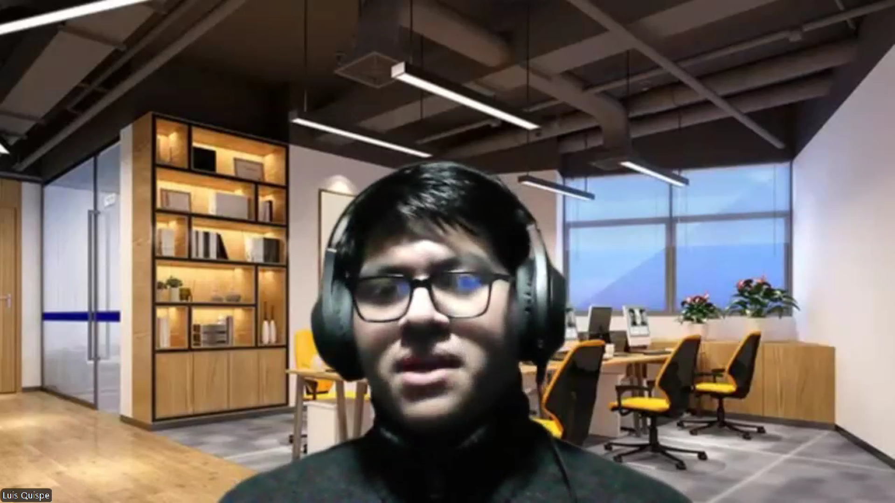 

**Enlace:** <a href="https://upcedupe-my.sharepoint.com/:v:/g/personal/u202221518_upc_edu_pe/EQAWSuW1CB9BhDIb-DEdFUgBE_27nMdsPVxCreJ9n0pLxQ?e=16i45B"> https://upcedupe-my.sharepoint.com/:v:/g/personal/u202221518_upc_edu_pe/EQAWSuW1CB9BhDIb-DEdFUgBE_27nMdsPVxCreJ9n0pLxQ?e=16i45B</a>

**Resumen de la Entrevista:** 	Luis Anthony, un comprador de autos de 24 años, usa medios de transporte alternativos ocasionalmente, valorando su flexibilidad, conveniencia y menor impacto ambiental. Aunque ha tenido experiencias positivas con plataformas de alquiler, sus principales preocupaciones son la seguridad, calidad y disponibilidad de los vehículos. Le interesaría usar RideFind sí ofrece tarifas competitivas, una variedad adecuada de vehículos y promociones. Recomendaría la plataforma si cumple con sus expectativas de calidad y facilidad de uso.

---

Entrevista N°3:

**Entrevistado:** Sabiel Surichaqui  
**Sexo:** Masculino 
**Edad:** 20 años 
**Inicio de la Entrevista:** 0:05 

 

**Enlace:** <a href="https://upcedupe-my.sharepoint.com/:v:/g/personal/u202221518_upc_edu_pe/EdW4MG4fMRZFtuoBaQlOyW0Bv3gGBsH-9aUTnfLxTnVoUA?e=UWE5n8"> https://upcedupe-my.sharepoint.com/:v:/g/personal/u202221518_upc_edu_pe/EdW4MG4fMRZFtuoBaQlOyW0Bv3gGBsH-9aUTnfLxTnVoUA?e=UWE5n8</a>

**Resumen de la Entrevista:** Sabiel, un estudiante de 20 años de Ingeniería Mecánica, utiliza frecuentemente una bicicleta eléctrica para movilizarse a su universidad, motivado por el ahorro de dinero y la comodidad. Nunca ha utilizado una plataforma de alquiler de vehículos, pero considera importantes la calidad, seguridad, y la facilidad de uso en una plataforma.
 Además, valora que los precios sean justos y la variedad de vehículos. Estaría motivado a volver a utilizar la plataforma si esta ofrece descuentos o cupones para usuarios frecuentes. Sabiel también mencionó que recomendaría la plataforma a amigos y familiares si cumple con sus expectativas.

---

**Entrevista para el Segmento Objetivo 1 - Propietarios de Vehículos Alternativos:**

Entrevista N°1:

**Entrevistado:** Steven Quito 
**Sexo:** Masculino 
**Edad:** 21 años 
**Inicio de la Entrevista:** 0:01 

 

**Enlace:** <a href="https://upcedupe-my.sharepoint.com/:v:/g/personal/u202221518_upc_edu_pe/EY2g8tRloDlJvXhdqOSyeD4BrqBakso8OSIHKpr3ULXWEg?nav=eyJyZWZlcnJhbEluZm8iOnsicmVmZXJyYWxBcHAiOiJTdHJlYW1XZWJBcHAiLCJyZWZlcnJhbFZpZXciOiJTaGFyZURpYWxvZy1MaW5rIiwicmVmZXJyYWxBcHBQbGF0Zm9ybSI6IldlYiIsInJlZmVycmFsTW9kZSI6InZpZXcifX0%3D&e=RJaTB1"> https://upcedupe-my.sharepoint.com/:v:/g/personal/u202221518_upc_edu_pe/EY2g8tRloDlJvXhdqOSyeD4BrqBakso8OSIHKpr3ULXWEg?nav=eyJyZWZlcnJhbEluZm8iOnsicmVmZXJyYWxBcHAiOiJTdHJlYW1XZWJBcHAiLCJyZWZlcnJhbFZpZXciOiJTaGFyZURpYWxvZy1MaW5rIiwicmVmZXJyYWxBcHBQbGF0Zm9ybSI6IldlYiIsInJlZmVycmFsTW9kZSI6InZpZXcifX0%3D&e=RJaTB1</a>

**Resumen de la Entrevista:** Stiven, un profesional de 35 años que posee una bicicleta eléctrica y un scooter eléctrico, fue entrevistado sobre su disposición e interés en compartir sus vehículos a través de la plataforma RideFind. Utiliza su bicicleta eléctrica a diario para ir al trabajo, mientras que el scooter lo utiliza principalmente los fines de semana. Aunque nunca ha alquilado sus vehículos antes, Stiven está interesado en hacerlo, especialmente con su scooter, con la intención de generar ingresos adicionales. Para él, los aspectos más importantes al alquilar su vehículo son la seguridad y un precio justo. Sus principales preocupaciones incluyen posibles daños a sus vehículos y asegurarse de que el alquiler sea rentable. Stiven considera que un seguro integral y un sistema de calificaciones para los usuarios serían características clave para sentirse cómodo al ofrecer su vehículo en alquiler. Él espera que la experiencia en la plataforma sea simple y transparente, y estaría dispuesto a continuar utilizando y recomendar la plataforma si cumple con sus expectativas de rentabilidad, seguridad y facilidad de uso.

---

Entrevista N°2:

**Entrevistada:** Nombre Nombre 
**Sexo:** Masculino 
**Edad:** 20 años 
**Inicio de la Entrevista:** 0:03 

 

<a href="https://upcedupe-my.sharepoint.com/:v:/g/personal/u202221518_upc_edu_pe/EY2g8tRloDlJvXhdqOSyeD4BrqBakso8OSIHKpr3ULXWEg?nav=eyJyZWZlcnJhbEluZm8iOnsicmVmZXJyYWxBcHAiOiJTdHJlYW1XZWJBcHAiLCJyZWZlcnJhbFZpZXciOiJTaGFyZURpYWxvZy1MaW5rIiwicmVmZXJyYWxBcHBQbGF0Zm9ybSI6IldlYiIsInJlZmVycmFsTW9kZSI6InZpZXcifX0%3D&e=RJaTB1"> https://upcedupe-my.sharepoint.com/:v:/g/personal/u202221518_upc_edu_pe/EY2g8tRloDlJvXhdqOSyeD4BrqBakso8OSIHKpr3ULXWEg?nav=eyJyZWZlcnJhbEluZm8iOnsicmVmZXJyYWxBcHAiOiJTdHJlYW1XZWJBcHAiLCJyZWZlcnJhbFZpZXciOiJTaGFyZURpYWxvZy1MaW5rIiwicmVmZXJyYWxBcHBQbGF0Zm9ybSI6IldlYiIsInJlZmVycmFsTW9kZSI6InZpZXcifX0%3D&e=RJaTB1</a>

**Resumen de la Entrevista**: Resumen de la entrevista aquí.

---

Entrevista N°3:

**Entrevistada:** Nombre 
**Sexo:** Masculino 
**Edad:** 19 años 
**Inicio de la Entrevista:** 0:03 

 

<a href="https://upcedupe-my.sharepoint.com/:v:/g/personal/u202221518_upc_edu_pe/EY2g8tRloDlJvXhdqOSyeD4BrqBakso8OSIHKpr3ULXWEg?nav=eyJyZWZlcnJhbEluZm8iOnsicmVmZXJyYWxBcHAiOiJTdHJlYW1XZWJBcHAiLCJyZWZlcnJhbFZpZXciOiJTaGFyZURpYWxvZy1MaW5rIiwicmVmZXJyYWxBcHBQbGF0Zm9ybSI6IldlYiIsInJlZmVycmFsTW9kZSI6InZpZXcifX0%3D&e=RJaTB1"> https://upcedupe-my.sharepoint.com/:v:/g/personal/u202221518_upc_edu_pe/EY2g8tRloDlJvXhdqOSyeD4BrqBakso8OSIHKpr3ULXWEg?nav=eyJyZWZlcnJhbEluZm8iOnsicmVmZXJyYWxBcHAiOiJTdHJlYW1XZWJBcHAiLCJyZWZlcnJhbFZpZXciOiJTaGFyZURpYWxvZy1MaW5rIiwicmVmZXJyYWxBcHBQbGF0Zm9ybSI6IldlYiIsInJlZmVycmFsTW9kZSI6InZpZXcifX0%3D&e=RJaTB1</a>

**Resumen de la Entrevista:** Resumen de la entrevista aquí.

### 2.2.3. Análisis de entrevistas.

<table border>
  <tr>
    <td align="center"><b>Características</b></td>
    <td align="center"><b>Propietario de Vehículo</b></td>
    <td align="center"><b>Usuario que Alquila</b></td>
  </tr>
  <tr>
    <td>Interés en la plataforma RideFind</td>
    <td>Stiven está interesado en alquilar su scooter eléctrico para generar ingresos.</td>
    <td>Todos los usuarios muestran interés en la plataforma por su impacto ecológico y conveniencia.</td>
  </tr>
  <tr>
    <td>Uso frecuente de vehículos alternativos</td>
    <td>Utiliza su bicicleta eléctrica a diario y el scooter los fines de semana.</td>
    <td>Sabiel usa una bicicleta eléctrica regularmente, mientras que Harold y Luis los usan ocasionalmente.</td>
  </tr>
  <tr>
    <td>Preocupaciones principales</td>
    <td>Preocupado por la seguridad de sus vehículos y la rentabilidad del alquiler.</td>
    <td>Principales preocupaciones incluyen la seguridad, calidad y disponibilidad de los vehículos.</td>
  </tr>
  <tr>
    <td>Experiencia previa con plataformas similares</td>
    <td>Nunca ha alquilado sus vehículos, pero está dispuesto a probar RideFind.</td>
    <td>Sabiel nunca ha usado plataformas de alquiler, mientras que Harold y Luis tienen experiencia previa positiva.</td>
  </tr>
  <tr>
    <td>Preferencias en la plataforma</td>
    <td>Desea un seguro integral y un sistema de calificaciones para los usuarios.</td>
    <td>Valoran la facilidad de uso, precios accesibles, y promociones para usuarios frecuentes.</td>
  </tr>
  <tr>
    <td>Disposición a recomendar la plataforma</td>
    <td>Dispuesto a recomendarla si cumple con sus expectativas de seguridad y rentabilidad.</td>
    <td>Todos estarían dispuestos a recomendar la plataforma si cumple con sus expectativas de calidad, precio, y facilidad de uso.</td>
  </tr>
  <tr>
    <td>Motivación principal para usar la plataforma</td>
    <td>Generar ingresos adicionales al alquilar su scooter.</td>
    <td>Ahorro de dinero, comodidad, y menor impacto ambiental son las principales motivaciones.</td>
  </tr>
  <tr>
    <td>Sugerencias para mejorar la plataforma</td>
    <td>Considera importante la transparencia en el proceso de alquiler.</td>
    <td>Sugieren educar a los usuarios y fomentar una comunidad dentro de la plataforma.</td>
  </tr>
  <tr>
    <td>Preferencia por características adicionales</td>
    <td>Valora un proceso de alquiler simple y transparente.</td>
    <td>Valoran una variedad adecuada de vehículos, tarifas competitivas, y la oferta de descuentos/cupones.</td>
  </tr>
</table>

## 2.3. Needfinding.

El Needfinding es una metodología cualitativa centrada en captar las opiniones y sentimientos de los usuarios. Su propósito, como su nombre sugiere, es identificar, explorar, analizar, descubrir, y valorar de manera sencilla las necesidades que pueden dirigir y orientar el desarrollo y diseño de cualquier proyecto.

En este proyecto, hemos optado por interactuar con posibles usuarios a través de entrevistas y cuestionarios. A continuación, se presentan diversos análisis derivados de estas entrevistas en los siguientes artefactos.

### 2.3.1. User Personas.

- **Segmento Objetivo 1 - Usuarios que Buscan Alquilar Vehículos**

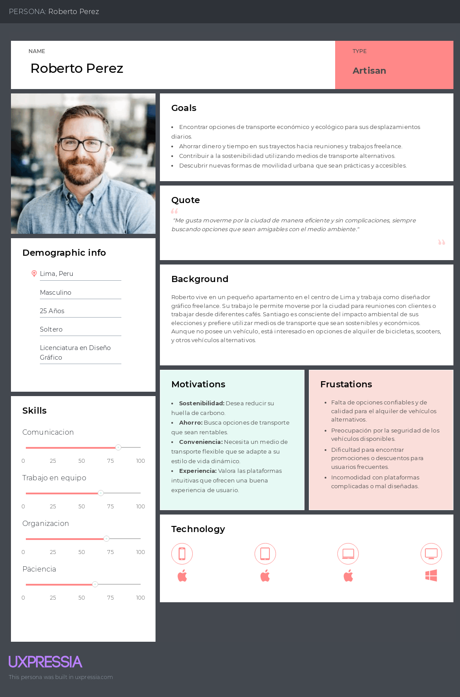 

- **Segmento Objetivo 2 - Propietarios de Vehículos Alternativos**

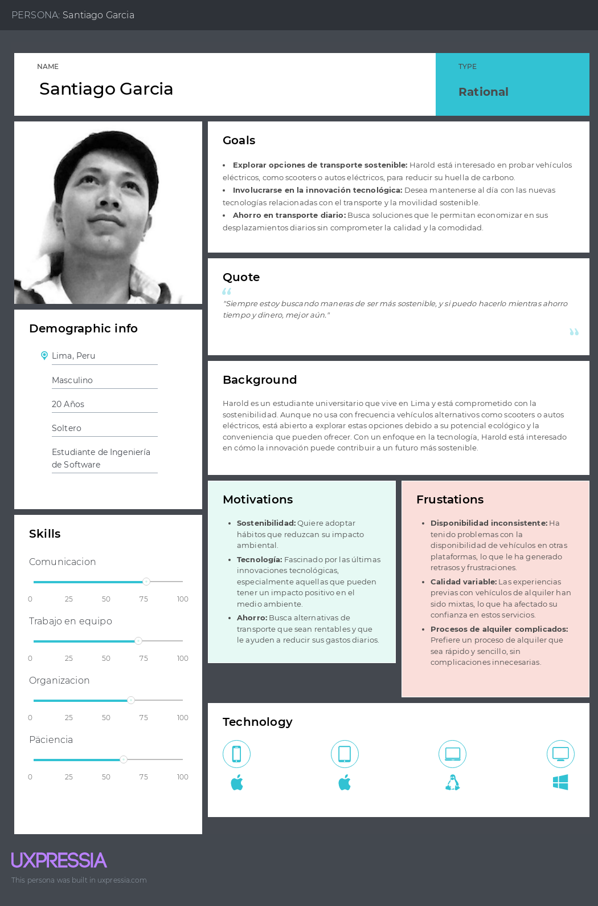 

### 2.3.2. User Task Matrix.

**Segmento Objetivo 1 - Usuarios que Buscan Alquilar Vehículos**   
**Roberto Perez**

---

| Tareas                                   | Frecuencia                          | Importancia                          |
| ---------------------------------------- | ----------------------------------- | ------------------------------------ |
| Buscar y seleccionar un vehículo         | Alta                                | Alta                                 |
| Recoger y verificar el estado del vehículo | Alta                              | Alta                                 |
| Regresar el vehículo rentado al propietario según los términos acordados | Media  | Media                                |
| Gestionar el pago y revisar los costos finales | Media                            | Alta                                 |
| Comparar precios y beneficios entre las opciones disponibles | Baja | Media                                |

---

 **Segmento Objetivo 2 - Propietarios de Vehículos Alternativos**   
**Santiago Garcia**

---

| Tareas                                                  | Frecuencia | Importancia |
| ------------------------------------------------------- | ---------- | ----------- |
| Configurar y ajustar las tarifas de alquiler            | Baja       | Alta        |
| Mantener el vehículo en buenas condiciones              | Alta       | Alta        |
| Gestionar las solicitudes de alquiler y comunicarse con los interesados | Media      | Media       |
| Monitorear el estado del vehículo durante el alquiler   | Media      | Alta        |
| Recibir y verificar el estado del vehículo al final del alquiler | Media      | Alta        |

---

### 2.3.3. User Journey Mapping.

- **Primer segmento: Usuario que Alquila**

 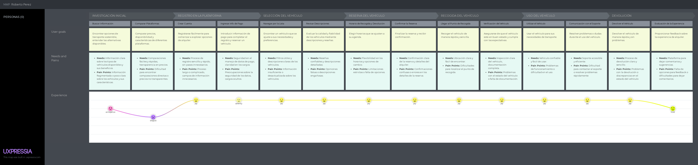 

- **Segundo segmento: Propietario de Vehículo**

 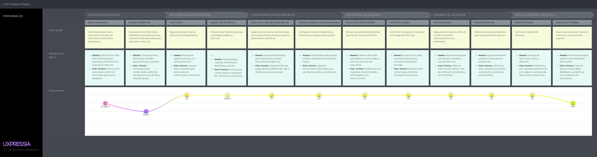 

### 2.3.4. Empathy Mapping.

- **Primer segmento: Usuario que Alquila**
 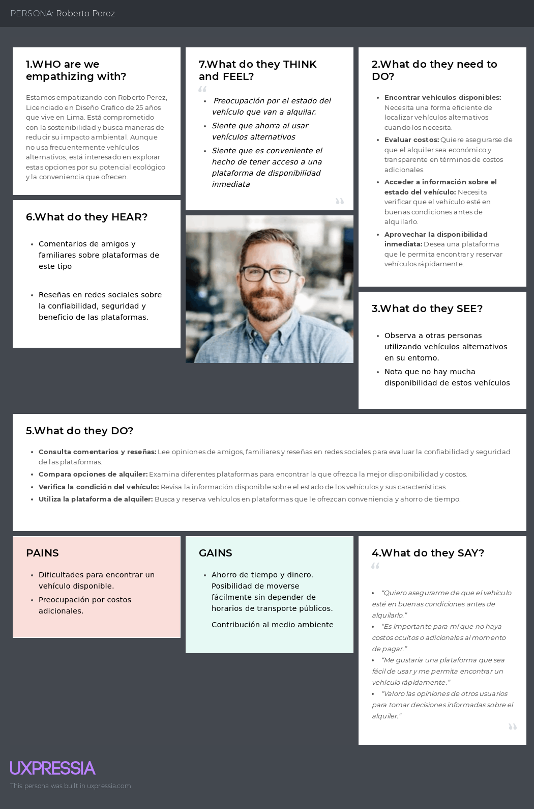 

- **Segundo segmento: Propietario de Vehículo**
 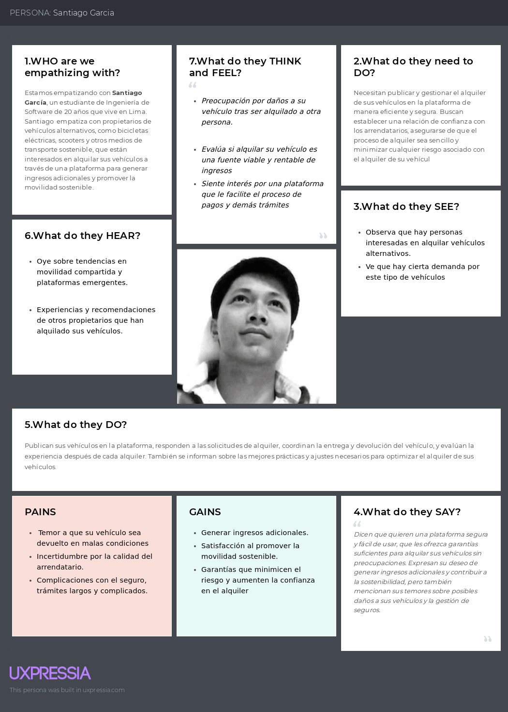 

### 2.3.5. As-is Scenario Mapping.

- **Primer segmento: Usuario que Alquila**
 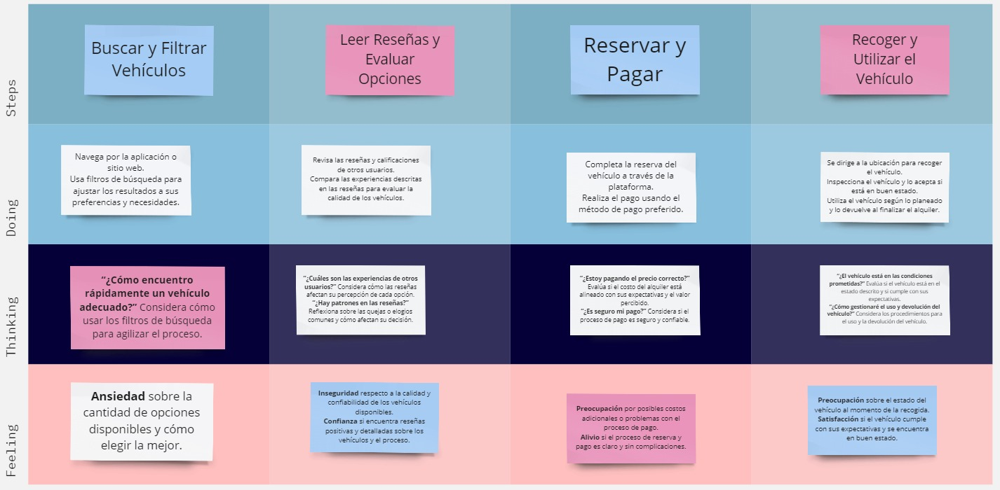 

- **Segundo segmento: Propietario de Vehículo**
 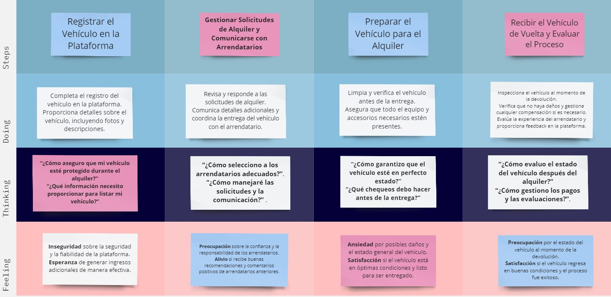 

## 2.4. Ubiquitous Language.

- Usuario (User): Persona que interactúa con la plataforma para alquilar o gestionar vehículos eléctricos. Se clasifica en dos categorías:

    - Propietario de Vehículo (Owner): Usuario que pone a disposición su vehículo para alquilar a otros.
    - Usuario que Alquila (Renting User): Usuario que busca alquilar un vehículo a través de la plataforma.
- Vehículo (Vehicle): Cualquier medio de transporte eléctrico disponible en la plataforma, incluyendo bicicletas, scooters, patinetas, motos, etc.

- Plataforma (Platform): Sistema digital donde se gestionan los alquileres de vehículos, incluyendo la interfaz de usuario, el panel de control y las funcionalidades de búsqueda y gestión.

- Alquiler (Rental): Proceso mediante el cual un usuario paga por el uso de un vehículo durante un período determinado. Incluye la solicitud, confirmación y devolución del vehículo.

- Seguridad (Security): Conjunto de medidas para proteger los vehículos y asegurar la confianza en la plataforma, incluyendo el seguro de vehículo y la verificación de identidad.

- Experiencia del Usuario (User Experience): Impresión y satisfacción general del usuario al interactuar con la plataforma, abarcando la facilidad de uso, el tiempo de respuesta y el soporte al cliente.
- Tarifa de alquiler (Rental fee): Precio que cobra el propietario al cliente por el uso del vehículo durante un período específico.
- Planes (Plans): Modelo de negocio que se utiliza para proporcionar un servicio por una cuota. En este caso, habrá tres planes para los propietarios.
- Pago (Payment): Método que el cliente emplea para pagar el alquiler del vehículo y los planes.
