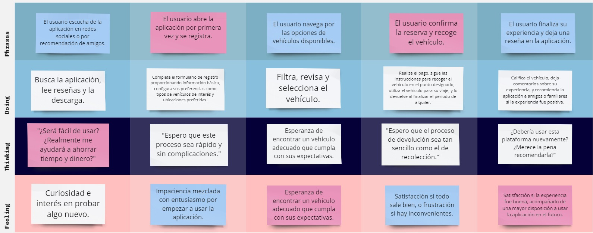
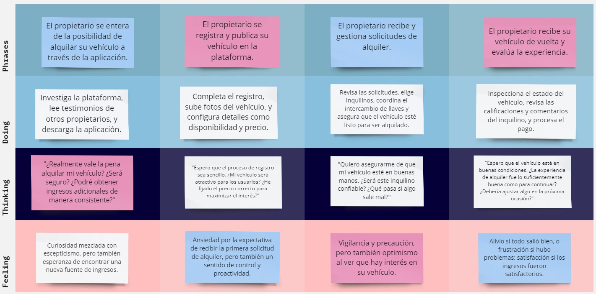
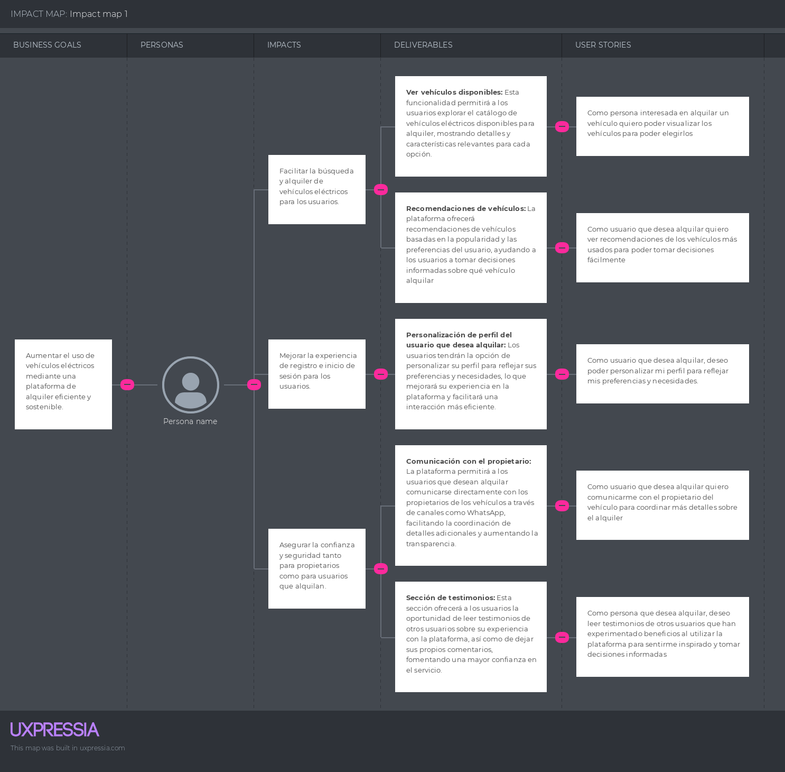

# Capítulo III: Requirements Specification

## 3.1. To-Be Scenario Mapping.

- **Primer segmento: Usuario que Alquila**

  

- **Segundo segmento: Propietario de Vehículos alternativos**

  

## 3.2. User Stories.

<!-- Tabla para Epic01 -->
<table>
  <thead>
    <tr>
      <th>Epic ID</th>
      <th>Descripción del Epic</th>
    </tr>
  </thead>
  <tbody>
    <tr>
      <td>Epic01</td>
      <td>Como usuario, deseo explorar las secciones principales de la Landing Page</td>
    </tr>
  </tbody>
</table>

<table>
  <thead>
    <tr>
      <th>User Story ID</th>
      <th>Título</th>
    </tr>
  </thead>
  <tbody>
    <tr>
      <td>US01</td>
      <td>Barra de navegación Principal</td>
    </tr>
    <tr>
      <td>US02</td>
      <td>Sección de beneficios de la Aplicación</td>
    </tr>
    <tr>
      <td>US03</td>
      <td>Información sobre Nosotros</td>
    </tr>
    <tr>
      <td>US04</td>
      <td>Redes Sociales y Footer</td>
    </tr>
    <tr>
      <td>US05</td>
      <td>Sección de contacto</td>
    </tr>
  </tbody>
</table>

<!-- Tabla para Epic02 -->
 
<table>
  <thead>
    <tr>
      <th>Epic ID</th>
      <th>Descripción del Epic</th>
    </tr>
  </thead>
  <tbody>
    <tr>
      <td>Epic02</td>
      <td>Como usuario, deseo poder registrarme e iniciar sesión en la aplicación fácilmente</td>
    </tr>
  </tbody>
</table>

<table>
  <thead>
    <tr>
      <th>User Story ID</th>
      <th>Título</th>
    </tr>
  </thead>
  <tbody>
    <tr>
      <td>US06</td>
      <td>Registro de cuenta</td>
    </tr>
    <tr>
      <td>US07</td>
      <td>Registro con Google u Outlook</td>
    </tr>
    <tr>
      <td>US08</td>
      <td>Inicio de sesión</td>
    </tr>
  </tbody>
</table>

 
<!-- Tabla para Epic03 -->
<table>
  <thead>
    <tr>
      <th>Epic ID</th>
      <th>Descripción del Epic</th>
    </tr>
  </thead>
  <tbody>
    <tr>
      <td>Epic03</td>
      <td>Como usuario, deseo poder visualizar y filtrar los vehículos disponibles en la plataforma</td>
    </tr>
  </tbody>
</table>

<table>
  <thead>
    <tr>
      <th>User Story ID</th>
      <th>Título</th>
    </tr>
  </thead>
  <tbody>
    <tr>
      <td>US09</td>
      <td>Ver vehículos disponibles</td>
    </tr>
    <tr>
      <td>US10</td>
      <td>Filtro de búsqueda de vehículos</td>
    </tr>
    <tr>
      <td>US18</td>
      <td>Publicar un Vehículo</td>
    </tr>
    <tr>
      <td>US19</td>
      <td>Alquilar un Vehículo</td>
    </tr>
    <tr>
      <td>US20</td>
      <td>Selección de Vehículo entre Opciones</td>
    </tr>
  </tbody>
</table>

 
<!-- Tabla para Epic04 -->
<table>
  <thead>
    <tr>
      <th>Epic ID</th>
      <th>Descripción del Epic</th>
    </tr>
  </thead>
  <tbody>
    <tr>
      <td>Epic04</td>
      <td>Como usuario, deseo personalizar mi experiencia y tener acceso a funcionalidades adicionales</td>
    </tr>
  </tbody>
</table>

<table>
  <thead>
    <tr>
      <th>User Story ID</th>
      <th>Título</th>
    </tr>
  </thead>
  <tbody>
    <tr>
      <td>US11</td>
      <td>Beneficios por Promoción de Movilidad Sostenible</td>
    </tr>
    <tr>
      <td>US12</td>
      <td>Beneficios por Promoción de Movilidad Eléctrica</td>
    </tr>
    <tr>
      <td>US13</td>
      <td>Sección de testimonios</td>
    </tr>
    <tr>
      <td>US14</td>
      <td>Pago de plan de suscripción</td>
    </tr>
    <tr>
      <td>US15</td>
      <td>Información de pedido</td>
    </tr>
    <tr>
      <td>US16</td>
      <td>Personalización de perfil de propietario</td>
    </tr>
    <tr>
      <td>US17</td>
      <td>Personalización del Perfil del Usuario de Alquiler</td>
    </tr>
  </tbody>
</table>

---

  
<table>
    <thead>
        <tr>
            <th class= "red">Epic/Story ID</th>
            <th class= "red">US01</th>
            <th class= "red">Relacionado con (Epic ID)</th>
            <th class= "red">EP1</th>
        </tr>
    </thead>
    <tbody>
        <tr>
            <td class= "red">Título</td>
            <th colspan=3 align= "justify">Barra de navegación Principal</th>
        </tr>
        <tr>
            <td class= "red">Descripción</td>
            <th colspan=3 align= "justify">Como usuario quiero un menú para ver las secciones de la aplicación</th>
        </tr>
        <tr> 
            <td colspan=4><b class= "red">Criterios de Aceptación:</b>
             <b>Scenario 1:</b> El usuario debe poder ver el menú de navegación.
             <b>Dado que</b> el usuario se encuentra en la página principal.
             <b>Cuando</b> visualiza la barra de navegación.
             <b>Entonces</b> podrá interactuar con las secciones y botones disponibles.
             <b>Scenario 2:</b> El usuario debe ser redirigido a la sección deseada.
             <b>Dado que</b> el usuario está en la página principal,
             <b>Cuando</b> haga clic en un botón de la barra de navegación,
             <b>Entonces</b> será redirigido a la sección correspondiente.</td>
        </tr>
    </tbody>
</table>
<table>
    <thead>
        <tr>
            <th class= "red">Epic/Story ID</th>
            <th class= "red">US02</th>
            <th class= "red">Relacionado con (Epic ID)</th>
            <th class= "red">EP1</th>
        </tr>
    </thead>
    <tbody>
        <tr>
            <td class= "red">Título</td>
            <th colspan=3 align= "justify">Beneficios de la Aplicación</th>
        </tr>
        <tr>
            <td class= "red">Descripción</td>
            <th colspan=3 align= "justify">Como usuario, quiero conocer los beneficios y servicios ofrecidos en la página principal para tomar una decisión informada.</th>
        </tr>
        <tr> 
            <td colspan=4><b class= "red">Criterios de Aceptación:</b>
             <b>Scenario 1:</b> El usuario debe poder ver los beneficios ofrecidos.
             <b>Dado que</b> el usuario se encuentra en la página principal,
             <b>Cuando</b> acceda a la sección de beneficios.
             <b>Entonces</b> podrá visualizar información sobre los servicios de movilidad sostenible.</td>
        </tr>
    </tbody>
</table>

<table>
    <thead>
        <tr>
            <th class= "red">Epic/Story ID</th>
            <th class= "red">US03</th>
            <th class= "red">Relacionado con (Epic ID)</th>
            <th class= "red">EP1</th>
        </tr>
    </thead>
    <tbody>
        <tr>
            <td class= "red">Título</td>
            <th colspan=3 align= "justify">Información sobre Nosotros</th>
        </tr>
        <tr>
            <td class= "red">Descripción</td>
            <th colspan=3 align= "justify">Como usuario, quiero saber quiénes están detrás de la aplicación y qué ofrece para confiar en el servicio.</th>
        </tr>
        <tr> 
            <td colspan=4><b class= "red">Criterios de Aceptación:</b>
             <b>Scenario 1:</b> EEl usuario debe poder conocer al equipo y los servicios.
             <b>Dado que</b> que el usuario está en la página principal,
             <b>Cuando</b> acceda a la sección "Nosotros",
             <b>Entonces</b> podrá ver información sobre el equipo y los servicios ofrecidos.</td>
        </tr>
    </tbody>
</table>

<table>
    <thead>
        <tr>
            <th class= "red">Epic/Story ID</th>
            <th class= "red">US04</th>
            <th class= "red">Relacionado con (Epic ID)</th>
            <th class= "red">EP1</th>
        </tr>
    </thead>
    <tbody>
        <tr>
            <td class= "red">Título</td>
            <th colspan=3 align= "justify">Redes Sociales y Footer</th>
        </tr>
        <tr>
            <td class= "red">Descripción</td>
            <th colspan=3 align= "justify">Como usuario, deseo ver las redes sociales de la aplicación para seguirnos y estar al tanto de las actualizaciones.</th>
        </tr>
        <tr> 
            <td colspan=4><b class= "red">Criterios de Aceptación:</b>
             <b>Scenario 1:</b> El usuario debe ver las redes sociales de RideFind.
             <b>Dado que</b> el usuario está en la pagina principal.
             <b>Cuando</b> llegue al footer,
             <b>Entonces</b> podrá ver los enlaces a las redes sociales de la aplicación.</td>
        </tr>
    </tbody>
</table>

<table>
    <thead>
        <tr>
            <th class= "red">Epic/Story ID</th>
            <th class= "red">US05</th>
            <th class= "red">Relacionado con (Epic ID)</th>
            <th class= "red">EP1</th>
        </tr>
    </thead>
    <tbody>
        <tr>
            <td class= "red">Título</td>
            <th colspan=3 align= "justify">Sección de contacto en la pagina web.</th>
        </tr>
        <tr>
            <td class= "red">Descripción</td>
            <th colspan=3 align= "justify">Como usuario, quiero poder contactarnos para resolver dudas o problemas.</th>
        </tr>
        <tr> 
            <td colspan=4><b class= "red">Criterios de Aceptación:</b>
             <b>Scenario 1:</b> El usuario debe tener acceso a una sección de contacto.
             <b>Dado que</b> el usuario está en la página principal,
             <b>Cuando</b> acceda a la sección de contacto,
             <b>Entonces</b> podrá enviar sus datos y recibir asistencia.</td>
        </tr>
    </tbody>
</table>

<table>
    <thead>
        <tr>
            <th class= "red">Epic/Story ID</th>
            <th class= "red">US06</th>
            <th class= "red">Relacionado con (Epic ID)</th>
            <th class= "red">EP2</th>
        </tr>
    </thead>
    <tbody>
        <tr>
            <td class= "red">Título</td>
            <th colspan=3 align= "justify">Registro de cuenta</th>
        </tr>
        <tr>
            <td class= "red">Descripción</td>
            <th colspan=3 align= "justify">Como usuario, quiero registrarme para empezar a usar la aplicación.</th>
        </tr>
         <tr> 
            <td colspan=4><b class= "red">Criterios de Aceptación:</b>
             <b>Scenario 1:</b> El usuario debe completar el registro exitosamente.
             <b>Dado que</b>el usuario está en la pantalla de registro,
             <b>Cuando</b> ingrese sus datos y haga clic en "Enviar",
             <b>Entonces</b> sus datos serán guardados y se mostrará la pantalla principal con un mensaje de bienvenida.</td>
        </tr>
    </tbody>
</table>

<table>
    <thead>
        <tr>
            <th class= "red">Epic/Story ID</th>
            <th class= "red">US07</th>
            <th class= "red">Relacionado con (Epic ID)</th>
            <th class= "red">EP2</th>
        </tr>
    </thead>
    <tbody>
        <tr>
            <td class= "red">Título</td>
            <th colspan=3 align= "justify">Registro con Google u Outlook</th>
        </tr>
        <tr>
            <td class= "red">Descripción</td>
            <th colspan=3 align= "justify">Como usuario, quiero registrarme utilizando Google u Outlook para un proceso más rápido.</th>
        </tr>
         <tr> 
            <td colspan=4><b class= "red">Criterios de Aceptación:</b>
             <b>Scenario 1:</b>  El usuario debe poder registrarse usando una cuenta de Google u Outlook.
             <b>Dado que</b> El usuario debe poder registrarse usando una cuenta de Google u Outlook.
             <b>Cuando</b> haga clic en "Registrarse con Google u Outlook",
             <b>Entonces</b> será registrado rápidamente y se le mostrará un mensaje de confirmación.</td>
        </tr>
    </tbody>
</table>

<table>
    <thead>
        <tr>
            <th class= "red">Epic/Story ID</th>
            <th class= "red">US08</th>
            <th class= "red">Relacionado con (Epic ID)</th>
            <th class= "red">EP2</th>
        </tr>
    </thead>
    <tbody>
        <tr>
            <td class= "red">Título</td>
            <th colspan=3 align= "justify">Inicio de Sesión</th>
        </tr>
        <tr>
            <td class= "red">Descripción</td>
            <th colspan=3 align= "justify">Como usuario, deseo iniciar sesión para acceder a la aplicación.</th>
        </tr>
        <tr> 
            <td colspan=4><b class= "red">Criterios de Aceptación:</b>
             <b>Scenario 1:</b> El usuario debe iniciar sesión exitosamente.
             <b>Dado que</b>el usuario está en la pantalla de inicio de sesión,
             <b>Cuando</b> ingrese sus credenciales y haga clic en "Iniciar sesión",
             <b>Entonces</b> se validarán sus datos y se le mostrará la pantalla principal con un mensaje de bienvenida.</td>
        </tr>
    </tbody>
</table>

<table>
    <thead>
        <tr>
            <th class= "red">Epic/Story ID</th>
            <th class= "red">US09</th>
            <th class= "red">Relacionado con (Epic ID)</th>
            <th class= "red">EP3</th>
        </tr>
    </thead>
    <tbody>
        <tr>
            <td class= "red">Título</td>
            <th colspan=3 align= "justify">Visualización y Filtro de Vehículos</th>
        </tr>
        <tr>
            <td class= "red">Descripción</td>
            <th colspan=3 align= "justify"><b>Como usuario, quiero ver todos los vehículos disponibles para seleccionar el que desee alquilar.</th>
        </tr>
        <tr> 
            <td colspan=4><b class= "red">Criterios de Aceptación:</b>
             <b>Scenario 1:</b> El usuario debe ver una lista de vehículos.
             <b>Dado que</b> el usuario está en la sección de vehículos,
             <b>Cuando</b> acceda al catálogo,
             <b>Entonces</b> podrá ver todos los vehículos registrados y sus características.</td>
        </tr>
    </tbody>
</table>

<table>
    <thead>
        <tr>
            <th class= "red">Epic/Story ID</th>
            <th class= "red">US10</th>
            <th class= "red">Relacionado con (Epic ID)</th>
            <th class= "red">EP3</th>
        </tr>
    </thead>
    <tbody>
        <tr>
            <td class= "red">Título</td>
            <th colspan=3 align= "justify">Filtro de búsqueda de vehículos</th>
        </tr>
        <tr>
            <td class= "red">Descripción</td>
            <th colspan=3 align= "justify"><b>Como usuario, quiero filtrar los vehículos según mis preferencias para encontrar el adecuado.</th>
        </tr>
         <tr> 
            <td colspan=4><b class= "red">Criterios de Aceptación:</b>
             <b>Scenario 1:</b> El usuario debe usar filtros para buscar vehículos.
             <b>Dado que</b> el usuario está en la sección de vehículos,
             <b>Cuando</b> seleccione los filtros (por tipo, marca, modelo),
             <b>Entonces</b> podrá ver los vehículos que cumplen con los criterios seleccionados.</td>
        </tr>
    </tbody>
</table>

<table>
    <thead>
        <tr>
            <th class= "red">Epic/Story ID</th>
            <th class= "red">US11</th>
            <th class= "red">Relacionado con (Epic ID)</th>
            <th class= "red">EP4</th>
        </tr>
    </thead>
    <tbody>
        <tr>
            <td class= "red">Título</td>
            <th colspan=3 align= "justify">Beneficios por Promoción de Movilidad Sostenible</th>
        </tr>
        <tr>
            <td class= "red">Descripción</td>
            <th colspan=3 align= "justify"><b>Como usuario, quiero recibir beneficios al compartir contenido sobre la movilidad sostenible en mis redes sociales.</th>
        </tr>
         <tr> 
            <td colspan=4><b class= "red">Criterios de Aceptación:</b>
             <b>Scenario 1:</b> El usuario debe recibir beneficios al compartir en redes
             <b>Dado que</b> el usuario está en la sección de reservas,
             <b>Cuando</b> comparta la información en redes sociales,
             <b>Entonces</b> verá los beneficios asociados a su acción.</td>
        </tr>
    </tbody>
</table>

<table>
    <thead>
        <tr>
            <th class= "red">Epic/Story ID</th>
            <th class= "red">US12</th>
            <th class= "red">Relacionado con (Epic ID)</th>
            <th class= "red">EP4</th>
        </tr>
    </thead>
    <tbody>
        <tr>
            <td class= "red">Título</td>
            <th colspan=3 align= "justify">Beneficios por Promoción de Movilidad Eléctrica</th>
        </tr>
        <tr>
            <td class= "red">Descripción</td>
            <th colspan=3 align= "justify"><b>Como usuario, quiero recibir beneficios al compartir contenido sobre la movilidad eléctrica en mis redes sociales.</th>
        </tr>
         <tr> 
            <td colspan=4><b class= "red">Criterios de Aceptación:</b>
             <b>Scenario 1:</b> El usuario debe recibir beneficios por compartir sobre movilidad eléctrica.
             <b>Dado que</b> el usuario está en la pantalla principal,
             <b>Cuando</b> comparta información sobre movilidad eléctrica,
             <b>Entonces</b> verá los beneficios relacionados.</td>
        </tr>
    </tbody>
</table>

<table>
    <thead>
        <tr>
            <th class= "red">Epic/Story ID</th>
            <th class= "red">US13</th>
            <th class= "red">Relacionado con (Epic ID)</th>
            <th class= "red">EP4</th>
        </tr>
    </thead>
    <tbody>
        <tr>
            <td class= "red">Título</td>
            <th colspan=3 align= "justify">Sección de Testimonios</th>
        </tr>
        <tr>
            <td class= "red">Descripción</td>
            <th colspan=3 align= "justify"><b>Como usuario, quiero leer testimonios de otros usuarios para tomar decisiones basadas en experiencias previas.</th>
        </tr>
         <tr> 
            <td colspan=4><b class= "red">Criterios de Aceptación:</b>
             <b>Scenario 1:</b> El usuario debe acceder a la sección de testimonios.
             <b>Dado que</b>el usuario está en la pantalla principal,
             <b>Cuando</b>  acceda a la sección de testimonios,
             <b>Entonces</b> podrá leer y agregar su propio testimonio.</td>
        </tr>
    </tbody>
</table>

<table>
    <thead>
        <tr>
            <th class= "red">Epic/Story ID</th>
            <th class= "red">US14</th>
            <th class= "red">Relacionado con (Epic ID)</th>
            <th class= "red">EP4</th>
        </tr>
    </thead>
    <tbody>
        <tr>
            <td class= "red">Título</td>
            <th colspan=3 align= "justify">Pago de plan de suscripción</th>
        </tr>
        <tr>
            <td class= "red">Descripción</td>
            <th colspan=3 align= "justify">Como propietario, deseo pagar por un plan de suscripción para acceder a características adicionales.</th>
        </tr>
         <tr> 
            <td colspan=4><b class= "red">Criterios de Aceptación:</b>
             <b>Scenario 1:</b> El usuario completa el Pago de manera exitosa.
             <b>Dado que</b> el propietario selecciona un plan,
             <b>Cuando</b> proceda al pago con PayPal y confirme,
             <b>Entonces</b> el pago se procesará y se actualizará la cuenta con las nuevas características.
             <b>Scenario 2:</b> El usuario presenta fallo en el pago.
             <b>Dado que</b> el propietario intenta pagar y el pago falla
             <b>Cuando</b> intente confirmar el pago,
             <b>Entonces</b> se mostrará un mensaje de error.
            </td>
        </tr>
    </tbody>
</table>

<table>
    <thead>
        <tr>
            <th class= "red">Epic/Story ID</th>
            <th class= "red">US15</th>
            <th class= "red">Relacionado con (Epic ID)</th>
            <th class= "red">EP4</th>
        </tr>
    </thead>
    <tbody>
        <tr>
            <td class= "red">Título</td>
            <th colspan=3 align= "justify">Información de pedido</th>
        </tr>
        <tr>
            <td class= "red">Descripción</td>
            <th colspan=3 align= "justify">Como propietario, quiero revisar la información del pedido antes de confirmar el pago.</th>
        </tr>
        <tr> 
            <td colspan=4><b class= "red">Criterios de Aceptación:</b>
             <b>Scenario :</b> Visualización de detalles del pedido
             <b>Dado que</b> el propietario está eligiendo un plan,
             <b>Cuando</b> acceda a la sección de detalles del pedido,
             <b>Entonces</b> podrá revisar la información antes de proceder al pago.
        </tr>
    </tbody>
</table>

<table>
    <thead>
        <tr>
            <th class= "red">Epic/Story ID</th>
            <th class= "red">US16</th>
            <th class= "red">Relacionado con (Epic ID)</th>
            <th class= "red">EP4</th>
        </tr>
    </thead>
    <tbody>
        <tr>
            <td class= "red">Título</td>
            <th colspan=3 align= "justify">Personalización de perfil de propietario</th>
        </tr>
        <tr>
            <td class= "red">Descripción</td>
            <th colspan=3 align= "justify">Como propietario, deseo personalizar mi perfil para mejorar mi visibilidad y mostrar información relevante.</th>
        </tr>
         <tr> 
            <td colspan=4><b class= "red">Criterios de Aceptación:</b>
             <b>Scenario 1:</b> Acceso a la sección de perfil.
             <b>Dado que</b> el propietario está registrado,
             <b>Cuando</b> acceda a la sección de perfil,
             <b>Entonces</b> podrá personalizar su información fácilmente.
             <b>Scenario 2:</b>  Edición y actualización del perfil.
             <b>Dado que</b> el propietario está en la sección de perfil,
             <b>Cuando</b> realice cambios en su información
             <b>Entonces</b> los cambios se guardarán y actualizarán automáticamente.
            </td>
        </tr>
    </tbody>
</table>

<table>
    <thead>
        <tr>
            <th class= "red">Epic/Story ID</th>
            <th class= "red">US17</th>
            <th class= "red">Relacionado con (Epic ID)</th>
            <th class= "red">EP4</th>
        </tr>
    </thead>
    <tbody>
        <tr>
            <td class= "red">Título</td>
            <th colspan=3 align= "justify">Personalización del Perfil del Usuario de Alquiler</th>
        </tr>
        <tr>
            <td class= "red">Descripción</td>
            <th colspan=3 align= "justify">Como usuario de alquiler, quiero personalizar mi perfil para mejorar mi experiencia en la aplicación.</th>
        </tr>
         <tr> 
            <td colspan=4><b class= "red">Criterios de Aceptación:</b>
             <b>Scenario 1:</b> Acceso a la sección de perfil.
             <b>Dado que</b> el usuario está registrado,
             <b>Cuando</b> acceda a la sección de perfil,
             <b>Entonces</b> podrá personalizar su información y preferencias.</td>
        </tr>
    </tbody>
</table>

<!-- nuevas US -->

<table>
    <thead>
        <tr>
            <th class= "red">Epic/Story ID</th>
            <th class= "red">US18</th>
            <th class= "red">Relacionado con (Epic ID)</th>
            <th class= "red">EP3</th>
        </tr>
    </thead>
    <tbody>
        <tr>
            <td class= "red">Título</td>
            <th colspan=3 align= "justify">Publicar un Vehículo</th>
        </tr>
        <tr>
            <td class= "red">Descripción</td>
            <th colspan=3 align= "justify"><b>Como usuario, quiero publicar un vehículo en la plataforma para que otros usuarios puedan alquilarlo.</th>
        </tr>
        <tr> 
            <td colspan=4><b class= "red">Criterios de Aceptación:</b>
             <b>Scenario 1:</b> El usuario debe poder añadir un vehículo a la plataforma.
             <b>Dado que</b> el usuario está en la sección de publicación de vehículos,
             <b>Cuando</b>  ingrese los detalles del vehículo y presione el botón "Publicar",
             <b>Entonces</b> el vehículo se añadirá a la plataforma y estará visible para otros usuarios.</td>
        </tr>
    </tbody>
</table>

<table>
    <thead>
        <tr>
            <th class= "red">Epic/Story ID</th>
            <th class= "red">US19</th>
            <th class= "red">Relacionado con (Epic ID)</th>
            <th class= "red">EP3</th>
        </tr>
    </thead>
    <tbody>
        <tr>
            <td class= "red">Título</td>
            <th colspan=3 align= "justify">Alquilar un Vehículo</th>
        </tr>
        <tr>
            <td class= "red">Descripción</td>
            <th colspan=3 align= "justify"><b>Como usuario, quiero alquilar un vehículo disponible en la plataforma.</th>
        </tr>
        <tr> 
            <td colspan=4><b class= "red">Criterios de Aceptación:</b>
             <b>Scenario 1:</b> El usuario debe poder alquilar un vehículo
             <b>Dado que</b>  el usuario ha seleccionado un vehículo,
             <b>Cuando</b> haga clic en el botón "Alquilar",
             <b>Entonces</b> el sistema iniciará el proceso de alquiler y mostrará una confirmación de la transacción.</td>
        </tr>
    </tbody>
</table>

<table>
    <thead>
        <tr>
            <th class= "red">Epic/Story ID</th>
            <th class= "red">US20</th>
            <th class= "red">Relacionado con (Epic ID)</th>
            <th class= "red">EP3</th>
        </tr>
    </thead>
    <tbody>
        <tr>
            <td class= "red">Título</td>
            <th colspan=3 align= "justify">Selección de Vehículo entre Opciones</th>
        </tr>
        <tr>
            <td class= "red">Descripción</td>
            <th colspan=3 align= "justify"><b>Como usuario, quiero seleccionar un vehículo entre varias opciones disponibles para alquilar.</th>
        </tr>
        <tr> 
            <td colspan=4><b class= "red">Criterios de Aceptación:</b>
             <b>Scenario 1:</b> El usuario debe poder elegir entre múltiples vehículos
             <b>Dado que</b> que el usuario está en la sección de selección de vehículos,
             <b>Cuando</b> vea una lista de vehículos disponibles,
             <b>Entonces</b> podrá seleccionar el vehículo que prefiera y proceder con el alquiler.</td>
        </tr>
    </tbody>
</table>

<!-- Fin nuevas US -->

---
## 3.3. Impact Mapping.

En esta sección, debemos identificar los "Business Goals" para nuestra aplicación web, la cual conecta a personas que desean alquilar un vehículo con propietarios que desean ofrecer sus vehículos. Estos usuarios nos ayudarán a cumplir estos objetivos. Hemos identificado el "Impact" o impacto que deseamos lograr, y luego estableceremos los "Deliverables" que nos permitirán como negocio digital alcanzar estos impactos. Finalmente, incluiremos las "User Stories" para obtener las características o funcionalidades que ayudarán a producir los Deliverables.

  

## 3.4. Product Backlog.

Con el fin de simplificar la complejidad de las tareas, hemos utilizado la escala de Fibonacci (1/2/3/5/8) para crear nuestro product backlog.
Historia de usuario base:
Tomamos como referencia US09: Como persona interesada en alquilar un vehículo, quiero poder visualizar todos los vehículos disponibles para poder elegir. (Posee 3 puntos de historia).
Asimismo, utilizamos la herramienta “Planning Poker Online” para poder votar en grupo y decidir la dificultad de cada historia de usuario, tomando como punto intermedio el User Story 09

<table>
  <thead>
    <tr>
      <th># Orden</th>
      <th>User Story ID</th>
      <th>Título</th>
      <th>Descripción</th>
      <th>Story Points (1/2/3/5/8)</th>
    </tr>
  </thead>
  <tbody>
    <tr>
      <td>1</td>
      <td>US01</td>
      <td>Barra de navegación en la Principal</td>
      <td>Como usuario, quiero ver una barra de navegación en la Landing Page para acceder fácilmente a las secciones principales.</td>
      <td>3</td>
    </tr>
    <tr>
      <td>2</td>
      <td>US02</td>
      <td>Como usuario, quiero ver una sección de beneficios de la aplicación en la Landing Page para entender las ventajas que ofrece.</td>
      <td>3</td>
    </tr>
    <tr>
      <td>3</td>
      <td>US03</td>
      <td>Información sobre Nosotros</td>
      <td>Como usuario, quiero conocer más sobre nosotros en la Landing Page para saber quién está detrás de la aplicación.</td>
      <td>2</td>
    </tr>
    <tr>
      <td>4</td>
      <td>US04</td>
      <td>Redes Sociales y Footer</td>
      <td>Como usuario, quiero ver enlaces a redes sociales y un footer en la Landing Page para conectar con nosotros y tener información adicional.</td>
      <td>2</td>
    </tr>
    <tr>
      <td>5</td>
      <td>US05</td>
      <td>Sección de contacto</td>
      <td>Como usuario, quiero tener una sección de contacto en la Landing Page para poder comunicarme con el soporte.</td>
      <td>3</td>
    </tr>
    <tr>
      <td>6</td>
      <td>US06</td>
      <td>Registro de cuenta</td>
      <td>Como usuario, quiero registrarme en la aplicación con un formulario de registro para crear una cuenta.</td>
      <td>5</td>
    </tr>
    <tr>
      <td>7</td>
      <td>US07</td>
      <td>Registro con Google u Outlook</td>
      <td>Como usuario, quiero registrarme usando Google u Outlook para simplificar el proceso de registro.</td>
      <td>3</td>
    </tr>
    <tr>
      <td>8</td>
      <td>US08</td>
      <td>Inicio de sesión</td>
      <td>Como usuario, quiero iniciar sesión en la aplicación para acceder a mi cuenta.</td>
      <td>3</td>
    </tr>
    <tr>
      <td>9</td>
      <td>US09</td>
      <td>Ver vehículos disponibles</td>
      <td>Como persona interesada en alquilar un vehículo, quiero poder visualizar todos los vehículos disponibles para poder elegir.</td>
      <td>3</td>
    </tr>
    <tr>
      <td>10</td>
      <td>US10</td>
      <td>Filtro de búsqueda de vehículos</td>
      <td>Como usuario, quiero usar filtros para buscar vehículos específicos en la plataforma para encontrar rápidamente el que necesito.</td>
      <td>5</td>
    </tr>
    <tr>
      <td>11</td>
      <td>US18</td>
      <td>Publicar un Vehículo</td>
      <td>Como propietario, quiero publicar un vehículo en la plataforma para que otros usuarios puedan alquilarlo.</td>
      <td>5</td>
    </tr>
    <tr>
      <td>12</td>
      <td>US19</td>
      <td>Alquilar un Vehículo</td>
      <td>Como usuario, quiero alquilar un vehículo publicado para utilizarlo según mis necesidades.</td>
      <td>5</td>
    </tr>
    <tr>
      <td>13</td>
      <td>US20</td>
      <td>Selección de Vehículo entre Opciones</td>
      <td>Como usuario, quiero seleccionar un vehículo entre varias opciones disponibles para tomar una decisión informada.</td>
      <td>8</td>
    </tr>
    <tr>
      <td>14</td>
      <td>US11</td>
      <td>Beneficios por Promoción de Movilidad Sostenible</td>
      <td>Como usuario, quiero conocer los beneficios por promover la movilidad sostenible para tomar decisiones alineadas con el medio ambiente.</td>
      <td>3</td>
    </tr>
    <tr>
      <td>15</td>
      <td>US12</td>
      <td>Beneficios por Promoción de Movilidad Eléctrica</td>
      <td>Como usuario, quiero conocer los beneficios por promover la movilidad eléctrica para aprovechar las ventajas ofrecidas.</td>
      <td>3</td>
    </tr>
    <tr>
      <td>16</td>
      <td>US13</td>
      <td>Sección de testimonios</td>
      <td>Como usuario, quiero ver testimonios en la aplicación para conocer las experiencias de otros usuarios.</td>
      <td>5</td>
    </tr>
    <tr>
      <td>17</td>
      <td>US14</td>
      <td>Pago de plan de suscripción</td>
      <td>Como usuario, quiero pagar mi plan de suscripción para acceder a las funcionalidades según el plan seleccionado.</td>
      <td>5</td>
    </tr>
    <tr>
      <td>18</td>
      <td>US15</td>
      <td>Información de pedido</td>
      <td>Como usuario, quiero recibir información detallada sobre mi pedido de suscripción para tener claro el estado y detalles del mismo.</td>
      <td>3</td>
    </tr>
    <tr>
      <td>19</td>
      <td>US16</td>
      <td>Personalización de perfil de propietario</td>
      <td>Como propietario, quiero personalizar mi perfil en la plataforma para reflejar mejor mis vehículos y mi identidad.</td>
      <td>5</td>
    </tr>
    <tr>
      <td>20</td>
      <td>US17</td>
      <td>Personalización del Perfil del Usuario de Alquiler</td>
      <td>Como usuario de alquiler, quiero personalizar mi perfil para mejorar la experiencia de uso y gestión de mis alquileres.</td>
      <td>5</td>
    </tr>
  </tbody>
</table>

---

