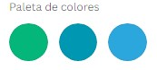
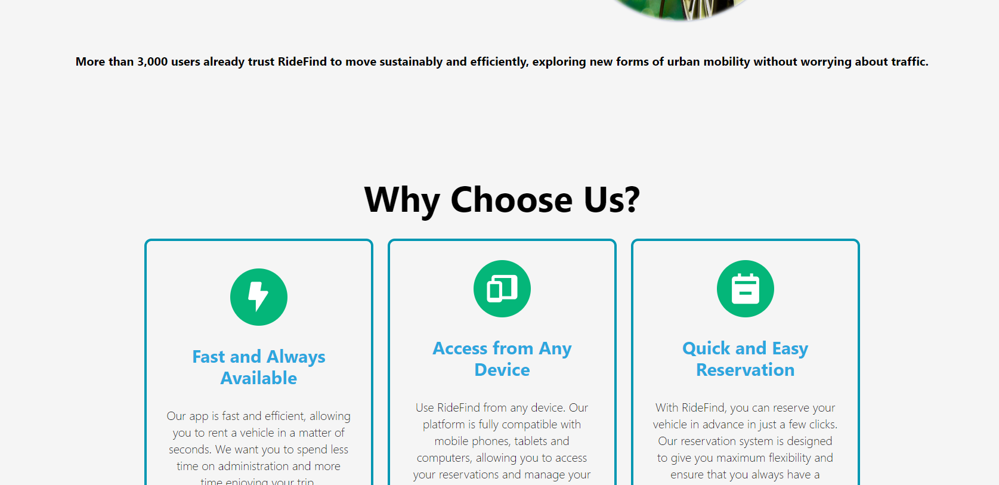
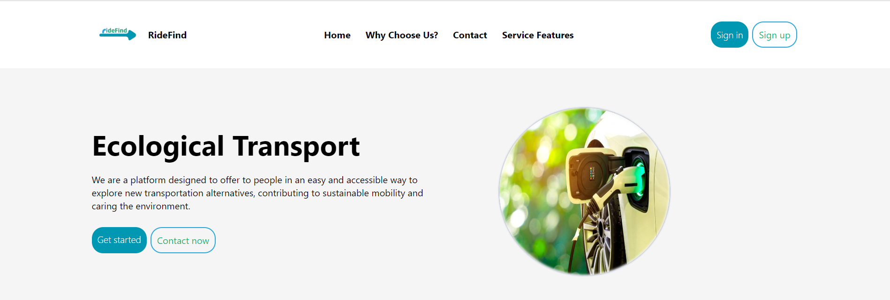
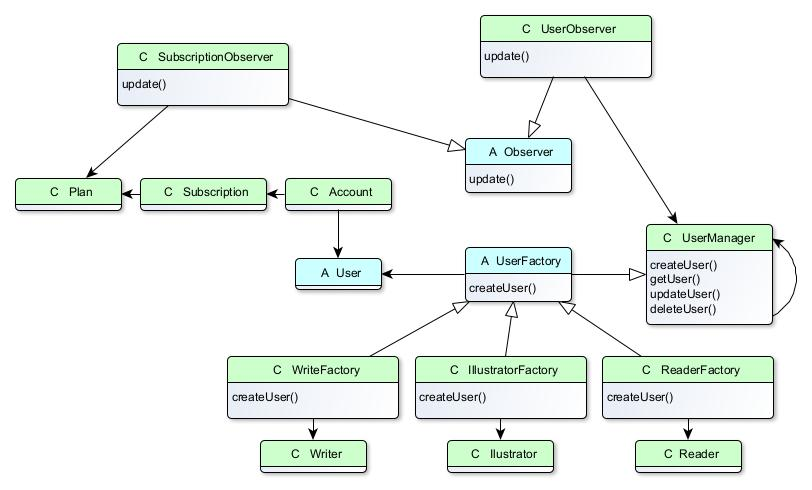
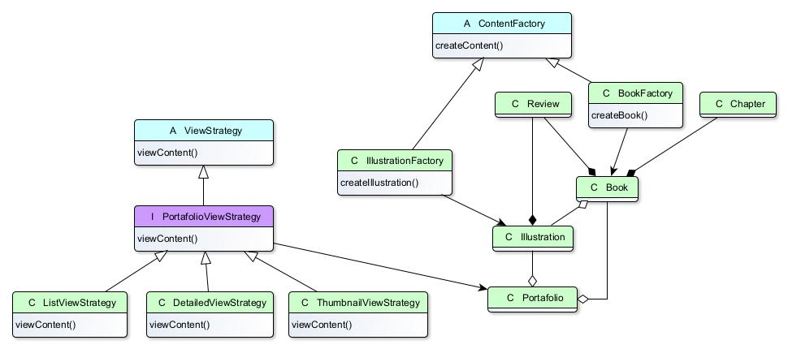
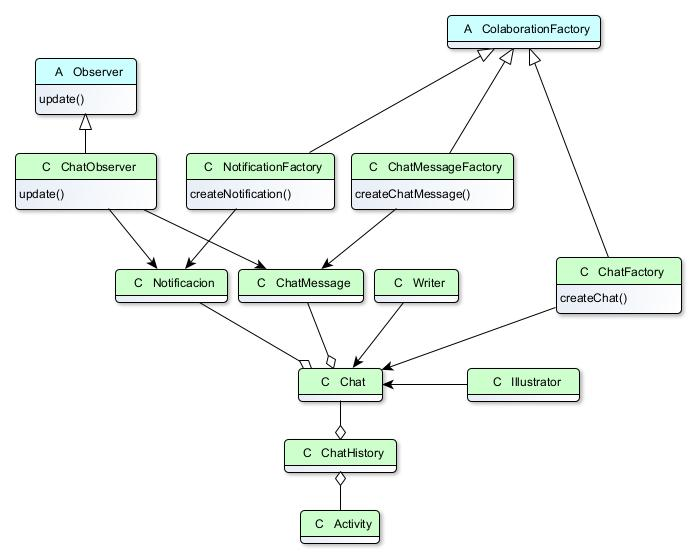
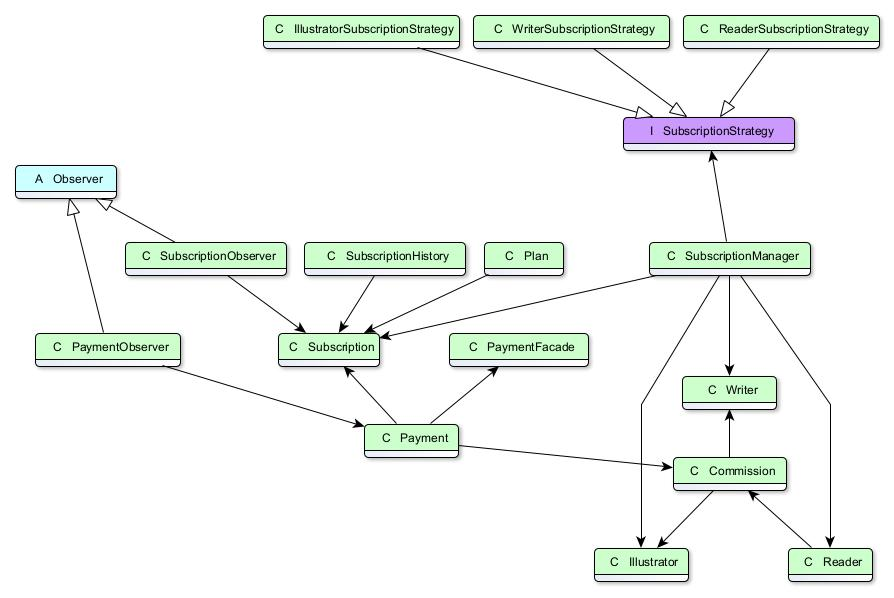

## Capítulo IV: Product Design

El diseño de producto es una fase fundamental en el desarrollo de cualquier software, ya que define cómo los usuarios interactuarán con la plataforma y garantiza que la experiencia de usuario sea intuitiva, fluida y estéticamente atractiva. En este capítulo, detallamos el proceso de diseño que seguimos para RideFind, desde las directrices generales de estilo hasta la arquitectura de software y la base de datos. Cada sección refleja nuestro enfoque en la creación de una experiencia de usuario óptima y un diseño de interfaz que facilite la navegación y el uso de la plataforma, tanto en la landing page como en las aplicaciones web.

### 4.1. Style Guidelines.

Definimos las pautas de estilo tanto generales como específicas para la web, asegurándonos de mantener una coherencia visual y una identidad sólida a lo largo de todo el diseño.

#### 4.1.1. General Style Guidelines.

**Task:**
En esta sección, se detallarán las directrices generales de estilo que guiarán el diseño y la presentación de nuestro proyecto. Estas directrices asegurarán que todos los elementos visuales y textuales sean coherentes y alineados con la identidad de nuestra marca, proporcionando una experiencia de usuario uniforme y profesional. 

**Insight:**
La consistencia en el estilo y diseño es crucial para establecer una identidad de marca fuerte y reconocible. Una guía de estilo clara ayuda a mantener la coherencia a lo largo del proyecto y asegura que todos los miembros del equipo trabajen hacia los mismos objetivos visuales y comunicativos. 

**Branding:**
Nuestro logo es una flecha orientada hacia la derecha con "RideFind" escrito sobre la flecha. Este diseño simboliza el progreso y la dirección, reflejando nuestra misión de conectar a las personas con vehículos de forma eficiente y moderna. La flecha representa movimiento y avance, mientras que la tipografía utilizada para "RideFind" está diseñada para ser clara y fácilmente legible, reforzando la identidad de nuestra marca y facilitando el reconocimiento de nuestro nombre en diferentes contextos.

**Typography:**
Se escogió esta tipografía debido a que proyecta simplicidad, y un toque moderno el cual creemos que encaja con nuestro proyecto.

**Colors:**

**Primary Colors**

- **Eco-Friendly Green (#04b679)**

    **Usage:** Utilizado para texto principal y elementos clave en la interfaz. Este verde representa nuestro compromiso con la sostenibilidad y el enfoque ecológico de nuestra plataforma. Se empleará en llamadas a la acción, botones principales y enlaces destacados para resaltar nuestra misión de promover la movilidad sostenible.

- **Sky Blue (#0097b2)**

    **Usage:** Este celeste se usará para la flecha en el logo y como color secundario en la interfaz. Representa nuestro compromiso con el medio ambiente y la frescura de nuestras soluciones. También se aplicará en fondos y elementos decorativos para transmitir una sensación de claridad y amplitud.

- **Light Blue (#2ca7de)**

    **Usage:** Utilizado para textos y elementos secundarios. Este tono de azul celeste complementa el color principal, proporcionando una visualización coherente y atractiva. Se aplicará en subtítulos, íconos y detalles que requieran una distinción suave pero efectiva sin perder la armonía visual con el verde principal.

**Spacing:**

Se utiliza un espaciado base de 4px para padding y margin en todos los elementos. Este espaciado asegura una apariencia uniforme y ordenada en la interfaz.

#### 4.1.2. Web Style Guidelines.

**Responsive Web Interface**

La Landing Page se centra en facilitar el acceso a información clave como inscripción, vehículos y beneficios, para captar la atención de los usuarios de manera eficiente.

El espaciado está basado en múltiplos de 4px, garantizando un diseño coherente y organizado. Los colores elegidos, junto con el tamaño y alineación del texto, aseguran una buena legibilidad. La tipografía empleada distingue claramente los títulos y mantiene un estilo profesional y serio.

Las imágenes utilizadas son de dominio público y están alineadas con el propósito de la aplicación. Se optó por un fondo degradado para mantener una apariencia simple y atractiva.

### 4.2. Information Architecture.

La arquitectura de la información es clave para organizar y estructurar los contenidos de RideFind. En esta sección, presentamos los sistemas de organización, etiquetado, y búsqueda, junto con el uso de etiquetas SEO y meta tags para mejorar la visibilidad de la plataforma en motores de búsqueda.

#### 4.2.1. Organization Systems.

El propósito del sistema de organización de la página es establecer la estructura visual del contenido y la navegación en la misma. En el caso de RideFind, el esquema de organización de contenido se divide en módulos y se enfoca en los siguientes temas:

**Homepage:**
La página se divide en distintas secciones que incluyen: Home , Why Choose Us?, Contact, Service Features, Sign In y Sign Up.

En la parte superior, los enlaces de navegación permiten a los usuarios acceder rápidamente a diferentes áreas del sitio, siguiendo un diseño intuitivo que destaca la información esencial. La estructura está diseñada para que los usuarios comprendan fácilmente la propuesta de valor de la aplicación y puedan registrar o iniciar sesión con facilidad.

Además, hemos incluido un botón para alternar entre el modo claro y oscuro, proporcionando una experiencia de usuario personalizada basada en las preferencias individuales. También, en la esquina superior derecha, se encuentra un selector de idioma que permite cambiar entre Español e Inglés, mejorando la accesibilidad y adaptabilidad del sitio para una audiencia global.

#### 4.2.2. Labeling Systems.

**Home:**  
La sección Home sirve como punto de partida para los usuarios, proporcionando una visión general de la aplicación y destacando las características principales y los beneficios. Aquí, los visitantes pueden explorar rápidamente el propósito de la aplicación y acceder a otras secciones clave del sitio.

**Why Choose Us?:**  
En Why Choose Us? se detallan las razones por las que la aplicación se destaca en comparación con otras soluciones en el mercado. Esta sección resalta los beneficios únicos y las ventajas competitivas, ayudando a los usuarios a comprender por qué deberían elegir nuestra aplicación.

**Contact:**  
La sección Contact ofrece diferentes métodos para que los usuarios se pongan en contacto con el equipo de soporte o con el servicio de atención al cliente. Aquí se proporcionan formularios, direcciones de correo electrónico, números de teléfono y otros medios para resolver dudas o recibir asistencia.

**Service Features:**  
Service Features presenta una descripción detallada de las características y funcionalidades que ofrece la aplicación. Esta sección proporciona a los usuarios una comprensión clara de lo que pueden esperar y cómo cada característica puede satisfacer sus necesidades.

**Sign In:**  
La sección Sign In permite a los usuarios registrados acceder a sus cuentas. Aquí, los usuarios ingresan sus credenciales para acceder a sus perfiles y disfrutar de las funcionalidades personalizadas que la aplicación ofrece.

**Sign Up:**  
En Sign Up, los nuevos usuarios pueden crear una cuenta para comenzar a utilizar la aplicación. Esta sección incluye formularios para ingresar información básica y establecer credenciales, facilitando el registro y el inicio de la experiencia en la plataforma.

#### 4.2.3. SEO Tags and Meta Tags

En esta sección, se detallan las etiquetas SEO y Meta que se utilizarán para optimizar el posicionamiento en buscadores del sitio web y la landing page de RideFind. Estas etiquetas son esenciales para garantizar que el sitio sea fácilmente encontrado por los usuarios a través de motores de búsqueda como Google, lo cual incrementa la visibilidad y el tráfico cualificado al sitio.

Cada página clave del sitio, incluyendo Inicio, Registro de vehículo, Alquiler y Funcionalidades, contará con etiquetas SEO y Meta personalizadas que reflejan su contenido específico. Esto incluirá títulos relevantes, descripciones claras y palabras clave estratégicas para mejorar la posición en los resultados de búsqueda y atraer a usuarios interesados en nuestra aplicación.

**Landing Page**

- Title Tag: Descubre RideFind | Alquiler de Vehículos Alternativos
- Meta Description Tag: "Bienvenido a RideFind, la plataforma ideal para alquilar vehículos alternativos de forma rápida y segura. Explora nuestra amplia gama de opciones y únete hoy mismo."
- Meta Keyword Tag: RideFind, alquiler de vehículos, movilidad alternativa, alquiler de scooters, alquiler de bicicletas eléctricas
- Author: RideFind Team

**Home**

- Title Tag: Inicio | RideFind
- Meta Description Tag: Content: "Explora la página principal de RideFind y descubre cómo puedes alquilar vehículos alternativos de manera conveniente y ecológica. Únete a nuestra comunidad hoy."
- Meta Keyword Tag: Content: RideFind, alquiler de vehículos, movilidad sostenible, alquiler de bicicletas, alquiler de scooters
- Author: RideFind Team

**Why Choose Us?**

- Title Tag: ¿Por qué Elegir RideFind? | Ventajas y Beneficios
- Meta Description Tag: "Conoce las razones por las que RideFind es la mejor opción para alquilar vehículos alternativos. Descubre nuestras ventajas y beneficios únicos que nos diferencian de la competencia."
- Meta Keyword Tag: ventajas RideFind, beneficios alquiler vehículos, por qué elegir RideFind
- Author: RideFind Team

**Contact**

- Title Tag: Contacta con RideFind | Soporte y Atención al Cliente
- Meta Description Tag: "¿Necesitas ayuda? Contacta a RideFind para soporte y asistencia. Encuentra los medios de contacto, incluyendo formularios, correos electrónicos y números de teléfono."
- Meta Keyword Tag: contacto RideFind, soporte RideFind, atención al cliente
- Author: RideFind Team

**Service Features**

- Title Tag: Características del Servicio de RideFind | Lo que Ofrecemos
Meta Description Tag: "Explora las características y funcionalidades de RideFind. Conoce - cómo nuestra plataforma puede satisfacer tus necesidades de alquiler de vehículos alternativos."
- Meta Keyword Tag: características RideFind, funcionalidades alquiler vehículos, servicios RideFind
- Author: RideFind Team

**Sign In**
- Title Tag: Iniciar Sesión en RideFind | Accede a tu Cuenta
- Meta Description Tag: "Accede a tu cuenta de RideFind para gestionar tus alquileres y disfrutar de una experiencia personalizada. Introduce tus credenciales para iniciar sesión."
- Meta Keyword Tag: iniciar sesión RideFind, acceso cuenta RideFind, login RideFind
- Author: RideFind Team

**Sign Up**
- Title Tag: Regístrate en RideFind | Crea tu Cuenta
- Meta Description Tag: "Únete a RideFind creando una cuenta. Completa el formulario de registro para empezar a alquilar vehículos alternativos y aprovechar todas nuestras funcionalidades."
- Meta Keyword Tag: registrarse RideFind, crear cuenta RideFind, signup RideFind
- Author: RideFind Team

#### 4.2.4. Searching Systems.

- **Barra de Navegación Principal:**
  En la parte superior de la página se encuentra una barra de navegación que incluye enlaces a las secciones principales del sitio.
  Los enlaces principales son: "Página Principal", "¿Porque elegirnos?", "Contacto" y "Caracteristicas del servicio".  

- **Navegación Jerárquica:**
  La página principal sigue un diseño en forma de F, lo que resalta la importancia de que el usuario comprenda la empresa y sus servicios. Las opciones de navegación están organizadas de manera jerárquica, colocando las secciones más relevantes y destacadas en la parte superior.
  

- **Sección Inferior:**
  En la parte inferior de la página, se incluye una navegación adicional que proporciona acceso rápido a información importante y complementaria, como "Contáctanos.

#### 4.2.5. Navigation Systems.

### 4.3. Landing Page UI Design.

#### 4.3.1. Landing Page Wireframe.

#### 4.3.2. Landing Page Mock-up.

### 4.4. Web Applications UX/UI Design.

#### 4.4.1. Web Applications Wireframes.

  

### 4.4.2. wireflow diagrams
inicio de sesion

Busqueda y seleccion de un vehículo

Enlace de los Wireflow Diagrams en LucidChart: https://lucid.app/lucidchart/db91d34c-37fb-4264-8376-1aece315750c/edit?viewport_loc=-257%2C860%2C4021%2C1923%2C0_0&invitationId=inv_5b6a04fe-06ce-4f58-a6a1-0c50ef7bd0ec

## 4.7. Software Object-Oriented Design
### 4.7.1. Class Diagrams

User Bounded Context

Content Bounded Context

Collaboration Bounded Context

Monetization Bounded Context

### 4.7.2. Class Dictionary

<table border="1" width="30%">
  <tr>
    <td colspan="1" valign="top">User</td>
  </tr>
    <tr>
    <td colspan="2" valign="top">La clase User representa a los usuarios de la aplicación</td>
  </tr>
<table>

<table border="1" width="30%">
  <tr>
    <td colspan="1" valign="top">Writer</td>
  </tr>
    <tr>
    <td colspan="2" valign="top">La clase Writer representa a los escritores de la aplicación</td>
  </tr>
<table>

<table border="1" width="30%">
  <tr>
    <td colspan="1" valign="top">Illustrator</td>
  </tr>
    <tr>
    <td colspan="2" valign="top">La clase Illustrator representa a los ilustradores de la aplicación</td>
  </tr>
<table>

<table border="1" width="30%">
  <tr>
    <td colspan="1" valign="top">Reader</td>
  </tr>
    <tr>
    <td colspan="2" valign="top">La clase Reader representa a los lectores de la aplicación</td>
  </tr>
<table>

<table border="1" width="50%">
  <tr>
    <td colspan="2" valign="top">UserFactory</td>
  </tr>
    <tr>
    <td colspan="2" valign="top">La clase UserFactory es una clase hija de UserManager y se encarga de la creación de los usuarios del sistema.</td>
  </tr>
  <tr>
    <td colspan="1" valign="top">Método</td>
    <td colspan="2" valign="top">Descripción</td>
  </tr>
   <tr>
    <td colspan="1" valign="top">createUser()</td>
    <td colspan="2" valign="top">Método que crea nuevos objetos de tipo User.</td>
  </tr>
<table>

<table border="1" width="50%">
  <tr>
    <td colspan="2" valign="top">WriterFactory</td>
  </tr>
    <tr>
    <td colspan="2" valign="top">La clase WriterFactory es una clase hija de UserFactory. Se encarga de la creación de los usuarios escritores en la aplicación.</td>
  </tr>
  <tr>
    <td colspan="1" valign="top">Método</td>
    <td colspan="2" valign="top">Descripción</td>
  </tr>
   <tr>
    <td colspan="1" valign="top">createUser()</td>
    <td colspan="2" valign="top">Método que crea nuevos objetos de tipo Writer.</td>
  </tr>
<table>

<table border="1" width="50%">
  <tr>
    <td colspan="2" valign="top">IllustratorFactory</td>
  </tr>
    <tr>
    <td colspan="2" valign="top">La clase IllustratorFactory es una clase hija de UserFactory. Se encarga de la creación de los usuarios ilustradores en la aplicación.</td>
  </tr>
  <tr>
    <td colspan="1" valign="top">Método</td>
    <td colspan="2" valign="top">Descripción</td>
  </tr>
   <tr>
    <td colspan="1" valign="top">createUser()</td>
    <td colspan="2" valign="top">Método que crea nuevos objetos de tipo Illustrator.</td>
  </tr>
<table>

<table border="1" width="50%">
  <tr>
    <td colspan="2" valign="top">ReaderFactory</td>
  </tr>
    <tr>
    <td colspan="2" valign="top">La clase ReaderFactory es una clase hija de UserFactory. Se encarga de la creación de los usuarios lectores en la aplicación.</td>
  </tr>
  <tr>
    <td colspan="1" valign="top">Método</td>
    <td colspan="2" valign="top">Descripción</td>
  </tr>
   <tr>
    <td colspan="1" valign="top">createUser()</td>
    <td colspan="2" valign="top">Método que crea nuevos objetos de tipo Reader.</td>
  </tr>
<table>

<table border="1" width="50%">
  <tr>
    <td colspan="2" valign="top">UserManager</td>
  </tr>
    <tr>
    <td colspan="2" valign="top">La clase UserManager se encarga de la gestión de los usuarios en el sistema.</td>
  </tr>
  <tr>
    <td colspan="1" valign="top">Método</td>
    <td colspan="2" valign="top">Descripción</td>
  </tr>
   <tr>
    <td colspan="1" valign="top">createUser()</td>
    <td colspan="2" valign="top">Método que crea nuevos objetos de tipo User.</td>
  </tr>
  <tr>
    <td colspan="1" valign="top">getUser()</td>
    <td colspan="2" valign="top">Método que obtiene el identificador de un usuario.</td>
  </tr>
  <tr>
    <td colspan="1" valign="top">updateUser()</td>
    <td colspan="2" valign="top">Método que actualiza los atributos de un usuario.</td>
  </tr>
  <tr>
    <td colspan="1" valign="top">deleteUser()</td>
    <td colspan="2" valign="top">Método que elimina a un usuario del sistema.</td>
  </tr>
<table>

<table border="1" width="30%">
  <tr>
    <td colspan="1" valign="top">Account</td>
  </tr>
    <tr>
    <td colspan="2" valign="top">La clase Account representa la cuenta de los usuarios de la aplicación.</td>
  </tr>
<table>

<table border="1" width="30%">
  <tr>
    <td colspan="1" valign="top">Subscription</td>
  </tr>
    <tr>
    <td colspan="2" valign="top">La clase Subscription representa la suscripción a un plan de la aplicaicón.</td>
  </tr>
<table>

<table border="1" width="30%">
  <tr>
    <td colspan="1" valign="top">Plan</td>
  </tr>
    <tr>
    <td colspan="2" valign="top">La clase Plan representa a los planes de suscripción de la aplicación.</td>
  </tr>
<table>

<table border="1" width="50%">
  <tr>
    <td colspan="2" valign="top">Observer</td>
  </tr>
    <tr>
    <td colspan="2" valign="top">La clase Observer es una clase se encarga de notificar acerca de cambios realizadosa otro objeto </td>
  </tr>
  <tr>
    <td colspan="1" valign="top">Método</td>
    <td colspan="2" valign="top">Descripción</td>
  </tr>
   <tr>
    <td colspan="1" valign="top">update()</td>
    <td colspan="2" valign="top">Método que informa al resto de los observadores acerca de n cambio de estado.</td>
  </tr>
<table>

<table border="1" width="50%">
  <tr>
    <td colspan="2" valign="top">SuscriptionObserver</td>
  </tr>
    <tr>
    <td colspan="2" valign="top">La clase SuscriptionObserver es una clase hija de Observer. Se encarga de gestionar el estado de las suscripciones del sistema.</td>
  </tr>
  <tr>
    <td colspan="1" valign="top">Método</td>
    <td colspan="2" valign="top">Descripción</td>
  </tr>
   <tr>
    <td colspan="1" valign="top">update()</td>
    <td colspan="2" valign="top">Método que actualiza el estado de la suscripción de un usuario.</td>
  </tr>
<table>

<table border="1" width="50%">
  <tr>
    <td colspan="2" valign="top">UserObserver</td>
  </tr>
    <tr>
    <td colspan="2" valign="top">La clase UserObserver es una clase hija de Observer. Se encarga de gestionar los estados de los usuarios en el sistema.</td>
  </tr>
  <tr>
    <td colspan="1" valign="top">Método</td>
    <td colspan="2" valign="top">Descripción</td>
  </tr>
   <tr>
    <td colspan="1" valign="top">update()</td>
    <td colspan="2" valign="top">Método que actualiza el estado de usuario.</td>
  </tr>
<table>

## 4.8. Database Design

### 4.8.1. Database Diagram

   
Se presenta a continuación el modelo físico elaborado para esta entrega, tomando en cuenta los requisitos necesarios para el negocio.

    

