## Capítulo V: Product Implementation, Validation & Deployment
### 5.1. Software Configuration Management.
#### 5.1.1. Software Development Environment Configuration.
En esta sección, detallaremos las herramientas y plataformas que hemos utilizado como equipo para la realización de nuestro startup. Estas herramientas son esenciales para el desarrollo, la colaboración y la gestión del proyecto. A continuación, se presenta un resumen de cada una de las herramientas utilizadas:

- **GitHub**

    **Descripción:** GitHub es una plataforma de alojamiento de código fuente y colaboración basada en Git. Nos permite gestionar el código del proyecto, realizar revisiones de código, y colaborar de manera eficiente con nuestro equipo. 
    **Uso:** Se utilizó para el versionado del código, gestión de ramas y pull requests, así como para la documentación del proyecto.

- **Git**

    **Descripción:** Git es un sistema de control de versiones distribuido que facilita la gestión de cambios en el código fuente.  **Uso:** Se empleó para realizar commits, push y pull de cambios, así como para la gestión de ramas, permitiendo una colaboración fluida y eficiente en el desarrollo del proyecto.

- **Canva**

    **Descripción:** Canva es una herramienta de diseño gráfico en línea que permite crear gráficos y elementos visuales de manera intuitiva.  **Uso:** Se utilizó para diseñar gráficos y elementos visuales para la landing page del proyecto, incluyendo banners, íconos y otros elementos de diseño que mejoran la presentación visual de la aplicación.

- **Visual Studio Code**

    **Descripción:** Visual Studio Code (VS Code) es un editor de código fuente ligero y extensible que soporta una amplia variedad de lenguajes de programación.  **Uso:** Se utilizó como el principal editor de código para escribir y editar el código del proyecto, aprovechando sus extensiones para mejorar la productividad y facilitar el desarrollo.

- **WhatsApp**

    **Descripción:** WhatsApp es una aplicación de mensajería instantánea que facilita la comunicación rápida y efectiva.  **Uso:** Se empleó para la comunicación diaria entre los miembros del equipo, coordinando tareas, resolviendo problemas y organizando reuniones informales.

- **Google Meet**

    **Descripción:** Google Meet es una herramienta de videoconferencia que permite realizar reuniones virtuales con facilidad.  **Uso:** Se utilizó para llevar a cabo reuniones virtuales de equipo, facilitando discusiones en tiempo real y presentaciones de avances del proyecto a los stakeholders y al equipo.

- **Figma**

    **Descripción:** Figma es una herramienta de diseño colaborativo en línea que permite crear y prototipar interfaces de usuario.  **Uso:** Se empleó para el diseño de interfaces y prototipos del proyecto, permitiendo la colaboración en tiempo real entre diseñadores y desarrolladores para ajustar y revisar el diseño de la aplicación.

  

#### 5.1.2. Source Code Management.

**Gestión del Código Fuente:**

En esta sección, se detalla cómo gestionamos y supervisamos el desarrollo del código para el proyecto RideFind. Utilizamos GitHub como nuestra plataforma principal para la gestión del código fuente, complementada por Git como sistema de control de versiones. Además, seguimos el flujo de trabajo GitFlow para estructurar el desarrollo de manera eficiente.

- Repositorio GitHub para nuestra Landing Page:
<b>https://github.com/upc-pre-202401-si730-ws51-RideLink/RideFind.github.io</b>

**Ramas Principales:**
- **main:** Esta rama, a menudo llamada "master", contiene la versión más estable y final del proyecto, lista para ser desplegada en producción. Los cambios integrados en esta rama han pasado todas las pruebas y revisiones necesarias, y se consideran completamente preparados para su lanzamiento.

- **develop:** La rama develop es el punto central de integración para las nuevas funcionalidades y mejoras en desarrollo. Las características y correcciones se fusionan en esta rama, donde se realizan pruebas adicionales antes de su eventual integración en la rama main.

**Ramas Auxiliares:**

- **releases:** Las ramas de tipo releases se crean para preparar nuevas versiones del proyecto. En estas ramas se llevan a cabo las pruebas finales y se corrigen errores menores antes del lanzamiento oficial. Una vez que una versión ha sido validada, los cambios se integran en la rama develop para futuros desarrollos y luego se fusionan en la rama main para su despliegue.

**Uso de GitFlow:**

- **Feature Branches:** Se utilizan ramas de características para desarrollar nuevas funcionalidades. Estas ramas se crean a partir de la rama develop y, una vez que se completa el desarrollo y se aprueban las revisiones, se fusionan nuevamente en la rama develop.

- **Bugfix Branches:** Para solucionar errores que necesitan ser corregidos antes de la siguiente versión, se utilizan ramas de corrección de errores. Estas ramas se crean a partir de la rama develop o, en casos críticos, desde la rama main.

- **Hotfix Branches:** Se emplean para abordar errores críticos que requieren una solución urgente en producción. Estas ramas se crean a partir de la rama main, y una vez que el problema se resuelve, los cambios se fusionan tanto en la rama main como en la rama develop.

Este enfoque estructurado con GitFlow nos permite gestionar el desarrollo del código de manera eficiente, facilitando la integración de nuevas características, la corrección de errores y la preparación de versiones estables para producción.

**Commits Conventions:**

En RideFind, los commits se nombran de acuerdo con el avance y el contenido específico del trabajo realizado. No seguimos una convención rígida para los nombres de los commits; en su lugar, los desarrolladores utilizan descripciones claras y concisas para reflejar las modificaciones implementadas. Esto nos permite una mayor flexibilidad a la hora de registrar el progreso, asegurando que cada commit tenga un nombre que represente con precisión el trabajo efectuado.

#### 5.1.3. Source Code Style Guide & Conventions.
n RideFind hemos implementado varias convenciones de estilo para asegurar un desarrollo de código claro y consistente en distintos lenguajes y tecnologías:

<b>HTML y CSS:</b>  

1. El tipo de documento se declara al inicio del archivo con `<!DOCTYPE html>`.

2. Se añaden los meta tags necesarios.

3. La etiqueta `<title>` se incluye dentro del bloque `<head>`.

4. Usamos una indentación de dos espacios.

5. Se escriben en minúsculas los nombres de los elementos HTML, atributos, propiedades, valores y selectores CSS.

6. Los atributos de los elementos HTML siempre están entre comillas.

7. Cada elemento HTML debe contar con su etiqueta de cierre.

8. Se evita escribir líneas de código demasiado largas.

9. Para las imágenes, se especifican tanto el ancho y alto como el texto alternativo.

<b>JavaScript</b>

1. Cada línea de código termina con un punto y coma.

2. Las variables y funciones siguen la convención de CamelCase.

3. Las cadenas de texto (strings) se colocan entre comillas simples.

4. La indentación es de 2 espacios.

5. Se utiliza preferentemente let y const en lugar de var para declarar variables.

6. Gherkin (Convenciones de Gherkin para Especificaciones Legibles)

7. Se utilizan los términos "Given", "When", "Then" y "And" para definir los pasos del escenario.

8. Los pasos que comienzan con "And" se indentan.

9. Se deja una línea en blanco entre los pasos.

10. Los parámetros se colocan entre comillas simples.

11. Se separan los escenarios con un comentario y dos líneas en blanco.

Estas convenciones nos ayudan a mantener el código organizado, legible y coherente a lo largo del proyecto.

- US01:

- US02:

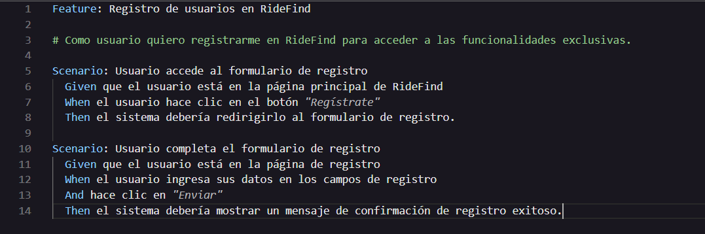

- US03:

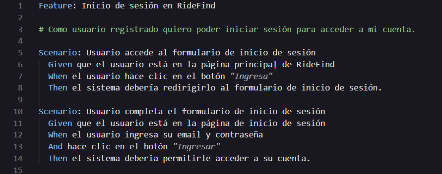

- US04:

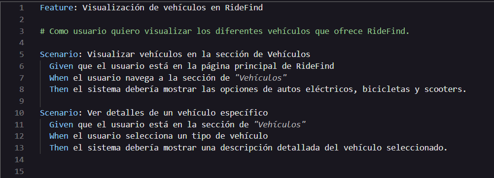

- US05:

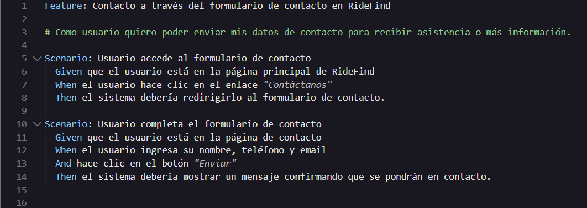

#### 5.1.4. Software Deployment Configuration.

Explicaremos cómo realizar el despliegue de nuestra Landing Page utilizando el servicio automatizado en la nube de GitHub Pages. A continuación, detallaremos los pasos necesarios para lograr este proceso. 

1. Es fundamental asegurarnos de que la configuración del repositorio sea correcta, ya que será desplegado posteriormente con GitHub Pages: 
 

 
 
2. Accedemos a GitHub Pages:
 
 

 
 
3. Tras guardar la configuración adecuada, GitHub Pages comenzará automáticamente el despliegue de nuestra Landing Page. En este caso, trabajamos con tres ramas clave: main, develop, y releases. El contenido más estable y listo para producción se encuentra en main, mientras que develop se utiliza para integrar nuevas características en desarrollo, y releases nos ayuda a preparar versiones finales. Una vez completado el despliegue, se generará un enlace que nos permitirá acceder directamente a nuestra Landing Page.
 
 

 
 
4. Una vez que hayamos ajustado la configuración, GitHub Pages dará inicio al despliegue automático de nuestra Landing Page. Durante este proceso, podremos monitorear el progreso, y cuando se complete exitosamente, se nos proporcionará un enlace directo para acceder a la Landing Page.
 
 

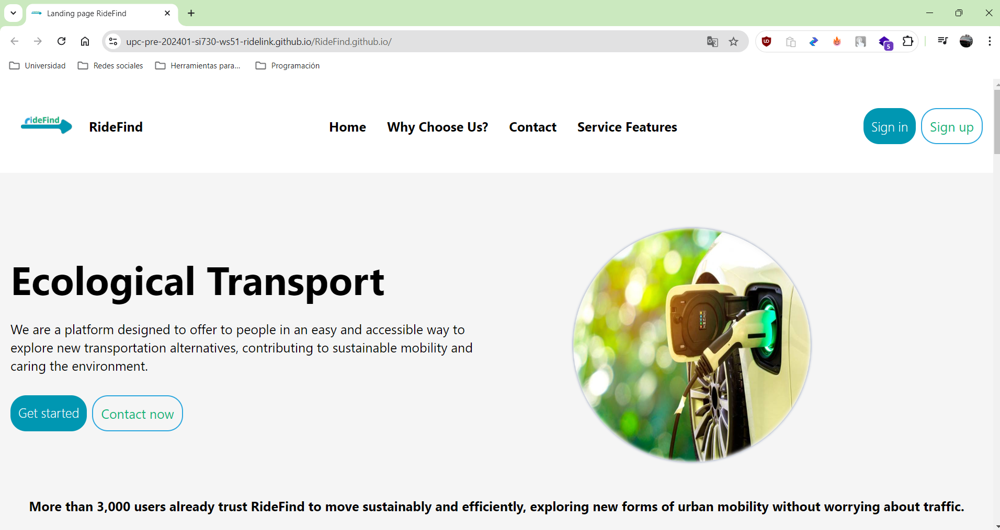

 
 

<b> Link de nuestra Landing Page: </b> https://upc-pre-202401-si730-ws51-ridelink.github.io/RideFind.github.io/

### 5.2. Landing Page, Services & Applications Implementation.
#### 5.2.1. Sprint 1.
#### 5.2.1.1. Sprint Planning 1.

<table>
  <tr>
    <th> Sprint # </th>
    <th> Sprint 1 </th>
  </tr>
  <tr>
    <td style="font-weight: bold;" colspan="2"> Sprint Planning Background </td>
  </tr>
  <tr>
    <td style="font-weight: bold;"> Date </td>
    <td> 09/07/2024 </td>
  </tr>
  <tr>
    <td style="font-weight: bold;"> Time </td>
    <td> 19:00 horas (GMT-5) </td>
  </tr>
  <tr>
    <td style="font-weight: bold;"> Location </td>
    <td> Virtual (Google Meet) </td>
  </tr>
  <tr>
    <td style="font-weight: bold;"> Prepared By </td>
    <td> Gutierrez Garcia, Jose Eduardo </td>
  </tr>
  <tr>
    <td style="font-weight: bold;"> Attendees (to planning meeting) </td>
    <td>
      Briceño De La Cruz, Farid Sebastian 
      Gutierrez Garcia, Jose Eduardo 
      Huamani Aguilar, Jhon Rony  
      Huanca Zevallos, Cristhian Joel  
      Sanchez Ignacio, Jefrey Martin  
    </td>
    </td>
  </tr>
  <tr>
    <td style="font-weight: bold;"> Sprint 1 Review Summary </td>
    <td> Al este ser nuestro primer sprint de desarrollo no existe un review summary del sprint </td>
  </tr>
  <tr>
    <td style="font-weight: bold;"> Sprint 1 Retrospective Summary </td>
    <td> Ya que es nuestro primer sprint aún no identificamos ningun plane de mejora. </td>
  </tr>
  <tr>
    <td style="font-weight: bold;" colspan="2"> Sprint Goal & User Stories </td>
  </tr>
  <tr>
    <td style="font-weight: bold;"> Sprint 1 Goal </td>
    <td> Completar las principales secciones de la Landing Page de la aplicación RideFind, permitiendo a los usuarios explorar y familiarizarse con la plataforma. </td>
  </tr>
  <tr>
    <td style="font-weight: bold;"> Sprint 1 Velocity </td>
    <td> <strong>8 </strong>  Se estima una capacidad de 8 Story Points para este sprint, tomando en cuenta las tareas relacionadas con el desarrollo de la Landing Page. </td>
  </tr>
  <tr>
    <td style="font-weight: bold;"> Sum of Story Points </td>
    <td> 8 </td>
  </tr>
</table>

#### 5.2.1.2. Sprint Backlog 1.

| id   | Title                  | Id  | Title                                                    | Description                                                                                                   | Estimations(Hours) | Assigned To   | Status(To-do /InProcess/ToReview/Done) |
| ---- | ---------------------- | --- | -------------------------------------------------------- | ------------------------------------------------------------------------------------------------------------- | ------------------ | ------------- | -------------------------------------- |
| US01 | Barra de navegación en la Landing Page     | TS01 |Barra de navegación en la Landing Page (Desarrollado en HTML, CSS y JS).| Implementación del header y la barra de navegación, desarrollados en HTML, CSS y JS con diseño responsive. | 8                  | Farid | Done                                   |
| US02 | 	Sección de beneficios de la Aplicación   | TS02 | Sección de beneficios (Desarrollado en HTML, CSS y JS).|Desarrollar una sección que destaque los beneficios clave de RideFind utilizando HTML, CSS, y componentes reutilizables con diseño responsive. | 6                | Jose | Done                                   |
| US03 | Información sobre Nosotros           | TS03 | Sección de suscripciones (Desarrollado en HTML, CSS y JS).| Implementar la sección "Sobre Nosotros", mostrando información clave de la empresa con diseño responsive y optimización para dispositivos móviles y tablets. | 4                 | Jhon   | Done                                   |
| US04 | Redes Sociales y Footer | TS04 | RRedes Sociales y Footer (Desarrollado en HTML, CSS y JS).| Crear un footer con enlaces a redes sociales, optimizado para diferentes resoluciones de pantalla, asegurando su visibilidad en todo tipo de dispositivos.| 4 | Cristhian | Done
| US05 | Sección de contacto | TS04 | Sección de contacto (Desarrollado en HTML, CSS y JS).| Implementar una sección de contacto con un formulario básico, validación de datos, y diseño responsive para garantizar su correcto funcionamiento en móviles.| 4 | Jefrey | Done

Este plan del Sprint 1 se centra en la implementación técnica de las principales secciones de la Landing Page con un enfoque en diseño responsive para asegurar que la plataforma RideFind sea accesible y visualmente atractiva en todos los dispositivos.

---

#### 5.2.1.3. Development Evidence for Sprint Review.

| Repository | Branch | Commit Id | Commit  Message | Commit  Message Body | Commited  on (Date) |
|:-------------:|:---------------:|:-------------:|:-------------:|:---------------:|:-------------:|
| RideFind | main | 7f2e29691448144300e3a8c4a1a6078841206486 | Initial commit |  | 07/09/2024 |
| Landing | develop | 45ebb06fb1cd8f33405b7545ce698b0f39848447 | feat: add footer |  | 07/09/2024 |
| Landing | develop | 9841da5fd418fe9618ea0a58a9b45ab3a4a943f1 | feat: Add Customers feedback |  | 07/09/2024 |
| Landing | develop | 87aea777d2da7e056a3f63bda68a52f52e7a4c9a | feat: added service |  | 07/09/2024 |
| Landing | develop | a0cab30644d8c7166c7f5d31f8d63541dd33f718 | Add: Update section 1 index.html |  | 07/09/2024 |
| Landing | develop | c0c2c323a498f48408239ba36bc2b9179806d638 | feat: Add headers |  | 07/09/2024 |
| Landing | develop  | 8c13ce84d24ccdd7d924dbd58d03917cfe49bb3c | feat: Update styles |  | 07/09/2024 |

#### 5.2.1.4. Testing Suite Evidence for Sprint Review.

Durante este sprint, hemos llevado a cabo las pruebas de aceptación utilizando la herramienta Gherkin. Puedes encontrar los escenarios de estas pruebas dando click aqui: [https://github.com/upc-pre-202401-si730-ws51-RideLink/RideFind-Acceptance-Tests](https://github.com/upc-pre-202401-si730-ws51-RideLink/RideFind-Acceptance-Tests).

| Repository | Branch | Commit Id | Commit  Message | Commit  Message Body | Commited  on (Date) |
|:-------------:|:---------------:|:-------------:|:-------------:|:---------------:|:-------------:|
| RideLink | main | a4398b440f4935619dccd14ee2c75b8815409834 | Initial commit |  | 07/09/2024 |
|  | main | de33ade90354d7ca9156ec92f80d2747d1335edc | feat: add .feature in Epic-01 |  | 07/09/2024 |

#### 5.2.1.5. Execution Evidence for Sprint Review.

En esta entrega, el equipo RideFind ha logrado completar con éxito la creación de la Landing Page. Esta proporcionará detalles precisos sobre nuestra misión como startup, además de ofrecer información sobre los servicios que proporcionamos en nuestra aplicación web.

Enlace del deploy del Landing Page de RideLink en GitHub Pages: https://upc-pre-202401-si730-ws51-ridelink.github.io/RideFind.github.io/

Sección de header donde se encuentra el menu de navegación principal y el Banner donde  se muestra un mensaje con una imagen acerca de RideFind:

<a href="deploy01">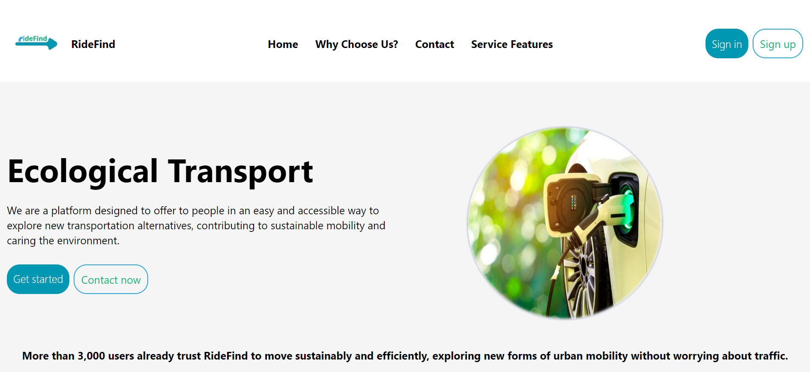</a>

Sección para saber que ofrecemos en nuestra plataforma:

<a href="deploy01">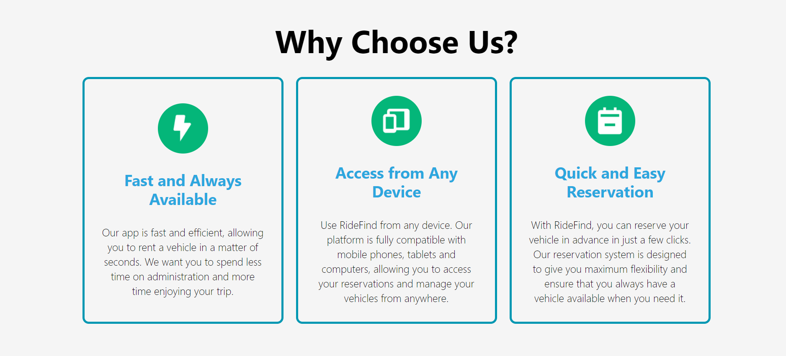</a>

Sección para ver las ventajas

Sección para ver las suscripciones:

Sección para ver las reseñas de nuestros clientes:

Sección de contacto y footer con enlaces a redes sociales y un formulario de contacto:

<a href="deploy01">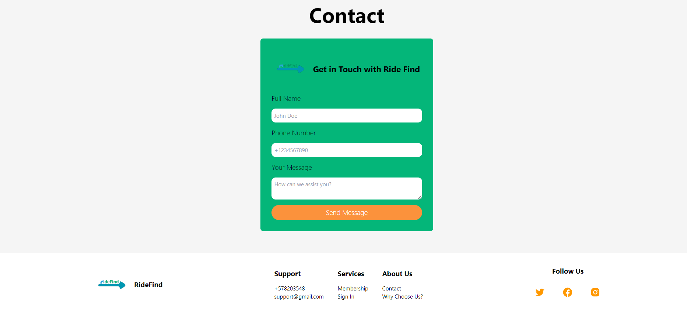</a>

#### 5.2.1.6. Services Documentation Evidence for Sprint Review.

En esta entrega, nos enfocamos en Landing page, por lo que no fue necesario ningún servicio adicional.

#### 5.2.1.7. Software Deployment Evidence for Sprint Review.

En este caso se uso GitHub Pages, para desplegar la Landing page, el cual nos sirvio para, a partir de un código en un repositorio poder desplegar la página. Enlace de la landing page: [https://upc-pre-202401-si730-ws51-ridelink.github.io/RideFind.github.io/](https://upc-pre-202401-si730-ws51-ridelink.github.io/RideFind.github.io/)

#### 5.2.1.8. Team Collaboration Insights during Sprint.

Para llevar a cabo este proyecto se usaron distintas herramientas como Visual Studio Code; junto con manejo de versiones en Git. En este caso se dividio la landing page mostrada anteriormente en sectores, a partir de esto cada uno presentó su parte y luego un miembro juntó las partes para finalmente tener el resultado deseado.

<a href="deploy01">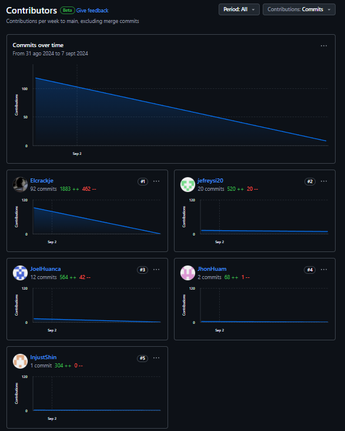</a>

 
 

<a href="deploy01">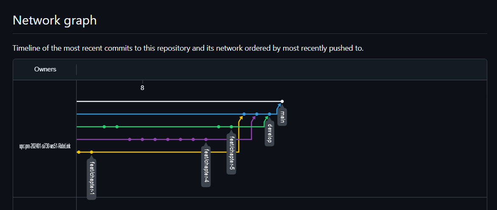</a>

 

#### 5.2.2. Sprint 2.
#### 5.2.2.1. Sprint Planning 2.

<table>
  <tr>
    <th> Sprint # </th>
    <th> Sprint 2 </th>
  </tr>
  <tr>
    <td style="font-weight: bold;" colspan="2"> Sprint Planning Background </td>
  </tr>
  <tr>
    <td style="font-weight: bold;"> Date </td>
    <td> 14/09/2024 </td>
  </tr>
  <tr>
    <td style="font-weight: bold;"> Time </td>
    <td> 19:00 horas (GMT-5) </td>
  </tr>
  <tr>
    <td style="font-weight: bold;"> Location </td>
    <td> Virtual (Google Meet) </td>
  </tr>
  <tr>
    <td style="font-weight: bold;"> Prepared By </td>
    <td> Gutierrez Garcia, Jose Eduardo </td>
  </tr>
  <tr>
    <td style="font-weight: bold;"> Attendees (to planning meeting) </td>
    <td>
      Briceño De La Cruz, Farid Sebastian 
      Gutierrez Garcia, Jose Eduardo 
      Huamani Aguilar, Jhon Rony 
      Huanca Zevallos, Cristhian Joel 
      Sanchez Ignacio, Jefrey Martin 
    </td>
  </tr>
  <tr>
    <td style="font-weight: bold;"> Sprint 2 Review Summary </td>
    <td> En este sprint se completaron las principales secciones de la Landing Page y se realizaron pruebas básicas para asegurar su correcto funcionamiento. Se logró que la página se visualice correctamente en diferentes dispositivos, asegurando una experiencia responsiva. </td>
  </tr>
  <tr>
    <td style="font-weight: bold;"> Sprint 2 Retrospective Summary </td>
    <td> Se identificó la necesidad de establecer una mejor comunicación en la asignación de tareas y definir criterios de aceptación más claros para cada historia de usuario. Se acordó realizar reuniones diarias más breves y enfocadas. </td>
  </tr>
  <tr>
    <td style="font-weight: bold;" colspan="2"> Sprint Goal & User Stories </td>
  </tr>
  <tr>
    <td style="font-weight: bold;"> Sprint 2 Goal </td>
    <td> Implementar las funcionalidades de registro e inicio de sesión para la aplicación RideFind, asegurando que los usuarios puedan crear cuentas, autenticarse y recuperar contraseñas. </td>
  </tr>
  <tr>
    <td style="font-weight: bold;"> Sprint 2 Velocity </td>
    <td> <strong>10</strong>  Se estima una capacidad de 10 Story Points para este sprint, considerando la complejidad de las funcionalidades relacionadas con el registro e inicio de sesión. </td>
  </tr>
  <tr>
    <td style="font-weight: bold;"> Sum of Story Points </td>
    <td> 10 </td>
  </tr>
</table>

#### 5.2.2.2. Sprint Backlog 2.

| id   | Title                  | Id  | Title                                                    | Description                                                                                                   | Estimations(Hours) | Assigned To   | Status(To-do /InProcess/ToReview/Done) |
| ---- | ---------------------- | --- | -------------------------------------------------------- | ------------------------------------------------------------------------------------------------------------- | ------------------ | ------------- | -------------------------------------- |
| US06 | Funcionalidad de Registro de Usuario | TS06 | Desarrollo del formulario de registro (HTML, CSS y JS). | Crear un formulario de registro de usuario con validación de datos y diseño responsive para todos los dispositivos. | 10                 | Farid         | InProcess                              |
| US07 | Funcionalidad de Inicio de Sesión    | TS07 | Desarrollo de inicio de sesión (HTML, CSS, JS y Backend). | Implementar la funcionalidad de inicio de sesión utilizando autenticación en backend y diseño responsive. | 12                 | Jose          | To-do                                  |
| US08 | Recuperación de Contraseña           | TS08 | Recuperación de contraseña (HTML, CSS, JS y Backend). | Implementar la funcionalidad de recuperación de contraseña con envío de correo y validación de código. | 8                  | Jhon          | To-do                                  |
| US09 | Mensajes de Error y Validaciones      | TS09 | Mensajes de error y validaciones (HTML, CSS y JS). | Crear mensajes de error y validaciones visuales para los formularios de registro e inicio de sesión. | 6                  | Cristhian     | To-do                                  |
| US10 | Pruebas de la Funcionalidad          | TS10 | Pruebas de validación y funcionalidad (QA). | Realizar pruebas de validación y funcionalidad para asegurarse de que el registro, inicio de sesión y recuperación de contraseña funcionen correctamente. | 6                  | Jefrey        | To-do                                  |

#### 5.2.2.3. Development Evidence for Sprint Review.

| Repository | Branch | Commit Id | Commit  Message | Commit  Message Body | Commited  on (Date) |
|:-------------:|:---------------:|:-------------:|:-------------:|:---------------:|:-------------:|
| RideFind-FrontEnd | main | 6d9ca50ced635ff55453038eca62f8d9c59aa96b | Initial commit | Create .gitignore| 27/09/2024 |
| RideFind-FrontEnd | develop | e7e8e6b2b3cdd8c0d0c983df572705eec22ca4ce | feat: develop | Update http-common.js | 28/09/2024 |
| RideFind-FrontEnd | develop | 8350dbc4c55f12f94c09c98f4b2e2a3754d5729d | feat:login | Upload RideFind FrontEnd | 27/09/2024 |
| RideFind-FrontEnd | develop | 87aea777d2da7e056a3f63bda68a52f52e7a4c9a | feat: order-owner  | create order-owner | 27/09/2024 |
| RideFind-FrontEnd | develop | 05866f6bd76c7860f20eb5d426e26fc4241f805a | Feat: Owner-profile | create profiles | 27/09/2024 |
| RideFind-FrontEnd | develop | 8350dbc4c55f12f94c09c98f4b2e2a3754d5729d | feat: Plans | view plans | 27/09/2024 |

#### 5.2.2.4. Testing Suite Evidence for Sprint Review.

Durante este sprint, hemos llevado a cabo las pruebas de aceptación utilizando la herramienta Gherkin. Puedes encontrar los escenarios de estas pruebas dando click aqui: [https://github.com/upc-pre-202401-si730-ws51-RideLink/RideFind-Acceptance-Tests](https://github.com/upc-pre-202401-si730-ws51-RideLink/RideFind-Acceptance-Tests).

| Repository | Branch | Commit Id | Commit  Message | Commit  Message Body | Commited  on (Date) |
|:-------------:|:---------------:|:-------------:|:-------------:|:---------------:|:-------------:|
| RideLink | main | 6d9ca50ced635ff55453038eca62f8d9c59aa96b | Initial commit |  | 27/09/2024 |
|  | main | 05866f6bd76c7860f20eb5d426e26fc4241f805a | feat: develop |  | 28/09/2024 |

#### 5.2.2.5. Execution Evidence for Sprint Review.

Durante este sprint, el equipo de RideFind ha logrado optimizar y completar la creación del front-end de la aplicación, incorporando mejoras significativas en la estructura y la usabilidad de las principales interfaces. El nuevo diseño ofrece una navegación más fluida y una disposición coherente de los componentes, proporcionando una experiencia de usuario más satisfactoria e intuitiva.

Enlace al despliegue del front-end de RideFind en GitHub Pages: 

En la sección del header, se han ajustado los elementos del menú de navegación y se han mejorado los estilos visuales, brindando una interfaz moderna y responsiva. Además, se ha incluido un mensaje claro y conciso que resalta los beneficios de utilizar la plataforma RideFind, alineado con la misión y visión de la startup.

<a href="deploy02">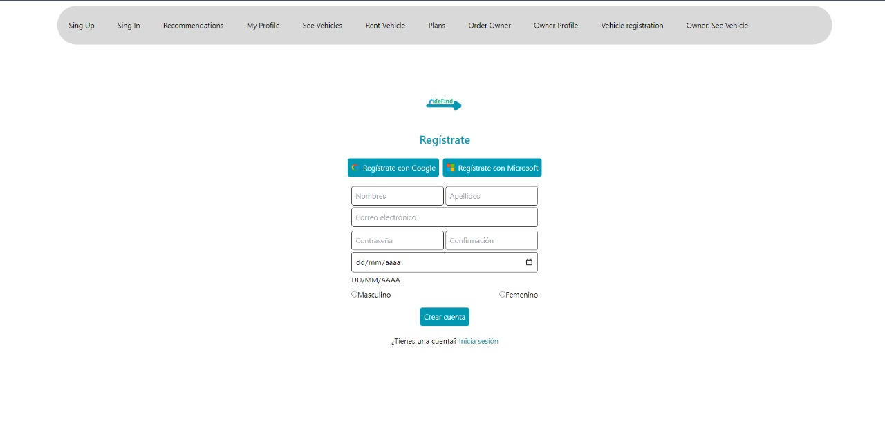</a>

<a href="deploy02">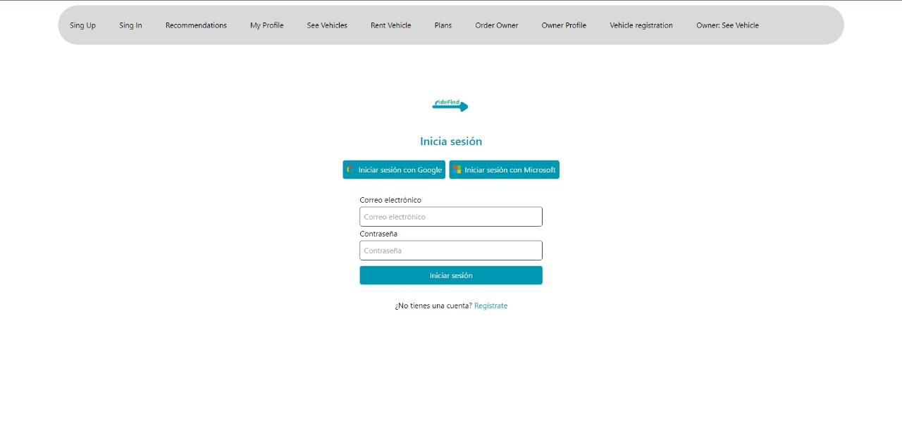</a>

<a href="deploy02">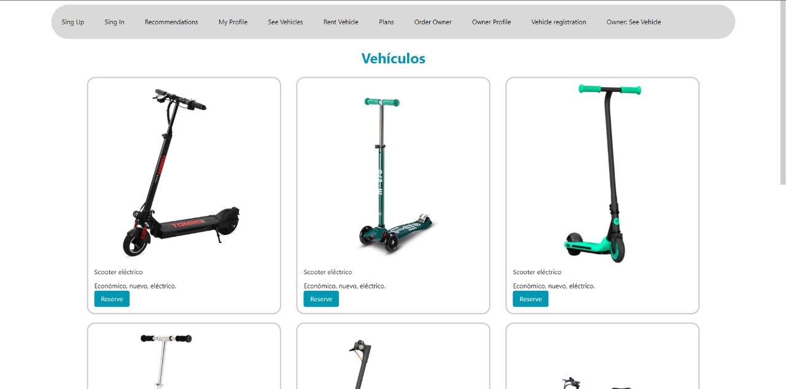</a>

<a href="deploy01">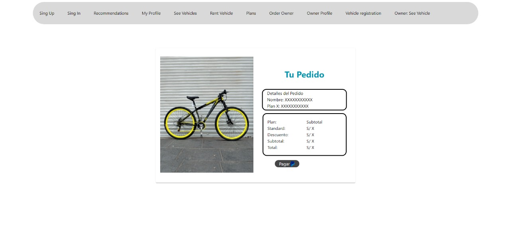</a>

<a href="deploy01">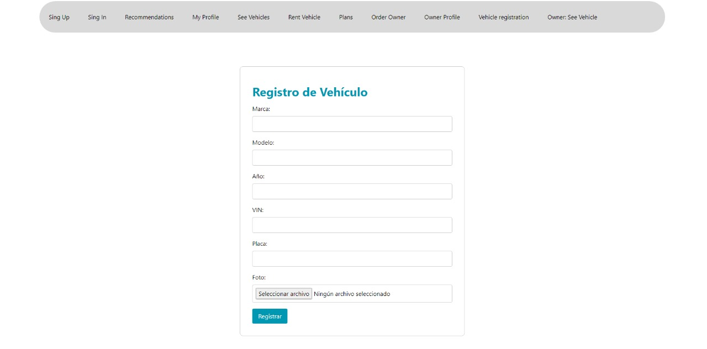</a>

#### 5.2.2.6. Services Documentation Evidence for Sprint Review.

En esta entrega, nos enfocamos en todo lo que es el Front, por lo que no fue necesario ningún servicio adicional.

#### 5.2.2.7. Software Deployment Evidence for Sprint Review.

Para este sprint, se utilizó Firebase como la plataforma de despliegue para el front-end de la aplicación RideFind. La elección de Firebase nos permitió implementar y gestionar de manera eficiente el código almacenado en nuestro repositorio, garantizando una integración continua y un despliegue rápido. El front-end de la aplicación se encuentra ahora disponible, asegurando una entrega fluida de la interfaz al usuario final.

Enlace del despliegue del front-end en Firebase: https://ridefind-frontend.web.app/myProfile.

#### 5.2.2.8. Team Collaboration insights during sprint.

Para el desarrollo de este proyecto se emplearon diversas herramientas, entre ellas WebStorm para la programación y edición del código, junto con el control de versiones utilizando Git. La estructura del front-end se dividió en secciones individuales, permitiendo a cada miembro del equipo trabajar en su parte correspondiente. Posteriormente, un integrante del equipo consolidó todas las secciones en un solo proyecto, obteniendo así el resultado final esperado de manera coordinada y eficiente.

## Conclusiones

- Colaboración y participación equitativa: Para asegurar el éxito del proyecto, es crucial que todos los miembros del equipo participen de manera equitativa. Una colaboración efectiva entre los integrantes permitirá finalizar el proyecto de manera eficiente y dentro del plazo establecido.

- Priorización de necesidades del usuario: La creación de User Stories y la definición del Product Backlog son pasos clave para identificar y clasificar las necesidades de los usuarios. Esto permite que el equipo se enfoque en resolver primero las necesidades más críticas, optimizando así el valor entregado al cliente.

- Pruebas continuas y mitigación de riesgos: El éxito del proyecto también depende de la capacidad del equipo para abordar los riesgos funcionales mediante pruebas continuas y mejoras incrementales. Esto garantiza que los errores sean corregidos rápidamente, mejorando la calidad del producto final.

- Para el desarrollo de este proyecto se emplearon diversas herramientas, entre ellas WebStorm para la programación y edición del código, junto con el control de versiones utilizando Git. La estructura del front-end se dividió en secciones individuales, permitiendo a cada miembro del equipo trabajar en su parte correspondiente. Posteriormente, un integrante del equipo consolidó todas las secciones en un solo proyecto, obteniendo así el resultado final esperado de manera coordinada y eficiente.

- Durante el proceso, se evidenció una mejora significativa en la colaboración y en la organización del equipo. Cada miembro aportó su experiencia y conocimientos, lo que permitió optimizar tiempos y resolver los desafíos que se presentaron en la implementación de la interfaz. Además, la utilización de Firebase para el despliegue facilitó la visualización y revisión del proyecto en tiempo real, asegurando una entrega más ágil y efectiva.

- La estructura modular aplicada al desarrollo del front-end permitió un mayor control sobre cada componente y una mejor capacidad de realizar ajustes en función del feedback recibido. Asimismo, la adopción de WebStorm como entorno de desarrollo se tradujo en una mayor productividad gracias a sus herramientas de depuración y soporte para tecnologías web.

- A lo largo del sprint, el equipo identificó y resolvió problemas relacionados con la compatibilidad entre navegadores y la optimización de recursos, lo que resultó en un front-end más robusto y eficiente. El despliegue en Firebase también facilitó la detección y solución de errores de integración que surgieron durante las pruebas.

## Bibliografía

- Banco Mundial. (2020). Peru: Better transport for Lima to mitigate climate change. World Bank. https://www.bancomundial.org/es/results/2013/04/24/Peru-better-transport-for-Lima-to-mitigate-climate-change

- Universidad de Nueva York. (2019). Analyzing traffic management issues in Lima, Peru. New York University. https://wagner.nyu.edu/education/capstone/projects/analyzing-traffic-management-issues-lima-peru-0

- Conexión Esan. (2019, junio 6). Scooters eléctricos: ¿una solución ecosostenible al caótico tráfico?. ESAN. https://www.esan.edu.pe/conexion/blog/scooters-electricos-una-solucion-ecosostenible-al-caotico-trafico 

## Anexos

**Anexo 1:**  
**Entrevistas Usuarios que Buscan Alquilar Vehículos:**  
- [https://upcedupe-my.sharepoint.com/:v:/g/personal/u202221518_upc_edu_pe/EcCSsXuECudMq43U96doDSoBjlRz9pEakJAKjz9886APtQ?e=TCRqC8](https://upcedupe-my.sharepoint.com/:v:/g/personal/u202221518_upc_edu_pe/EcCSsXuECudMq43U96doDSoBjlRz9pEakJAKjz9886APtQ?e=TCRqC8)  
- [https://upcedupe-my.sharepoint.com/:v:/g/personal/u202221518_upc_edu_pe/EQAWSuW1CB9BhDIb-DEdFUgBE_27nMdsPVxCreJ9n0pLxQ?e=16i45B](https://upcedupe-my.sharepoint.com/:v:/g/personal/u202221518_upc_edu_pe/EQAWSuW1CB9BhDIb-DEdFUgBE_27nMdsPVxCreJ9n0pLxQ?e=16i45B)  
- [https://upcedupe-my.sharepoint.com/:v:/g/personal/u202221518_upc_edu_pe/EdW4MG4fMRZFtuoBaQlOyW0Bv3gGBsH-9aUTnfLxTnVoUA?e=UWE5n8](https://upcedupe-my.sharepoint.com/:v:/g/personal/u202221518_upc_edu_pe/EdW4MG4fMRZFtuoBaQlOyW0Bv3gGBsH-9aUTnfLxTnVoUA?e=UWE5n8)  

**Entrevistas Propietarios de Vehículos Alternativos:**  
- [https://upcedupe-my.sharepoint.com/:v:/g/personal/u202221518_upc_edu_pe/EY2g8tRloDlJvXhdqOSyeD4BrqBakso8OSIHKpr3ULXWEg?nav=eyJyZWZlcnJhbEluZm8iOnsicmVmZXJyYWxBcHAiOiJTdHJlYW1XZWJBcHAiLCJyZWZlcnJhbFZpZXciOiJTaGFyZURpYWxvZy1MaW5rIiwicmVmZXJyYWxBcHBQbGF0Zm9ybSI6IldlYiIsInJlZmVycmFsTW9kZSI6InZpZXcifX0%3D&e=RJaTB1](https://upcedupe-my.sharepoint.com/:v:/g/personal/u202221518_upc_edu_pe/EY2g8tRloDlJvXhdqOSyeD4BrqBakso8OSIHKpr3ULXWEg?nav=eyJyZWZlcnJhbEluZm8iOnsicmVmZXJyYWxBcHAiOiJTdHJlYW1XZWJBcHAiLCJyZWZlcnJhbFZpZXciOiJTaGFyZURpYWxvZy1MaW5rIiwicmVmZXJyYWxBcHBQbGF0Zm9ybSI6IldlYiIsInJlZmVycmFsTW9kZSI6InZpZXcifX0%3D&e=RJaTB1)  
- [https://upcedupe-my.sharepoint.com/:v:/g/personal/u20201b914_upc_edu_pe/EZot7z-5ZzxJiBx9pe2-4YMBjAaj3e8lpuOhQ7c0G4UFRQ?nav=eyJyZWZlcnJhbEluZm8iOnsicmVmZXJyYWxBcHAiOiJPbmVEcml2ZUZvckJ1c2luZXNzIiwicmVmZXJyYWxBcHBQbGF0Zm9ybSI6IldlYiIsInJlZmVycmFsTW9kZSI6InZpZXciLCJyZWZlcnJhbFZpZXciOiJNeUZpbGVzTGlua0NvcHkifX0&e=dWx1gU](https://upcedupe-my.sharepoint.com/:v:/g/personal/u20201b914_upc_edu_pe/EZot7z-5ZzxJiBx9pe2-4YMBjAaj3e8lpuOhQ7c0G4UFRQ?nav=eyJyZWZlcnJhbEluZm8iOnsicmVmZXJyYWxBcHAiOiJPbmVEcml2ZUZvckJ1c2luZXNzIiwicmVmZXJyYWxBcHBQbGF0Zm9ybSI6IldlYiIsInJlZmVycmFsTW9kZSI6InZpZXciLCJyZWZlcnJhbFZpZXciOiJNeUZpbGVzTGlua0NvcHkifX0&e=dWx1gU)  
- [https://upcedupe-my.sharepoint.com/:v:/g/personal/u20201b914_upc_edu_pe/ES6SusUIAe1Evh6zgGRi5AoBH-SerCMW3tTJta2Bj9vpzg?nav=eyJyZWZlcnJhbEluZm8iOnsicmVmZXJyYWxBcHAiOiJPbmVEcml2ZUZvckJ1c2luZXNzIiwicmVmZXJyYWxBcHBQbGF0Zm9ybSI6IldlYiIsInJlZmVycmFsTW9kZSI6InZpZXciLCJyZWZlcnJhbFZpZXciOiJNeUZpbGVzTGlua0NvcHkifX0&e=gWHAek](https://upcedupe-my.sharepoint.com/:v:/g/personal/u20201b914_upc_edu_pe/ES6SusUIAe1Evh6zgGRi5AoBH-SerCMW3tTJta2Bj9vpzg?nav=eyJyZWZlcnJhbEluZm8iOnsicmVmZXJyYWxBcHAiOiJPbmVEcml2ZUZvckJ1c2luZXNzIiwicmVmZXJyYWxBcHBQbGF0Zm9ybSI6IldlYiIsInJlZmVycmFsTW9kZSI6InZpZXciLCJyZWZlcnJhbFZpZXciOiJNeUZpbGVzTGlua0NvcHkifX0&e=gWHAek)  

---

**Anexo 2:**  
**Presentación del Proyecto:**  
[https://www.canva.com/design/DAGQDRydqY8/or-NGszjIWSFbZ9EE5PpSw/edit?utm_content=DAGQDRydqY8&utm_campaign=designshare&utm_medium=link2&utm_source=sharebutton](https://www.canva.com/design/DAGQDRydqY8/or-NGszjIWSFbZ9EE5PpSw/edit?utm_content=DAGQDRydqY8&utm_campaign=designshare&utm_medium=link2&utm_source=sharebutton)  

---

**Anexo 3:**  
**Project Figma:**  
[https://www.figma.com/design/3wujndmKi1aJfHe56S9odg/app-web-project?node-id=0-1&node-type=CANVAS&t=fMYzVqO9YaR2ms7B-0](https://www.figma.com/design/3wujndmKi1aJfHe56S9odg/app-web-project?node-id=0-1&node-type=CANVAS&t=fMYzVqO9YaR2ms7B-0)  

---

**Anexo 4:**  
**Landing Page:**  
[https://upc-pre-202401-si730-ws51-ridelink.github.io/RideFind.github.io/](https://upc-pre-202401-si730-ws51-ridelink.github.io/RideFind.github.io/)  

---

**Anexo 5:**
**Front-End:**
[https://ridefind-frontend.web.app/](https://ridefind-frontend.web.app/)

---

**Anexo 6:**  
**Organización de Github:**  
[https://github.com/upc-pre-202401-si730-ws51-RideLink](https://github.com/upc-pre-202401-si730-ws51-RideLink)  
