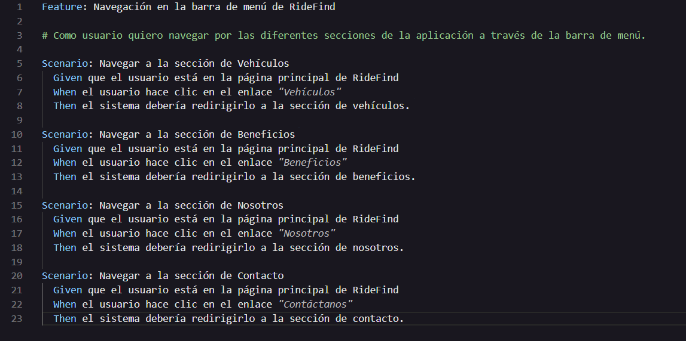
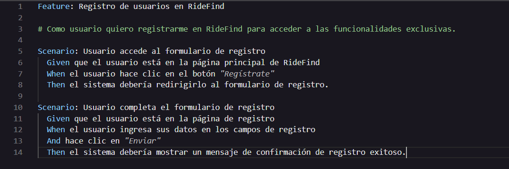
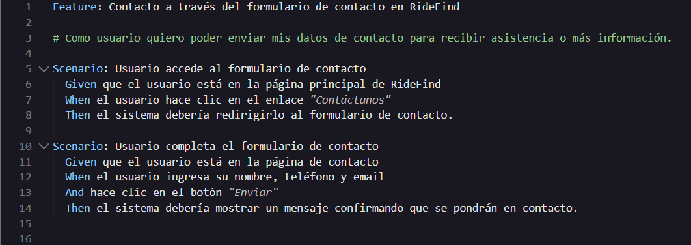
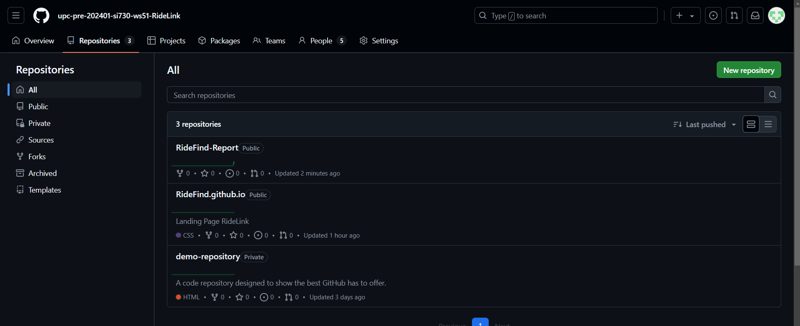
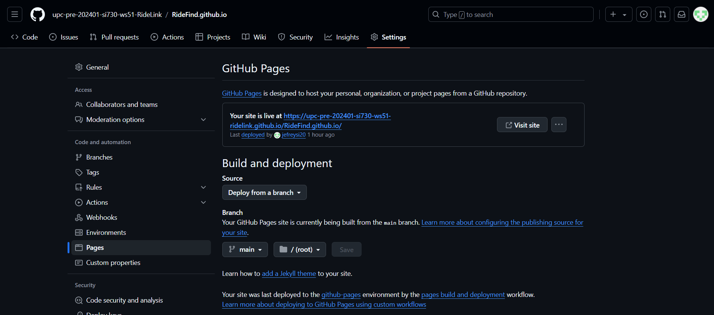
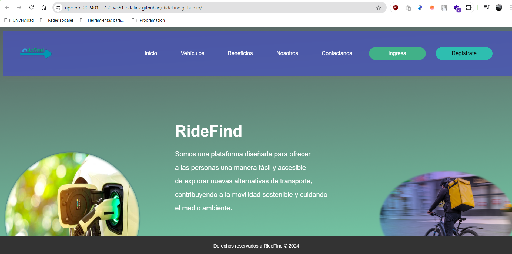

## Capítulo V: Product Implementation, Validation & Deployment

### 5.1. Software Configuration Management.

#### 5.1.1. Software Development Environment Configuration.

En esta sección describiremos y detallaremos las plataformas y el software que utilizamos como equipo para el desarrollo de nuestro proyecto.

1. <b>Visual Studio Code</b>: Es un editor de código que, aunque es ligero, tiene mucha potencia. Fue desarrollado por Microsoft y cuenta con un montón de características útiles para programadores. Tiene soporte para varios lenguajes de programación, permite agregar extensiones personalizadas, se integra fácilmente con control de versiones y herramientas de depuración. Además, su interfaz es bastante intuitiva y se puede personalizar mucho, lo que lo convierte en una opción muy popular entre los desarrolladores de software a nivel mundial.
<b>https://code.visualstudio.com/</b>
 
 

2. <b>GitHub</b>: Esta es la plataforma que utilizaremos para crear el repositorio de nuestro startup y llevar un registro de nuestros avances. Nos facilita un mejor control del trabajo en equipo, ya que permite ver el progreso de cada miembro mediante los commits que realizan.  
<b>https://github.com</b>
 
 

3. <b>Git</b>: Es el sistema de control de versiones más utilizado y es fundamental para poder realizar los commits en GitHub.  
<b>https://git-scm.com/</b>
 
 

4. <b>Whatsapp</b>: Es una aplicación de mensajería instantánea que funciona en varias plataformas y permite a los usuarios enviar mensajes de texto, notas de voz, archivos multimedia, y realizar llamadas y videollamadas sin costo usando una conexión a Internet. Su interfaz sencilla y su disponibilidad tanto en dispositivos móviles como en computadoras la han convertido en una herramienta muy utilizada para la comunicación, tanto personal como profesional, a nivel global.  
<b>https://whatsapp.com/</b>
 
 

 5. <b>Zoom</b>: Es una plataforma de videoconferencias que permite realizar reuniones virtuales con video y audio en tiempo real. Ofrece opciones para compartir pantalla, grabar sesiones y colaborar a través de chats, lo que la convierte en una herramienta ideal para trabajo remoto y reuniones en equipo. Gracias a su fácil acceso desde dispositivos móviles y de escritorio, Zoom se ha consolidado como una opción popular para la comunicación en el ámbito profesional y educativo.  
 <b>https://zoom.us/es</b>
  
  

 #### 5.1.2. Source Code Management.

##### Gestión del Código Fuente:

En esta sección, describiremos cómo gestionamos y monitoreamos el desarrollo del código en Ridefind. Empleamos GitHub como plataforma principal y Git como nuestro sistema de control de versiones.

- Repositorio GitHub para nuestra Landing Page:
<b>https://github.com/upc-pre-202401-si730-ws51-RideLink/RideFind.github.io</b>

1. **main**: Esta rama, también conocida como "master", contiene la versión más estable y final del proyecto, lista para ser desplegada en producción.

2. **Develop**: En esta rama se integran las nuevas funcionalidades en desarrollo. Su progreso corre en paralelo a la rama main.

Además de estas ramas principales, se pueden utilizar unas que otras ramas auxiliares para diferentes propósitos:

1. **releases**: Estas ramas se emplean para preparar la siguiente versión del proyecto. En ellas se realizan las pruebas finales y se solucionan pequeños errores antes del lanzamiento oficial. Una vez finalizado este proceso, los cambios se integran primero en la rama develop y posteriormente en la rama main.

##### - Commits Conventions:

En RideFind, los commits se nombran de acuerdo con el avance y el contenido específico del trabajo realizado. No seguimos una convención rígida para los nombres de los commits; en su lugar, los desarrolladores utilizan descripciones claras y concisas para reflejar las modificaciones implementadas. Esto nos permite una mayor flexibilidad a la hora de registrar el progreso, asegurando que cada commit tenga un nombre que represente con precisión el trabajo efectuado.

#### 5.1.3. Source Code Style Guide & Conventions.

En RideFind hemos implementado varias convenciones de estilo para asegurar un desarrollo de código claro y consistente en distintos lenguajes y tecnologías:

<b>HTML y CSS:</b>  

1. El tipo de documento se declara al inicio del archivo con `<!DOCTYPE html>`.

2. Se añaden los meta tags necesarios.

3. La etiqueta `<title>` se incluye dentro del bloque `<head>`.

4. Usamos una indentación de dos espacios.

5. Se escriben en minúsculas los nombres de los elementos HTML, atributos, propiedades, valores y selectores CSS.

6. Los atributos de los elementos HTML siempre están entre comillas.

7. Cada elemento HTML debe contar con su etiqueta de cierre.

8. Se evita escribir líneas de código demasiado largas.

9. Para las imágenes, se especifican tanto el ancho y alto como el texto alternativo.

<b>JavaScript</b>

1. Cada línea de código termina con un punto y coma.

2. Las variables y funciones siguen la convención de CamelCase.

3. Las cadenas de texto (strings) se colocan entre comillas simples.

4. La indentación es de 2 espacios.

5. Se utiliza preferentemente let y const en lugar de var para declarar variables.

6. Gherkin (Convenciones de Gherkin para Especificaciones Legibles)

7. Se utilizan los términos "Given", "When", "Then" y "And" para definir los pasos del escenario.

8. Los pasos que comienzan con "And" se indentan.

9. Se deja una línea en blanco entre los pasos.

10. Los parámetros se colocan entre comillas simples.

11. Se separan los escenarios con un comentario y dos líneas en blanco.

<b>C# (Convenciones de Codificación de Microsoft para C#)</b>

1. Los nombres de los paquetes van en minúsculas, mientras que las clases se nombran usando UpperCamelCase y los métodos en lowerCamelCase.

2. La indentación se realiza con 2 o 4 espacios, evitando el uso de tabulaciones.

3. Las líneas de código que superen los 100 caracteres se dividen.

4. El nombre del archivo C# debe coincidir con el de la clase que contiene, y la clase debe ser única y pública.

5. Después de cada declaración se deja un espacio en blanco.

Estas convenciones nos ayudan a mantener el código organizado, legible y coherente a lo largo del proyecto.

- US01:

- US02:

- US03:

- US04:

- US05:

#### 5.1.4. Software Deployment Configuration.

Explicaremos cómo realizar el despliegue de nuestra Landing Page utilizando el servicio automatizado en la nube de GitHub Pages. A continuación, detallaremos los pasos necesarios para lograr este proceso. 

1. Es fundamental asegurarnos de que la configuración del repositorio sea correcta, ya que será desplegado posteriormente con GitHub Pages: 
 

 
 
2. Accedemos a GitHub Pages:
 
 

 
 
3. Tras guardar la configuración adecuada, GitHub Pages comenzará automáticamente el despliegue de nuestra Landing Page. En este caso, trabajamos con tres ramas clave: main, develop, y releases. El contenido más estable y listo para producción se encuentra en main, mientras que develop se utiliza para integrar nuevas características en desarrollo, y releases nos ayuda a preparar versiones finales. Una vez completado el despliegue, se generará un enlace que nos permitirá acceder directamente a nuestra Landing Page.
 
 

 
 
4. Una vez que hayamos ajustado la configuración, GitHub Pages dará inicio al despliegue automático de nuestra Landing Page. Durante este proceso, podremos monitorear el progreso, y cuando se complete exitosamente, se nos proporcionará un enlace directo para acceder a la Landing Page.
 
 

 
 

<b> Link de nuestra Landing Page: </b> https://upc-pre-202401-si730-ws51-ridelink.github.io/RideFind.github.io/

### 5.2. Landing Page, Services & Applications Implementation.
## 5.2.1.1. Sprint Planning 1
<table>
  <tr>
    <th> Sprint # </th>
    <th> Sprint 1 </th>
  </tr>
  <tr>
    <td style="font-weight: bold;" colspan="2"> Sprint Planning Background </td>
  </tr>
  <tr>
    <td style="font-weight: bold;"> Date </td>
    <td> 5/09/2024 </td>
  </tr>
  <tr>
    <td style="font-weight: bold;"> Time </td>
    <td> 19:00 horas (GMT-5) </td>
  </tr>
  <tr>
    <td style="font-weight: bold;"> Location </td>
    <td> Modalidad remota a través de la plataforma Google Meets </td>
  </tr>
  <tr>
    <td style="font-weight: bold;"> Prepared By </td>
    <td> Huamani Aguilar, Jhon Rony </td>
  </tr>
  <tr>
    <td style="font-weight: bold;"> Attendees (to planning meeting) </td>
    <td>
      Huamani Aguilar, Jhon Rony 
      Sanchez Ignacio, Jefrey Martin 
      Gutierrez Garcia, Jose Eduardo 
      Briceño De La Cruz, Farid Sebastian 
      Huamani Aguilar, Jhon Rony
    </td>
  </tr>
  <tr>
    <td style="font-weight: bold;"> Sprint 0 Review Summary </td>
    <td> Dado que es nuestro primer sprint de desarrollo no existe un review summary del sprint </td>
  </tr>
  <tr>
    <td style="font-weight: bold;"> Sprint 0 Retrospective Summary </td>
    <td> Dado que nos encontramos en nuestro primer sprint aún no identificamos planes de mejora. </td>
  </tr>
  <tr>
    <td style="font-weight: bold;" colspan="2"> Sprint Goal & User Stories </td>
  </tr>
  <tr>
    <td style="font-weight: bold;"> Sprint 1 Goal </td>
    <td> En este sprint se espera implementar el landing page con las secciones de login de inicio, secciones de orientación para el usuario, como por ejemplo el footer. Al finalizar este sprint la landing page debe estar desplegada con GitHub Pages y cualquier usuario debería poder acceder y visualizar la página a través de un enlace. </td>
  </tr>
  <tr>
    <td style="font-weight: bold;"> Sprint 1 Velocity </td>
    <td> 19 </td>
  </tr>
  <tr>
    <td style="font-weight: bold;"> Sum of Story Points </td>
    <td> 19 </td>
  </tr>
</table>

